# Antrag auf Erteilung einer Beschäftigungserlaubnis bei Aufenthaltsgestattung

- **FIM-ID:** `S00000000362 1.0.0` · **Reifegrad:** fachlich freigegeben (gold)
- **Rechtsgrundlagen:** § 61 AsylG vom 15.07.2024; § 32 BeschV vom 07.12.2023
- **Kompiliert:** 2026-08-13T15:33:23Z aus https://fimportal.de/api/v1/schemas/S00000000362/1.0.0/xdf
- **Umfang:** 65 Felder, 28 gesicherte Bedingungen, 0 ungeklärt

## Verbindliche Arbeitsweise

1. **`graph.json` entscheidet, nicht du.** Ob ein Feld gebraucht wird, welcher Nachweis fehlt und welche Bedingung gilt, steht dort. Leite das nie selbst ab.
2. **Übersetze nur.** Deine Aufgabe ist Alltagssprache ↔ Feldwert. Nenne auf Nachfrage die amtliche Formulierung und die Rechtsgrundlage.
3. **Frage nur, was offen ist.** Felder, deren Bedingung nach den bisherigen Antworten nicht erfüllt ist, entfallen — frage sie nicht ab.
4. **Bei ungeklärten Regeln sag das.** Der Abschnitt „Ungeklärte Regeln" enthält Bedingungen, die nicht maschinell gelesen werden konnten. Rate dort nicht, sondern verweise auf die zuständige Stelle.

## Antworten zur Leistung

_Quelle: LeiKa 99010012001001, bundesweiter Stammtext · Zuordnung geprüft über § 32, 61 · asylg._

### Wer darf den Antrag stellen?

<ul>
 <li>Sie sind im Besitz einer gültigen Aufenthaltsgestattung.</li>
 <li>Sie sind nicht verpflichtet, in einer Aufnahmeeinrichtung zu wohnen, und halten sich seit drei Monaten gestattet im Bundesgebiet auf.</li>
 <li>Sie sind verpflichtet, in einer Aufnahmeeinrichtung zu wohnen, aber Ihr Asylverfahren wurde nicht innerhalb von neun Monaten unanfechtbar abgeschlossen und sie kommen nicht aus einem sicheren Herkunftsstaat.</li>
 <li>Sie kommen zwar aus einem sicheren Herkunftsstaat, aber haben Ihren Asylantrag vor dem 31. August 2015 gestellt.</li>
 <li>Ein Arbeitgeber hat Ihnen einen konkreten Arbeitsplatz angeboten und das Formular „Erklärung zum Beschäftigungsverhältnis“ ausgefüllt.</li>
 <li>Die Bedingungen, unter denen Sie künftig arbeiten werden, sind mit denen deutscher Arbeitnehmerinnen und Arbeitnehmer vergleichbar.</li>
 <li>Ihr Arbeitslohn entspricht dem Lohn deutscher Arbeitnehmerinnen und Arbeitnehmer.</li>
</ul>

### Welche Unterlagen werden gebraucht?

<ul>
 <li>Gültige Aufenthaltsgestattung</li>
 <li>Identitätsdokument (zum Beispiel Reisepass oder Passersatz), sofern vorhanden</li>
 <li>Formular „Erklärung zum Beschäftigungsverhältnis“ (vom Arbeitgeber vollständig auszufüllen)</li>
 <li>Im Einzelfall kann die Ausländerbehörde weniger oder weitere Nachweise verlangen.</li>
</ul>

### Wie läuft das Verfahren ab?

<ul>
 <li>Informieren Sie sich, ob Ihre Ausländerbehörde die Antragsstellung online ermöglicht oder ein spezielles Antragsformular vorhält.</li>
 <li>Ist die Antragsstellung nur persönlich möglich, übermitteln Sie vorab das von Ihrem Arbeitgeber vollständig ausgefüllte Formular „Erklärung zum Beschäftigungsverhältnis“ an die Ausländerbehörde und vereinbaren einen Termin in der Ausländerbehörde. Im Fall der OnlineAntragsstellung wird sich die Ausländerbehörde nach Eingang Ihres Antrags mit Ihnen in Verbindung setzen, um einen Termin zu vereinbaren.</li>
 <li>Während des Termins werden Ihre Identität und Ihre Unterlagen geprüft (bringen Sie bitte Ihre Unterlagen, möglichst im Original, mit zum Termin).</li>
 <li>In der Regel wird die Ausländerbehörde die Bundesagentur für Arbeit um Zustimmung bitten.</li>
 <li>Wird die Beschäftigungserlaubnis erteilt, wird in der Regel ein entsprechender Eintrag auf der Aufenthaltsgestattung (unter „Nebenbestimmungen“) oder in einem Zusatzblatt vorgenommen.</li>
</ul>

### Wer ist zuständig?

Zuständig ist die für den Wohnsitz der antragstellenden Person zuständige Ausländerbehörde.

### Ausführliche Beschreibung

Wenn Sie sich in einem laufenden Asylverfahren befinden, ist eine Beschäftigung nur dann erlaubt, wenn dies in Ihrer Aufenthaltsgestattung ausdrücklich vermerkt ist. Wenn Sie arbeiten möchten, müssen Sie deshalb bei der Ausländerbehörde eine Beschäftigungserlaubnis beantragen. Dies gilt auch für die Ausübung einer betrieblichen Berufsausbildung oder eines Praktikums.

Halten Sie sich seit drei Monaten gestattet im Bundesgebiet auf, sind nicht (mehr) verpflichtet, in einer Erstaufnahmeeinrichtung für Asylsuchende (auch Aufnahmeeinrichtung, Ankunftszentrum oder Ankerzentrum) zu wohnen und haben bereits einen Arbeitgeber gefunden, der Sie einstellen möchte, kann Ihnen die Ausübung einer Beschäftigung erlaubt werden.

Zur Bearbeitung Ihres Antrags beteiligt die Ausländerbehörde in der Regel die Bundesagentur für Arbeit, welche die Arbeitsbedingungen prüft. Nach einem mehr als vierjährigen, ununterbrochenen Aufenthalt in Deutschland muss die Bundesagentur für Arbeit nicht mehr beteiligt werden.

Wenn Sie eine betriebliche Berufsausbildung (duale Ausbildung) absolvieren möchten, muss die Beschäftigungserlaubnis für den konkreten Ausbildungsplatz individuell beantragt werden. Schulische Berufsausbildungen sind genehmigungsfrei.

Die Beschäftigungserlaubnis wird befristet für die Dauer der Zustimmung der Bundesagentur für Arbeit erteilt, längstens bis zum Erlöschen der Aufenthaltsgestattung.

Es bestehen die folgenden Einschränkungen:

Die Ausübung einer Erwerbstätigkeit ist grundsätzlich untersagt, so lange Sie verpflichtet sind, in einer Erstaufnahmeeinrichtung zu wohnen. Nur wenn Ihr Asylverfahren nicht innerhalb von neun Monaten abgeschlossen wurde, kann Ihnen die Ausübung einer Beschäftigung erlaubt werden.

Wenn Sie Asylbewerber oder Asylbewerberin aus einem sogenannten „sicheren Herkunftsstaat“ sind, also aus einem Mitgliedstaat der Europäischen Union, Albanien, Bosnien und Herzegowina, Ghana, Kosovo, der ehemaligen jugoslawischen Republik Mazedonien (Nordmazedonien), Montenegro, Senegal oder Serbien stammen, und ihren Asylantrag nach dem 31. August 2015 gestellt haben, können Sie während des Asylverfahrens keine Beschäftigungserlaubnis erhalten.

Auch für Asylbewerberinnen und Asylbewerber, deren Asylverfahren als offensichtlich unbegründet oder unzulässig abgelehnt wurde und für deren Klage keine aufschiebende Wirkung angeordnet wurde, besteht kein Zugang zum deutschen Arbeitsmarkt.

_Für 13 Länder gibt es abweichende Fassungen mit eigenen Fristen und Zuständigkeiten. Bei Fragen dazu auf die zuständige Stelle des jeweiligen Landes verweisen._

## Felder

### Angaben Antragsteller oder Gesetzlicher Vertreter (`G00000002161`)

- **Vertritt ein gesetzlicher Vertreter den Antragsteller?** (`F00000003327`) — Pflicht
  - Rechtsgrundlage: §§ 1773 - 1808 BGB

### Angaben Antragsteller oder Gesetzlicher Vertreter › Angaben zum Antragsteller (`G00000002159`)

- **Familienname** (`F60000000227`) — Pflicht
  - Rechtsgrundlage: § 5 (2) Nr. 1 PAuswG vom 21.6.2019; Anhang 3 PAuswV vom 28.9.2017; Tabelle 9 BSI TR-03123 Version 1.5.1; XOEV.Kernkomponente.NameNatuerlichePerson.familienname vom 31.01.2020
  - Hilfe: Geben Sie den Nachnamen, Familiennamen bzw. Zunamen an.
- **Geburtsname** (`F60000000230`) — optional
  - Rechtsgrundlage: § 5 (2) Nr. 1 PAuswG vom 21.6.2019; Anhang 3 Abschnitt 1 PAuswV vom 28.9.2017; Tabelle 9 BSI TR-03123 Version 1.5.1; XOEV.Kernkomponente.NameNatuerlichePerson.geburtsname vom 31.01.2020
  - Hilfe: Geben Sie den Geburtsnamen an. Manche Menschen ändern ihren Familiennamen, wenn sie heiraten oder eine Lebenspartnerschaft eingehen. Der  Geburtsname ist der Familienname den die Person bei der Geburt hatte, bevor sie ihren Namen geändert hat.
- **Vornamen** (`F60000000228`) — Pflicht
  - Rechtsgrundlage: § 5 (2) Nr. 2 PAuswG vom 21.6.2019; Anhang 3 PAuswV vom 28.9.2017; Tabelle 9 BSI TR-03123 Version 1.5.1; XOEV.Kernkomponente.NameNatuerlichePerson.vorname vom 31.08.2020
  - Hilfe: Geben Sie die Vornamen so an, wie sie auf den offiziellen Ausweisen angegeben sind, zum Beispiel im Personalausweis.
- **Doktorgrade** (`F60000000229`) — optional
  - Rechtsgrundlage: § 5 (2) Nr. 3 PAuswG vom 21.6.2019; Tabelle 9 BSI TR-03123 Version 1.5.1 (dort als Titel); XMeld.type.NameNatuerlichePerson.doktorgrad Version 2.4.4
  - Hilfe: Geben Sie anerkannte Doktorgrade an. Zulässig sind: "Dr.", "Dr.hc." und "Dr.eh.". Wollen Sie mehrere Doktorgrade angeben, trennen Sie diese durch ein Leerzeichen.

### Angaben Antragsteller oder Gesetzlicher Vertreter › Angaben zum Antragsteller › Geburtsdatum (`G60000000083`)

- **Tag** (`F60000000231`) — optional
  - Rechtsgrundlage: § 5 (2) PAuswG vom 21.6.2019; Anhang 3 Abschnitt 1 PAuswV vom 28.9.2017; Tabelle 9 BSI TR-03123 Version 1.5.1 _(geerbt)_
- **Monat** (`F60000000232`) — optional, conditional
  - Rechtsgrundlage: § 5 (2) PAuswG vom 21.6.2019; Anhang 3 Abschnitt 1 PAuswV vom 28.9.2017; Tabelle 9 BSI TR-03123 Version 1.5.1 _(geerbt)_
- **Jahr** (`F60000000233`) — Pflicht
  - Rechtsgrundlage: § 5 (2) PAuswG vom 21.6.2019; Anhang 3 Abschnitt 1 PAuswV vom 28.9.2017; Tabelle 9 BSI TR-03123 Version 1.5.1 _(geerbt)_

### Angaben Antragsteller oder Gesetzlicher Vertreter › Angaben zum Antragsteller › Straßenanschrift (`G60000000086`)

- **Straße** (`F60000000243`) — Pflicht
  - Rechtsgrundlage: XInneres.Meldeanschrift.strasse Version 8
  - Hilfe: Geben Sie an, wie die Straße heißt, ohne Abkürzungen zu verwenden, Beispiel Bischöflich-Geistlicher-Rat-Josef-Zinnbauer-Straße
- **Hausnummer** (`F60000000244`) — optional
  - Rechtsgrundlage: XInneres.Meldeanschrift.hausnummer Version 8
  - Hilfe: Geben Sie die Ziffern und ggf. Buchstaben der Hausnummer der Anschrift an, Beispiel 124a.
- **Postleitzahl** (`F60000000246`) — Pflicht
  - Rechtsgrundlage: XInneres.Meldeanschrift.postleitzahl Version 8
  - Hilfe: Geben Sie die Postleitzahl des Ortes an, Beispiel 10115.
- **Ort** (`F60000000247`) — Pflicht
  - Rechtsgrundlage: § 5 (2) Nr. 9 PAuswG vom 21.6.2019; Anhang 3 Abschnitt 1 (Wohnort) PAuswV vom 28.9.2017; Tabelle 11 BSI TR-03123, Version 1.5.1; Xinneres.Meldeanschrift.Wohnort Version 8; XOEV.Kernkomponente.Anschrift.ort vom 31.01.2020
  - Hilfe: Geben Sie an, wie der Ort heißt. Benennen Sie dafür den Namen der Ortschaft, Gemeinde oder Stadt; nicht jedoch den Namen des Ortsteils, Beispiel Berlin.
- **Adresszusatz** (`F60000000248`) — optional
  - Rechtsgrundlage: XInneres.Meldeanschrift.zusatzangaben Version 8
  - Hilfe: Geben Sie Zusatzangaben zur Anschrift an. Beispiele: Hinterhaus, Gartenhaus.

### Angaben Antragsteller oder Gesetzlicher Vertreter › Angaben zum Antragsteller › Erreichbarkeit (`G60000000183`)

- **Telefonnummer** (`F60000000240`) — optional
  - Rechtsgrundlage: ITU E.123
  - Hilfe: Geben Sie bei Telefonnummern innerhalb Deutschlands zuerst die Ortsvorwahl bzw. Mobilnetzvorwahl in Klammern, gefolgt von der Rufnummer an, Beispiel (0211) 12345678.
Geben Sie bei Telefonnummern außerhalb Deutschlands zuerst den Internationalen Ländercode mit vorgestelltem Plus, gefolgt von der Ortsvorwahl bzw. Mobilnetzvorwahl ohne der führenden Null, gefolgt von der Rufnummer an, Beispiel +49 211 123456789.
- **Telefaxnummer** (`F60000000241`) — optional
  - Rechtsgrundlage: ITU E.123
  - Hilfe: Geben Sie bei Telefaxnummern innerhalb Deutschlands zuerst die Ortsvorwahl bzw. Mobilnetzvorwahl in Klammern, gefolgt von der Rufnummer an, Beispiel (0211) 12345678.
Geben Sie bei Telefaxnummern außerhalb Deutschlands zuerst den Internationalen Ländercode mit vorgestelltem Plus, gefolgt von der Ortsvorwahl bzw. Mobilnetzvorwahl ohne der führenden Null, gefolgt von der Rufnummer an, Beispiel +49 211 123456789.
- **E-Mail-Adresse** (`F60000000242`) — optional
  - Rechtsgrundlage: RFC 5322; RFC 5321
  - Hilfe: Geben Sie eine E-Mail-Adresse an, z.B. Max.Mustermann@email.de

### Angaben Antragsteller oder Gesetzlicher Vertreter › Gesetzliche Vertretung / Bevollmächtigung (`G60000000220`)

- **Wird die antragstellende Person vertreten?** (`F60000000352`) — Pflicht
  - Rechtsgrundlage: basierend auf Elementen der BOB-Gruppe G60000175 Antragsteller (abstrakt, umfassend); urn:xoev-de:xunternehmen:kerndatenobjekt:antragsteller Version 1.1; ebenfalls basierend auf G60000112 Gesetzlicher Vertreter - Natürliche Person (abstrakt); urn:xoev-de:xunternehmen:kerndatenobjekt:gesetzlichervertreter Version 1.1 _(geerbt)_
- **Betreuungsurkunde** (`F60000000350`) — optional, conditional
  - Rechtsgrundlage: basierend auf Elementen der BOB-Gruppe G60000175 Antragsteller (abstrakt, umfassend); urn:xoev-de:xunternehmen:kerndatenobjekt:antragsteller Version 1.1; ebenfalls basierend auf G60000112 Gesetzlicher Vertreter - Natürliche Person (abstrakt); urn:xoev-de:xunternehmen:kerndatenobjekt:gesetzlichervertreter Version 1.1 _(geerbt)_
  - Hilfe: Fügen Sie die Betreuungsurkunde (in Kopie) bei.
- **Vollmacht** (`F60000000351`) — optional, conditional
  - Rechtsgrundlage: basierend auf Elementen der BOB-Gruppe G60000175 Antragsteller (abstrakt, umfassend); urn:xoev-de:xunternehmen:kerndatenobjekt:antragsteller Version 1.1; ebenfalls basierend auf G60000112 Gesetzlicher Vertreter - Natürliche Person (abstrakt); urn:xoev-de:xunternehmen:kerndatenobjekt:gesetzlichervertreter Version 1.1 _(geerbt)_
  - Hilfe: Fügen Sie die Vollmacht (in Kopie) bei.

### Angaben Antragsteller oder Gesetzlicher Vertreter › Gesetzliche Vertretung / Bevollmächtigung › Gesetzlich vertretende juristische Person (`G60000000223`)

- **Eingetragener Name** (`F60000000319`) — Pflicht
  - Rechtsgrundlage: XOEV.Kernkomponente.NameOrganisation.name vom 01.08.2017; XGewerbeanzeige.Betrieb.eingetragenerName Version 2.2; XUnternehmen.Kerndatenmodell.Eingetragener Name Version 1.1
  - Hilfe: Geben Sie den im Handelsregister, im Genossenschaftsregister, im Vereinsregister oder im Stiftungsverzeichnis eingetragenen Namen mit Rechtsform an, soweit eine Eintragung vorliegt.

### Angaben Antragsteller oder Gesetzlicher Vertreter › Gesetzliche Vertretung / Bevollmächtigung › Gesetzlich vertretende juristische Person › Anschrift (`G60000000093`)

- **Wo befindet sich die Anschrift?** (`F60000000263`) — Pflicht
  - Rechtsgrundlage: in Anlehnung an urn:xoev-de:xunternehmen:kerndatenobjekt:gesetzlichervertreter Version 1.1 _(geerbt)_
  - Hilfe: Geben Sie an, ob sich die Anschrift im Inland oder im Ausland befindet.

### Angaben Antragsteller oder Gesetzlicher Vertreter › Gesetzliche Vertretung / Bevollmächtigung › Gesetzlich vertretende juristische Person › Anschrift › Anschrift in Deutschland › Straßenanschrift (`G60000000086`)

- **Straße** (`F60000000243`) — Pflicht
  - Rechtsgrundlage: XInneres.Meldeanschrift.strasse Version 8
  - Hilfe: Geben Sie an, wie die Straße heißt, ohne Abkürzungen zu verwenden, Beispiel Bischöflich-Geistlicher-Rat-Josef-Zinnbauer-Straße
- **Hausnummer** (`F60000000244`) — optional
  - Rechtsgrundlage: XInneres.Meldeanschrift.hausnummer Version 8
  - Hilfe: Geben Sie die Ziffern und ggf. Buchstaben der Hausnummer der Anschrift an, Beispiel 124a.
- **Postleitzahl** (`F60000000246`) — Pflicht
  - Rechtsgrundlage: XInneres.Meldeanschrift.postleitzahl Version 8
  - Hilfe: Geben Sie die Postleitzahl des Ortes an, Beispiel 10115.
- **Ort** (`F60000000247`) — Pflicht
  - Rechtsgrundlage: § 5 (2) Nr. 9 PAuswG vom 21.6.2019; Anhang 3 Abschnitt 1 (Wohnort) PAuswV vom 28.9.2017; Tabelle 11 BSI TR-03123, Version 1.5.1; Xinneres.Meldeanschrift.Wohnort Version 8; XOEV.Kernkomponente.Anschrift.ort vom 31.01.2020
  - Hilfe: Geben Sie an, wie der Ort heißt. Benennen Sie dafür den Namen der Ortschaft, Gemeinde oder Stadt; nicht jedoch den Namen des Ortsteils, Beispiel Berlin.
- **Adresszusatz** (`F60000000248`) — optional
  - Rechtsgrundlage: XInneres.Meldeanschrift.zusatzangaben Version 8
  - Hilfe: Geben Sie Zusatzangaben zur Anschrift an. Beispiele: Hinterhaus, Gartenhaus.

### Angaben Antragsteller oder Gesetzlicher Vertreter › Gesetzliche Vertretung / Bevollmächtigung › Gesetzlich vertretende juristische Person › Anschrift › Anschrift in Deutschland › Anschrift Postfach (`G60000000087`)

- **Postfach** (`F60000000249`) — optional
  - Rechtsgrundlage: XInneres.PostalischeInlandsanschrift.postfach Version 8
  - Hilfe: Geben Sie die Nummer oder Zeichenkette des Postfachs an. Das wird manchmal Postfachnummer genannt.
- **Postleitzahl** (`F60000000246`) — Pflicht
  - Rechtsgrundlage: XInneres.Meldeanschrift.postleitzahl Version 8
  - Hilfe: Geben Sie die Postleitzahl des Ortes an, Beispiel 10115.
- **Ort** (`F60000000247`) — Pflicht
  - Rechtsgrundlage: § 5 (2) Nr. 9 PAuswG vom 21.6.2019; Anhang 3 Abschnitt 1 (Wohnort) PAuswV vom 28.9.2017; Tabelle 11 BSI TR-03123, Version 1.5.1; Xinneres.Meldeanschrift.Wohnort Version 8; XOEV.Kernkomponente.Anschrift.ort vom 31.01.2020
  - Hilfe: Geben Sie an, wie der Ort heißt. Benennen Sie dafür den Namen der Ortschaft, Gemeinde oder Stadt; nicht jedoch den Namen des Ortsteils, Beispiel Berlin.

### Angaben Antragsteller oder Gesetzlicher Vertreter › Gesetzliche Vertretung / Bevollmächtigung › Gesetzlich vertretende juristische Person › Anschrift › Auslandsanschrift (`G60000000091`)

- **Staat** (`F60000000261`) — Pflicht
  - Rechtsgrundlage: XMeld.type.AnschriftMelderecht.Ausland.staat Version 2.4.4; Codeliste laut Xmeld und DSMeld: Codeliste Destatis Staat (urn:de:bund:destatis:bevoelkerungsstatistik:schluessel:staat)
  - Hilfe: Geben Sie den Namen des Staates bzw. des Landes an, Beispiel Deutschland, Frankreich, ...

### Angaben Antragsteller oder Gesetzlicher Vertreter › Gesetzliche Vertretung / Bevollmächtigung › Gesetzlich vertretende juristische Person › Anschrift › Auslandsanschrift › Ausländische Anschrift (`G60000000092`)

- **Anschriftzeile** (`F60000000262`) — optional
  - Rechtsgrundlage: XInneres.Auslandsanschrift.Anschriftzone.zeile.anschrift Version 8
  - Hilfe: Geben Sie die ausländische Anschrift an

### Angaben Antragsteller oder Gesetzlicher Vertreter › Gesetzliche Vertretung / Bevollmächtigung › Gesetzlich vertretende juristische Person › Erreichbarkeit (`G60000000183`)

- **Telefonnummer** (`F60000000240`) — optional
  - Rechtsgrundlage: ITU E.123
  - Hilfe: Geben Sie bei Telefonnummern innerhalb Deutschlands zuerst die Ortsvorwahl bzw. Mobilnetzvorwahl in Klammern, gefolgt von der Rufnummer an, Beispiel (0211) 12345678.
Geben Sie bei Telefonnummern außerhalb Deutschlands zuerst den Internationalen Ländercode mit vorgestelltem Plus, gefolgt von der Ortsvorwahl bzw. Mobilnetzvorwahl ohne der führenden Null, gefolgt von der Rufnummer an, Beispiel +49 211 123456789.
- **Telefaxnummer** (`F60000000241`) — optional
  - Rechtsgrundlage: ITU E.123
  - Hilfe: Geben Sie bei Telefaxnummern innerhalb Deutschlands zuerst die Ortsvorwahl bzw. Mobilnetzvorwahl in Klammern, gefolgt von der Rufnummer an, Beispiel (0211) 12345678.
Geben Sie bei Telefaxnummern außerhalb Deutschlands zuerst den Internationalen Ländercode mit vorgestelltem Plus, gefolgt von der Ortsvorwahl bzw. Mobilnetzvorwahl ohne der führenden Null, gefolgt von der Rufnummer an, Beispiel +49 211 123456789.
- **E-Mail-Adresse** (`F60000000242`) — optional
  - Rechtsgrundlage: RFC 5322; RFC 5321
  - Hilfe: Geben Sie eine E-Mail-Adresse an, z.B. Max.Mustermann@email.de

### Angaben Antragsteller oder Gesetzlicher Vertreter › Gesetzliche Vertretung / Bevollmächtigung › Gesetzlich vertretende juristische Person › Ansprechperson (`G60000000225`)

- **Familienname** (`F60000000227`) — Pflicht
  - Rechtsgrundlage: § 5 (2) Nr. 1 PAuswG vom 21.6.2019; Anhang 3 PAuswV vom 28.9.2017; Tabelle 9 BSI TR-03123 Version 1.5.1; XOEV.Kernkomponente.NameNatuerlichePerson.familienname vom 31.01.2020
  - Hilfe: Geben Sie den Nachnamen, Familiennamen bzw. Zunamen an.
- **Vornamen** (`F60000000228`) — Pflicht
  - Rechtsgrundlage: § 5 (2) Nr. 2 PAuswG vom 21.6.2019; Anhang 3 PAuswV vom 28.9.2017; Tabelle 9 BSI TR-03123 Version 1.5.1; XOEV.Kernkomponente.NameNatuerlichePerson.vorname vom 31.08.2020
  - Hilfe: Geben Sie die Vornamen so an, wie sie auf den offiziellen Ausweisen angegeben sind, zum Beispiel im Personalausweis.
- **Doktorgrade** (`F60000000229`) — optional
  - Rechtsgrundlage: § 5 (2) Nr. 3 PAuswG vom 21.6.2019; Tabelle 9 BSI TR-03123 Version 1.5.1 (dort als Titel); XMeld.type.NameNatuerlichePerson.doktorgrad Version 2.4.4
  - Hilfe: Geben Sie anerkannte Doktorgrade an. Zulässig sind: "Dr.", "Dr.hc." und "Dr.eh.". Wollen Sie mehrere Doktorgrade angeben, trennen Sie diese durch ein Leerzeichen.
- **Funktion** (`F60000000322`) — optional
  - Rechtsgrundlage: in Anlehnung an urn:xoev-de:xunternehmen:kerndatenobjekt:ansprechpartner Version 1.0 _(geerbt)_
  - Hilfe: Geben Sie die Funktion oder Rolle der Person an.

### Angaben Antragsteller oder Gesetzlicher Vertreter › Gesetzliche Vertretung / Bevollmächtigung › Gesetzlich vertretende juristische Person › Ansprechperson › Erreichbarkeit (`G60000000183`)

- **Telefonnummer** (`F60000000240`) — optional
  - Rechtsgrundlage: ITU E.123
  - Hilfe: Geben Sie bei Telefonnummern innerhalb Deutschlands zuerst die Ortsvorwahl bzw. Mobilnetzvorwahl in Klammern, gefolgt von der Rufnummer an, Beispiel (0211) 12345678.
Geben Sie bei Telefonnummern außerhalb Deutschlands zuerst den Internationalen Ländercode mit vorgestelltem Plus, gefolgt von der Ortsvorwahl bzw. Mobilnetzvorwahl ohne der führenden Null, gefolgt von der Rufnummer an, Beispiel +49 211 123456789.
- **Telefaxnummer** (`F60000000241`) — optional
  - Rechtsgrundlage: ITU E.123
  - Hilfe: Geben Sie bei Telefaxnummern innerhalb Deutschlands zuerst die Ortsvorwahl bzw. Mobilnetzvorwahl in Klammern, gefolgt von der Rufnummer an, Beispiel (0211) 12345678.
Geben Sie bei Telefaxnummern außerhalb Deutschlands zuerst den Internationalen Ländercode mit vorgestelltem Plus, gefolgt von der Ortsvorwahl bzw. Mobilnetzvorwahl ohne der führenden Null, gefolgt von der Rufnummer an, Beispiel +49 211 123456789.
- **E-Mail-Adresse** (`F60000000242`) — optional
  - Rechtsgrundlage: RFC 5322; RFC 5321
  - Hilfe: Geben Sie eine E-Mail-Adresse an, z.B. Max.Mustermann@email.de

### Angaben Antragsteller oder Gesetzlicher Vertreter › Gesetzliche Vertretung / Bevollmächtigung › Gesetzlich vertretende Person (`G60000000224`)

- **Familienname** (`F60000000227`) — Pflicht
  - Rechtsgrundlage: § 5 (2) Nr. 1 PAuswG vom 21.6.2019; Anhang 3 PAuswV vom 28.9.2017; Tabelle 9 BSI TR-03123 Version 1.5.1; XOEV.Kernkomponente.NameNatuerlichePerson.familienname vom 31.01.2020
  - Hilfe: Geben Sie den Nachnamen, Familiennamen bzw. Zunamen an.
- **Geburtsname** (`F60000000230`) — optional
  - Rechtsgrundlage: § 5 (2) Nr. 1 PAuswG vom 21.6.2019; Anhang 3 Abschnitt 1 PAuswV vom 28.9.2017; Tabelle 9 BSI TR-03123 Version 1.5.1; XOEV.Kernkomponente.NameNatuerlichePerson.geburtsname vom 31.01.2020
  - Hilfe: Geben Sie den Geburtsnamen an. Manche Menschen ändern ihren Familiennamen, wenn sie heiraten oder eine Lebenspartnerschaft eingehen. Der  Geburtsname ist der Familienname den die Person bei der Geburt hatte, bevor sie ihren Namen geändert hat.
- **Vornamen** (`F60000000228`) — Pflicht
  - Rechtsgrundlage: § 5 (2) Nr. 2 PAuswG vom 21.6.2019; Anhang 3 PAuswV vom 28.9.2017; Tabelle 9 BSI TR-03123 Version 1.5.1; XOEV.Kernkomponente.NameNatuerlichePerson.vorname vom 31.08.2020
  - Hilfe: Geben Sie die Vornamen so an, wie sie auf den offiziellen Ausweisen angegeben sind, zum Beispiel im Personalausweis.
- **Doktorgrade** (`F60000000229`) — optional
  - Rechtsgrundlage: § 5 (2) Nr. 3 PAuswG vom 21.6.2019; Tabelle 9 BSI TR-03123 Version 1.5.1 (dort als Titel); XMeld.type.NameNatuerlichePerson.doktorgrad Version 2.4.4
  - Hilfe: Geben Sie anerkannte Doktorgrade an. Zulässig sind: "Dr.", "Dr.hc." und "Dr.eh.". Wollen Sie mehrere Doktorgrade angeben, trennen Sie diese durch ein Leerzeichen.

### Angaben Antragsteller oder Gesetzlicher Vertreter › Gesetzliche Vertretung / Bevollmächtigung › Gesetzlich vertretende Person › Geburtsdatum (`G60000000083`)

- **Tag** (`F60000000231`) — optional
  - Rechtsgrundlage: § 5 (2) PAuswG vom 21.6.2019; Anhang 3 Abschnitt 1 PAuswV vom 28.9.2017; Tabelle 9 BSI TR-03123 Version 1.5.1 _(geerbt)_
- **Monat** (`F60000000232`) — optional, conditional
  - Rechtsgrundlage: § 5 (2) PAuswG vom 21.6.2019; Anhang 3 Abschnitt 1 PAuswV vom 28.9.2017; Tabelle 9 BSI TR-03123 Version 1.5.1 _(geerbt)_
- **Jahr** (`F60000000233`) — Pflicht
  - Rechtsgrundlage: § 5 (2) PAuswG vom 21.6.2019; Anhang 3 Abschnitt 1 PAuswV vom 28.9.2017; Tabelle 9 BSI TR-03123 Version 1.5.1 _(geerbt)_

### Angaben Antragsteller oder Gesetzlicher Vertreter › Gesetzliche Vertretung / Bevollmächtigung › Gesetzlich vertretende Person › Anschrift (`G60000000093`)

- **Wo befindet sich die Anschrift?** (`F60000000263`) — Pflicht
  - Rechtsgrundlage: In Anlehnung an urn:xoev-de:xunternehmen:kerndatenobjekt:gesetzlichervertreter Version 1.1 _(geerbt)_
  - Hilfe: Geben Sie an, ob sich die Anschrift im Inland oder im Ausland befindet.

### Angaben Antragsteller oder Gesetzlicher Vertreter › Gesetzliche Vertretung / Bevollmächtigung › Gesetzlich vertretende Person › Anschrift › Anschrift in Deutschland › Straßenanschrift (`G60000000086`)

- **Straße** (`F60000000243`) — Pflicht
  - Rechtsgrundlage: XInneres.Meldeanschrift.strasse Version 8
  - Hilfe: Geben Sie an, wie die Straße heißt, ohne Abkürzungen zu verwenden, Beispiel Bischöflich-Geistlicher-Rat-Josef-Zinnbauer-Straße
- **Hausnummer** (`F60000000244`) — optional
  - Rechtsgrundlage: XInneres.Meldeanschrift.hausnummer Version 8
  - Hilfe: Geben Sie die Ziffern und ggf. Buchstaben der Hausnummer der Anschrift an, Beispiel 124a.
- **Postleitzahl** (`F60000000246`) — Pflicht
  - Rechtsgrundlage: XInneres.Meldeanschrift.postleitzahl Version 8
  - Hilfe: Geben Sie die Postleitzahl des Ortes an, Beispiel 10115.
- **Ort** (`F60000000247`) — Pflicht
  - Rechtsgrundlage: § 5 (2) Nr. 9 PAuswG vom 21.6.2019; Anhang 3 Abschnitt 1 (Wohnort) PAuswV vom 28.9.2017; Tabelle 11 BSI TR-03123, Version 1.5.1; Xinneres.Meldeanschrift.Wohnort Version 8; XOEV.Kernkomponente.Anschrift.ort vom 31.01.2020
  - Hilfe: Geben Sie an, wie der Ort heißt. Benennen Sie dafür den Namen der Ortschaft, Gemeinde oder Stadt; nicht jedoch den Namen des Ortsteils, Beispiel Berlin.
- **Adresszusatz** (`F60000000248`) — optional
  - Rechtsgrundlage: XInneres.Meldeanschrift.zusatzangaben Version 8
  - Hilfe: Geben Sie Zusatzangaben zur Anschrift an. Beispiele: Hinterhaus, Gartenhaus.

### Angaben Antragsteller oder Gesetzlicher Vertreter › Gesetzliche Vertretung / Bevollmächtigung › Gesetzlich vertretende Person › Anschrift › Anschrift in Deutschland › Anschrift Postfach (`G60000000087`)

- **Postfach** (`F60000000249`) — optional
  - Rechtsgrundlage: XInneres.PostalischeInlandsanschrift.postfach Version 8
  - Hilfe: Geben Sie die Nummer oder Zeichenkette des Postfachs an. Das wird manchmal Postfachnummer genannt.
- **Postleitzahl** (`F60000000246`) — Pflicht
  - Rechtsgrundlage: XInneres.Meldeanschrift.postleitzahl Version 8
  - Hilfe: Geben Sie die Postleitzahl des Ortes an, Beispiel 10115.
- **Ort** (`F60000000247`) — Pflicht
  - Rechtsgrundlage: § 5 (2) Nr. 9 PAuswG vom 21.6.2019; Anhang 3 Abschnitt 1 (Wohnort) PAuswV vom 28.9.2017; Tabelle 11 BSI TR-03123, Version 1.5.1; Xinneres.Meldeanschrift.Wohnort Version 8; XOEV.Kernkomponente.Anschrift.ort vom 31.01.2020
  - Hilfe: Geben Sie an, wie der Ort heißt. Benennen Sie dafür den Namen der Ortschaft, Gemeinde oder Stadt; nicht jedoch den Namen des Ortsteils, Beispiel Berlin.

### Angaben Antragsteller oder Gesetzlicher Vertreter › Gesetzliche Vertretung / Bevollmächtigung › Gesetzlich vertretende Person › Anschrift › Auslandsanschrift (`G60000000091`)

- **Staat** (`F60000000261`) — Pflicht
  - Rechtsgrundlage: XMeld.type.AnschriftMelderecht.Ausland.staat Version 2.4.4; Codeliste laut Xmeld und DSMeld: Codeliste Destatis Staat (urn:de:bund:destatis:bevoelkerungsstatistik:schluessel:staat)
  - Hilfe: Geben Sie den Namen des Staates bzw. des Landes an, Beispiel Deutschland, Frankreich, ...

### Angaben Antragsteller oder Gesetzlicher Vertreter › Gesetzliche Vertretung / Bevollmächtigung › Gesetzlich vertretende Person › Anschrift › Auslandsanschrift › Ausländische Anschrift (`G60000000092`)

- **Anschriftzeile** (`F60000000262`) — optional
  - Rechtsgrundlage: XInneres.Auslandsanschrift.Anschriftzone.zeile.anschrift Version 8
  - Hilfe: Geben Sie die ausländische Anschrift an

### Angaben Antragsteller oder Gesetzlicher Vertreter › Gesetzliche Vertretung / Bevollmächtigung › Gesetzlich vertretende Person › Erreichbarkeit (`G60000000183`)

- **Telefonnummer** (`F60000000240`) — optional
  - Rechtsgrundlage: ITU E.123
  - Hilfe: Geben Sie bei Telefonnummern innerhalb Deutschlands zuerst die Ortsvorwahl bzw. Mobilnetzvorwahl in Klammern, gefolgt von der Rufnummer an, Beispiel (0211) 12345678.
Geben Sie bei Telefonnummern außerhalb Deutschlands zuerst den Internationalen Ländercode mit vorgestelltem Plus, gefolgt von der Ortsvorwahl bzw. Mobilnetzvorwahl ohne der führenden Null, gefolgt von der Rufnummer an, Beispiel +49 211 123456789.
- **Telefaxnummer** (`F60000000241`) — optional
  - Rechtsgrundlage: ITU E.123
  - Hilfe: Geben Sie bei Telefaxnummern innerhalb Deutschlands zuerst die Ortsvorwahl bzw. Mobilnetzvorwahl in Klammern, gefolgt von der Rufnummer an, Beispiel (0211) 12345678.
Geben Sie bei Telefaxnummern außerhalb Deutschlands zuerst den Internationalen Ländercode mit vorgestelltem Plus, gefolgt von der Ortsvorwahl bzw. Mobilnetzvorwahl ohne der führenden Null, gefolgt von der Rufnummer an, Beispiel +49 211 123456789.
- **E-Mail-Adresse** (`F60000000242`) — optional
  - Rechtsgrundlage: RFC 5322; RFC 5321
  - Hilfe: Geben Sie eine E-Mail-Adresse an, z.B. Max.Mustermann@email.de

### Nachweise für eine Beschäftigungserlaubnis bei Aufenthaltsgestattung (`G00000002150`)

- **Identitätsnachweis** (`F00000001768`) — optional
  - Rechtsgrundlage: § 61 AsylG, § 32 BeschV _(geerbt)_
  - Hilfe: Fügen Sie den Identitätsnachweis bei.
- **Gültige Aufenthaltsgestattung** (`F00000003363`) — Pflicht
  - Rechtsgrundlage: §§ 55,63 AsylG
  - Hilfe: Fügen Sie hier Ihrer gültigen Aufenthaltsgestattung (in Kopie) bei.
- **Erklärung zum Beschäftigungsverhältnis** (`F00000003341`) — Pflicht
  - Rechtsgrundlage: § 61 Abs. 2 AsylG
  - Hilfe: Fügen Sie hier das Dokument "Erklärung zum Beschäftigungsverhältnis" bei. Das entsprechende Formular ist vom Arbeitgeber vollständig auszufüllen.

## Bedingungen

| Bedingung | Feld | Folge | Rechtsgrundlage | Regel |
|---|---|---|---|---|
| wenn „Vertritt ein gesetzlicher Vertreter den Antragsteller?" gleich „wahr" ist | „Gesetzliche Vertretung / Bevollmächtigung" | muss ausgefüllt werden | — | `G00000002161` |
| wenn „Vertritt ein gesetzlicher Vertreter den Antragsteller?" gleich „falsch" ist | „Gesetzliche Vertretung / Bevollmächtigung" | darf nicht ausgefüllt werden | — | `G00000002161` |
| wenn „Tag" nicht leer ist | „Monat" | muss ausgefüllt werden | — | `G60000000083` |
| wenn „Wird die antragstellende Person vertreten?" gleich „003" oder „005" ist | „Gesetzlich vertretende juristische Person" | muss ausgefüllt werden | — | `G60000000220` |
| wenn „Wird die antragstellende Person vertreten?" gleich „002" oder „004" ist | „Gesetzlich vertretende Person" | muss ausgefüllt werden | — | `G60000000220` |
| wenn „Wird die antragstellende Person vertreten?" gleich „002" oder „003" ist | „Betreuungsurkunde" | muss ausgefüllt werden | — | `G60000000220` |
| wenn „Wird die antragstellende Person vertreten?" gleich „004" oder „005" ist | „Vollmacht" | muss ausgefüllt werden | — | `G60000000220` |
| wenn „Wo befindet sich die Anschrift?" gleich „001" ist | „Anschrift in Deutschland" | muss ausgefüllt werden | — | `G60000000093` |
| wenn „Wo befindet sich die Anschrift?" ungleich „001" ist | „Anschrift in Deutschland" | darf nicht ausgefüllt werden | — | `G60000000093` |
| wenn „Wo befindet sich die Anschrift?" gleich „002" ist | „Auslandsanschrift" | muss ausgefüllt werden | — | `G60000000093` |
| wenn „Wo befindet sich die Anschrift?" ungleich „002" ist | „Auslandsanschrift" | darf nicht ausgefüllt werden | — | `G60000000093` |
| wenn „Tag" nicht leer ist | „Monat" | muss ausgefüllt werden | — | `G60000000083` |
| wenn „Wo befindet sich die Anschrift?" gleich „001" ist | „Anschrift in Deutschland" | muss ausgefüllt werden | — | `G60000000093` |
| wenn „Wo befindet sich die Anschrift?" ungleich „001" ist | „Anschrift in Deutschland" | darf nicht ausgefüllt werden | — | `G60000000093` |
| wenn „Wo befindet sich die Anschrift?" gleich „002" ist | „Auslandsanschrift" | muss ausgefüllt werden | — | `G60000000093` |
| wenn „Wo befindet sich die Anschrift?" ungleich „002" ist | „Auslandsanschrift" | darf nicht ausgefüllt werden | — | `G60000000093` |

## Abhängigkeitsgraph

```mermaid
flowchart TD
  G00000002161_F00000003327["Vertritt ein gesetzlicher Vertreter de"] ==>|"= wahr → required"| G00000002161_G60000000220["Gesetzliche Vertretung / Bevollmächtig"]
  G00000002161_F00000003327["Vertritt ein gesetzlicher Vertreter de"] -.->|"= falsch → forbidden"| G00000002161_G60000000220["Gesetzliche Vertretung / Bevollmächtig"]
  G00000002161_G00000002159_G60000000083_F60000000231["Tag"] ==>|"nicht leer ? → required"| G00000002161_G00000002159_G60000000083_F60000000232["Monat"]
  G00000002161_G60000000220_F60000000352["Wird die antragstellende Person vertre"] ==>|"= 003, 005 → required"| G00000002161_G60000000220_G60000000223["Gesetzlich vertretende juristische Per"]
  G00000002161_G60000000220_F60000000352["Wird die antragstellende Person vertre"] ==>|"= 002, 004 → required"| G00000002161_G60000000220_G60000000224["Gesetzlich vertretende Person"]
  G00000002161_G60000000220_F60000000352["Wird die antragstellende Person vertre"] ==>|"= 002, 003 → required"| G00000002161_G60000000220_F60000000350["Betreuungsurkunde"]
  G00000002161_G60000000220_F60000000352["Wird die antragstellende Person vertre"] ==>|"= 004, 005 → required"| G00000002161_G60000000220_F60000000351["Vollmacht"]
  G00000002161_G60000000220_G60000000223_G60000000093_F60000000263["Wo befindet sich die Anschrift?"] ==>|"= 001 → required"| G00000002161_G60000000220_G60000000223_G60000000093_G60000000088["Anschrift in Deutschland"]
  G00000002161_G60000000220_G60000000223_G60000000093_F60000000263["Wo befindet sich die Anschrift?"] -.->|"<> 001 → forbidden"| G00000002161_G60000000220_G60000000223_G60000000093_G60000000088["Anschrift in Deutschland"]
  G00000002161_G60000000220_G60000000223_G60000000093_F60000000263["Wo befindet sich die Anschrift?"] ==>|"= 002 → required"| G00000002161_G60000000220_G60000000223_G60000000093_G60000000091["Auslandsanschrift"]
  G00000002161_G60000000220_G60000000223_G60000000093_F60000000263["Wo befindet sich die Anschrift?"] -.->|"<> 002 → forbidden"| G00000002161_G60000000220_G60000000223_G60000000093_G60000000091["Auslandsanschrift"]
  G00000002161_G60000000220_G60000000224_G60000000083_F60000000231["Tag"] ==>|"nicht leer ? → required"| G00000002161_G60000000220_G60000000224_G60000000083_F60000000232["Monat"]
  G00000002161_G60000000220_G60000000224_G60000000093_F60000000263["Wo befindet sich die Anschrift?"] ==>|"= 001 → required"| G00000002161_G60000000220_G60000000224_G60000000093_G60000000088["Anschrift in Deutschland"]
  G00000002161_G60000000220_G60000000224_G60000000093_F60000000263["Wo befindet sich die Anschrift?"] -.->|"<> 001 → forbidden"| G00000002161_G60000000220_G60000000224_G60000000093_G60000000088["Anschrift in Deutschland"]
  G00000002161_G60000000220_G60000000224_G60000000093_F60000000263["Wo befindet sich die Anschrift?"] ==>|"= 002 → required"| G00000002161_G60000000220_G60000000224_G60000000093_G60000000091["Auslandsanschrift"]
  G00000002161_G60000000220_G60000000224_G60000000093_F60000000263["Wo befindet sich die Anschrift?"] -.->|"<> 002 → forbidden"| G00000002161_G60000000220_G60000000224_G60000000093_G60000000091["Auslandsanschrift"]
```

