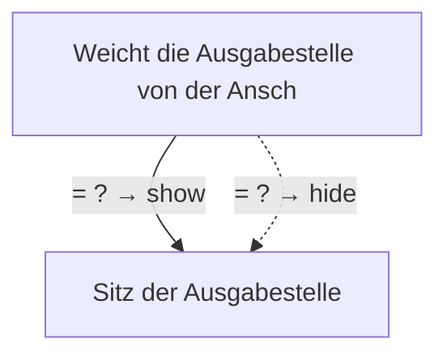

# Anzeige der erstmaligen Ausgabe von Heimarbeit

- **FIM-ID:** `S00000000364 1.0.0` · **Reifegrad:** fachlich freigegeben (gold)
- **Rechtsgrundlagen:** § 7 HAG vom 23.10.2024; § 6 HAG vom 23.10.2024; § 15 HAG vom 23.10.2024
- **Kompiliert:** 2026-08-13T15:33:55Z aus https://fimportal.de/api/v1/schemas/S00000000364/1.0.0/xdf
- **Umfang:** 14 Felder, 2 gesicherte Bedingungen, 0 ungeklärt

## Verbindliche Arbeitsweise

1. **`graph.json` entscheidet, nicht du.** Ob ein Feld gebraucht wird, welcher Nachweis fehlt und welche Bedingung gilt, steht dort. Leite das nie selbst ab.
2. **Übersetze nur.** Deine Aufgabe ist Alltagssprache ↔ Feldwert. Nenne auf Nachfrage die amtliche Formulierung und die Rechtsgrundlage.
3. **Frage nur, was offen ist.** Felder, deren Bedingung nach den bisherigen Antworten nicht erfüllt ist, entfallen — frage sie nicht ab.
4. **Bei ungeklärten Regeln sag das.** Der Abschnitt „Ungeklärte Regeln" enthält Bedingungen, die nicht maschinell gelesen werden konnten. Rate dort nicht, sondern verweise auf die zuständige Stelle.

## Felder

### Ohne Gruppe

- **Eingetragener Name** (`F60000000319`) — Pflicht
  - Rechtsgrundlage: XOEV.Kernkomponente.NameOrganisation.name vom 01.08.2017; XGewerbeanzeige.Betrieb.eingetragenerName Version 2.2; XUnternehmen.Kerndatenmodell.Eingetragener Name Version 1.1
  - Hilfe: Geben Sie den im Handelsregister, im Genossenschaftsregister, im Vereinsregister oder im Stiftungsverzeichnis eingetragenen Namen mit Rechtsform an, soweit eine Eintragung vorliegt.
- **Art des Betriebes und Wirtschaftszweiges** (`F00000003446`) — optional
  - Rechtsgrundlage: leitet sich nicht direkt aus der Norm ab, ist nach Bundesfachlichkeit aber fachlich sinnvoll zu erheben
- **Weicht die Ausgabestelle von der Anschrift des Unternehmens ab?** (`F00000003445`) — Pflicht
  - Rechtsgrundlage: leitet sich nicht direkt aus der Norm ab, wird aber von der Bundesfachlichkeit als fachlich notwendig erachtet

### Straßenanschrift (`G60000000086`)

- **Straße** (`F60000000243`) — Pflicht
  - Rechtsgrundlage: XInneres.Meldeanschrift.strasse Version 8
  - Hilfe: Geben Sie an, wie die Straße heißt, ohne Abkürzungen zu verwenden, Beispiel Bischöflich-Geistlicher-Rat-Josef-Zinnbauer-Straße
- **Hausnummer** (`F60000000244`) — optional
  - Rechtsgrundlage: XInneres.Meldeanschrift.hausnummer Version 8
  - Hilfe: Geben Sie die Ziffern und ggf. Buchstaben der Hausnummer der Anschrift an, Beispiel 124a.
- **Postleitzahl** (`F60000000246`) — Pflicht
  - Rechtsgrundlage: XInneres.Meldeanschrift.postleitzahl Version 8
  - Hilfe: Geben Sie die Postleitzahl des Ortes an, Beispiel 10115.
- **Ort** (`F60000000247`) — Pflicht
  - Rechtsgrundlage: § 5 (2) Nr. 9 PAuswG vom 21.6.2019; Anhang 3 Abschnitt 1 (Wohnort) PAuswV vom 28.9.2017; Tabelle 11 BSI TR-03123, Version 1.5.1; Xinneres.Meldeanschrift.Wohnort Version 8; XOEV.Kernkomponente.Anschrift.ort vom 31.01.2020
  - Hilfe: Geben Sie an, wie der Ort heißt. Benennen Sie dafür den Namen der Ortschaft, Gemeinde oder Stadt; nicht jedoch den Namen des Ortsteils, Beispiel Berlin.
- **Adresszusatz** (`F60000000248`) — optional
  - Rechtsgrundlage: XInneres.Meldeanschrift.zusatzangaben Version 8
  - Hilfe: Geben Sie Zusatzangaben zur Anschrift an. Beispiele: Hinterhaus, Gartenhaus.

### Sitz der Ausgabestelle › Straßenanschrift (`G60000000086`)

- **Straße** (`F60000000243`) — Pflicht
  - Rechtsgrundlage: XInneres.Meldeanschrift.strasse Version 8
  - Hilfe: Geben Sie an, wie die Straße heißt, ohne Abkürzungen zu verwenden, Beispiel Bischöflich-Geistlicher-Rat-Josef-Zinnbauer-Straße
- **Hausnummer** (`F60000000244`) — optional
  - Rechtsgrundlage: XInneres.Meldeanschrift.hausnummer Version 8
  - Hilfe: Geben Sie die Ziffern und ggf. Buchstaben der Hausnummer der Anschrift an, Beispiel 124a.
- **Postleitzahl** (`F60000000246`) — Pflicht
  - Rechtsgrundlage: XInneres.Meldeanschrift.postleitzahl Version 8
  - Hilfe: Geben Sie die Postleitzahl des Ortes an, Beispiel 10115.
- **Ort** (`F60000000247`) — Pflicht
  - Rechtsgrundlage: § 5 (2) Nr. 9 PAuswG vom 21.6.2019; Anhang 3 Abschnitt 1 (Wohnort) PAuswV vom 28.9.2017; Tabelle 11 BSI TR-03123, Version 1.5.1; Xinneres.Meldeanschrift.Wohnort Version 8; XOEV.Kernkomponente.Anschrift.ort vom 31.01.2020
  - Hilfe: Geben Sie an, wie der Ort heißt. Benennen Sie dafür den Namen der Ortschaft, Gemeinde oder Stadt; nicht jedoch den Namen des Ortsteils, Beispiel Berlin.
- **Adresszusatz** (`F60000000248`) — optional
  - Rechtsgrundlage: XInneres.Meldeanschrift.zusatzangaben Version 8
  - Hilfe: Geben Sie Zusatzangaben zur Anschrift an. Beispiele: Hinterhaus, Gartenhaus.

### Sitz der Ausgabestelle (`G00000002211`)

- **Telefonnummer** (`F60000000240`) — optional
  - Rechtsgrundlage: ITU E.123
  - Hilfe: Geben Sie bei Telefonnummern innerhalb Deutschlands zuerst die Ortsvorwahl bzw. Mobilnetzvorwahl in Klammern, gefolgt von der Rufnummer an, Beispiel (0211) 12345678.
Geben Sie bei Telefonnummern außerhalb Deutschlands zuerst den Internationalen Ländercode mit vorgestelltem Plus, gefolgt von der Ortsvorwahl bzw. Mobilnetzvorwahl ohne der führenden Null, gefolgt von der Rufnummer an, Beispiel +49 211 123456789.

## Bedingungen

| Bedingung | Feld | Folge | Rechtsgrundlage | Regel |
|---|---|---|---|---|
| wenn „Weicht die Ausgabestelle von der Anschrift des Unternehmens ab?" gleich einem beliebigen Wert ist | „Sitz der Ausgabestelle" | wird gezeigt | — | `R00000002589` |
| wenn „Weicht die Ausgabestelle von der Anschrift des Unternehmens ab?" gleich einem beliebigen Wert ist | „Sitz der Ausgabestelle" | entfällt | — | `R00000002589` |

## Abhängigkeitsgraph

