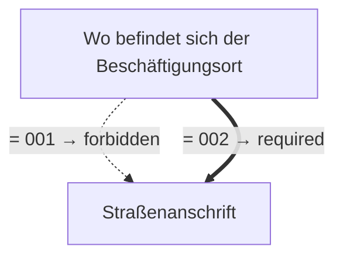

# Antrag für die Zulässigkeit von Kündigungen bei besonderen Kündigungsverboten

- **FIM-ID:** `S00000000367 1.0.0` · **Reifegrad:** fachlich freigegeben (gold)
- **Rechtsgrundlagen:** § 17 (2) MuSchG v. 12.12.2019
- **Kompiliert:** 2026-08-13T15:34:10Z aus https://fimportal.de/api/v1/schemas/S00000000367/1.0.0/xdf
- **Umfang:** 21 Felder, 2 gesicherte Bedingungen, 0 ungeklärt

## Verbindliche Arbeitsweise

1. **`graph.json` entscheidet, nicht du.** Ob ein Feld gebraucht wird, welcher Nachweis fehlt und welche Bedingung gilt, steht dort. Leite das nie selbst ab.
2. **Übersetze nur.** Deine Aufgabe ist Alltagssprache ↔ Feldwert. Nenne auf Nachfrage die amtliche Formulierung und die Rechtsgrundlage.
3. **Frage nur, was offen ist.** Felder, deren Bedingung nach den bisherigen Antworten nicht erfüllt ist, entfallen — frage sie nicht ab.
4. **Bei ungeklärten Regeln sag das.** Der Abschnitt „Ungeklärte Regeln" enthält Bedingungen, die nicht maschinell gelesen werden konnten. Rate dort nicht, sondern verweise auf die zuständige Stelle.

## Antworten zur Leistung

_Quelle: LeiKa 99006045129000, bundesweiter Stammtext · Zuordnung geprüft über § 17 · muschg._

### Wer darf den Antrag stellen?

<ul>
 <li>Es besteht ein triftiger Kündigungsgrund wie zum Beispiel Insolvenz, teilweise Stilllegung des Betriebs oder eine besonders schwere Pflichtverletzung der Arbeitnehmenden.</li>
 <li>Sie beschäftigen Arbeitnehmende einer der 3 Personengruppen, die einem besonderen Kündigungsverbot unterliegen.</li>
</ul>

### Welche Unterlagen werden gebraucht?

<ul>
 <li>Antrag für die Zulässigkeitserklärung</li>
</ul>

Das zuständige Amt kann bei Bedarf weitere Informationen und Unterlagen anfordern, wenn es zu den gemachten Angaben Rückfragen gibt.

### Besonderheiten

Es gibt keine Hinweise oder Besonderheiten.&#xa0;

### Ausführliche Beschreibung

Möchten Sie Beschäftigten kündigen, die unter besonderem Kündigungsschutz stehen, müssen Sie vor der Kündigung eine Zulässigkeitserklärung beantragen.

Folgende Personengruppen stehen unter besonderem Kündigungsschutz:

<ul>
 <li>Frauen</li>
</ul>
<ul>
 <li>Personen in Elternzeit,</li>
 <li>
  Personen, die nach dem Pflegezeitgesetz oder dem Familienpflegezeitgesetz eine pflegebedürftige angehörige Person pflegen und dafür die entsprechende (teiweise) Freistellung in Anspruch nehmen. Pflegezeit und Pflegefamilienzeit können Sie zusammen maximal 24 Monate je pflegebedürftige, angehörige Person nehmen. &#xa0;
   
  &#xa0;
 </li>
</ul>

Beachten Sie die Besonderheiten der unterschiedlichen Kündigungsschutzregeln bei diesen Personengruppen:

<ul>
 <li>Für die Pflege gilt der Kündigungsschutz nicht nur während der pflegebedingten Freistellung, sondern bereits dann, wenn eine Arbeitsverhinderung bei Ihnen angekündigt wird. Der Schutz gilt höchstens 12 Wochen vor dem angekündigten Beginn. Der Kündigungsschutz gilt außerdem nicht nur bei der Übernahme einer Pflegeleistung, sondern auch, wenn eine Pflege organisiert wird. Hierfür können Beschäftigte unter bestimmten Voraussetzungen bis zu 10 Tage freigestellt werden.</li>
 <li>
  Ein Kündigungsschutz für Eltern in Elternzeit beginnt bereits bei Antragstellung. Jedoch frühestens:
  <ul>
   <li>8 Wochen vor Beginn der Elternzeit, wenn das Kind unter 3 Jahren alt ist.</li>
   <li>14 Wochen vor Beginn der Elternzeit, wenn das Kind zwischen 3 und 8 Jahren alt ist.</li>
  </ul>
 </li>
</ul>

Die zuständige Behörde erteilt Ihnen die Zustimmung nur, wenn ein belegbarer Kündigungsgrund nachgewiesen werden kann.

_Für 11 Länder gibt es abweichende Fassungen mit eigenen Fristen und Zuständigkeiten. Bei Fragen dazu auf die zuständige Stelle des jeweiligen Landes verweisen._

## Felder

### Angaben zum Unternehmen (`G00000002191`)

- **Eingetragener Name** (`F60000000319`) — Pflicht
  - Rechtsgrundlage: XOEV.Kernkomponente.NameOrganisation.name vom 01.08.2017; XGewerbeanzeige.Betrieb.eingetragenerName Version 2.2; XUnternehmen.Kerndatenmodell.Eingetragener Name Version 1.1
  - Hilfe: Geben Sie den im Handelsregister, im Genossenschaftsregister, im Vereinsregister oder im Stiftungsverzeichnis eingetragenen Namen mit Rechtsform an, soweit eine Eintragung vorliegt.

### Angaben zum Unternehmen › Straßenanschrift (`G60000000086`)

- **Straße** (`F60000000243`) — Pflicht
  - Rechtsgrundlage: XInneres.Meldeanschrift.strasse Version 8
  - Hilfe: Geben Sie an, wie die Straße heißt, ohne Abkürzungen zu verwenden, Beispiel Bischöflich-Geistlicher-Rat-Josef-Zinnbauer-Straße
- **Hausnummer** (`F60000000244`) — optional
  - Rechtsgrundlage: XInneres.Meldeanschrift.hausnummer Version 8
  - Hilfe: Geben Sie die Ziffern und ggf. Buchstaben der Hausnummer der Anschrift an, Beispiel 124a.
- **Postleitzahl** (`F60000000246`) — Pflicht
  - Rechtsgrundlage: XInneres.Meldeanschrift.postleitzahl Version 8
  - Hilfe: Geben Sie die Postleitzahl des Ortes an, Beispiel 10115.
- **Ort** (`F60000000247`) — Pflicht
  - Rechtsgrundlage: § 5 (2) Nr. 9 PAuswG vom 21.6.2019; Anhang 3 Abschnitt 1 (Wohnort) PAuswV vom 28.9.2017; Tabelle 11 BSI TR-03123, Version 1.5.1; Xinneres.Meldeanschrift.Wohnort Version 8; XOEV.Kernkomponente.Anschrift.ort vom 31.01.2020
  - Hilfe: Geben Sie an, wie der Ort heißt. Benennen Sie dafür den Namen der Ortschaft, Gemeinde oder Stadt; nicht jedoch den Namen des Ortsteils, Beispiel Berlin.
- **Adresszusatz** (`F60000000248`) — optional
  - Rechtsgrundlage: XInneres.Meldeanschrift.zusatzangaben Version 8
  - Hilfe: Geben Sie Zusatzangaben zur Anschrift an. Beispiele: Hinterhaus, Gartenhaus.

### Angaben zur arbeitnehmenden Person (`G00000002200`)

- **Vornamen** (`F60000000228`) — Pflicht
  - Rechtsgrundlage: § 5 (2) Nr. 2 PAuswG vom 21.6.2019; Anhang 3 PAuswV vom 28.9.2017; Tabelle 9 BSI TR-03123 Version 1.5.1; XOEV.Kernkomponente.NameNatuerlichePerson.vorname vom 31.08.2020
  - Hilfe: Geben Sie die Vornamen so an, wie sie auf den offiziellen Ausweisen angegeben sind, zum Beispiel im Personalausweis.
- **Familienname** (`F60000000227`) — Pflicht
  - Rechtsgrundlage: § 5 (2) Nr. 1 PAuswG vom 21.6.2019; Anhang 3 PAuswV vom 28.9.2017; Tabelle 9 BSI TR-03123 Version 1.5.1; XOEV.Kernkomponente.NameNatuerlichePerson.familienname vom 31.01.2020
  - Hilfe: Geben Sie den Nachnamen, Familiennamen bzw. Zunamen an.

### Angaben zur arbeitnehmenden Person › Straßenanschrift (`G60000000086`)

- **Straße** (`F60000000243`) — Pflicht
  - Rechtsgrundlage: XInneres.Meldeanschrift.strasse Version 8
  - Hilfe: Geben Sie an, wie die Straße heißt, ohne Abkürzungen zu verwenden, Beispiel Bischöflich-Geistlicher-Rat-Josef-Zinnbauer-Straße
- **Hausnummer** (`F60000000244`) — optional
  - Rechtsgrundlage: XInneres.Meldeanschrift.hausnummer Version 8
  - Hilfe: Geben Sie die Ziffern und ggf. Buchstaben der Hausnummer der Anschrift an, Beispiel 124a.
- **Postleitzahl** (`F60000000246`) — Pflicht
  - Rechtsgrundlage: XInneres.Meldeanschrift.postleitzahl Version 8
  - Hilfe: Geben Sie die Postleitzahl des Ortes an, Beispiel 10115.
- **Ort** (`F60000000247`) — Pflicht
  - Rechtsgrundlage: § 5 (2) Nr. 9 PAuswG vom 21.6.2019; Anhang 3 Abschnitt 1 (Wohnort) PAuswV vom 28.9.2017; Tabelle 11 BSI TR-03123, Version 1.5.1; Xinneres.Meldeanschrift.Wohnort Version 8; XOEV.Kernkomponente.Anschrift.ort vom 31.01.2020
  - Hilfe: Geben Sie an, wie der Ort heißt. Benennen Sie dafür den Namen der Ortschaft, Gemeinde oder Stadt; nicht jedoch den Namen des Ortsteils, Beispiel Berlin.
- **Adresszusatz** (`F60000000248`) — optional
  - Rechtsgrundlage: XInneres.Meldeanschrift.zusatzangaben Version 8
  - Hilfe: Geben Sie Zusatzangaben zur Anschrift an. Beispiele: Hinterhaus, Gartenhaus.

### Angaben zur arbeitnehmenden Person › Ort der Beschäftigung (`G00000002194`)

- **Wo befindet sich der Beschäftigungsort der Frau?** (`F00000003390`) — Pflicht
  - Rechtsgrundlage: § 17 (2) MuSchG

### Angaben zur arbeitnehmenden Person › Ort der Beschäftigung › Straßenanschrift (`G60000000086`)

- **Straße** (`F60000000243`) — Pflicht
  - Rechtsgrundlage: XInneres.Meldeanschrift.strasse Version 8
  - Hilfe: Geben Sie an, wie die Straße heißt, ohne Abkürzungen zu verwenden, Beispiel Bischöflich-Geistlicher-Rat-Josef-Zinnbauer-Straße
- **Hausnummer** (`F60000000244`) — optional
  - Rechtsgrundlage: XInneres.Meldeanschrift.hausnummer Version 8
  - Hilfe: Geben Sie die Ziffern und ggf. Buchstaben der Hausnummer der Anschrift an, Beispiel 124a.
- **Postleitzahl** (`F60000000246`) — Pflicht
  - Rechtsgrundlage: XInneres.Meldeanschrift.postleitzahl Version 8
  - Hilfe: Geben Sie die Postleitzahl des Ortes an, Beispiel 10115.
- **Ort** (`F60000000247`) — Pflicht
  - Rechtsgrundlage: § 5 (2) Nr. 9 PAuswG vom 21.6.2019; Anhang 3 Abschnitt 1 (Wohnort) PAuswV vom 28.9.2017; Tabelle 11 BSI TR-03123, Version 1.5.1; Xinneres.Meldeanschrift.Wohnort Version 8; XOEV.Kernkomponente.Anschrift.ort vom 31.01.2020
  - Hilfe: Geben Sie an, wie der Ort heißt. Benennen Sie dafür den Namen der Ortschaft, Gemeinde oder Stadt; nicht jedoch den Namen des Ortsteils, Beispiel Berlin.
- **Adresszusatz** (`F60000000248`) — optional
  - Rechtsgrundlage: XInneres.Meldeanschrift.zusatzangaben Version 8
  - Hilfe: Geben Sie Zusatzangaben zur Anschrift an. Beispiele: Hinterhaus, Gartenhaus.

### Kündigungsnachweis (`G00000002236`)

- **Kündigungsgrund** (`F00000003429`) — Pflicht
  - Rechtsgrundlage: § 17 (2) MuSchG
  - Hilfe: Beschreiben Sie den Kündigungsgrund.
- **Nachweis** (`F60000000296`) — optional
  - Rechtsgrundlage: § 17 (2) MuSchG _(geerbt)_
  - Hilfe: Fügen Sie einen Nachweis bei, der die Angaben bestätigt.

## Bedingungen

| Bedingung | Feld | Folge | Rechtsgrundlage | Regel |
|---|---|---|---|---|
| wenn „Wo befindet sich der Beschäftigungsort der Frau?" gleich „001" ist | „Straßenanschrift" | darf nicht ausgefüllt werden | — | `G00000002194` |
| wenn „Wo befindet sich der Beschäftigungsort der Frau?" gleich „002" ist | „Straßenanschrift" | muss ausgefüllt werden | — | `G00000002194` |

## Abhängigkeitsgraph

