# Ausnahmegenehmigung vom Verbot der Mehr- oder Nacharbeit einer schwangeren oder stillenden Frau

- **FIM-ID:** `S00000000372 1.0.0` · **Reifegrad:** fachlich freigegeben (gold)
- **Rechtsgrundlagen:** § 29 (3) Nr. 1 MuSchG v. 12.12.2019; § 29 (3) Nr. 8 MuSchG v. 12.12.2019
- **Kompiliert:** 2026-08-13T15:34:51Z aus https://fimportal.de/api/v1/schemas/S00000000372/1.0.0/xdf
- **Umfang:** 28 Felder, 11 gesicherte Bedingungen, 0 ungeklärt

## Verbindliche Arbeitsweise

1. **`graph.json` entscheidet, nicht du.** Ob ein Feld gebraucht wird, welcher Nachweis fehlt und welche Bedingung gilt, steht dort. Leite das nie selbst ab.
2. **Übersetze nur.** Deine Aufgabe ist Alltagssprache ↔ Feldwert. Nenne auf Nachfrage die amtliche Formulierung und die Rechtsgrundlage.
3. **Frage nur, was offen ist.** Felder, deren Bedingung nach den bisherigen Antworten nicht erfüllt ist, entfallen — frage sie nicht ab.
4. **Bei ungeklärten Regeln sag das.** Der Abschnitt „Ungeklärte Regeln" enthält Bedingungen, die nicht maschinell gelesen werden konnten. Rate dort nicht, sondern verweise auf die zuständige Stelle.

## Antworten zur Leistung

_Quelle: LeiKa 99006054273000, bundesweiter Stammtext · Zuordnung geprüft über § 29 · muschg._

### Wer darf den Antrag stellen?

<ul>
 <li>Als Antragstellerin oder Antragsteller sind Sie Arbeitgeberin oder Arbeitgeber.</li>
 <li>Die schwangere oder stillende Frau erklärt sich ausdrücklich dazu bereit.</li>
 <li>
  Das ärztliche Zeugnis spricht nicht gegen die geplante &#xa0;&#xa0;
  <ul>
   <li>Nacht-,</li>
   <li>Mehr-,</li>
   <li>Akkord- oder</li>
   <li>Fließarbeit.</li>
  </ul>
 </li>
 <li>Eine unverantwortbare Gefährdung für die schwangere Frau durch Alleinarbeit, Art der Arbeit und das Arbeitstempo ist ausgeschlossen.</li>
 <li>Eine unverantwortbare Gefährdung für das Kind durch Alleinarbeit, Art der Arbeit und das Arbeitstempo ist ausgeschlossen.</li>
</ul>

### Welche Unterlagen werden gebraucht?

<ul>
 <li>
  ärztliches Zeugnis darüber, dass nichts gegen eine Beschäftigung der Frau spricht in Bezug auf:
  <ul>
   <li>Nacht-,</li>
   <li>Mehr-,</li>
   <li>Akkord- oder</li>
   <li>Fließarbeit.</li>
  </ul>
 </li>
 <li>
  zustimmende Erklärung der schwangeren oder stillenden Frau
  <ul>
   <li>die Frau kann Ihre Erklärung jederzeit widerrufen</li>
  </ul>
 </li>
</ul>

Das zuständige Amt kann bei Bedarf weitere Informationen und Unterlagen anfordern, wenn es zu den gemachten Angaben Rückfragen gibt.

### Besonderheiten

Das Mutterschutzgesetz gilt grundsätzlich nicht für:

<ul>
 <li>Selbständige</li>
 <li>Organmitglieder und Geschäftsführerinnen juristischer Personen oder Gesellschaften (soweit sie nicht überwiegend auch als Beschäftigte tätig sind)</li>
 <li>Hausfrauen</li>
</ul>

Grund hierfür ist, dass diese nicht in einem Beschäftigungsverhältnis stehen.

### Ausführliche Beschreibung

Das Mutterschutzgesetz gilt für alle schwangeren und stillenden Frauen, die in einem Beschäftigungsverhältnis stehen. Eine Frau im Sinne des Mutterschutzgesetzes ist jede Person, die schwanger ist, ein Kind geboren hat oder stillt – unabhängig von dem im Geburtseintrag angegebenen Geschlecht.

Dementsprechend gelten für schwangere und stillende Frauen besondere Regeln, wenn es um körperlich oder psychisch anstrengende Arbeiten geht.

So dürfen Sie als Unternehmerin oder Unternehmer schwangere oder stillende Frauen nicht in folgenden Tätigkeiten beschäftigen:

<ul>
 <li>Nachtarbeit</li>
 <li>Mehrarbeit</li>
 <li>Fließarbeit</li>
 <li>Akkordarbeit</li>
 <li>sonstige Arbeiten, in denen gegen ein höheres Arbeitstempo ein höheres Entgelt erzielt werden kann</li>
</ul>

Dafür können Sie eine Ausnahme durch die für Arbeitsschutz zuständige Behörde beantragen.

Von Nachtarbeit ist die Rede, wenn eine Tätigkeit zwischen 22 Uhr und 6 Uhr ausgeführt wird.

Bei einer schwangeren oder stillenden Frau von 18 Jahren oder älter wird von Mehrarbeit gesprochen, wenn ihre Arbeit eines der folgenden Kriterien erfüllt:

<ul>
 <li>über 8,5 Stunden täglich</li>
 <li>über 90 Stunden in der Doppelwoche (inklusive Sonntage)</li>
 <li>die vertraglich vereinbarte Wochenarbeitszeit den Monatsdurchschnitt übersteigend</li>
</ul>

Bei einer schwangeren oder stillenden Frau unter 18 Jahren wird von Mehrarbeit gesprochen, wenn ihre Arbeit eines der folgenden Kriterien erfüllt:&#xa0;

<ul>
 <li>über 8 Stunden täglich</li>
 <li>über 80 Stunden in der Doppelwoche (inklusive Sonntage)</li>
 <li>die vertraglich vereinbarte Wochenarbeitszeit den Monatsdurchschnitt übersteigend</li>
</ul>

Sind neben Ihnen noch weitere Arbeitgeberinnen oder Arbeitgeber vorhanden, ist die Arbeitszeit zusammenzurechnen.

Eine Bewilligung von Mehrarbeit, Nachtarbeit, Fließ- oder Akkordarbeit ersetzt nicht die grundsätzlich notwendige Mitteilung an die Aufsichtsbehörde, dass eine Mitarbeiterin schwanger ist. Diese Mitteilung muss erfolgen, sobald die Arbeitgeberin oder der Arbeitgeber über die Schwangerschaft informiert wurde.

_Für 10 Länder gibt es abweichende Fassungen mit eigenen Fristen und Zuständigkeiten. Bei Fragen dazu auf die zuständige Stelle des jeweiligen Landes verweisen._

## Felder

### Angaben zum Unternehmen (`G00000002191`)

- **Eingetragener Name** (`F60000000319`) — Pflicht
  - Rechtsgrundlage: XOEV.Kernkomponente.NameOrganisation.name vom 01.08.2017; XGewerbeanzeige.Betrieb.eingetragenerName Version 2.2; XUnternehmen.Kerndatenmodell.Eingetragener Name Version 1.1
  - Hilfe: Geben Sie den im Handelsregister, im Genossenschaftsregister, im Vereinsregister oder im Stiftungsverzeichnis eingetragenen Namen mit Rechtsform an, soweit eine Eintragung vorliegt.

### Angaben zum Unternehmen › Straßenanschrift (`G60000000086`)

- **Straße** (`F60000000243`) — Pflicht
  - Rechtsgrundlage: XInneres.Meldeanschrift.strasse Version 8
  - Hilfe: Geben Sie an, wie die Straße heißt, ohne Abkürzungen zu verwenden, Beispiel Bischöflich-Geistlicher-Rat-Josef-Zinnbauer-Straße
- **Hausnummer** (`F60000000244`) — optional
  - Rechtsgrundlage: XInneres.Meldeanschrift.hausnummer Version 8
  - Hilfe: Geben Sie die Ziffern und ggf. Buchstaben der Hausnummer der Anschrift an, Beispiel 124a.
- **Postleitzahl** (`F60000000246`) — Pflicht
  - Rechtsgrundlage: XInneres.Meldeanschrift.postleitzahl Version 8
  - Hilfe: Geben Sie die Postleitzahl des Ortes an, Beispiel 10115.
- **Ort** (`F60000000247`) — Pflicht
  - Rechtsgrundlage: § 5 (2) Nr. 9 PAuswG vom 21.6.2019; Anhang 3 Abschnitt 1 (Wohnort) PAuswV vom 28.9.2017; Tabelle 11 BSI TR-03123, Version 1.5.1; Xinneres.Meldeanschrift.Wohnort Version 8; XOEV.Kernkomponente.Anschrift.ort vom 31.01.2020
  - Hilfe: Geben Sie an, wie der Ort heißt. Benennen Sie dafür den Namen der Ortschaft, Gemeinde oder Stadt; nicht jedoch den Namen des Ortsteils, Beispiel Berlin.
- **Adresszusatz** (`F60000000248`) — optional
  - Rechtsgrundlage: XInneres.Meldeanschrift.zusatzangaben Version 8
  - Hilfe: Geben Sie Zusatzangaben zur Anschrift an. Beispiele: Hinterhaus, Gartenhaus.

### Angaben zur schwangeren oder stillenden Frau (`G00000002193`)

- **Vornamen** (`F60000000228`) — Pflicht
  - Rechtsgrundlage: § 5 (2) Nr. 2 PAuswG vom 21.6.2019; Anhang 3 PAuswV vom 28.9.2017; Tabelle 9 BSI TR-03123 Version 1.5.1; XOEV.Kernkomponente.NameNatuerlichePerson.vorname vom 31.08.2020
  - Hilfe: Geben Sie die Vornamen so an, wie sie auf den offiziellen Ausweisen angegeben sind, zum Beispiel im Personalausweis.
- **Familienname** (`F60000000227`) — Pflicht
  - Rechtsgrundlage: § 5 (2) Nr. 1 PAuswG vom 21.6.2019; Anhang 3 PAuswV vom 28.9.2017; Tabelle 9 BSI TR-03123 Version 1.5.1; XOEV.Kernkomponente.NameNatuerlichePerson.familienname vom 31.01.2020
  - Hilfe: Geben Sie den Nachnamen, Familiennamen bzw. Zunamen an.
- **In welcher Art Beschäftigungsverhältnis steht die Frau?** (`F00000003391`) — Pflicht
  - Rechtsgrundlage: § 28 (1) MuSchG
- **Beschreibung sonstiges Beschäftigungsverhältnis** (`F17000009298`) — optional, conditional
  - Rechtsgrundlage: § 28 (1) MuSchG; § 29 (3) MuSchG
- **Auswahl zum Status der Frau (schwanger oder stillend)** (`F17000009294`) — Pflicht
  - Rechtsgrundlage: § 28 (1) MuSchG; § 29 (3) MuSchG
  - Hilfe: Wählen Sie aus, ob die Frau schwanger oder stillend ist.
- **Geben Sie den (voraussichtlichen) Entbindungstermin an.** (`F17000009295`) — optional, conditional
  - Rechtsgrundlage: § 28 (1) MuSchG; § 29 (3) MuSchG
- **Wann war der tatsächliche Entbindungstermin?** (`F17000009296`) — optional, conditional
  - Rechtsgrundlage: § 28 (1) MuSchG; § 29 (3) MuSchG

### Angaben zur schwangeren oder stillenden Frau › Geburtsdatum (`G60000000083`)

- **Tag** (`F60000000231`) — optional
  - Rechtsgrundlage: § 5 (2) PAuswG vom 21.6.2019; Anhang 3 Abschnitt 1 PAuswV vom 28.9.2017; Tabelle 9 BSI TR-03123 Version 1.5.1 _(geerbt)_
- **Monat** (`F60000000232`) — optional, conditional
  - Rechtsgrundlage: § 5 (2) PAuswG vom 21.6.2019; Anhang 3 Abschnitt 1 PAuswV vom 28.9.2017; Tabelle 9 BSI TR-03123 Version 1.5.1 _(geerbt)_
- **Jahr** (`F60000000233`) — Pflicht
  - Rechtsgrundlage: § 5 (2) PAuswG vom 21.6.2019; Anhang 3 Abschnitt 1 PAuswV vom 28.9.2017; Tabelle 9 BSI TR-03123 Version 1.5.1 _(geerbt)_

### Angaben zur schwangeren oder stillenden Frau › Ort der Beschäftigung (`G00000002194`)

- **Wo befindet sich der Beschäftigungsort der Frau?** (`F00000003390`) — Pflicht
  - Rechtsgrundlage: § 17 (2) MuSchG

### Angaben zur schwangeren oder stillenden Frau › Ort der Beschäftigung › Straßenanschrift (`G60000000086`)

- **Straße** (`F60000000243`) — Pflicht
  - Rechtsgrundlage: XInneres.Meldeanschrift.strasse Version 8
  - Hilfe: Geben Sie an, wie die Straße heißt, ohne Abkürzungen zu verwenden, Beispiel Bischöflich-Geistlicher-Rat-Josef-Zinnbauer-Straße
- **Hausnummer** (`F60000000244`) — optional
  - Rechtsgrundlage: XInneres.Meldeanschrift.hausnummer Version 8
  - Hilfe: Geben Sie die Ziffern und ggf. Buchstaben der Hausnummer der Anschrift an, Beispiel 124a.
- **Postleitzahl** (`F60000000246`) — Pflicht
  - Rechtsgrundlage: XInneres.Meldeanschrift.postleitzahl Version 8
  - Hilfe: Geben Sie die Postleitzahl des Ortes an, Beispiel 10115.
- **Ort** (`F60000000247`) — Pflicht
  - Rechtsgrundlage: § 5 (2) Nr. 9 PAuswG vom 21.6.2019; Anhang 3 Abschnitt 1 (Wohnort) PAuswV vom 28.9.2017; Tabelle 11 BSI TR-03123, Version 1.5.1; Xinneres.Meldeanschrift.Wohnort Version 8; XOEV.Kernkomponente.Anschrift.ort vom 31.01.2020
  - Hilfe: Geben Sie an, wie der Ort heißt. Benennen Sie dafür den Namen der Ortschaft, Gemeinde oder Stadt; nicht jedoch den Namen des Ortsteils, Beispiel Berlin.
- **Adresszusatz** (`F60000000248`) — optional
  - Rechtsgrundlage: XInneres.Meldeanschrift.zusatzangaben Version 8
  - Hilfe: Geben Sie Zusatzangaben zur Anschrift an. Beispiele: Hinterhaus, Gartenhaus.

### Ohne Gruppe

- **Welche Art der Ausnahmegenehmigung möchten Sie beantragen?** (`F00000003396`) — Pflicht
  - Rechtsgrundlage: § 29 (3) Nr. 1 und 8 MuSchG

### Abfrage über die Einhaltung der Bedingungen nach § 28 (1) MuSchG (`G00000002195`)

- **Begründung für die Beschäftigung** (`F00000003442`) — Pflicht
  - Rechtsgrundlage: § 28 (1) MuSchG; § 14 (1) MuSchG
  - Hilfe: Die Begründung muss auf folgende Fragestellungen eingehen:
- Warum muss die Frau in diesem Zeitraum beschäftigt werden?
- Welche Art der Beschäftigung liegt vor?
- Wie lange ist der Zeitraum der Beschäftigung in diesem Zeitraum angestrebt?
- **Fügen Sie die Dokumentation zur Beurteilung der Arbeitsbedingungen nach § 10 (1) MuSchG bei.** (`F00000003395`) — optional
  - Rechtsgrundlage: § 28 (1) MuSchG; § 14 (1) MuSchG
  - Hilfe: Der Arbeitgeber hat die Beurteilung der Arbeitsbedingungen nach § 10 durch Unterlagen zu dokumentieren, aus denen Folgendes ersichtlich ist:
1. das Ergebnis der Gefährdungsbeurteilung nach § 10 Absatz 1 Satz 1 Nummer 1 und der Bedarf an Schutzmaßnahmen nach § 10 Absatz 1 Satz 1 Nummer 2,
2. die Festlegung der erforderlichen Schutzmaßnahmen nach § 10 Absatz 2 Satz 1 sowie das Ergebnis ihrer Überprüfung nach § 9 Absatz 1 Satz 2 und
3. das Angebot eines Gesprächs mit der Frau über weitere Anpassungen ihrer Arbeitsbedingungen nach § 10 Absatz 2 Satz 2 oder der Zeitpunkt eines solchen Gesprächs.
- **Die Arbeitnehmerin erklärt sich ausdrücklich dazu bereit, zwischen 20 Uhr und 22 Uhr für das Unternehmen tätig zu sein.** (`F00000003392`) — optional
  - Rechtsgrundlage: § 28 (1) MuSchG; § 14 (1) MuSchG
- **Ärztliches Zeugnis aus dem hervorgeht, dass keine Bedenken gegen Nacht-, Mehr-, Akkord- oder Fließarbeit bestehen.** (`F00000003393`) — optional
  - Rechtsgrundlage: § 28 (1) MuSchG; § 14 (1) MuSchG
  - Hilfe: Ärztliches Zeugnis muss beigelegt werden.
- **Eine unverantwortbare Gefährdung für die schwangere Frau oder ihr Kind durch Alleinarbeit, Art der Arbeit und das Arbeitstempo ist ausgeschlossen.** (`F00000003394`) — optional
  - Rechtsgrundlage: § 28 (1) MuSchG; § 14 (1) MuSchG
  - Hilfe: Alleinarbeit liegt vor, wenn die Arbeitnehmerin nicht jederzeit ihren Arbeitsplatz verlassen oder 
nicht jederzeit Hilfe erreichen kann.

## Bedingungen

| Bedingung | Feld | Folge | Rechtsgrundlage | Regel |
|---|---|---|---|---|
| wenn „In welcher Art Beschäftigungsverhältnis steht die Frau?" gleich „999" ist | „Beschreibung sonstiges Beschäftigungsverhältnis" | muss ausgefüllt werden | — | `G00000002193` |
| wenn „In welcher Art Beschäftigungsverhältnis steht die Frau?" ungleich „999" ist | „Beschreibung sonstiges Beschäftigungsverhältnis" | darf nicht ausgefüllt werden | — | `G00000002193` |
| wenn „Auswahl zum Status der Frau (schwanger oder stillend)" gleich „001" ist | „Geben Sie den (voraussichtlichen) Entbindungstermin an." | muss ausgefüllt werden | — | `G00000002193` |
| wenn „Auswahl zum Status der Frau (schwanger oder stillend)" ungleich „001" ist | „Geben Sie den (voraussichtlichen) Entbindungstermin an." | darf nicht ausgefüllt werden | — | `G00000002193` |
| wenn „Auswahl zum Status der Frau (schwanger oder stillend)" gleich „001" ist | „Wann war der tatsächliche Entbindungstermin?" | darf nicht ausgefüllt werden | — | `G00000002193` |
| wenn „Auswahl zum Status der Frau (schwanger oder stillend)" gleich „002" ist | „Wann war der tatsächliche Entbindungstermin?" | muss ausgefüllt werden | — | `G00000002193` |
| wenn „Auswahl zum Status der Frau (schwanger oder stillend)" ungleich „002" ist | „Wann war der tatsächliche Entbindungstermin?" | darf nicht ausgefüllt werden | — | `G00000002193` |
| wenn „Tag" nicht leer ist | „Monat" | muss ausgefüllt werden | — | `G60000000083` |
| wenn „Wo befindet sich der Beschäftigungsort der Frau?" gleich „001" ist | „Straßenanschrift" | darf nicht ausgefüllt werden | — | `G00000002194` |
| wenn „Wo befindet sich der Beschäftigungsort der Frau?" gleich „002" ist | „Straßenanschrift" | muss ausgefüllt werden | — | `G00000002194` |

## Abhängigkeitsgraph

```mermaid
flowchart TD
  G00000002193_F00000003391["In welcher Art Beschäftigungsverhältni"] ==>|"= 999 → required"| G00000002193_F17000009298["Beschreibung sonstiges Beschäftigungsv"]
  G00000002193_F00000003391["In welcher Art Beschäftigungsverhältni"] -.->|"<> 999 → forbidden"| G00000002193_F17000009298["Beschreibung sonstiges Beschäftigungsv"]
  G00000002193_F17000009294["Auswahl zum Status der Frau (schwanger"] ==>|"= 001 → required"| G00000002193_F17000009295["Geben Sie den (voraussichtlichen) Entb"]
  G00000002193_F17000009294["Auswahl zum Status der Frau (schwanger"] -.->|"<> 001 → forbidden"| G00000002193_F17000009295["Geben Sie den (voraussichtlichen) Entb"]
  G00000002193_F17000009294["Auswahl zum Status der Frau (schwanger"] -.->|"= 001 → forbidden"| G00000002193_F17000009296["Wann war der tatsächliche Entbindungst"]
  G00000002193_F17000009294["Auswahl zum Status der Frau (schwanger"] ==>|"= 002 → required"| G00000002193_F17000009296["Wann war der tatsächliche Entbindungst"]
  G00000002193_F17000009294["Auswahl zum Status der Frau (schwanger"] -.->|"<> 002 → forbidden"| G00000002193_F17000009296["Wann war der tatsächliche Entbindungst"]
  G00000002193_G60000000083_F60000000231["Tag"] ==>|"nicht leer ? → required"| G00000002193_G60000000083_F60000000232["Monat"]
  G00000002193_G00000002194_F00000003390["Wo befindet sich der Beschäftigungsort"] -.->|"= 001 → forbidden"| G00000002193_G00000002194_G60000000086["Straßenanschrift"]
  G00000002193_G00000002194_F00000003390["Wo befindet sich der Beschäftigungsort"] ==>|"= 002 → required"| G00000002193_G00000002194_G60000000086["Straßenanschrift"]
```

