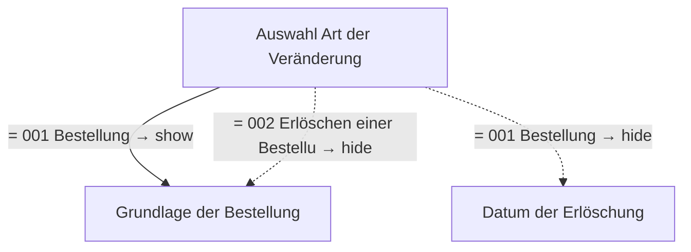

# Mitteilung über eine bestellte verantwortliche Person nach dem Sprengstoffgesetz

- **FIM-ID:** `S00000000373 1.0.0` · **Reifegrad:** fachlich freigegeben (gold)
- **Rechtsgrundlagen:** § 21 (4) SprengG v. 25.10.2024; § 19 (1) Nr. 3, 4 SprengG v. 25.10.2024
- **Kompiliert:** 2026-08-13T15:35:07Z aus https://fimportal.de/api/v1/schemas/S00000000373/1.0.0/xdf
- **Umfang:** 15 Felder, 3 gesicherte Bedingungen, 0 ungeklärt

## Verbindliche Arbeitsweise

1. **`graph.json` entscheidet, nicht du.** Ob ein Feld gebraucht wird, welcher Nachweis fehlt und welche Bedingung gilt, steht dort. Leite das nie selbst ab.
2. **Übersetze nur.** Deine Aufgabe ist Alltagssprache ↔ Feldwert. Nenne auf Nachfrage die amtliche Formulierung und die Rechtsgrundlage.
3. **Frage nur, was offen ist.** Felder, deren Bedingung nach den bisherigen Antworten nicht erfüllt ist, entfallen — frage sie nicht ab.
4. **Bei ungeklärten Regeln sag das.** Der Abschnitt „Ungeklärte Regeln" enthält Bedingungen, die nicht maschinell gelesen werden konnten. Rate dort nicht, sondern verweise auf die zuständige Stelle.

## Felder

### Angaben zum Unternehmen (`G00000002191`)

- **Eingetragener Name** (`F60000000319`) — Pflicht
  - Rechtsgrundlage: XOEV.Kernkomponente.NameOrganisation.name vom 01.08.2017; XGewerbeanzeige.Betrieb.eingetragenerName Version 2.2; XUnternehmen.Kerndatenmodell.Eingetragener Name Version 1.1
  - Hilfe: Geben Sie den im Handelsregister, im Genossenschaftsregister, im Vereinsregister oder im Stiftungsverzeichnis eingetragenen Namen mit Rechtsform an, soweit eine Eintragung vorliegt.

### Angaben zum Unternehmen › Straßenanschrift (`G60000000086`)

- **Straße** (`F60000000243`) — Pflicht
  - Rechtsgrundlage: XInneres.Meldeanschrift.strasse Version 8
  - Hilfe: Geben Sie an, wie die Straße heißt, ohne Abkürzungen zu verwenden, Beispiel Bischöflich-Geistlicher-Rat-Josef-Zinnbauer-Straße
- **Hausnummer** (`F60000000244`) — optional
  - Rechtsgrundlage: XInneres.Meldeanschrift.hausnummer Version 8
  - Hilfe: Geben Sie die Ziffern und ggf. Buchstaben der Hausnummer der Anschrift an, Beispiel 124a.
- **Postleitzahl** (`F60000000246`) — Pflicht
  - Rechtsgrundlage: XInneres.Meldeanschrift.postleitzahl Version 8
  - Hilfe: Geben Sie die Postleitzahl des Ortes an, Beispiel 10115.
- **Ort** (`F60000000247`) — Pflicht
  - Rechtsgrundlage: § 5 (2) Nr. 9 PAuswG vom 21.6.2019; Anhang 3 Abschnitt 1 (Wohnort) PAuswV vom 28.9.2017; Tabelle 11 BSI TR-03123, Version 1.5.1; Xinneres.Meldeanschrift.Wohnort Version 8; XOEV.Kernkomponente.Anschrift.ort vom 31.01.2020
  - Hilfe: Geben Sie an, wie der Ort heißt. Benennen Sie dafür den Namen der Ortschaft, Gemeinde oder Stadt; nicht jedoch den Namen des Ortsteils, Beispiel Berlin.
- **Adresszusatz** (`F60000000248`) — optional
  - Rechtsgrundlage: XInneres.Meldeanschrift.zusatzangaben Version 8
  - Hilfe: Geben Sie Zusatzangaben zur Anschrift an. Beispiele: Hinterhaus, Gartenhaus.

### Angaben über Bestellung oder Erlöschung einer Bestellung nach § 21 (4) Sprengstoffgesetz (`G00000002237`)

- **Auswahl Art der Veränderung** (`F00000003430`) — Pflicht
  - Rechtsgrundlage: § 21 (4) SprengG
  - Hilfe: Wählen Sie aus, ob Sie eine Bestellung oder das Erlöschen einer Bestellung anzeigen möchten.
- **Datum der Erlöschung** (`F00000003540`) — Pflicht, conditional
  - Rechtsgrundlage: § 21 (4) SprengG; § 21 (2) SprengG; § 21 (3) SprengG
  - Hilfe: Geben Sie das Datum an, an dem die Bestellung als verantwortliche Person nach dem SprengG erlischt bzw. erloschen ist.

### Angaben über Bestellung oder Erlöschung einer Bestellung nach § 21 (4) Sprengstoffgesetz › Angaben zur verantwortlichen Person (`G00000002238`)

- **Familienname** (`F60000000227`) — Pflicht
  - Rechtsgrundlage: § 5 (2) Nr. 1 PAuswG vom 21.6.2019; Anhang 3 PAuswV vom 28.9.2017; Tabelle 9 BSI TR-03123 Version 1.5.1; XOEV.Kernkomponente.NameNatuerlichePerson.familienname vom 31.01.2020
  - Hilfe: Geben Sie den Nachnamen, Familiennamen bzw. Zunamen an.
- **Vornamen** (`F60000000228`) — Pflicht
  - Rechtsgrundlage: § 5 (2) Nr. 2 PAuswG vom 21.6.2019; Anhang 3 PAuswV vom 28.9.2017; Tabelle 9 BSI TR-03123 Version 1.5.1; XOEV.Kernkomponente.NameNatuerlichePerson.vorname vom 31.08.2020
  - Hilfe: Geben Sie die Vornamen so an, wie sie auf den offiziellen Ausweisen angegeben sind, zum Beispiel im Personalausweis.
- **Doktorgrade** (`F60000000229`) — optional
  - Rechtsgrundlage: § 5 (2) Nr. 3 PAuswG vom 21.6.2019; Tabelle 9 BSI TR-03123 Version 1.5.1 (dort als Titel); XMeld.type.NameNatuerlichePerson.doktorgrad Version 2.4.4
  - Hilfe: Geben Sie anerkannte Doktorgrade an. Zulässig sind: "Dr.", "Dr.hc." und "Dr.eh.". Wollen Sie mehrere Doktorgrade angeben, trennen Sie diese durch ein Leerzeichen.

### Angaben über Bestellung oder Erlöschung einer Bestellung nach § 21 (4) Sprengstoffgesetz › Grundlage der Bestellung (`G00000002252`)

- **Art der Grundlage für Bestellung** (`F00000003450`) — Pflicht
  - Rechtsgrundlage: § 21 (2-3) SprengG
  - Hilfe: Je nach Art der Grundlage für die Bestellung stellen Sie bitte als Nachweis für Ihre Befähigung entweder den Befähigungsschein oder die Unbedenklichkeitsbescheinigung zur Verfügung.
- **Nachweis** (`F60000000296`) — optional
  - Rechtsgrundlage: § 21 (2-4) SprengG; § 19 SprengG _(geerbt)_
  - Hilfe: Fügen Sie einen Nachweis bei, der die Angaben bestätigt.
- **Benennen Sie den Aufgaben- und Verantwortungsbereich der verantwortlichen Person** (`F00000003451`) — Pflicht
  - Rechtsgrundlage: § 19 SprengG
  - Hilfe: Verantwortliche Personen und deren Aufgaben sind nach § 19 SprengG folgende Personen:
A) der Erlaubnisinhaber oder der Inhaber eines Betriebes, der den Umgang oder den Verkehr mit explosionsgefährlichen Stoffen betreiben darf, B) die mit der Gesamtleitung der genannten Tätigkeiten beauftragte Person, C) die mit der Leitung des Betriebes, einer Zweigniederlassung oder einer unselbständigen Zweigstelle beauftragten Personen, D) Aufsichtspersonen, insbesondere Leiter einer Betriebsabteilung, Sprengberechtigte, Betriebsmeister, fachtechnisches Aufsichtspersonal in der Kampfmittelbeseitigung und Lagerverwalter sowie E) Personen, die zum Verbringen explosionsgefährlicher Stoffe, zu deren Überlassen an andere oder zum Empfang dieser Stoffe von anderen bestellt sind.
- **Datum der Bestellung** (`F00000003541`) — Pflicht
  - Rechtsgrundlage: § 21 (4) SprengG; § 21 (2) SprengG; § 21 (3) SprengG
  - Hilfe: Geben Sie das Datum an, zu dem die verantwortliche Person nach SprengG bestellt ist bzw. wird.

## Bedingungen

| Bedingung | Feld | Folge | Rechtsgrundlage | Regel |
|---|---|---|---|---|
| wenn „Auswahl Art der Veränderung" gleich „001 Bestellung" ist | „Grundlage der Bestellung" | wird gezeigt | § 21 (4) SprengG | `R00000002588` |
| wenn „Auswahl Art der Veränderung" gleich „001 Bestellung" ist | „Datum der Erlöschung" | entfällt | § 21 (4) SprengG | `R00000002588` |
| wenn „Auswahl Art der Veränderung" gleich „002 Erlöschen einer Bestellung" ist | „Grundlage der Bestellung" | entfällt | § 21 (4) SprengG | `R00000002588` |

## Abhängigkeitsgraph

