# Antrag auf Verlängerung einer Aufenthaltserlaubnis für Staatsangehörige der Schweiz

- **FIM-ID:** `S00000000387 1.0.0` · **Reifegrad:** fachlich freigegeben (gold)
- **Rechtsgrundlagen:** § 56 (2) AufenthV vom 08.05.2024; Abkommen zwischen der Europäischen Gemeinschaft und ihren Mitgliedstaaten einerseits und der Schweizerischen Eidgenossenschaft andererseits über die Freizügigkeit vom 15.12.2020
- **Kompiliert:** 2026-08-13T15:36:12Z aus https://fimportal.de/api/v1/schemas/S00000000387/1.0.0/xdf
- **Umfang:** 147 Felder, 54 gesicherte Bedingungen, 0 ungeklärt

## Verbindliche Arbeitsweise

1. **`graph.json` entscheidet, nicht du.** Ob ein Feld gebraucht wird, welcher Nachweis fehlt und welche Bedingung gilt, steht dort. Leite das nie selbst ab.
2. **Übersetze nur.** Deine Aufgabe ist Alltagssprache ↔ Feldwert. Nenne auf Nachfrage die amtliche Formulierung und die Rechtsgrundlage.
3. **Frage nur, was offen ist.** Felder, deren Bedingung nach den bisherigen Antworten nicht erfüllt ist, entfallen — frage sie nicht ab.
4. **Bei ungeklärten Regeln sag das.** Der Abschnitt „Ungeklärte Regeln" enthält Bedingungen, die nicht maschinell gelesen werden konnten. Rate dort nicht, sondern verweise auf die zuständige Stelle.

> **Hinweis:** Die zugehörige Leistung konnte nicht zweifelsfrei zugeordnet werden (Rechtsgrundlage stimmt nicht überein (D99000001632)). Zu Fristen, Kosten, Unterlagen und Zuständigkeit daher keine Auskunft geben, sondern an die zuständige Stelle verweisen.

## Felder

### Angaben Antragsteller oder Gesetzlicher Vertreter (`G00000002190`)

- **Vertritt ein gesetzlicher Vertreter den Antragsteller?** (`F00000003327`) — Pflicht
  - Rechtsgrundlage: §§ 1773 - 1808 BGB

### Angaben Antragsteller oder Gesetzlicher Vertreter › Angaben zum Antragsteller (`G00000002181`)

- **Familienname** (`F60000000227`) — Pflicht
  - Rechtsgrundlage: § 5 (2) Nr. 1 PAuswG vom 21.6.2019; Anhang 3 PAuswV vom 28.9.2017; Tabelle 9 BSI TR-03123 Version 1.5.1; XOEV.Kernkomponente.NameNatuerlichePerson.familienname vom 31.01.2020
  - Hilfe: Geben Sie den Nachnamen, Familiennamen bzw. Zunamen an.
- **Geburtsname** (`F60000000230`) — optional
  - Rechtsgrundlage: § 5 (2) Nr. 1 PAuswG vom 21.6.2019; Anhang 3 Abschnitt 1 PAuswV vom 28.9.2017; Tabelle 9 BSI TR-03123 Version 1.5.1; XOEV.Kernkomponente.NameNatuerlichePerson.geburtsname vom 31.01.2020
  - Hilfe: Geben Sie den Geburtsnamen an. Manche Menschen ändern ihren Familiennamen, wenn sie heiraten oder eine Lebenspartnerschaft eingehen. Der  Geburtsname ist der Familienname den die Person bei der Geburt hatte, bevor sie ihren Namen geändert hat.
- **Vornamen** (`F60000000228`) — Pflicht
  - Rechtsgrundlage: § 5 (2) Nr. 2 PAuswG vom 21.6.2019; Anhang 3 PAuswV vom 28.9.2017; Tabelle 9 BSI TR-03123 Version 1.5.1; XOEV.Kernkomponente.NameNatuerlichePerson.vorname vom 31.08.2020
  - Hilfe: Geben Sie die Vornamen so an, wie sie auf den offiziellen Ausweisen angegeben sind, zum Beispiel im Personalausweis.
- **Doktorgrade** (`F60000000229`) — optional
  - Rechtsgrundlage: § 5 (2) Nr. 3 PAuswG vom 21.6.2019; Tabelle 9 BSI TR-03123 Version 1.5.1 (dort als Titel); XMeld.type.NameNatuerlichePerson.doktorgrad Version 2.4.4
  - Hilfe: Geben Sie anerkannte Doktorgrade an. Zulässig sind: "Dr.", "Dr.hc." und "Dr.eh.". Wollen Sie mehrere Doktorgrade angeben, trennen Sie diese durch ein Leerzeichen.
- **Geburtsort** (`F60000000234`) — Pflicht
  - Rechtsgrundlage: § 5 (2) Nr. 4 PAuswG vom 21.6.2019; Anhang 3 Abschnitt 1 PAuswV vom 28.9.2017; Tabelle 9 BSI TR-03123 Version 1.5.1; XOEV.Kernkomponente.Geburt.geburtsort vom 31.01.2020
  - Hilfe: Geben Sie die Bezeichnung des Ortes an, in dem die Person geboren wurde, Beispiel Düsseldorf.
- **Staat der Geburt** (`F60000000235`) — Pflicht
  - Rechtsgrundlage: XMeld.type.AnschriftMelderecht.Ausland.staat Version 2.4.3; Codeliste laut XMeld und DSMeld: Codeliste Destatis Staat (urn:de:bund:destatis:bevoelkerungsstatistik:schluessel:staat)
- **Staatsangehörigkeit** (`F60000000236`) — Pflicht
  - Rechtsgrundlage: XOEV.Kernkomponente.NatuerlichePerson.staatsangehoerigkeit vom 31.08.2020; Codeliste laut XMeld und DSMeld: Codeliste Destatis Staatsangehörigkeit (urn:de:bund:destatis:bevoelkerungsstatistik:schluessel:staatsangehörigkeit)
  - Hilfe: Wählen Sie aus, welcher Nationalität bzw. welchen Nationalitäten die Person angehört. Es ist auch die Auswahl "ohne Angabe" möglich, falls die Person keiner Nationalität angehört.
- **Frühere Staatsangehörigkeit** (`F00000001839`) — optional
  - Rechtsgrundlage: basierend auf Elementen der BOB-Gruppe G60000175 Antragsteller (abstrakt, umfassend); urn:xoev-de:xunternehmen:kerndatenobjekt:antragsteller Version 1.1 _(geerbt)_
  - Hilfe: Falls Sie früher eine andere Staatsangehörigkeit besessen haben, geben Sie diese an.

### Angaben Antragsteller oder Gesetzlicher Vertreter › Angaben zum Antragsteller › Geburtsdatum (`G60000000083`)

- **Tag** (`F60000000231`) — optional
  - Rechtsgrundlage: § 5 (2) PAuswG vom 21.6.2019; Anhang 3 Abschnitt 1 PAuswV vom 28.9.2017; Tabelle 9 BSI TR-03123 Version 1.5.1 _(geerbt)_
- **Monat** (`F60000000232`) — optional, conditional
  - Rechtsgrundlage: § 5 (2) PAuswG vom 21.6.2019; Anhang 3 Abschnitt 1 PAuswV vom 28.9.2017; Tabelle 9 BSI TR-03123 Version 1.5.1 _(geerbt)_
- **Jahr** (`F60000000233`) — Pflicht
  - Rechtsgrundlage: § 5 (2) PAuswG vom 21.6.2019; Anhang 3 Abschnitt 1 PAuswV vom 28.9.2017; Tabelle 9 BSI TR-03123 Version 1.5.1 _(geerbt)_

### Angaben Antragsteller oder Gesetzlicher Vertreter › Angaben zum Antragsteller › Anschrift (`G60000000093`)

- **Wo befindet sich die Anschrift?** (`F60000000263`) — Pflicht
  - Rechtsgrundlage: basierend auf Elementen der BOB-Gruppe G60000175 Antragsteller (abstrakt, umfassend); urn:xoev-de:xunternehmen:kerndatenobjekt:antragsteller Version 1.1 _(geerbt)_
  - Hilfe: Geben Sie an, ob sich die Anschrift im Inland oder im Ausland befindet.

### Angaben Antragsteller oder Gesetzlicher Vertreter › Angaben zum Antragsteller › Anschrift › Anschrift in Deutschland › Straßenanschrift (`G60000000086`)

- **Straße** (`F60000000243`) — Pflicht
  - Rechtsgrundlage: XInneres.Meldeanschrift.strasse Version 8
  - Hilfe: Geben Sie an, wie die Straße heißt, ohne Abkürzungen zu verwenden, Beispiel Bischöflich-Geistlicher-Rat-Josef-Zinnbauer-Straße
- **Hausnummer** (`F60000000244`) — optional
  - Rechtsgrundlage: XInneres.Meldeanschrift.hausnummer Version 8
  - Hilfe: Geben Sie die Ziffern und ggf. Buchstaben der Hausnummer der Anschrift an, Beispiel 124a.
- **Postleitzahl** (`F60000000246`) — Pflicht
  - Rechtsgrundlage: XInneres.Meldeanschrift.postleitzahl Version 8
  - Hilfe: Geben Sie die Postleitzahl des Ortes an, Beispiel 10115.
- **Ort** (`F60000000247`) — Pflicht
  - Rechtsgrundlage: § 5 (2) Nr. 9 PAuswG vom 21.6.2019; Anhang 3 Abschnitt 1 (Wohnort) PAuswV vom 28.9.2017; Tabelle 11 BSI TR-03123, Version 1.5.1; Xinneres.Meldeanschrift.Wohnort Version 8; XOEV.Kernkomponente.Anschrift.ort vom 31.01.2020
  - Hilfe: Geben Sie an, wie der Ort heißt. Benennen Sie dafür den Namen der Ortschaft, Gemeinde oder Stadt; nicht jedoch den Namen des Ortsteils, Beispiel Berlin.
- **Adresszusatz** (`F60000000248`) — optional
  - Rechtsgrundlage: XInneres.Meldeanschrift.zusatzangaben Version 8
  - Hilfe: Geben Sie Zusatzangaben zur Anschrift an. Beispiele: Hinterhaus, Gartenhaus.

### Angaben Antragsteller oder Gesetzlicher Vertreter › Angaben zum Antragsteller › Anschrift › Anschrift in Deutschland › Anschrift Postfach (`G60000000087`)

- **Postfach** (`F60000000249`) — optional
  - Rechtsgrundlage: XInneres.PostalischeInlandsanschrift.postfach Version 8
  - Hilfe: Geben Sie die Nummer oder Zeichenkette des Postfachs an. Das wird manchmal Postfachnummer genannt.
- **Postleitzahl** (`F60000000246`) — Pflicht
  - Rechtsgrundlage: XInneres.Meldeanschrift.postleitzahl Version 8
  - Hilfe: Geben Sie die Postleitzahl des Ortes an, Beispiel 10115.
- **Ort** (`F60000000247`) — Pflicht
  - Rechtsgrundlage: § 5 (2) Nr. 9 PAuswG vom 21.6.2019; Anhang 3 Abschnitt 1 (Wohnort) PAuswV vom 28.9.2017; Tabelle 11 BSI TR-03123, Version 1.5.1; Xinneres.Meldeanschrift.Wohnort Version 8; XOEV.Kernkomponente.Anschrift.ort vom 31.01.2020
  - Hilfe: Geben Sie an, wie der Ort heißt. Benennen Sie dafür den Namen der Ortschaft, Gemeinde oder Stadt; nicht jedoch den Namen des Ortsteils, Beispiel Berlin.

### Angaben Antragsteller oder Gesetzlicher Vertreter › Angaben zum Antragsteller › Anschrift › Auslandsanschrift (`G60000000091`)

- **Staat** (`F60000000261`) — Pflicht
  - Rechtsgrundlage: XMeld.type.AnschriftMelderecht.Ausland.staat Version 2.4.4; Codeliste laut Xmeld und DSMeld: Codeliste Destatis Staat (urn:de:bund:destatis:bevoelkerungsstatistik:schluessel:staat)
  - Hilfe: Geben Sie den Namen des Staates bzw. des Landes an, Beispiel Deutschland, Frankreich, ...

### Angaben Antragsteller oder Gesetzlicher Vertreter › Angaben zum Antragsteller › Anschrift › Auslandsanschrift › Ausländische Anschrift (`G60000000092`)

- **Anschriftzeile** (`F60000000262`) — optional
  - Rechtsgrundlage: XInneres.Auslandsanschrift.Anschriftzone.zeile.anschrift Version 8
  - Hilfe: Geben Sie die ausländische Anschrift an

### Angaben Antragsteller oder Gesetzlicher Vertreter › Angaben zum Antragsteller › Erreichbarkeit (`G60000000183`)

- **Telefonnummer** (`F60000000240`) — optional
  - Rechtsgrundlage: ITU E.123
  - Hilfe: Geben Sie bei Telefonnummern innerhalb Deutschlands zuerst die Ortsvorwahl bzw. Mobilnetzvorwahl in Klammern, gefolgt von der Rufnummer an, Beispiel (0211) 12345678.
Geben Sie bei Telefonnummern außerhalb Deutschlands zuerst den Internationalen Ländercode mit vorgestelltem Plus, gefolgt von der Ortsvorwahl bzw. Mobilnetzvorwahl ohne der führenden Null, gefolgt von der Rufnummer an, Beispiel +49 211 123456789.
- **Telefaxnummer** (`F60000000241`) — optional
  - Rechtsgrundlage: ITU E.123
  - Hilfe: Geben Sie bei Telefaxnummern innerhalb Deutschlands zuerst die Ortsvorwahl bzw. Mobilnetzvorwahl in Klammern, gefolgt von der Rufnummer an, Beispiel (0211) 12345678.
Geben Sie bei Telefaxnummern außerhalb Deutschlands zuerst den Internationalen Ländercode mit vorgestelltem Plus, gefolgt von der Ortsvorwahl bzw. Mobilnetzvorwahl ohne der führenden Null, gefolgt von der Rufnummer an, Beispiel +49 211 123456789.
- **E-Mail-Adresse** (`F60000000242`) — optional
  - Rechtsgrundlage: RFC 5322; RFC 5321
  - Hilfe: Geben Sie eine E-Mail-Adresse an, z.B. Max.Mustermann@email.de

### Angaben Antragsteller oder Gesetzlicher Vertreter › Gesetzliche Vertretung / Bevollmächtigung (`G60000000220`)

- **Wird die antragstellende Person vertreten?** (`F60000000352`) — Pflicht
  - Rechtsgrundlage: basierend auf Elementen der BOB-Gruppe G60000175 Antragsteller (abstrakt, umfassend); urn:xoev-de:xunternehmen:kerndatenobjekt:antragsteller Version 1.1; ebenfalls basierend auf G60000112 Gesetzlicher Vertreter - Natürliche Person (abstrakt); urn:xoev-de:xunternehmen:kerndatenobjekt:gesetzlichervertreter Version 1.1 _(geerbt)_
- **Betreuungsurkunde** (`F60000000350`) — optional, conditional
  - Rechtsgrundlage: basierend auf Elementen der BOB-Gruppe G60000175 Antragsteller (abstrakt, umfassend); urn:xoev-de:xunternehmen:kerndatenobjekt:antragsteller Version 1.1; ebenfalls basierend auf G60000112 Gesetzlicher Vertreter - Natürliche Person (abstrakt); urn:xoev-de:xunternehmen:kerndatenobjekt:gesetzlichervertreter Version 1.1 _(geerbt)_
  - Hilfe: Fügen Sie die Betreuungsurkunde (in Kopie) bei.
- **Vollmacht** (`F60000000351`) — optional, conditional
  - Rechtsgrundlage: basierend auf Elementen der BOB-Gruppe G60000175 Antragsteller (abstrakt, umfassend); urn:xoev-de:xunternehmen:kerndatenobjekt:antragsteller Version 1.1; ebenfalls basierend auf G60000112 Gesetzlicher Vertreter - Natürliche Person (abstrakt); urn:xoev-de:xunternehmen:kerndatenobjekt:gesetzlichervertreter Version 1.1 _(geerbt)_
  - Hilfe: Fügen Sie die Vollmacht (in Kopie) bei.

### Angaben Antragsteller oder Gesetzlicher Vertreter › Gesetzliche Vertretung / Bevollmächtigung › Gesetzlich vertretende juristische Person (`G60000000223`)

- **Eingetragener Name** (`F60000000319`) — Pflicht
  - Rechtsgrundlage: XOEV.Kernkomponente.NameOrganisation.name vom 01.08.2017; XGewerbeanzeige.Betrieb.eingetragenerName Version 2.2; XUnternehmen.Kerndatenmodell.Eingetragener Name Version 1.1
  - Hilfe: Geben Sie den im Handelsregister, im Genossenschaftsregister, im Vereinsregister oder im Stiftungsverzeichnis eingetragenen Namen mit Rechtsform an, soweit eine Eintragung vorliegt.

### Angaben Antragsteller oder Gesetzlicher Vertreter › Gesetzliche Vertretung / Bevollmächtigung › Gesetzlich vertretende juristische Person › Anschrift (`G60000000093`)

- **Wo befindet sich die Anschrift?** (`F60000000263`) — Pflicht
  - Rechtsgrundlage: in Anlehnung an urn:xoev-de:xunternehmen:kerndatenobjekt:gesetzlichervertreter Version 1.1 _(geerbt)_
  - Hilfe: Geben Sie an, ob sich die Anschrift im Inland oder im Ausland befindet.

### Angaben Antragsteller oder Gesetzlicher Vertreter › Gesetzliche Vertretung / Bevollmächtigung › Gesetzlich vertretende juristische Person › Anschrift › Anschrift in Deutschland › Straßenanschrift (`G60000000086`)

- **Straße** (`F60000000243`) — Pflicht
  - Rechtsgrundlage: XInneres.Meldeanschrift.strasse Version 8
  - Hilfe: Geben Sie an, wie die Straße heißt, ohne Abkürzungen zu verwenden, Beispiel Bischöflich-Geistlicher-Rat-Josef-Zinnbauer-Straße
- **Hausnummer** (`F60000000244`) — optional
  - Rechtsgrundlage: XInneres.Meldeanschrift.hausnummer Version 8
  - Hilfe: Geben Sie die Ziffern und ggf. Buchstaben der Hausnummer der Anschrift an, Beispiel 124a.
- **Postleitzahl** (`F60000000246`) — Pflicht
  - Rechtsgrundlage: XInneres.Meldeanschrift.postleitzahl Version 8
  - Hilfe: Geben Sie die Postleitzahl des Ortes an, Beispiel 10115.
- **Ort** (`F60000000247`) — Pflicht
  - Rechtsgrundlage: § 5 (2) Nr. 9 PAuswG vom 21.6.2019; Anhang 3 Abschnitt 1 (Wohnort) PAuswV vom 28.9.2017; Tabelle 11 BSI TR-03123, Version 1.5.1; Xinneres.Meldeanschrift.Wohnort Version 8; XOEV.Kernkomponente.Anschrift.ort vom 31.01.2020
  - Hilfe: Geben Sie an, wie der Ort heißt. Benennen Sie dafür den Namen der Ortschaft, Gemeinde oder Stadt; nicht jedoch den Namen des Ortsteils, Beispiel Berlin.
- **Adresszusatz** (`F60000000248`) — optional
  - Rechtsgrundlage: XInneres.Meldeanschrift.zusatzangaben Version 8
  - Hilfe: Geben Sie Zusatzangaben zur Anschrift an. Beispiele: Hinterhaus, Gartenhaus.

### Angaben Antragsteller oder Gesetzlicher Vertreter › Gesetzliche Vertretung / Bevollmächtigung › Gesetzlich vertretende juristische Person › Anschrift › Anschrift in Deutschland › Anschrift Postfach (`G60000000087`)

- **Postfach** (`F60000000249`) — optional
  - Rechtsgrundlage: XInneres.PostalischeInlandsanschrift.postfach Version 8
  - Hilfe: Geben Sie die Nummer oder Zeichenkette des Postfachs an. Das wird manchmal Postfachnummer genannt.
- **Postleitzahl** (`F60000000246`) — Pflicht
  - Rechtsgrundlage: XInneres.Meldeanschrift.postleitzahl Version 8
  - Hilfe: Geben Sie die Postleitzahl des Ortes an, Beispiel 10115.
- **Ort** (`F60000000247`) — Pflicht
  - Rechtsgrundlage: § 5 (2) Nr. 9 PAuswG vom 21.6.2019; Anhang 3 Abschnitt 1 (Wohnort) PAuswV vom 28.9.2017; Tabelle 11 BSI TR-03123, Version 1.5.1; Xinneres.Meldeanschrift.Wohnort Version 8; XOEV.Kernkomponente.Anschrift.ort vom 31.01.2020
  - Hilfe: Geben Sie an, wie der Ort heißt. Benennen Sie dafür den Namen der Ortschaft, Gemeinde oder Stadt; nicht jedoch den Namen des Ortsteils, Beispiel Berlin.

### Angaben Antragsteller oder Gesetzlicher Vertreter › Gesetzliche Vertretung / Bevollmächtigung › Gesetzlich vertretende juristische Person › Anschrift › Auslandsanschrift (`G60000000091`)

- **Staat** (`F60000000261`) — Pflicht
  - Rechtsgrundlage: XMeld.type.AnschriftMelderecht.Ausland.staat Version 2.4.4; Codeliste laut Xmeld und DSMeld: Codeliste Destatis Staat (urn:de:bund:destatis:bevoelkerungsstatistik:schluessel:staat)
  - Hilfe: Geben Sie den Namen des Staates bzw. des Landes an, Beispiel Deutschland, Frankreich, ...

### Angaben Antragsteller oder Gesetzlicher Vertreter › Gesetzliche Vertretung / Bevollmächtigung › Gesetzlich vertretende juristische Person › Anschrift › Auslandsanschrift › Ausländische Anschrift (`G60000000092`)

- **Anschriftzeile** (`F60000000262`) — optional
  - Rechtsgrundlage: XInneres.Auslandsanschrift.Anschriftzone.zeile.anschrift Version 8
  - Hilfe: Geben Sie die ausländische Anschrift an

### Angaben Antragsteller oder Gesetzlicher Vertreter › Gesetzliche Vertretung / Bevollmächtigung › Gesetzlich vertretende juristische Person › Erreichbarkeit (`G60000000183`)

- **Telefonnummer** (`F60000000240`) — optional
  - Rechtsgrundlage: ITU E.123
  - Hilfe: Geben Sie bei Telefonnummern innerhalb Deutschlands zuerst die Ortsvorwahl bzw. Mobilnetzvorwahl in Klammern, gefolgt von der Rufnummer an, Beispiel (0211) 12345678.
Geben Sie bei Telefonnummern außerhalb Deutschlands zuerst den Internationalen Ländercode mit vorgestelltem Plus, gefolgt von der Ortsvorwahl bzw. Mobilnetzvorwahl ohne der führenden Null, gefolgt von der Rufnummer an, Beispiel +49 211 123456789.
- **Telefaxnummer** (`F60000000241`) — optional
  - Rechtsgrundlage: ITU E.123
  - Hilfe: Geben Sie bei Telefaxnummern innerhalb Deutschlands zuerst die Ortsvorwahl bzw. Mobilnetzvorwahl in Klammern, gefolgt von der Rufnummer an, Beispiel (0211) 12345678.
Geben Sie bei Telefaxnummern außerhalb Deutschlands zuerst den Internationalen Ländercode mit vorgestelltem Plus, gefolgt von der Ortsvorwahl bzw. Mobilnetzvorwahl ohne der führenden Null, gefolgt von der Rufnummer an, Beispiel +49 211 123456789.
- **E-Mail-Adresse** (`F60000000242`) — optional
  - Rechtsgrundlage: RFC 5322; RFC 5321
  - Hilfe: Geben Sie eine E-Mail-Adresse an, z.B. Max.Mustermann@email.de

### Angaben Antragsteller oder Gesetzlicher Vertreter › Gesetzliche Vertretung / Bevollmächtigung › Gesetzlich vertretende juristische Person › Ansprechperson (`G60000000225`)

- **Familienname** (`F60000000227`) — Pflicht
  - Rechtsgrundlage: § 5 (2) Nr. 1 PAuswG vom 21.6.2019; Anhang 3 PAuswV vom 28.9.2017; Tabelle 9 BSI TR-03123 Version 1.5.1; XOEV.Kernkomponente.NameNatuerlichePerson.familienname vom 31.01.2020
  - Hilfe: Geben Sie den Nachnamen, Familiennamen bzw. Zunamen an.
- **Vornamen** (`F60000000228`) — Pflicht
  - Rechtsgrundlage: § 5 (2) Nr. 2 PAuswG vom 21.6.2019; Anhang 3 PAuswV vom 28.9.2017; Tabelle 9 BSI TR-03123 Version 1.5.1; XOEV.Kernkomponente.NameNatuerlichePerson.vorname vom 31.08.2020
  - Hilfe: Geben Sie die Vornamen so an, wie sie auf den offiziellen Ausweisen angegeben sind, zum Beispiel im Personalausweis.
- **Doktorgrade** (`F60000000229`) — optional
  - Rechtsgrundlage: § 5 (2) Nr. 3 PAuswG vom 21.6.2019; Tabelle 9 BSI TR-03123 Version 1.5.1 (dort als Titel); XMeld.type.NameNatuerlichePerson.doktorgrad Version 2.4.4
  - Hilfe: Geben Sie anerkannte Doktorgrade an. Zulässig sind: "Dr.", "Dr.hc." und "Dr.eh.". Wollen Sie mehrere Doktorgrade angeben, trennen Sie diese durch ein Leerzeichen.
- **Funktion** (`F60000000322`) — optional
  - Rechtsgrundlage: in Anlehnung an urn:xoev-de:xunternehmen:kerndatenobjekt:ansprechpartner Version 1.0 _(geerbt)_
  - Hilfe: Geben Sie die Funktion oder Rolle der Person an.

### Angaben Antragsteller oder Gesetzlicher Vertreter › Gesetzliche Vertretung / Bevollmächtigung › Gesetzlich vertretende juristische Person › Ansprechperson › Erreichbarkeit (`G60000000183`)

- **Telefonnummer** (`F60000000240`) — optional
  - Rechtsgrundlage: ITU E.123
  - Hilfe: Geben Sie bei Telefonnummern innerhalb Deutschlands zuerst die Ortsvorwahl bzw. Mobilnetzvorwahl in Klammern, gefolgt von der Rufnummer an, Beispiel (0211) 12345678.
Geben Sie bei Telefonnummern außerhalb Deutschlands zuerst den Internationalen Ländercode mit vorgestelltem Plus, gefolgt von der Ortsvorwahl bzw. Mobilnetzvorwahl ohne der führenden Null, gefolgt von der Rufnummer an, Beispiel +49 211 123456789.
- **Telefaxnummer** (`F60000000241`) — optional
  - Rechtsgrundlage: ITU E.123
  - Hilfe: Geben Sie bei Telefaxnummern innerhalb Deutschlands zuerst die Ortsvorwahl bzw. Mobilnetzvorwahl in Klammern, gefolgt von der Rufnummer an, Beispiel (0211) 12345678.
Geben Sie bei Telefaxnummern außerhalb Deutschlands zuerst den Internationalen Ländercode mit vorgestelltem Plus, gefolgt von der Ortsvorwahl bzw. Mobilnetzvorwahl ohne der führenden Null, gefolgt von der Rufnummer an, Beispiel +49 211 123456789.
- **E-Mail-Adresse** (`F60000000242`) — optional
  - Rechtsgrundlage: RFC 5322; RFC 5321
  - Hilfe: Geben Sie eine E-Mail-Adresse an, z.B. Max.Mustermann@email.de

### Angaben Antragsteller oder Gesetzlicher Vertreter › Gesetzliche Vertretung / Bevollmächtigung › Gesetzlich vertretende Person (`G60000000224`)

- **Familienname** (`F60000000227`) — Pflicht
  - Rechtsgrundlage: § 5 (2) Nr. 1 PAuswG vom 21.6.2019; Anhang 3 PAuswV vom 28.9.2017; Tabelle 9 BSI TR-03123 Version 1.5.1; XOEV.Kernkomponente.NameNatuerlichePerson.familienname vom 31.01.2020
  - Hilfe: Geben Sie den Nachnamen, Familiennamen bzw. Zunamen an.
- **Geburtsname** (`F60000000230`) — optional
  - Rechtsgrundlage: § 5 (2) Nr. 1 PAuswG vom 21.6.2019; Anhang 3 Abschnitt 1 PAuswV vom 28.9.2017; Tabelle 9 BSI TR-03123 Version 1.5.1; XOEV.Kernkomponente.NameNatuerlichePerson.geburtsname vom 31.01.2020
  - Hilfe: Geben Sie den Geburtsnamen an. Manche Menschen ändern ihren Familiennamen, wenn sie heiraten oder eine Lebenspartnerschaft eingehen. Der  Geburtsname ist der Familienname den die Person bei der Geburt hatte, bevor sie ihren Namen geändert hat.
- **Vornamen** (`F60000000228`) — Pflicht
  - Rechtsgrundlage: § 5 (2) Nr. 2 PAuswG vom 21.6.2019; Anhang 3 PAuswV vom 28.9.2017; Tabelle 9 BSI TR-03123 Version 1.5.1; XOEV.Kernkomponente.NameNatuerlichePerson.vorname vom 31.08.2020
  - Hilfe: Geben Sie die Vornamen so an, wie sie auf den offiziellen Ausweisen angegeben sind, zum Beispiel im Personalausweis.
- **Doktorgrade** (`F60000000229`) — optional
  - Rechtsgrundlage: § 5 (2) Nr. 3 PAuswG vom 21.6.2019; Tabelle 9 BSI TR-03123 Version 1.5.1 (dort als Titel); XMeld.type.NameNatuerlichePerson.doktorgrad Version 2.4.4
  - Hilfe: Geben Sie anerkannte Doktorgrade an. Zulässig sind: "Dr.", "Dr.hc." und "Dr.eh.". Wollen Sie mehrere Doktorgrade angeben, trennen Sie diese durch ein Leerzeichen.

### Angaben Antragsteller oder Gesetzlicher Vertreter › Gesetzliche Vertretung / Bevollmächtigung › Gesetzlich vertretende Person › Geburtsdatum (`G60000000083`)

- **Tag** (`F60000000231`) — optional
  - Rechtsgrundlage: § 5 (2) PAuswG vom 21.6.2019; Anhang 3 Abschnitt 1 PAuswV vom 28.9.2017; Tabelle 9 BSI TR-03123 Version 1.5.1 _(geerbt)_
- **Monat** (`F60000000232`) — optional, conditional
  - Rechtsgrundlage: § 5 (2) PAuswG vom 21.6.2019; Anhang 3 Abschnitt 1 PAuswV vom 28.9.2017; Tabelle 9 BSI TR-03123 Version 1.5.1 _(geerbt)_
- **Jahr** (`F60000000233`) — Pflicht
  - Rechtsgrundlage: § 5 (2) PAuswG vom 21.6.2019; Anhang 3 Abschnitt 1 PAuswV vom 28.9.2017; Tabelle 9 BSI TR-03123 Version 1.5.1 _(geerbt)_

### Angaben Antragsteller oder Gesetzlicher Vertreter › Gesetzliche Vertretung / Bevollmächtigung › Gesetzlich vertretende Person › Anschrift (`G60000000093`)

- **Wo befindet sich die Anschrift?** (`F60000000263`) — Pflicht
  - Rechtsgrundlage: In Anlehnung an urn:xoev-de:xunternehmen:kerndatenobjekt:gesetzlichervertreter Version 1.1 _(geerbt)_
  - Hilfe: Geben Sie an, ob sich die Anschrift im Inland oder im Ausland befindet.

### Angaben Antragsteller oder Gesetzlicher Vertreter › Gesetzliche Vertretung / Bevollmächtigung › Gesetzlich vertretende Person › Anschrift › Anschrift in Deutschland › Straßenanschrift (`G60000000086`)

- **Straße** (`F60000000243`) — Pflicht
  - Rechtsgrundlage: XInneres.Meldeanschrift.strasse Version 8
  - Hilfe: Geben Sie an, wie die Straße heißt, ohne Abkürzungen zu verwenden, Beispiel Bischöflich-Geistlicher-Rat-Josef-Zinnbauer-Straße
- **Hausnummer** (`F60000000244`) — optional
  - Rechtsgrundlage: XInneres.Meldeanschrift.hausnummer Version 8
  - Hilfe: Geben Sie die Ziffern und ggf. Buchstaben der Hausnummer der Anschrift an, Beispiel 124a.
- **Postleitzahl** (`F60000000246`) — Pflicht
  - Rechtsgrundlage: XInneres.Meldeanschrift.postleitzahl Version 8
  - Hilfe: Geben Sie die Postleitzahl des Ortes an, Beispiel 10115.
- **Ort** (`F60000000247`) — Pflicht
  - Rechtsgrundlage: § 5 (2) Nr. 9 PAuswG vom 21.6.2019; Anhang 3 Abschnitt 1 (Wohnort) PAuswV vom 28.9.2017; Tabelle 11 BSI TR-03123, Version 1.5.1; Xinneres.Meldeanschrift.Wohnort Version 8; XOEV.Kernkomponente.Anschrift.ort vom 31.01.2020
  - Hilfe: Geben Sie an, wie der Ort heißt. Benennen Sie dafür den Namen der Ortschaft, Gemeinde oder Stadt; nicht jedoch den Namen des Ortsteils, Beispiel Berlin.
- **Adresszusatz** (`F60000000248`) — optional
  - Rechtsgrundlage: XInneres.Meldeanschrift.zusatzangaben Version 8
  - Hilfe: Geben Sie Zusatzangaben zur Anschrift an. Beispiele: Hinterhaus, Gartenhaus.

### Angaben Antragsteller oder Gesetzlicher Vertreter › Gesetzliche Vertretung / Bevollmächtigung › Gesetzlich vertretende Person › Anschrift › Anschrift in Deutschland › Anschrift Postfach (`G60000000087`)

- **Postfach** (`F60000000249`) — optional
  - Rechtsgrundlage: XInneres.PostalischeInlandsanschrift.postfach Version 8
  - Hilfe: Geben Sie die Nummer oder Zeichenkette des Postfachs an. Das wird manchmal Postfachnummer genannt.
- **Postleitzahl** (`F60000000246`) — Pflicht
  - Rechtsgrundlage: XInneres.Meldeanschrift.postleitzahl Version 8
  - Hilfe: Geben Sie die Postleitzahl des Ortes an, Beispiel 10115.
- **Ort** (`F60000000247`) — Pflicht
  - Rechtsgrundlage: § 5 (2) Nr. 9 PAuswG vom 21.6.2019; Anhang 3 Abschnitt 1 (Wohnort) PAuswV vom 28.9.2017; Tabelle 11 BSI TR-03123, Version 1.5.1; Xinneres.Meldeanschrift.Wohnort Version 8; XOEV.Kernkomponente.Anschrift.ort vom 31.01.2020
  - Hilfe: Geben Sie an, wie der Ort heißt. Benennen Sie dafür den Namen der Ortschaft, Gemeinde oder Stadt; nicht jedoch den Namen des Ortsteils, Beispiel Berlin.

### Angaben Antragsteller oder Gesetzlicher Vertreter › Gesetzliche Vertretung / Bevollmächtigung › Gesetzlich vertretende Person › Anschrift › Auslandsanschrift (`G60000000091`)

- **Staat** (`F60000000261`) — Pflicht
  - Rechtsgrundlage: XMeld.type.AnschriftMelderecht.Ausland.staat Version 2.4.4; Codeliste laut Xmeld und DSMeld: Codeliste Destatis Staat (urn:de:bund:destatis:bevoelkerungsstatistik:schluessel:staat)
  - Hilfe: Geben Sie den Namen des Staates bzw. des Landes an, Beispiel Deutschland, Frankreich, ...

### Angaben Antragsteller oder Gesetzlicher Vertreter › Gesetzliche Vertretung / Bevollmächtigung › Gesetzlich vertretende Person › Anschrift › Auslandsanschrift › Ausländische Anschrift (`G60000000092`)

- **Anschriftzeile** (`F60000000262`) — optional
  - Rechtsgrundlage: XInneres.Auslandsanschrift.Anschriftzone.zeile.anschrift Version 8
  - Hilfe: Geben Sie die ausländische Anschrift an

### Angaben Antragsteller oder Gesetzlicher Vertreter › Gesetzliche Vertretung / Bevollmächtigung › Gesetzlich vertretende Person › Erreichbarkeit (`G60000000183`)

- **Telefonnummer** (`F60000000240`) — optional
  - Rechtsgrundlage: ITU E.123
  - Hilfe: Geben Sie bei Telefonnummern innerhalb Deutschlands zuerst die Ortsvorwahl bzw. Mobilnetzvorwahl in Klammern, gefolgt von der Rufnummer an, Beispiel (0211) 12345678.
Geben Sie bei Telefonnummern außerhalb Deutschlands zuerst den Internationalen Ländercode mit vorgestelltem Plus, gefolgt von der Ortsvorwahl bzw. Mobilnetzvorwahl ohne der führenden Null, gefolgt von der Rufnummer an, Beispiel +49 211 123456789.
- **Telefaxnummer** (`F60000000241`) — optional
  - Rechtsgrundlage: ITU E.123
  - Hilfe: Geben Sie bei Telefaxnummern innerhalb Deutschlands zuerst die Ortsvorwahl bzw. Mobilnetzvorwahl in Klammern, gefolgt von der Rufnummer an, Beispiel (0211) 12345678.
Geben Sie bei Telefaxnummern außerhalb Deutschlands zuerst den Internationalen Ländercode mit vorgestelltem Plus, gefolgt von der Ortsvorwahl bzw. Mobilnetzvorwahl ohne der führenden Null, gefolgt von der Rufnummer an, Beispiel +49 211 123456789.
- **E-Mail-Adresse** (`F60000000242`) — optional
  - Rechtsgrundlage: RFC 5322; RFC 5321
  - Hilfe: Geben Sie eine E-Mail-Adresse an, z.B. Max.Mustermann@email.de

### Zweck und Dauer des Aufenthalts in Deutschland (`G00000002183`)

- **Zweck des Aufenthalts** (`F00000003381`) — Pflicht
  - Rechtsgrundlage: § 28 Aufenthaltsverordnung (AufenthV); § 56 Ab. 2 Aufenthaltsverordnung (AufenthV); Abkommen zwischen der Europäischen Gemeinschaft und ihren Mitgliedstaaten einerseits und der Schweizerischen Eidgenossenschaft andererseits über die Freizügigkeit
  - Hilfe: Nennen Sie den Zweck Ihres Aufenthalts.

### Zweck und Dauer des Aufenthalts in Deutschland › Voraussichtliche Dauer des Aufenthalts (`G00000000881`)

- **Startdatum** (`F00000000040`) — Pflicht
  - Rechtsgrundlage: XÖV.Kernkomponente.Zeitraum.beginn
  - Hilfe: Geben Sie das Startdatum eines Zeitraumes an.
- **Enddatum** (`F00000000011`) — Pflicht
  - Rechtsgrundlage: XÖV.Kernkomponente.Zeitraum.ende
  - Hilfe: Geben Sie das Enddatum eines Zeitraumes an.

### Reisedokument (`G00000000970`)

- **Art des Reisedokuments** (`F00000001664`) — Pflicht
  - Rechtsgrundlage: Bitte Handlungsgrundlage ergänzen _(geerbt)_
- **Nummer des Reisedokuments** (`F00000001665`) — Pflicht
  - Rechtsgrundlage: Bitte Handlungsgrundlage ergänzen _(geerbt)_
- **Ausstellende Behörde** (`F60000000292`) — Pflicht
  - Rechtsgrundlage: Tabelle 9 BSI TR-03123 Version 1.5.1
  - Hilfe: Geben Sie den Namen der ausstellenden Behörde an.
- **Ausstellungsdatum** (`F60000000294`) — Pflicht
  - Rechtsgrundlage: Bitte Handlungsgrundlage ergänzen _(geerbt)_
  - Hilfe: Geben Sie das Datum der Ausstellung des Dokumentes an.
- **Gültig bis** (`F60000000295`) — Pflicht
  - Rechtsgrundlage: Bitte Handlungsgrundlage ergänzen _(geerbt)_
  - Hilfe: Geben Sie den letzten Tag der Gültigkeit an.

### Persönliche Angaben Ehegatte / Ehegattin bzw. eingetragener Lebenspartner / eingetragene Lebenspartnerin (`G00000002132`)

- **Familienname** (`F60000000227`) — Pflicht
  - Rechtsgrundlage: § 5 (2) Nr. 1 PAuswG vom 21.6.2019; Anhang 3 PAuswV vom 28.9.2017; Tabelle 9 BSI TR-03123 Version 1.5.1; XOEV.Kernkomponente.NameNatuerlichePerson.familienname vom 31.01.2020
  - Hilfe: Geben Sie den Nachnamen, Familiennamen bzw. Zunamen an.
- **Vornamen** (`F60000000228`) — optional
  - Rechtsgrundlage: § 5 (2) Nr. 2 PAuswG vom 21.6.2019; Anhang 3 PAuswV vom 28.9.2017; Tabelle 9 BSI TR-03123 Version 1.5.1; XOEV.Kernkomponente.NameNatuerlichePerson.vorname vom 31.08.2020
  - Hilfe: Geben Sie die Vornamen so an, wie sie auf den offiziellen Ausweisen angegeben sind, zum Beispiel im Personalausweis.
- **Geschlecht** (`F60000000332`) — Pflicht
  - Rechtsgrundlage: XPersonenstand:Code.Geschlecht Version 1.7.5; basierend auf DSMeld.Code.Geschlecht urn:de:dsmeld:schluesseltabelle:geschlecht Version 3
  - Hilfe: Geben Sie das Geschlecht an, das auch beim Personenstandsregister oder Standesamt hinterlegt ist.
- **Geburtsort** (`F60000000234`) — Pflicht
  - Rechtsgrundlage: § 5 (2) Nr. 4 PAuswG vom 21.6.2019; Anhang 3 Abschnitt 1 PAuswV vom 28.9.2017; Tabelle 9 BSI TR-03123 Version 1.5.1; XOEV.Kernkomponente.Geburt.geburtsort vom 31.01.2020
  - Hilfe: Geben Sie die Bezeichnung des Ortes an, in dem die Person geboren wurde, Beispiel Düsseldorf.
- **Staatsangehörigkeit** (`F60000000236`) — Pflicht
  - Rechtsgrundlage: XOEV.Kernkomponente.NatuerlichePerson.staatsangehoerigkeit vom 31.08.2020; Codeliste laut XMeld und DSMeld: Codeliste Destatis Staatsangehörigkeit (urn:de:bund:destatis:bevoelkerungsstatistik:schluessel:staatsangehörigkeit)
  - Hilfe: Wählen Sie aus, welcher Nationalität bzw. welchen Nationalitäten die Person angehört. Es ist auch die Auswahl "ohne Angabe" möglich, falls die Person keiner Nationalität angehört.

### Persönliche Angaben Ehegatte / Ehegattin bzw. eingetragener Lebenspartner / eingetragene Lebenspartnerin › Geburtsdatum (`G60000000083`)

- **Tag** (`F60000000231`) — optional
  - Rechtsgrundlage: § 5 (2) PAuswG vom 21.6.2019; Anhang 3 Abschnitt 1 PAuswV vom 28.9.2017; Tabelle 9 BSI TR-03123 Version 1.5.1 _(geerbt)_
- **Monat** (`F60000000232`) — optional, conditional
  - Rechtsgrundlage: § 5 (2) PAuswG vom 21.6.2019; Anhang 3 Abschnitt 1 PAuswV vom 28.9.2017; Tabelle 9 BSI TR-03123 Version 1.5.1 _(geerbt)_
- **Jahr** (`F60000000233`) — Pflicht
  - Rechtsgrundlage: § 5 (2) PAuswG vom 21.6.2019; Anhang 3 Abschnitt 1 PAuswV vom 28.9.2017; Tabelle 9 BSI TR-03123 Version 1.5.1 _(geerbt)_

### Persönliche Angaben Ehegatte / Ehegattin bzw. eingetragener Lebenspartner / eingetragene Lebenspartnerin › Anschrift Inland oder Ausland › Straßenanschrift (`G60000000086`)

- **Straße** (`F60000000243`) — Pflicht
  - Rechtsgrundlage: XInneres.Meldeanschrift.strasse Version 8
  - Hilfe: Geben Sie an, wie die Straße heißt, ohne Abkürzungen zu verwenden, Beispiel Bischöflich-Geistlicher-Rat-Josef-Zinnbauer-Straße
- **Hausnummer** (`F60000000244`) — optional
  - Rechtsgrundlage: XInneres.Meldeanschrift.hausnummer Version 8
  - Hilfe: Geben Sie die Ziffern und ggf. Buchstaben der Hausnummer der Anschrift an, Beispiel 124a.
- **Postleitzahl** (`F60000000246`) — Pflicht
  - Rechtsgrundlage: XInneres.Meldeanschrift.postleitzahl Version 8
  - Hilfe: Geben Sie die Postleitzahl des Ortes an, Beispiel 10115.
- **Ort** (`F60000000247`) — Pflicht
  - Rechtsgrundlage: § 5 (2) Nr. 9 PAuswG vom 21.6.2019; Anhang 3 Abschnitt 1 (Wohnort) PAuswV vom 28.9.2017; Tabelle 11 BSI TR-03123, Version 1.5.1; Xinneres.Meldeanschrift.Wohnort Version 8; XOEV.Kernkomponente.Anschrift.ort vom 31.01.2020
  - Hilfe: Geben Sie an, wie der Ort heißt. Benennen Sie dafür den Namen der Ortschaft, Gemeinde oder Stadt; nicht jedoch den Namen des Ortsteils, Beispiel Berlin.
- **Adresszusatz** (`F60000000248`) — optional
  - Rechtsgrundlage: XInneres.Meldeanschrift.zusatzangaben Version 8
  - Hilfe: Geben Sie Zusatzangaben zur Anschrift an. Beispiele: Hinterhaus, Gartenhaus.

### Persönliche Angaben Ehegatte / Ehegattin bzw. eingetragener Lebenspartner / eingetragene Lebenspartnerin › Anschrift Inland oder Ausland › Auslandsanschrift (`G60000000091`)

- **Staat** (`F60000000261`) — Pflicht
  - Rechtsgrundlage: XMeld.type.AnschriftMelderecht.Ausland.staat Version 2.4.4; Codeliste laut Xmeld und DSMeld: Codeliste Destatis Staat (urn:de:bund:destatis:bevoelkerungsstatistik:schluessel:staat)
  - Hilfe: Geben Sie den Namen des Staates bzw. des Landes an, Beispiel Deutschland, Frankreich, ...

### Persönliche Angaben Ehegatte / Ehegattin bzw. eingetragener Lebenspartner / eingetragene Lebenspartnerin › Anschrift Inland oder Ausland › Auslandsanschrift › Ausländische Anschrift (`G60000000092`)

- **Anschriftzeile** (`F60000000262`) — optional
  - Rechtsgrundlage: XInneres.Auslandsanschrift.Anschriftzone.zeile.anschrift Version 8
  - Hilfe: Geben Sie die ausländische Anschrift an

### Persönliche Angaben des Vaters des Antragstellers (`G00000002137`)

- **Familienname** (`F60000000227`) — Pflicht
  - Rechtsgrundlage: § 5 (2) Nr. 1 PAuswG vom 21.6.2019; Anhang 3 PAuswV vom 28.9.2017; Tabelle 9 BSI TR-03123 Version 1.5.1; XOEV.Kernkomponente.NameNatuerlichePerson.familienname vom 31.01.2020
  - Hilfe: Geben Sie den Nachnamen, Familiennamen bzw. Zunamen an.
- **Vornamen** (`F60000000228`) — optional
  - Rechtsgrundlage: § 5 (2) Nr. 2 PAuswG vom 21.6.2019; Anhang 3 PAuswV vom 28.9.2017; Tabelle 9 BSI TR-03123 Version 1.5.1; XOEV.Kernkomponente.NameNatuerlichePerson.vorname vom 31.08.2020
  - Hilfe: Geben Sie die Vornamen so an, wie sie auf den offiziellen Ausweisen angegeben sind, zum Beispiel im Personalausweis.
- **Geburtsort** (`F60000000234`) — Pflicht
  - Rechtsgrundlage: § 5 (2) Nr. 4 PAuswG vom 21.6.2019; Anhang 3 Abschnitt 1 PAuswV vom 28.9.2017; Tabelle 9 BSI TR-03123 Version 1.5.1; XOEV.Kernkomponente.Geburt.geburtsort vom 31.01.2020
  - Hilfe: Geben Sie die Bezeichnung des Ortes an, in dem die Person geboren wurde, Beispiel Düsseldorf.
- **Staatsangehörigkeit** (`F60000000236`) — Pflicht
  - Rechtsgrundlage: XOEV.Kernkomponente.NatuerlichePerson.staatsangehoerigkeit vom 31.08.2020; Codeliste laut XMeld und DSMeld: Codeliste Destatis Staatsangehörigkeit (urn:de:bund:destatis:bevoelkerungsstatistik:schluessel:staatsangehörigkeit)
  - Hilfe: Wählen Sie aus, welcher Nationalität bzw. welchen Nationalitäten die Person angehört. Es ist auch die Auswahl "ohne Angabe" möglich, falls die Person keiner Nationalität angehört.

### Persönliche Angaben des Vaters des Antragstellers › Geburtsdatum (`G60000000083`)

- **Tag** (`F60000000231`) — optional
  - Rechtsgrundlage: § 5 (2) PAuswG vom 21.6.2019; Anhang 3 Abschnitt 1 PAuswV vom 28.9.2017; Tabelle 9 BSI TR-03123 Version 1.5.1 _(geerbt)_
- **Monat** (`F60000000232`) — optional, conditional
  - Rechtsgrundlage: § 5 (2) PAuswG vom 21.6.2019; Anhang 3 Abschnitt 1 PAuswV vom 28.9.2017; Tabelle 9 BSI TR-03123 Version 1.5.1 _(geerbt)_
- **Jahr** (`F60000000233`) — Pflicht
  - Rechtsgrundlage: § 5 (2) PAuswG vom 21.6.2019; Anhang 3 Abschnitt 1 PAuswV vom 28.9.2017; Tabelle 9 BSI TR-03123 Version 1.5.1 _(geerbt)_

### Persönliche Angaben des Vaters des Antragstellers › Anschrift Inland oder Ausland › Straßenanschrift (`G60000000086`)

- **Straße** (`F60000000243`) — Pflicht
  - Rechtsgrundlage: XInneres.Meldeanschrift.strasse Version 8
  - Hilfe: Geben Sie an, wie die Straße heißt, ohne Abkürzungen zu verwenden, Beispiel Bischöflich-Geistlicher-Rat-Josef-Zinnbauer-Straße
- **Hausnummer** (`F60000000244`) — optional
  - Rechtsgrundlage: XInneres.Meldeanschrift.hausnummer Version 8
  - Hilfe: Geben Sie die Ziffern und ggf. Buchstaben der Hausnummer der Anschrift an, Beispiel 124a.
- **Postleitzahl** (`F60000000246`) — Pflicht
  - Rechtsgrundlage: XInneres.Meldeanschrift.postleitzahl Version 8
  - Hilfe: Geben Sie die Postleitzahl des Ortes an, Beispiel 10115.
- **Ort** (`F60000000247`) — Pflicht
  - Rechtsgrundlage: § 5 (2) Nr. 9 PAuswG vom 21.6.2019; Anhang 3 Abschnitt 1 (Wohnort) PAuswV vom 28.9.2017; Tabelle 11 BSI TR-03123, Version 1.5.1; Xinneres.Meldeanschrift.Wohnort Version 8; XOEV.Kernkomponente.Anschrift.ort vom 31.01.2020
  - Hilfe: Geben Sie an, wie der Ort heißt. Benennen Sie dafür den Namen der Ortschaft, Gemeinde oder Stadt; nicht jedoch den Namen des Ortsteils, Beispiel Berlin.
- **Adresszusatz** (`F60000000248`) — optional
  - Rechtsgrundlage: XInneres.Meldeanschrift.zusatzangaben Version 8
  - Hilfe: Geben Sie Zusatzangaben zur Anschrift an. Beispiele: Hinterhaus, Gartenhaus.

### Persönliche Angaben des Vaters des Antragstellers › Anschrift Inland oder Ausland › Auslandsanschrift (`G60000000091`)

- **Staat** (`F60000000261`) — Pflicht
  - Rechtsgrundlage: XMeld.type.AnschriftMelderecht.Ausland.staat Version 2.4.4; Codeliste laut Xmeld und DSMeld: Codeliste Destatis Staat (urn:de:bund:destatis:bevoelkerungsstatistik:schluessel:staat)
  - Hilfe: Geben Sie den Namen des Staates bzw. des Landes an, Beispiel Deutschland, Frankreich, ...

### Persönliche Angaben des Vaters des Antragstellers › Anschrift Inland oder Ausland › Auslandsanschrift › Ausländische Anschrift (`G60000000092`)

- **Anschriftzeile** (`F60000000262`) — optional
  - Rechtsgrundlage: XInneres.Auslandsanschrift.Anschriftzone.zeile.anschrift Version 8
  - Hilfe: Geben Sie die ausländische Anschrift an

### Persönliche Angaben der Mutter des Antragstellers (`G00000002138`)

- **Familienname** (`F60000000227`) — Pflicht
  - Rechtsgrundlage: § 5 (2) Nr. 1 PAuswG vom 21.6.2019; Anhang 3 PAuswV vom 28.9.2017; Tabelle 9 BSI TR-03123 Version 1.5.1; XOEV.Kernkomponente.NameNatuerlichePerson.familienname vom 31.01.2020
  - Hilfe: Geben Sie den Nachnamen, Familiennamen bzw. Zunamen an.
- **Vornamen** (`F60000000228`) — optional
  - Rechtsgrundlage: § 5 (2) Nr. 2 PAuswG vom 21.6.2019; Anhang 3 PAuswV vom 28.9.2017; Tabelle 9 BSI TR-03123 Version 1.5.1; XOEV.Kernkomponente.NameNatuerlichePerson.vorname vom 31.08.2020
  - Hilfe: Geben Sie die Vornamen so an, wie sie auf den offiziellen Ausweisen angegeben sind, zum Beispiel im Personalausweis.
- **Geburtsort** (`F60000000234`) — Pflicht
  - Rechtsgrundlage: § 5 (2) Nr. 4 PAuswG vom 21.6.2019; Anhang 3 Abschnitt 1 PAuswV vom 28.9.2017; Tabelle 9 BSI TR-03123 Version 1.5.1; XOEV.Kernkomponente.Geburt.geburtsort vom 31.01.2020
  - Hilfe: Geben Sie die Bezeichnung des Ortes an, in dem die Person geboren wurde, Beispiel Düsseldorf.
- **Staatsangehörigkeit** (`F60000000236`) — Pflicht
  - Rechtsgrundlage: XOEV.Kernkomponente.NatuerlichePerson.staatsangehoerigkeit vom 31.08.2020; Codeliste laut XMeld und DSMeld: Codeliste Destatis Staatsangehörigkeit (urn:de:bund:destatis:bevoelkerungsstatistik:schluessel:staatsangehörigkeit)
  - Hilfe: Wählen Sie aus, welcher Nationalität bzw. welchen Nationalitäten die Person angehört. Es ist auch die Auswahl "ohne Angabe" möglich, falls die Person keiner Nationalität angehört.

### Persönliche Angaben der Mutter des Antragstellers › Geburtsdatum (`G60000000083`)

- **Tag** (`F60000000231`) — optional
  - Rechtsgrundlage: § 5 (2) PAuswG vom 21.6.2019; Anhang 3 Abschnitt 1 PAuswV vom 28.9.2017; Tabelle 9 BSI TR-03123 Version 1.5.1 _(geerbt)_
- **Monat** (`F60000000232`) — optional, conditional
  - Rechtsgrundlage: § 5 (2) PAuswG vom 21.6.2019; Anhang 3 Abschnitt 1 PAuswV vom 28.9.2017; Tabelle 9 BSI TR-03123 Version 1.5.1 _(geerbt)_
- **Jahr** (`F60000000233`) — Pflicht
  - Rechtsgrundlage: § 5 (2) PAuswG vom 21.6.2019; Anhang 3 Abschnitt 1 PAuswV vom 28.9.2017; Tabelle 9 BSI TR-03123 Version 1.5.1 _(geerbt)_

### Persönliche Angaben der Mutter des Antragstellers › Anschrift Inland oder Ausland › Straßenanschrift (`G60000000086`)

- **Straße** (`F60000000243`) — Pflicht
  - Rechtsgrundlage: XInneres.Meldeanschrift.strasse Version 8
  - Hilfe: Geben Sie an, wie die Straße heißt, ohne Abkürzungen zu verwenden, Beispiel Bischöflich-Geistlicher-Rat-Josef-Zinnbauer-Straße
- **Hausnummer** (`F60000000244`) — optional
  - Rechtsgrundlage: XInneres.Meldeanschrift.hausnummer Version 8
  - Hilfe: Geben Sie die Ziffern und ggf. Buchstaben der Hausnummer der Anschrift an, Beispiel 124a.
- **Postleitzahl** (`F60000000246`) — Pflicht
  - Rechtsgrundlage: XInneres.Meldeanschrift.postleitzahl Version 8
  - Hilfe: Geben Sie die Postleitzahl des Ortes an, Beispiel 10115.
- **Ort** (`F60000000247`) — Pflicht
  - Rechtsgrundlage: § 5 (2) Nr. 9 PAuswG vom 21.6.2019; Anhang 3 Abschnitt 1 (Wohnort) PAuswV vom 28.9.2017; Tabelle 11 BSI TR-03123, Version 1.5.1; Xinneres.Meldeanschrift.Wohnort Version 8; XOEV.Kernkomponente.Anschrift.ort vom 31.01.2020
  - Hilfe: Geben Sie an, wie der Ort heißt. Benennen Sie dafür den Namen der Ortschaft, Gemeinde oder Stadt; nicht jedoch den Namen des Ortsteils, Beispiel Berlin.
- **Adresszusatz** (`F60000000248`) — optional
  - Rechtsgrundlage: XInneres.Meldeanschrift.zusatzangaben Version 8
  - Hilfe: Geben Sie Zusatzangaben zur Anschrift an. Beispiele: Hinterhaus, Gartenhaus.

### Persönliche Angaben der Mutter des Antragstellers › Anschrift Inland oder Ausland › Auslandsanschrift (`G60000000091`)

- **Staat** (`F60000000261`) — Pflicht
  - Rechtsgrundlage: XMeld.type.AnschriftMelderecht.Ausland.staat Version 2.4.4; Codeliste laut Xmeld und DSMeld: Codeliste Destatis Staat (urn:de:bund:destatis:bevoelkerungsstatistik:schluessel:staat)
  - Hilfe: Geben Sie den Namen des Staates bzw. des Landes an, Beispiel Deutschland, Frankreich, ...

### Persönliche Angaben der Mutter des Antragstellers › Anschrift Inland oder Ausland › Auslandsanschrift › Ausländische Anschrift (`G60000000092`)

- **Anschriftzeile** (`F60000000262`) — optional
  - Rechtsgrundlage: XInneres.Auslandsanschrift.Anschriftzone.zeile.anschrift Version 8
  - Hilfe: Geben Sie die ausländische Anschrift an

### Persönliche Angaben zum Kind des Antragstellers (`G00000002145`)

- **Familienname** (`F60000000227`) — Pflicht
  - Rechtsgrundlage: § 5 (2) Nr. 1 PAuswG vom 21.6.2019; Anhang 3 PAuswV vom 28.9.2017; Tabelle 9 BSI TR-03123 Version 1.5.1; XOEV.Kernkomponente.NameNatuerlichePerson.familienname vom 31.01.2020
  - Hilfe: Geben Sie den Nachnamen, Familiennamen bzw. Zunamen an.
- **Vornamen** (`F60000000228`) — optional
  - Rechtsgrundlage: § 5 (2) Nr. 2 PAuswG vom 21.6.2019; Anhang 3 PAuswV vom 28.9.2017; Tabelle 9 BSI TR-03123 Version 1.5.1; XOEV.Kernkomponente.NameNatuerlichePerson.vorname vom 31.08.2020
  - Hilfe: Geben Sie die Vornamen so an, wie sie auf den offiziellen Ausweisen angegeben sind, zum Beispiel im Personalausweis.
- **Geburtsort** (`F60000000234`) — Pflicht
  - Rechtsgrundlage: § 5 (2) Nr. 4 PAuswG vom 21.6.2019; Anhang 3 Abschnitt 1 PAuswV vom 28.9.2017; Tabelle 9 BSI TR-03123 Version 1.5.1; XOEV.Kernkomponente.Geburt.geburtsort vom 31.01.2020
  - Hilfe: Geben Sie die Bezeichnung des Ortes an, in dem die Person geboren wurde, Beispiel Düsseldorf.
- **Staatsangehörigkeit** (`F60000000236`) — Pflicht
  - Rechtsgrundlage: XOEV.Kernkomponente.NatuerlichePerson.staatsangehoerigkeit vom 31.08.2020; Codeliste laut XMeld und DSMeld: Codeliste Destatis Staatsangehörigkeit (urn:de:bund:destatis:bevoelkerungsstatistik:schluessel:staatsangehörigkeit)
  - Hilfe: Wählen Sie aus, welcher Nationalität bzw. welchen Nationalitäten die Person angehört. Es ist auch die Auswahl "ohne Angabe" möglich, falls die Person keiner Nationalität angehört.

### Persönliche Angaben zum Kind des Antragstellers › Geburtsdatum (`G60000000083`)

- **Tag** (`F60000000231`) — optional
  - Rechtsgrundlage: § 5 (2) PAuswG vom 21.6.2019; Anhang 3 Abschnitt 1 PAuswV vom 28.9.2017; Tabelle 9 BSI TR-03123 Version 1.5.1 _(geerbt)_
- **Monat** (`F60000000232`) — optional, conditional
  - Rechtsgrundlage: § 5 (2) PAuswG vom 21.6.2019; Anhang 3 Abschnitt 1 PAuswV vom 28.9.2017; Tabelle 9 BSI TR-03123 Version 1.5.1 _(geerbt)_
- **Jahr** (`F60000000233`) — Pflicht
  - Rechtsgrundlage: § 5 (2) PAuswG vom 21.6.2019; Anhang 3 Abschnitt 1 PAuswV vom 28.9.2017; Tabelle 9 BSI TR-03123 Version 1.5.1 _(geerbt)_

### Persönliche Angaben zum Kind des Antragstellers › Anschrift Inland oder Ausland › Straßenanschrift (`G60000000086`)

- **Straße** (`F60000000243`) — Pflicht
  - Rechtsgrundlage: XInneres.Meldeanschrift.strasse Version 8
  - Hilfe: Geben Sie an, wie die Straße heißt, ohne Abkürzungen zu verwenden, Beispiel Bischöflich-Geistlicher-Rat-Josef-Zinnbauer-Straße
- **Hausnummer** (`F60000000244`) — optional
  - Rechtsgrundlage: XInneres.Meldeanschrift.hausnummer Version 8
  - Hilfe: Geben Sie die Ziffern und ggf. Buchstaben der Hausnummer der Anschrift an, Beispiel 124a.
- **Postleitzahl** (`F60000000246`) — Pflicht
  - Rechtsgrundlage: XInneres.Meldeanschrift.postleitzahl Version 8
  - Hilfe: Geben Sie die Postleitzahl des Ortes an, Beispiel 10115.
- **Ort** (`F60000000247`) — Pflicht
  - Rechtsgrundlage: § 5 (2) Nr. 9 PAuswG vom 21.6.2019; Anhang 3 Abschnitt 1 (Wohnort) PAuswV vom 28.9.2017; Tabelle 11 BSI TR-03123, Version 1.5.1; Xinneres.Meldeanschrift.Wohnort Version 8; XOEV.Kernkomponente.Anschrift.ort vom 31.01.2020
  - Hilfe: Geben Sie an, wie der Ort heißt. Benennen Sie dafür den Namen der Ortschaft, Gemeinde oder Stadt; nicht jedoch den Namen des Ortsteils, Beispiel Berlin.
- **Adresszusatz** (`F60000000248`) — optional
  - Rechtsgrundlage: XInneres.Meldeanschrift.zusatzangaben Version 8
  - Hilfe: Geben Sie Zusatzangaben zur Anschrift an. Beispiele: Hinterhaus, Gartenhaus.

### Persönliche Angaben zum Kind des Antragstellers › Anschrift Inland oder Ausland › Auslandsanschrift (`G60000000091`)

- **Staat** (`F60000000261`) — Pflicht
  - Rechtsgrundlage: XMeld.type.AnschriftMelderecht.Ausland.staat Version 2.4.4; Codeliste laut Xmeld und DSMeld: Codeliste Destatis Staat (urn:de:bund:destatis:bevoelkerungsstatistik:schluessel:staat)
  - Hilfe: Geben Sie den Namen des Staates bzw. des Landes an, Beispiel Deutschland, Frankreich, ...

### Persönliche Angaben zum Kind des Antragstellers › Anschrift Inland oder Ausland › Auslandsanschrift › Ausländische Anschrift (`G60000000092`)

- **Anschriftzeile** (`F60000000262`) — optional
  - Rechtsgrundlage: XInneres.Auslandsanschrift.Anschriftzone.zeile.anschrift Version 8
  - Hilfe: Geben Sie die ausländische Anschrift an

### Benötigte Nachweise (`G00000002144`)

- **Identitätsnachweis** (`F00000001768`) — optional
  - Rechtsgrundlage: Abkommen zwischen der Europäischen Gemeinschaft und ihren Mitgliedstaaten einerseits und der Schweizerischen Eidgenossenschaft andererseits über die Freizügigkeit _(geerbt)_
  - Hilfe: Fügen Sie den Identitätsnachweis bei.
- **Nachweis Arbeitsvertrag/Arbeitsplatzangebot** (`F00000001054`) — optional, conditional
  - Rechtsgrundlage: § 18 Abs.5 AufenthG
- **Nachweis der Bestätigung einer Gewerbeanmeldung** (`F00000003358`) — optional, conditional
  - Rechtsgrundlage: § 14 Abs. 1 GewO (Gewerbeordnung)
- **Steuernummer** (`F00000003359`) — optional
  - Rechtsgrundlage: § 139a Abgabenordnung (AO)
  - Hilfe: Die Steuernummer ist eine 13-stellige Zuordnungsnummer, die steuerpflichtige, natürliche oder juristische Personen vom zuständigen Finanzamt erhalten. Sie ist nicht zu verwechseln mit der Steueridentifikationsnummer oder Umsatzsteuer-Identifikationsnummer.
- **Nachweis Lebensunterhalt** (`F00000002931`) — optional, conditional
  - Rechtsgrundlage: Abkommen zwischen der Europäischen Gemeinschaft und ihren Mitgliedstaaten einerseits und der Schweizerischen Eidgenossenschaft andererseits über die Freizügigkeit _(geerbt)_
  - Hilfe: Fügen Sie Dokumente bei, um einen gesicherten Lebensunterhalt nachzuweisen. Dies ist zum Beispiel durch folgende Dokumente möglich: Lohnabrechnungen, Steuerbescheide, Bericht eines Steuerberaters, Verpflichtungserklärung, Unterhaltsleistungen von Familienangehörigen, persönliches Vermögen, Eigenkapital, Sperrkonto.
- **Nachweis Krankenversicherung** (`F00000002930`) — optional
  - Rechtsgrundlage: Abkommen zwischen der Europäischen Gemeinschaft und ihren Mitgliedstaaten einerseits und der Schweizerischen Eidgenossenschaft andererseits über die Freizügigkeit _(geerbt)_
  - Hilfe: Fügen Sie einen Nachweis über den aktuellen Krankenversicherungsschutz bei. Wenn eine Aufenthaltserlaubnis vor der Einreise ins Bundesgebiet beantragt wird, kann die Bestätigung einer vorläufigen Krankenversicherung mit Aussicht auf eine langfristige Krankenversicherung als Nachweis eingereicht werden.
- **Immatrikulationsbescheinigung** (`F00000003010`) — optional
  - Rechtsgrundlage: § 16e (1) Nr. 3 AufenthG
  - Hilfe: Fügen Sie relevante Immatrikulationsbescheinigungen bei.
- **Nachweis Eheurkunde oder eingetragene gleichgeschlechtliche Lebenspartnerschaft** (`F00000003357`) — optional
  - Rechtsgrundlage: § 54 Abs. 2 PStG (Personenstandsgesetz); § 55 Abs. 1 Nr. 2 PStG (Personenstandsgesetz)
- **Geburtsurkunde** (`F00000001007`) — optional
  - Rechtsgrundlage: Abkommen zwischen der Europäischen Gemeinschaft und ihren Mitgliedstaaten einerseits und der Schweizerischen Eidgenossenschaft andererseits über die Freizügigkeit _(geerbt)_
  - Hilfe: Fügen Sie die Geburtsurkunde (in Kopie) bei.
- **Nachweis Sorgerecht** (`F00000003123`) — optional
  - Rechtsgrundlage: § 28 AufenthG
  - Hilfe: Weisen Sie nach, wer das Sorgerecht trägt. Dies ist zum Beispiel durch einen Auszug aus dem Sorgeregister des Jugendamts oder durch ein rechtskräftiges Urteil eines Gerichtes möglich.

## Bedingungen

| Bedingung | Feld | Folge | Rechtsgrundlage | Regel |
|---|---|---|---|---|
| wenn „Zweck des Aufenthalts" gleich „001 Erwerbstätigkeit als Arbeitnehmer" ist | „Nachweis Arbeitsvertrag/Arbeitsplatzangebot" | wird gezeigt | — | `R00000002595` |
| wenn „Zweck des Aufenthalts" gleich „001 Erwerbstätigkeit als Arbeitnehmer" ist | „Persönliche Angaben Ehegatte / Ehegattin bzw. eingetragener Lebenspartner / eingetragene Lebenspartnerin" | entfällt | — | `R00000002595` |
| wenn „Zweck des Aufenthalts" gleich „002  Erwerbstätigkeit als Selbständiger" ist | „Nachweis der Bestätigung einer Gewerbeanmeldung" | wird gezeigt | — | `R00000002596` |
| wenn „Zweck des Aufenthalts" gleich „002  Erwerbstätigkeit als Selbständiger" ist | „Nachweis Arbeitsvertrag/Arbeitsplatzangebot" | entfällt | — | `R00000002596` |
| wenn „Zweck des Aufenthalts" gleich „003 Studium" ist | „Nachweis Arbeitsvertrag/Arbeitsplatzangebot" | entfällt | — | `R00000002597` |
| wenn „Zweck des Aufenthalts" gleich „004 Familiäre Gründe" ist | „Persönliche Angaben Ehegatte / Ehegattin bzw. eingetragener Lebenspartner / eingetragene Lebenspartnerin" | wird gezeigt | — | `R00000002598` |
| wenn „Zweck des Aufenthalts" gleich „004 Familiäre Gründe" ist | „Nachweis Arbeitsvertrag/Arbeitsplatzangebot" | entfällt | — | `R00000002598` |
| wenn „Zweck des Aufenthalts" gleich „005 Sonstige Gründe" ist | „Nachweis Lebensunterhalt" | wird gezeigt | — | `R00000002599` |
| wenn „Zweck des Aufenthalts" gleich „005 Sonstige Gründe" ist | „Persönliche Angaben Ehegatte / Ehegattin bzw. eingetragener Lebenspartner / eingetragene Lebenspartnerin" | entfällt | — | `R00000002599` |
| wenn „Vertritt ein gesetzlicher Vertreter den Antragsteller?" gleich „wahr" ist | „Gesetzliche Vertretung / Bevollmächtigung" | muss ausgefüllt werden | — | `G00000002190` |
| wenn „Vertritt ein gesetzlicher Vertreter den Antragsteller?" gleich „falsch" ist | „Gesetzliche Vertretung / Bevollmächtigung" | darf nicht ausgefüllt werden | — | `G00000002190` |
| wenn „Tag" nicht leer ist | „Monat" | muss ausgefüllt werden | — | `G60000000083` |
| wenn „Wo befindet sich die Anschrift?" gleich „001" ist | „Anschrift in Deutschland" | muss ausgefüllt werden | — | `G60000000093` |
| wenn „Wo befindet sich die Anschrift?" ungleich „001" ist | „Anschrift in Deutschland" | darf nicht ausgefüllt werden | — | `G60000000093` |
| wenn „Wo befindet sich die Anschrift?" gleich „002" ist | „Auslandsanschrift" | muss ausgefüllt werden | — | `G60000000093` |
| wenn „Wo befindet sich die Anschrift?" ungleich „002" ist | „Auslandsanschrift" | darf nicht ausgefüllt werden | — | `G60000000093` |
| wenn „Wird die antragstellende Person vertreten?" gleich „003" oder „005" ist | „Gesetzlich vertretende juristische Person" | muss ausgefüllt werden | — | `G60000000220` |
| wenn „Wird die antragstellende Person vertreten?" gleich „002" oder „004" ist | „Gesetzlich vertretende Person" | muss ausgefüllt werden | — | `G60000000220` |
| wenn „Wird die antragstellende Person vertreten?" gleich „002" oder „003" ist | „Betreuungsurkunde" | muss ausgefüllt werden | — | `G60000000220` |
| wenn „Wird die antragstellende Person vertreten?" gleich „004" oder „005" ist | „Vollmacht" | muss ausgefüllt werden | — | `G60000000220` |
| wenn „Wo befindet sich die Anschrift?" gleich „001" ist | „Anschrift in Deutschland" | muss ausgefüllt werden | — | `G60000000093` |
| wenn „Wo befindet sich die Anschrift?" ungleich „001" ist | „Anschrift in Deutschland" | darf nicht ausgefüllt werden | — | `G60000000093` |
| wenn „Wo befindet sich die Anschrift?" gleich „002" ist | „Auslandsanschrift" | muss ausgefüllt werden | — | `G60000000093` |
| wenn „Wo befindet sich die Anschrift?" ungleich „002" ist | „Auslandsanschrift" | darf nicht ausgefüllt werden | — | `G60000000093` |
| wenn „Tag" nicht leer ist | „Monat" | muss ausgefüllt werden | — | `G60000000083` |
| wenn „Wo befindet sich die Anschrift?" gleich „001" ist | „Anschrift in Deutschland" | muss ausgefüllt werden | — | `G60000000093` |
| wenn „Wo befindet sich die Anschrift?" ungleich „001" ist | „Anschrift in Deutschland" | darf nicht ausgefüllt werden | — | `G60000000093` |
| wenn „Wo befindet sich die Anschrift?" gleich „002" ist | „Auslandsanschrift" | muss ausgefüllt werden | — | `G60000000093` |
| wenn „Wo befindet sich die Anschrift?" ungleich „002" ist | „Auslandsanschrift" | darf nicht ausgefüllt werden | — | `G60000000093` |
| wenn „Tag" nicht leer ist | „Monat" | muss ausgefüllt werden | — | `G60000000083` |
| wenn „Tag" nicht leer ist | „Monat" | muss ausgefüllt werden | — | `G60000000083` |
| wenn „Tag" nicht leer ist | „Monat" | muss ausgefüllt werden | — | `G60000000083` |
| wenn „Tag" nicht leer ist | „Monat" | muss ausgefüllt werden | — | `G60000000083` |

## Abhängigkeitsgraph

```mermaid
flowchart TD
  G00000002183_F00000003381["Zweck des Aufenthalts"] -->|"= 001 Erwerbstätigkeit als Arb → show"| G00000002144_F00000001054["Nachweis Arbeitsvertrag/Arbeitsplatzan"]
  G00000002183_F00000003381["Zweck des Aufenthalts"] -.->|"= 001 Erwerbstätigkeit als Arb → hide"| G00000002132["Persönliche Angaben Ehegatte / Ehegatt"]
  G00000002183_F00000003381["Zweck des Aufenthalts"] -->|"= 002  Erwerbstätigkeit als Se → show"| G00000002144_F00000003358["Nachweis der Bestätigung einer Gewerbe"]
  G00000002183_F00000003381["Zweck des Aufenthalts"] -.->|"= 002  Erwerbstätigkeit als Se → hide"| G00000002144_F00000001054["Nachweis Arbeitsvertrag/Arbeitsplatzan"]
  G00000002183_F00000003381["Zweck des Aufenthalts"] -.->|"= 003 Studium → hide"| G00000002144_F00000001054["Nachweis Arbeitsvertrag/Arbeitsplatzan"]
  G00000002183_F00000003381["Zweck des Aufenthalts"] -->|"= 004 Familiäre Gründe → show"| G00000002132["Persönliche Angaben Ehegatte / Ehegatt"]
  G00000002183_F00000003381["Zweck des Aufenthalts"] -.->|"= 004 Familiäre Gründe → hide"| G00000002144_F00000001054["Nachweis Arbeitsvertrag/Arbeitsplatzan"]
  G00000002183_F00000003381["Zweck des Aufenthalts"] -->|"= 005 Sonstige Gründe → show"| G00000002144_F00000002931["Nachweis Lebensunterhalt"]
  G00000002183_F00000003381["Zweck des Aufenthalts"] -.->|"= 005 Sonstige Gründe → hide"| G00000002132["Persönliche Angaben Ehegatte / Ehegatt"]
  G00000002190_F00000003327["Vertritt ein gesetzlicher Vertreter de"] ==>|"= wahr → required"| G00000002190_G60000000220["Gesetzliche Vertretung / Bevollmächtig"]
  G00000002190_F00000003327["Vertritt ein gesetzlicher Vertreter de"] -.->|"= falsch → forbidden"| G00000002190_G60000000220["Gesetzliche Vertretung / Bevollmächtig"]
  G00000002190_G00000002181_G60000000083_F60000000231["Tag"] ==>|"nicht leer ? → required"| G00000002190_G00000002181_G60000000083_F60000000232["Monat"]
  G00000002190_G00000002181_G60000000093_F60000000263["Wo befindet sich die Anschrift?"] ==>|"= 001 → required"| G00000002190_G00000002181_G60000000093_G60000000088["Anschrift in Deutschland"]
  G00000002190_G00000002181_G60000000093_F60000000263["Wo befindet sich die Anschrift?"] -.->|"<> 001 → forbidden"| G00000002190_G00000002181_G60000000093_G60000000088["Anschrift in Deutschland"]
  G00000002190_G00000002181_G60000000093_F60000000263["Wo befindet sich die Anschrift?"] ==>|"= 002 → required"| G00000002190_G00000002181_G60000000093_G60000000091["Auslandsanschrift"]
  G00000002190_G00000002181_G60000000093_F60000000263["Wo befindet sich die Anschrift?"] -.->|"<> 002 → forbidden"| G00000002190_G00000002181_G60000000093_G60000000091["Auslandsanschrift"]
  G00000002190_G60000000220_F60000000352["Wird die antragstellende Person vertre"] ==>|"= 003, 005 → required"| G00000002190_G60000000220_G60000000223["Gesetzlich vertretende juristische Per"]
  G00000002190_G60000000220_F60000000352["Wird die antragstellende Person vertre"] ==>|"= 002, 004 → required"| G00000002190_G60000000220_G60000000224["Gesetzlich vertretende Person"]
  G00000002190_G60000000220_F60000000352["Wird die antragstellende Person vertre"] ==>|"= 002, 003 → required"| G00000002190_G60000000220_F60000000350["Betreuungsurkunde"]
  G00000002190_G60000000220_F60000000352["Wird die antragstellende Person vertre"] ==>|"= 004, 005 → required"| G00000002190_G60000000220_F60000000351["Vollmacht"]
  G00000002190_G60000000220_G60000000223_G60000000093_F60000000263["Wo befindet sich die Anschrift?"] ==>|"= 001 → required"| G00000002190_G60000000220_G60000000223_G60000000093_G60000000088["Anschrift in Deutschland"]
  G00000002190_G60000000220_G60000000223_G60000000093_F60000000263["Wo befindet sich die Anschrift?"] -.->|"<> 001 → forbidden"| G00000002190_G60000000220_G60000000223_G60000000093_G60000000088["Anschrift in Deutschland"]
  G00000002190_G60000000220_G60000000223_G60000000093_F60000000263["Wo befindet sich die Anschrift?"] ==>|"= 002 → required"| G00000002190_G60000000220_G60000000223_G60000000093_G60000000091["Auslandsanschrift"]
  G00000002190_G60000000220_G60000000223_G60000000093_F60000000263["Wo befindet sich die Anschrift?"] -.->|"<> 002 → forbidden"| G00000002190_G60000000220_G60000000223_G60000000093_G60000000091["Auslandsanschrift"]
  G00000002190_G60000000220_G60000000224_G60000000083_F60000000231["Tag"] ==>|"nicht leer ? → required"| G00000002190_G60000000220_G60000000224_G60000000083_F60000000232["Monat"]
  G00000002190_G60000000220_G60000000224_G60000000093_F60000000263["Wo befindet sich die Anschrift?"] ==>|"= 001 → required"| G00000002190_G60000000220_G60000000224_G60000000093_G60000000088["Anschrift in Deutschland"]
  G00000002190_G60000000220_G60000000224_G60000000093_F60000000263["Wo befindet sich die Anschrift?"] -.->|"<> 001 → forbidden"| G00000002190_G60000000220_G60000000224_G60000000093_G60000000088["Anschrift in Deutschland"]
  G00000002190_G60000000220_G60000000224_G60000000093_F60000000263["Wo befindet sich die Anschrift?"] ==>|"= 002 → required"| G00000002190_G60000000220_G60000000224_G60000000093_G60000000091["Auslandsanschrift"]
  G00000002190_G60000000220_G60000000224_G60000000093_F60000000263["Wo befindet sich die Anschrift?"] -.->|"<> 002 → forbidden"| G00000002190_G60000000220_G60000000224_G60000000093_G60000000091["Auslandsanschrift"]
  G00000002132_G60000000083_F60000000231["Tag"] ==>|"nicht leer ? → required"| G00000002132_G60000000083_F60000000232["Monat"]
  G00000002137_G60000000083_F60000000231["Tag"] ==>|"nicht leer ? → required"| G00000002137_G60000000083_F60000000232["Monat"]
  G00000002138_G60000000083_F60000000231["Tag"] ==>|"nicht leer ? → required"| G00000002138_G60000000083_F60000000232["Monat"]
  G00000002145_G60000000083_F60000000231["Tag"] ==>|"nicht leer ? → required"| G00000002145_G60000000083_F60000000232["Monat"]
```

