# Antrag auf Verlängerung einer unionsrechtlichen Aufenthaltserlaubnis für Drittstaatsangehörige im Ausnahmefall bei Vorliegen eines ganz besonderen Abhängigkeitsverhältnisses zu einem minderjährigen Unionsbürger

- **FIM-ID:** `S00000000400 1.0.0` · **Reifegrad:** fachlich freigegeben (gold)
- **Rechtsgrundlagen:** Art. 20 AEUV vom 24.4.2012
- **Kompiliert:** 2026-08-13T15:37:01Z aus https://fimportal.de/api/v1/schemas/S00000000400/1.0.0/xdf
- **Umfang:** 100 Felder, 36 gesicherte Bedingungen, 0 ungeklärt

## Verbindliche Arbeitsweise

1. **`graph.json` entscheidet, nicht du.** Ob ein Feld gebraucht wird, welcher Nachweis fehlt und welche Bedingung gilt, steht dort. Leite das nie selbst ab.
2. **Übersetze nur.** Deine Aufgabe ist Alltagssprache ↔ Feldwert. Nenne auf Nachfrage die amtliche Formulierung und die Rechtsgrundlage.
3. **Frage nur, was offen ist.** Felder, deren Bedingung nach den bisherigen Antworten nicht erfüllt ist, entfallen — frage sie nicht ab.
4. **Bei ungeklärten Regeln sag das.** Der Abschnitt „Ungeklärte Regeln" enthält Bedingungen, die nicht maschinell gelesen werden konnten. Rate dort nicht, sondern verweise auf die zuständige Stelle.

## Felder

### Angaben Antragsteller oder Gesetzlicher Vertreter (`G00000002190`)

- **Vertritt ein gesetzlicher Vertreter den Antragsteller?** (`F00000003327`) — Pflicht
  - Rechtsgrundlage: §§ 1773 - 1808 BGB

### Angaben Antragsteller oder Gesetzlicher Vertreter › Angaben zum Antragsteller (`G00000002181`)

- **Familienname** (`F60000000227`) — Pflicht
  - Rechtsgrundlage: § 5 (2) Nr. 1 PAuswG vom 21.6.2019; Anhang 3 PAuswV vom 28.9.2017; Tabelle 9 BSI TR-03123 Version 1.5.1; XOEV.Kernkomponente.NameNatuerlichePerson.familienname vom 31.01.2020
  - Hilfe: Geben Sie den Nachnamen, Familiennamen bzw. Zunamen an.
- **Geburtsname** (`F60000000230`) — optional
  - Rechtsgrundlage: § 5 (2) Nr. 1 PAuswG vom 21.6.2019; Anhang 3 Abschnitt 1 PAuswV vom 28.9.2017; Tabelle 9 BSI TR-03123 Version 1.5.1; XOEV.Kernkomponente.NameNatuerlichePerson.geburtsname vom 31.01.2020
  - Hilfe: Geben Sie den Geburtsnamen an. Manche Menschen ändern ihren Familiennamen, wenn sie heiraten oder eine Lebenspartnerschaft eingehen. Der  Geburtsname ist der Familienname den die Person bei der Geburt hatte, bevor sie ihren Namen geändert hat.
- **Vornamen** (`F60000000228`) — Pflicht
  - Rechtsgrundlage: § 5 (2) Nr. 2 PAuswG vom 21.6.2019; Anhang 3 PAuswV vom 28.9.2017; Tabelle 9 BSI TR-03123 Version 1.5.1; XOEV.Kernkomponente.NameNatuerlichePerson.vorname vom 31.08.2020
  - Hilfe: Geben Sie die Vornamen so an, wie sie auf den offiziellen Ausweisen angegeben sind, zum Beispiel im Personalausweis.
- **Doktorgrade** (`F60000000229`) — optional
  - Rechtsgrundlage: § 5 (2) Nr. 3 PAuswG vom 21.6.2019; Tabelle 9 BSI TR-03123 Version 1.5.1 (dort als Titel); XMeld.type.NameNatuerlichePerson.doktorgrad Version 2.4.4
  - Hilfe: Geben Sie anerkannte Doktorgrade an. Zulässig sind: "Dr.", "Dr.hc." und "Dr.eh.". Wollen Sie mehrere Doktorgrade angeben, trennen Sie diese durch ein Leerzeichen.
- **Geburtsort** (`F60000000234`) — Pflicht
  - Rechtsgrundlage: § 5 (2) Nr. 4 PAuswG vom 21.6.2019; Anhang 3 Abschnitt 1 PAuswV vom 28.9.2017; Tabelle 9 BSI TR-03123 Version 1.5.1; XOEV.Kernkomponente.Geburt.geburtsort vom 31.01.2020
  - Hilfe: Geben Sie die Bezeichnung des Ortes an, in dem die Person geboren wurde, Beispiel Düsseldorf.
- **Staat der Geburt** (`F60000000235`) — Pflicht
  - Rechtsgrundlage: XMeld.type.AnschriftMelderecht.Ausland.staat Version 2.4.3; Codeliste laut XMeld und DSMeld: Codeliste Destatis Staat (urn:de:bund:destatis:bevoelkerungsstatistik:schluessel:staat)
- **Staatsangehörigkeit** (`F60000000236`) — Pflicht
  - Rechtsgrundlage: XOEV.Kernkomponente.NatuerlichePerson.staatsangehoerigkeit vom 31.08.2020; Codeliste laut XMeld und DSMeld: Codeliste Destatis Staatsangehörigkeit (urn:de:bund:destatis:bevoelkerungsstatistik:schluessel:staatsangehörigkeit)
  - Hilfe: Wählen Sie aus, welcher Nationalität bzw. welchen Nationalitäten die Person angehört. Es ist auch die Auswahl "ohne Angabe" möglich, falls die Person keiner Nationalität angehört.
- **Frühere Staatsangehörigkeit** (`F00000001839`) — optional
  - Rechtsgrundlage: basierend auf Elementen der BOB-Gruppe G60000175 Antragsteller (abstrakt, umfassend); urn:xoev-de:xunternehmen:kerndatenobjekt:antragsteller Version 1.1 _(geerbt)_
  - Hilfe: Falls Sie früher eine andere Staatsangehörigkeit besessen haben, geben Sie diese an.

### Angaben Antragsteller oder Gesetzlicher Vertreter › Angaben zum Antragsteller › Geburtsdatum (`G60000000083`)

- **Tag** (`F60000000231`) — optional
  - Rechtsgrundlage: § 5 (2) PAuswG vom 21.6.2019; Anhang 3 Abschnitt 1 PAuswV vom 28.9.2017; Tabelle 9 BSI TR-03123 Version 1.5.1 _(geerbt)_
- **Monat** (`F60000000232`) — optional, conditional
  - Rechtsgrundlage: § 5 (2) PAuswG vom 21.6.2019; Anhang 3 Abschnitt 1 PAuswV vom 28.9.2017; Tabelle 9 BSI TR-03123 Version 1.5.1 _(geerbt)_
- **Jahr** (`F60000000233`) — Pflicht
  - Rechtsgrundlage: § 5 (2) PAuswG vom 21.6.2019; Anhang 3 Abschnitt 1 PAuswV vom 28.9.2017; Tabelle 9 BSI TR-03123 Version 1.5.1 _(geerbt)_

### Angaben Antragsteller oder Gesetzlicher Vertreter › Angaben zum Antragsteller › Anschrift (`G60000000093`)

- **Wo befindet sich die Anschrift?** (`F60000000263`) — Pflicht
  - Rechtsgrundlage: basierend auf Elementen der BOB-Gruppe G60000175 Antragsteller (abstrakt, umfassend); urn:xoev-de:xunternehmen:kerndatenobjekt:antragsteller Version 1.1 _(geerbt)_
  - Hilfe: Geben Sie an, ob sich die Anschrift im Inland oder im Ausland befindet.

### Angaben Antragsteller oder Gesetzlicher Vertreter › Angaben zum Antragsteller › Anschrift › Anschrift in Deutschland › Straßenanschrift (`G60000000086`)

- **Straße** (`F60000000243`) — Pflicht
  - Rechtsgrundlage: XInneres.Meldeanschrift.strasse Version 8
  - Hilfe: Geben Sie an, wie die Straße heißt, ohne Abkürzungen zu verwenden, Beispiel Bischöflich-Geistlicher-Rat-Josef-Zinnbauer-Straße
- **Hausnummer** (`F60000000244`) — optional
  - Rechtsgrundlage: XInneres.Meldeanschrift.hausnummer Version 8
  - Hilfe: Geben Sie die Ziffern und ggf. Buchstaben der Hausnummer der Anschrift an, Beispiel 124a.
- **Postleitzahl** (`F60000000246`) — Pflicht
  - Rechtsgrundlage: XInneres.Meldeanschrift.postleitzahl Version 8
  - Hilfe: Geben Sie die Postleitzahl des Ortes an, Beispiel 10115.
- **Ort** (`F60000000247`) — Pflicht
  - Rechtsgrundlage: § 5 (2) Nr. 9 PAuswG vom 21.6.2019; Anhang 3 Abschnitt 1 (Wohnort) PAuswV vom 28.9.2017; Tabelle 11 BSI TR-03123, Version 1.5.1; Xinneres.Meldeanschrift.Wohnort Version 8; XOEV.Kernkomponente.Anschrift.ort vom 31.01.2020
  - Hilfe: Geben Sie an, wie der Ort heißt. Benennen Sie dafür den Namen der Ortschaft, Gemeinde oder Stadt; nicht jedoch den Namen des Ortsteils, Beispiel Berlin.
- **Adresszusatz** (`F60000000248`) — optional
  - Rechtsgrundlage: XInneres.Meldeanschrift.zusatzangaben Version 8
  - Hilfe: Geben Sie Zusatzangaben zur Anschrift an. Beispiele: Hinterhaus, Gartenhaus.

### Angaben Antragsteller oder Gesetzlicher Vertreter › Angaben zum Antragsteller › Anschrift › Anschrift in Deutschland › Anschrift Postfach (`G60000000087`)

- **Postfach** (`F60000000249`) — optional
  - Rechtsgrundlage: XInneres.PostalischeInlandsanschrift.postfach Version 8
  - Hilfe: Geben Sie die Nummer oder Zeichenkette des Postfachs an. Das wird manchmal Postfachnummer genannt.
- **Postleitzahl** (`F60000000246`) — Pflicht
  - Rechtsgrundlage: XInneres.Meldeanschrift.postleitzahl Version 8
  - Hilfe: Geben Sie die Postleitzahl des Ortes an, Beispiel 10115.
- **Ort** (`F60000000247`) — Pflicht
  - Rechtsgrundlage: § 5 (2) Nr. 9 PAuswG vom 21.6.2019; Anhang 3 Abschnitt 1 (Wohnort) PAuswV vom 28.9.2017; Tabelle 11 BSI TR-03123, Version 1.5.1; Xinneres.Meldeanschrift.Wohnort Version 8; XOEV.Kernkomponente.Anschrift.ort vom 31.01.2020
  - Hilfe: Geben Sie an, wie der Ort heißt. Benennen Sie dafür den Namen der Ortschaft, Gemeinde oder Stadt; nicht jedoch den Namen des Ortsteils, Beispiel Berlin.

### Angaben Antragsteller oder Gesetzlicher Vertreter › Angaben zum Antragsteller › Anschrift › Auslandsanschrift (`G60000000091`)

- **Staat** (`F60000000261`) — Pflicht
  - Rechtsgrundlage: XMeld.type.AnschriftMelderecht.Ausland.staat Version 2.4.4; Codeliste laut Xmeld und DSMeld: Codeliste Destatis Staat (urn:de:bund:destatis:bevoelkerungsstatistik:schluessel:staat)
  - Hilfe: Geben Sie den Namen des Staates bzw. des Landes an, Beispiel Deutschland, Frankreich, ...

### Angaben Antragsteller oder Gesetzlicher Vertreter › Angaben zum Antragsteller › Anschrift › Auslandsanschrift › Ausländische Anschrift (`G60000000092`)

- **Anschriftzeile** (`F60000000262`) — optional
  - Rechtsgrundlage: XInneres.Auslandsanschrift.Anschriftzone.zeile.anschrift Version 8
  - Hilfe: Geben Sie die ausländische Anschrift an

### Angaben Antragsteller oder Gesetzlicher Vertreter › Angaben zum Antragsteller › Erreichbarkeit (`G60000000183`)

- **Telefonnummer** (`F60000000240`) — optional
  - Rechtsgrundlage: ITU E.123
  - Hilfe: Geben Sie bei Telefonnummern innerhalb Deutschlands zuerst die Ortsvorwahl bzw. Mobilnetzvorwahl in Klammern, gefolgt von der Rufnummer an, Beispiel (0211) 12345678.
Geben Sie bei Telefonnummern außerhalb Deutschlands zuerst den Internationalen Ländercode mit vorgestelltem Plus, gefolgt von der Ortsvorwahl bzw. Mobilnetzvorwahl ohne der führenden Null, gefolgt von der Rufnummer an, Beispiel +49 211 123456789.
- **Telefaxnummer** (`F60000000241`) — optional
  - Rechtsgrundlage: ITU E.123
  - Hilfe: Geben Sie bei Telefaxnummern innerhalb Deutschlands zuerst die Ortsvorwahl bzw. Mobilnetzvorwahl in Klammern, gefolgt von der Rufnummer an, Beispiel (0211) 12345678.
Geben Sie bei Telefaxnummern außerhalb Deutschlands zuerst den Internationalen Ländercode mit vorgestelltem Plus, gefolgt von der Ortsvorwahl bzw. Mobilnetzvorwahl ohne der führenden Null, gefolgt von der Rufnummer an, Beispiel +49 211 123456789.
- **E-Mail-Adresse** (`F60000000242`) — optional
  - Rechtsgrundlage: RFC 5322; RFC 5321
  - Hilfe: Geben Sie eine E-Mail-Adresse an, z.B. Max.Mustermann@email.de

### Angaben Antragsteller oder Gesetzlicher Vertreter › Gesetzliche Vertretung / Bevollmächtigung (`G60000000220`)

- **Wird die antragstellende Person vertreten?** (`F60000000352`) — Pflicht
  - Rechtsgrundlage: basierend auf Elementen der BOB-Gruppe G60000175 Antragsteller (abstrakt, umfassend); urn:xoev-de:xunternehmen:kerndatenobjekt:antragsteller Version 1.1; ebenfalls basierend auf G60000112 Gesetzlicher Vertreter - Natürliche Person (abstrakt); urn:xoev-de:xunternehmen:kerndatenobjekt:gesetzlichervertreter Version 1.1 _(geerbt)_
- **Betreuungsurkunde** (`F60000000350`) — optional, conditional
  - Rechtsgrundlage: basierend auf Elementen der BOB-Gruppe G60000175 Antragsteller (abstrakt, umfassend); urn:xoev-de:xunternehmen:kerndatenobjekt:antragsteller Version 1.1; ebenfalls basierend auf G60000112 Gesetzlicher Vertreter - Natürliche Person (abstrakt); urn:xoev-de:xunternehmen:kerndatenobjekt:gesetzlichervertreter Version 1.1 _(geerbt)_
  - Hilfe: Fügen Sie die Betreuungsurkunde (in Kopie) bei.
- **Vollmacht** (`F60000000351`) — optional, conditional
  - Rechtsgrundlage: basierend auf Elementen der BOB-Gruppe G60000175 Antragsteller (abstrakt, umfassend); urn:xoev-de:xunternehmen:kerndatenobjekt:antragsteller Version 1.1; ebenfalls basierend auf G60000112 Gesetzlicher Vertreter - Natürliche Person (abstrakt); urn:xoev-de:xunternehmen:kerndatenobjekt:gesetzlichervertreter Version 1.1 _(geerbt)_
  - Hilfe: Fügen Sie die Vollmacht (in Kopie) bei.

### Angaben Antragsteller oder Gesetzlicher Vertreter › Gesetzliche Vertretung / Bevollmächtigung › Gesetzlich vertretende juristische Person (`G60000000223`)

- **Eingetragener Name** (`F60000000319`) — Pflicht
  - Rechtsgrundlage: XOEV.Kernkomponente.NameOrganisation.name vom 01.08.2017; XGewerbeanzeige.Betrieb.eingetragenerName Version 2.2; XUnternehmen.Kerndatenmodell.Eingetragener Name Version 1.1
  - Hilfe: Geben Sie den im Handelsregister, im Genossenschaftsregister, im Vereinsregister oder im Stiftungsverzeichnis eingetragenen Namen mit Rechtsform an, soweit eine Eintragung vorliegt.

### Angaben Antragsteller oder Gesetzlicher Vertreter › Gesetzliche Vertretung / Bevollmächtigung › Gesetzlich vertretende juristische Person › Anschrift (`G60000000093`)

- **Wo befindet sich die Anschrift?** (`F60000000263`) — Pflicht
  - Rechtsgrundlage: in Anlehnung an urn:xoev-de:xunternehmen:kerndatenobjekt:gesetzlichervertreter Version 1.1 _(geerbt)_
  - Hilfe: Geben Sie an, ob sich die Anschrift im Inland oder im Ausland befindet.

### Angaben Antragsteller oder Gesetzlicher Vertreter › Gesetzliche Vertretung / Bevollmächtigung › Gesetzlich vertretende juristische Person › Anschrift › Anschrift in Deutschland › Straßenanschrift (`G60000000086`)

- **Straße** (`F60000000243`) — Pflicht
  - Rechtsgrundlage: XInneres.Meldeanschrift.strasse Version 8
  - Hilfe: Geben Sie an, wie die Straße heißt, ohne Abkürzungen zu verwenden, Beispiel Bischöflich-Geistlicher-Rat-Josef-Zinnbauer-Straße
- **Hausnummer** (`F60000000244`) — optional
  - Rechtsgrundlage: XInneres.Meldeanschrift.hausnummer Version 8
  - Hilfe: Geben Sie die Ziffern und ggf. Buchstaben der Hausnummer der Anschrift an, Beispiel 124a.
- **Postleitzahl** (`F60000000246`) — Pflicht
  - Rechtsgrundlage: XInneres.Meldeanschrift.postleitzahl Version 8
  - Hilfe: Geben Sie die Postleitzahl des Ortes an, Beispiel 10115.
- **Ort** (`F60000000247`) — Pflicht
  - Rechtsgrundlage: § 5 (2) Nr. 9 PAuswG vom 21.6.2019; Anhang 3 Abschnitt 1 (Wohnort) PAuswV vom 28.9.2017; Tabelle 11 BSI TR-03123, Version 1.5.1; Xinneres.Meldeanschrift.Wohnort Version 8; XOEV.Kernkomponente.Anschrift.ort vom 31.01.2020
  - Hilfe: Geben Sie an, wie der Ort heißt. Benennen Sie dafür den Namen der Ortschaft, Gemeinde oder Stadt; nicht jedoch den Namen des Ortsteils, Beispiel Berlin.
- **Adresszusatz** (`F60000000248`) — optional
  - Rechtsgrundlage: XInneres.Meldeanschrift.zusatzangaben Version 8
  - Hilfe: Geben Sie Zusatzangaben zur Anschrift an. Beispiele: Hinterhaus, Gartenhaus.

### Angaben Antragsteller oder Gesetzlicher Vertreter › Gesetzliche Vertretung / Bevollmächtigung › Gesetzlich vertretende juristische Person › Anschrift › Anschrift in Deutschland › Anschrift Postfach (`G60000000087`)

- **Postfach** (`F60000000249`) — optional
  - Rechtsgrundlage: XInneres.PostalischeInlandsanschrift.postfach Version 8
  - Hilfe: Geben Sie die Nummer oder Zeichenkette des Postfachs an. Das wird manchmal Postfachnummer genannt.
- **Postleitzahl** (`F60000000246`) — Pflicht
  - Rechtsgrundlage: XInneres.Meldeanschrift.postleitzahl Version 8
  - Hilfe: Geben Sie die Postleitzahl des Ortes an, Beispiel 10115.
- **Ort** (`F60000000247`) — Pflicht
  - Rechtsgrundlage: § 5 (2) Nr. 9 PAuswG vom 21.6.2019; Anhang 3 Abschnitt 1 (Wohnort) PAuswV vom 28.9.2017; Tabelle 11 BSI TR-03123, Version 1.5.1; Xinneres.Meldeanschrift.Wohnort Version 8; XOEV.Kernkomponente.Anschrift.ort vom 31.01.2020
  - Hilfe: Geben Sie an, wie der Ort heißt. Benennen Sie dafür den Namen der Ortschaft, Gemeinde oder Stadt; nicht jedoch den Namen des Ortsteils, Beispiel Berlin.

### Angaben Antragsteller oder Gesetzlicher Vertreter › Gesetzliche Vertretung / Bevollmächtigung › Gesetzlich vertretende juristische Person › Anschrift › Auslandsanschrift (`G60000000091`)

- **Staat** (`F60000000261`) — Pflicht
  - Rechtsgrundlage: XMeld.type.AnschriftMelderecht.Ausland.staat Version 2.4.4; Codeliste laut Xmeld und DSMeld: Codeliste Destatis Staat (urn:de:bund:destatis:bevoelkerungsstatistik:schluessel:staat)
  - Hilfe: Geben Sie den Namen des Staates bzw. des Landes an, Beispiel Deutschland, Frankreich, ...

### Angaben Antragsteller oder Gesetzlicher Vertreter › Gesetzliche Vertretung / Bevollmächtigung › Gesetzlich vertretende juristische Person › Anschrift › Auslandsanschrift › Ausländische Anschrift (`G60000000092`)

- **Anschriftzeile** (`F60000000262`) — optional
  - Rechtsgrundlage: XInneres.Auslandsanschrift.Anschriftzone.zeile.anschrift Version 8
  - Hilfe: Geben Sie die ausländische Anschrift an

### Angaben Antragsteller oder Gesetzlicher Vertreter › Gesetzliche Vertretung / Bevollmächtigung › Gesetzlich vertretende juristische Person › Erreichbarkeit (`G60000000183`)

- **Telefonnummer** (`F60000000240`) — optional
  - Rechtsgrundlage: ITU E.123
  - Hilfe: Geben Sie bei Telefonnummern innerhalb Deutschlands zuerst die Ortsvorwahl bzw. Mobilnetzvorwahl in Klammern, gefolgt von der Rufnummer an, Beispiel (0211) 12345678.
Geben Sie bei Telefonnummern außerhalb Deutschlands zuerst den Internationalen Ländercode mit vorgestelltem Plus, gefolgt von der Ortsvorwahl bzw. Mobilnetzvorwahl ohne der führenden Null, gefolgt von der Rufnummer an, Beispiel +49 211 123456789.
- **Telefaxnummer** (`F60000000241`) — optional
  - Rechtsgrundlage: ITU E.123
  - Hilfe: Geben Sie bei Telefaxnummern innerhalb Deutschlands zuerst die Ortsvorwahl bzw. Mobilnetzvorwahl in Klammern, gefolgt von der Rufnummer an, Beispiel (0211) 12345678.
Geben Sie bei Telefaxnummern außerhalb Deutschlands zuerst den Internationalen Ländercode mit vorgestelltem Plus, gefolgt von der Ortsvorwahl bzw. Mobilnetzvorwahl ohne der führenden Null, gefolgt von der Rufnummer an, Beispiel +49 211 123456789.
- **E-Mail-Adresse** (`F60000000242`) — optional
  - Rechtsgrundlage: RFC 5322; RFC 5321
  - Hilfe: Geben Sie eine E-Mail-Adresse an, z.B. Max.Mustermann@email.de

### Angaben Antragsteller oder Gesetzlicher Vertreter › Gesetzliche Vertretung / Bevollmächtigung › Gesetzlich vertretende juristische Person › Ansprechperson (`G60000000225`)

- **Familienname** (`F60000000227`) — Pflicht
  - Rechtsgrundlage: § 5 (2) Nr. 1 PAuswG vom 21.6.2019; Anhang 3 PAuswV vom 28.9.2017; Tabelle 9 BSI TR-03123 Version 1.5.1; XOEV.Kernkomponente.NameNatuerlichePerson.familienname vom 31.01.2020
  - Hilfe: Geben Sie den Nachnamen, Familiennamen bzw. Zunamen an.
- **Vornamen** (`F60000000228`) — Pflicht
  - Rechtsgrundlage: § 5 (2) Nr. 2 PAuswG vom 21.6.2019; Anhang 3 PAuswV vom 28.9.2017; Tabelle 9 BSI TR-03123 Version 1.5.1; XOEV.Kernkomponente.NameNatuerlichePerson.vorname vom 31.08.2020
  - Hilfe: Geben Sie die Vornamen so an, wie sie auf den offiziellen Ausweisen angegeben sind, zum Beispiel im Personalausweis.
- **Doktorgrade** (`F60000000229`) — optional
  - Rechtsgrundlage: § 5 (2) Nr. 3 PAuswG vom 21.6.2019; Tabelle 9 BSI TR-03123 Version 1.5.1 (dort als Titel); XMeld.type.NameNatuerlichePerson.doktorgrad Version 2.4.4
  - Hilfe: Geben Sie anerkannte Doktorgrade an. Zulässig sind: "Dr.", "Dr.hc." und "Dr.eh.". Wollen Sie mehrere Doktorgrade angeben, trennen Sie diese durch ein Leerzeichen.
- **Funktion** (`F60000000322`) — optional
  - Rechtsgrundlage: in Anlehnung an urn:xoev-de:xunternehmen:kerndatenobjekt:ansprechpartner Version 1.0 _(geerbt)_
  - Hilfe: Geben Sie die Funktion oder Rolle der Person an.

### Angaben Antragsteller oder Gesetzlicher Vertreter › Gesetzliche Vertretung / Bevollmächtigung › Gesetzlich vertretende juristische Person › Ansprechperson › Erreichbarkeit (`G60000000183`)

- **Telefonnummer** (`F60000000240`) — optional
  - Rechtsgrundlage: ITU E.123
  - Hilfe: Geben Sie bei Telefonnummern innerhalb Deutschlands zuerst die Ortsvorwahl bzw. Mobilnetzvorwahl in Klammern, gefolgt von der Rufnummer an, Beispiel (0211) 12345678.
Geben Sie bei Telefonnummern außerhalb Deutschlands zuerst den Internationalen Ländercode mit vorgestelltem Plus, gefolgt von der Ortsvorwahl bzw. Mobilnetzvorwahl ohne der führenden Null, gefolgt von der Rufnummer an, Beispiel +49 211 123456789.
- **Telefaxnummer** (`F60000000241`) — optional
  - Rechtsgrundlage: ITU E.123
  - Hilfe: Geben Sie bei Telefaxnummern innerhalb Deutschlands zuerst die Ortsvorwahl bzw. Mobilnetzvorwahl in Klammern, gefolgt von der Rufnummer an, Beispiel (0211) 12345678.
Geben Sie bei Telefaxnummern außerhalb Deutschlands zuerst den Internationalen Ländercode mit vorgestelltem Plus, gefolgt von der Ortsvorwahl bzw. Mobilnetzvorwahl ohne der führenden Null, gefolgt von der Rufnummer an, Beispiel +49 211 123456789.
- **E-Mail-Adresse** (`F60000000242`) — optional
  - Rechtsgrundlage: RFC 5322; RFC 5321
  - Hilfe: Geben Sie eine E-Mail-Adresse an, z.B. Max.Mustermann@email.de

### Angaben Antragsteller oder Gesetzlicher Vertreter › Gesetzliche Vertretung / Bevollmächtigung › Gesetzlich vertretende Person (`G60000000224`)

- **Familienname** (`F60000000227`) — Pflicht
  - Rechtsgrundlage: § 5 (2) Nr. 1 PAuswG vom 21.6.2019; Anhang 3 PAuswV vom 28.9.2017; Tabelle 9 BSI TR-03123 Version 1.5.1; XOEV.Kernkomponente.NameNatuerlichePerson.familienname vom 31.01.2020
  - Hilfe: Geben Sie den Nachnamen, Familiennamen bzw. Zunamen an.
- **Geburtsname** (`F60000000230`) — optional
  - Rechtsgrundlage: § 5 (2) Nr. 1 PAuswG vom 21.6.2019; Anhang 3 Abschnitt 1 PAuswV vom 28.9.2017; Tabelle 9 BSI TR-03123 Version 1.5.1; XOEV.Kernkomponente.NameNatuerlichePerson.geburtsname vom 31.01.2020
  - Hilfe: Geben Sie den Geburtsnamen an. Manche Menschen ändern ihren Familiennamen, wenn sie heiraten oder eine Lebenspartnerschaft eingehen. Der  Geburtsname ist der Familienname den die Person bei der Geburt hatte, bevor sie ihren Namen geändert hat.
- **Vornamen** (`F60000000228`) — Pflicht
  - Rechtsgrundlage: § 5 (2) Nr. 2 PAuswG vom 21.6.2019; Anhang 3 PAuswV vom 28.9.2017; Tabelle 9 BSI TR-03123 Version 1.5.1; XOEV.Kernkomponente.NameNatuerlichePerson.vorname vom 31.08.2020
  - Hilfe: Geben Sie die Vornamen so an, wie sie auf den offiziellen Ausweisen angegeben sind, zum Beispiel im Personalausweis.
- **Doktorgrade** (`F60000000229`) — optional
  - Rechtsgrundlage: § 5 (2) Nr. 3 PAuswG vom 21.6.2019; Tabelle 9 BSI TR-03123 Version 1.5.1 (dort als Titel); XMeld.type.NameNatuerlichePerson.doktorgrad Version 2.4.4
  - Hilfe: Geben Sie anerkannte Doktorgrade an. Zulässig sind: "Dr.", "Dr.hc." und "Dr.eh.". Wollen Sie mehrere Doktorgrade angeben, trennen Sie diese durch ein Leerzeichen.

### Angaben Antragsteller oder Gesetzlicher Vertreter › Gesetzliche Vertretung / Bevollmächtigung › Gesetzlich vertretende Person › Geburtsdatum (`G60000000083`)

- **Tag** (`F60000000231`) — optional
  - Rechtsgrundlage: § 5 (2) PAuswG vom 21.6.2019; Anhang 3 Abschnitt 1 PAuswV vom 28.9.2017; Tabelle 9 BSI TR-03123 Version 1.5.1 _(geerbt)_
- **Monat** (`F60000000232`) — optional, conditional
  - Rechtsgrundlage: § 5 (2) PAuswG vom 21.6.2019; Anhang 3 Abschnitt 1 PAuswV vom 28.9.2017; Tabelle 9 BSI TR-03123 Version 1.5.1 _(geerbt)_
- **Jahr** (`F60000000233`) — Pflicht
  - Rechtsgrundlage: § 5 (2) PAuswG vom 21.6.2019; Anhang 3 Abschnitt 1 PAuswV vom 28.9.2017; Tabelle 9 BSI TR-03123 Version 1.5.1 _(geerbt)_

### Angaben Antragsteller oder Gesetzlicher Vertreter › Gesetzliche Vertretung / Bevollmächtigung › Gesetzlich vertretende Person › Anschrift (`G60000000093`)

- **Wo befindet sich die Anschrift?** (`F60000000263`) — Pflicht
  - Rechtsgrundlage: In Anlehnung an urn:xoev-de:xunternehmen:kerndatenobjekt:gesetzlichervertreter Version 1.1 _(geerbt)_
  - Hilfe: Geben Sie an, ob sich die Anschrift im Inland oder im Ausland befindet.

### Angaben Antragsteller oder Gesetzlicher Vertreter › Gesetzliche Vertretung / Bevollmächtigung › Gesetzlich vertretende Person › Anschrift › Anschrift in Deutschland › Straßenanschrift (`G60000000086`)

- **Straße** (`F60000000243`) — Pflicht
  - Rechtsgrundlage: XInneres.Meldeanschrift.strasse Version 8
  - Hilfe: Geben Sie an, wie die Straße heißt, ohne Abkürzungen zu verwenden, Beispiel Bischöflich-Geistlicher-Rat-Josef-Zinnbauer-Straße
- **Hausnummer** (`F60000000244`) — optional
  - Rechtsgrundlage: XInneres.Meldeanschrift.hausnummer Version 8
  - Hilfe: Geben Sie die Ziffern und ggf. Buchstaben der Hausnummer der Anschrift an, Beispiel 124a.
- **Postleitzahl** (`F60000000246`) — Pflicht
  - Rechtsgrundlage: XInneres.Meldeanschrift.postleitzahl Version 8
  - Hilfe: Geben Sie die Postleitzahl des Ortes an, Beispiel 10115.
- **Ort** (`F60000000247`) — Pflicht
  - Rechtsgrundlage: § 5 (2) Nr. 9 PAuswG vom 21.6.2019; Anhang 3 Abschnitt 1 (Wohnort) PAuswV vom 28.9.2017; Tabelle 11 BSI TR-03123, Version 1.5.1; Xinneres.Meldeanschrift.Wohnort Version 8; XOEV.Kernkomponente.Anschrift.ort vom 31.01.2020
  - Hilfe: Geben Sie an, wie der Ort heißt. Benennen Sie dafür den Namen der Ortschaft, Gemeinde oder Stadt; nicht jedoch den Namen des Ortsteils, Beispiel Berlin.
- **Adresszusatz** (`F60000000248`) — optional
  - Rechtsgrundlage: XInneres.Meldeanschrift.zusatzangaben Version 8
  - Hilfe: Geben Sie Zusatzangaben zur Anschrift an. Beispiele: Hinterhaus, Gartenhaus.

### Angaben Antragsteller oder Gesetzlicher Vertreter › Gesetzliche Vertretung / Bevollmächtigung › Gesetzlich vertretende Person › Anschrift › Anschrift in Deutschland › Anschrift Postfach (`G60000000087`)

- **Postfach** (`F60000000249`) — optional
  - Rechtsgrundlage: XInneres.PostalischeInlandsanschrift.postfach Version 8
  - Hilfe: Geben Sie die Nummer oder Zeichenkette des Postfachs an. Das wird manchmal Postfachnummer genannt.
- **Postleitzahl** (`F60000000246`) — Pflicht
  - Rechtsgrundlage: XInneres.Meldeanschrift.postleitzahl Version 8
  - Hilfe: Geben Sie die Postleitzahl des Ortes an, Beispiel 10115.
- **Ort** (`F60000000247`) — Pflicht
  - Rechtsgrundlage: § 5 (2) Nr. 9 PAuswG vom 21.6.2019; Anhang 3 Abschnitt 1 (Wohnort) PAuswV vom 28.9.2017; Tabelle 11 BSI TR-03123, Version 1.5.1; Xinneres.Meldeanschrift.Wohnort Version 8; XOEV.Kernkomponente.Anschrift.ort vom 31.01.2020
  - Hilfe: Geben Sie an, wie der Ort heißt. Benennen Sie dafür den Namen der Ortschaft, Gemeinde oder Stadt; nicht jedoch den Namen des Ortsteils, Beispiel Berlin.

### Angaben Antragsteller oder Gesetzlicher Vertreter › Gesetzliche Vertretung / Bevollmächtigung › Gesetzlich vertretende Person › Anschrift › Auslandsanschrift (`G60000000091`)

- **Staat** (`F60000000261`) — Pflicht
  - Rechtsgrundlage: XMeld.type.AnschriftMelderecht.Ausland.staat Version 2.4.4; Codeliste laut Xmeld und DSMeld: Codeliste Destatis Staat (urn:de:bund:destatis:bevoelkerungsstatistik:schluessel:staat)
  - Hilfe: Geben Sie den Namen des Staates bzw. des Landes an, Beispiel Deutschland, Frankreich, ...

### Angaben Antragsteller oder Gesetzlicher Vertreter › Gesetzliche Vertretung / Bevollmächtigung › Gesetzlich vertretende Person › Anschrift › Auslandsanschrift › Ausländische Anschrift (`G60000000092`)

- **Anschriftzeile** (`F60000000262`) — optional
  - Rechtsgrundlage: XInneres.Auslandsanschrift.Anschriftzone.zeile.anschrift Version 8
  - Hilfe: Geben Sie die ausländische Anschrift an

### Angaben Antragsteller oder Gesetzlicher Vertreter › Gesetzliche Vertretung / Bevollmächtigung › Gesetzlich vertretende Person › Erreichbarkeit (`G60000000183`)

- **Telefonnummer** (`F60000000240`) — optional
  - Rechtsgrundlage: ITU E.123
  - Hilfe: Geben Sie bei Telefonnummern innerhalb Deutschlands zuerst die Ortsvorwahl bzw. Mobilnetzvorwahl in Klammern, gefolgt von der Rufnummer an, Beispiel (0211) 12345678.
Geben Sie bei Telefonnummern außerhalb Deutschlands zuerst den Internationalen Ländercode mit vorgestelltem Plus, gefolgt von der Ortsvorwahl bzw. Mobilnetzvorwahl ohne der führenden Null, gefolgt von der Rufnummer an, Beispiel +49 211 123456789.
- **Telefaxnummer** (`F60000000241`) — optional
  - Rechtsgrundlage: ITU E.123
  - Hilfe: Geben Sie bei Telefaxnummern innerhalb Deutschlands zuerst die Ortsvorwahl bzw. Mobilnetzvorwahl in Klammern, gefolgt von der Rufnummer an, Beispiel (0211) 12345678.
Geben Sie bei Telefaxnummern außerhalb Deutschlands zuerst den Internationalen Ländercode mit vorgestelltem Plus, gefolgt von der Ortsvorwahl bzw. Mobilnetzvorwahl ohne der führenden Null, gefolgt von der Rufnummer an, Beispiel +49 211 123456789.
- **E-Mail-Adresse** (`F60000000242`) — optional
  - Rechtsgrundlage: RFC 5322; RFC 5321
  - Hilfe: Geben Sie eine E-Mail-Adresse an, z.B. Max.Mustermann@email.de

### Angaben zum Kind des Antragstellers (`G00000002234`)

- **Familienname** (`F60000000227`) — Pflicht
  - Rechtsgrundlage: § 5 (2) Nr. 1 PAuswG vom 21.6.2019; Anhang 3 PAuswV vom 28.9.2017; Tabelle 9 BSI TR-03123 Version 1.5.1; XOEV.Kernkomponente.NameNatuerlichePerson.familienname vom 31.01.2020
  - Hilfe: Geben Sie den Nachnamen, Familiennamen bzw. Zunamen an.
- **Vornamen** (`F60000000228`) — optional
  - Rechtsgrundlage: § 5 (2) Nr. 2 PAuswG vom 21.6.2019; Anhang 3 PAuswV vom 28.9.2017; Tabelle 9 BSI TR-03123 Version 1.5.1; XOEV.Kernkomponente.NameNatuerlichePerson.vorname vom 31.08.2020
  - Hilfe: Geben Sie die Vornamen so an, wie sie auf den offiziellen Ausweisen angegeben sind, zum Beispiel im Personalausweis.
- **Geburtsort** (`F60000000234`) — Pflicht
  - Rechtsgrundlage: § 5 (2) Nr. 4 PAuswG vom 21.6.2019; Anhang 3 Abschnitt 1 PAuswV vom 28.9.2017; Tabelle 9 BSI TR-03123 Version 1.5.1; XOEV.Kernkomponente.Geburt.geburtsort vom 31.01.2020
  - Hilfe: Geben Sie die Bezeichnung des Ortes an, in dem die Person geboren wurde, Beispiel Düsseldorf.
- **Geburtsurkunde** (`F00000001007`) — optional
  - Rechtsgrundlage: § 86 AufenthG i.V.m § 3 BDSG; § 5 (1) Nr. 1 AufenthG i.V.m. § 2 (3) AufenthG _(geerbt)_
  - Hilfe: Fügen Sie die Geburtsurkunde (in Kopie) bei.
- **Staatsangehörigkeit** (`F60000000236`) — Pflicht
  - Rechtsgrundlage: XOEV.Kernkomponente.NatuerlichePerson.staatsangehoerigkeit vom 31.08.2020; Codeliste laut XMeld und DSMeld: Codeliste Destatis Staatsangehörigkeit (urn:de:bund:destatis:bevoelkerungsstatistik:schluessel:staatsangehörigkeit)
  - Hilfe: Wählen Sie aus, welcher Nationalität bzw. welchen Nationalitäten die Person angehört. Es ist auch die Auswahl "ohne Angabe" möglich, falls die Person keiner Nationalität angehört.

### Angaben zum Kind des Antragstellers › Geburtsdatum (`G60000000083`)

- **Tag** (`F60000000231`) — optional
  - Rechtsgrundlage: § 5 (2) PAuswG vom 21.6.2019; Anhang 3 Abschnitt 1 PAuswV vom 28.9.2017; Tabelle 9 BSI TR-03123 Version 1.5.1 _(geerbt)_
- **Monat** (`F60000000232`) — optional, conditional
  - Rechtsgrundlage: § 5 (2) PAuswG vom 21.6.2019; Anhang 3 Abschnitt 1 PAuswV vom 28.9.2017; Tabelle 9 BSI TR-03123 Version 1.5.1 _(geerbt)_
- **Jahr** (`F60000000233`) — Pflicht
  - Rechtsgrundlage: § 5 (2) PAuswG vom 21.6.2019; Anhang 3 Abschnitt 1 PAuswV vom 28.9.2017; Tabelle 9 BSI TR-03123 Version 1.5.1 _(geerbt)_

### Angaben zum Kind des Antragstellers › Anschrift Inland oder Ausland › Straßenanschrift (`G60000000086`)

- **Straße** (`F60000000243`) — Pflicht
  - Rechtsgrundlage: XInneres.Meldeanschrift.strasse Version 8
  - Hilfe: Geben Sie an, wie die Straße heißt, ohne Abkürzungen zu verwenden, Beispiel Bischöflich-Geistlicher-Rat-Josef-Zinnbauer-Straße
- **Hausnummer** (`F60000000244`) — optional
  - Rechtsgrundlage: XInneres.Meldeanschrift.hausnummer Version 8
  - Hilfe: Geben Sie die Ziffern und ggf. Buchstaben der Hausnummer der Anschrift an, Beispiel 124a.
- **Postleitzahl** (`F60000000246`) — Pflicht
  - Rechtsgrundlage: XInneres.Meldeanschrift.postleitzahl Version 8
  - Hilfe: Geben Sie die Postleitzahl des Ortes an, Beispiel 10115.
- **Ort** (`F60000000247`) — Pflicht
  - Rechtsgrundlage: § 5 (2) Nr. 9 PAuswG vom 21.6.2019; Anhang 3 Abschnitt 1 (Wohnort) PAuswV vom 28.9.2017; Tabelle 11 BSI TR-03123, Version 1.5.1; Xinneres.Meldeanschrift.Wohnort Version 8; XOEV.Kernkomponente.Anschrift.ort vom 31.01.2020
  - Hilfe: Geben Sie an, wie der Ort heißt. Benennen Sie dafür den Namen der Ortschaft, Gemeinde oder Stadt; nicht jedoch den Namen des Ortsteils, Beispiel Berlin.
- **Adresszusatz** (`F60000000248`) — optional
  - Rechtsgrundlage: XInneres.Meldeanschrift.zusatzangaben Version 8
  - Hilfe: Geben Sie Zusatzangaben zur Anschrift an. Beispiele: Hinterhaus, Gartenhaus.

### Angaben zum Kind des Antragstellers › Anschrift Inland oder Ausland › Auslandsanschrift (`G60000000091`)

- **Staat** (`F60000000261`) — Pflicht
  - Rechtsgrundlage: XMeld.type.AnschriftMelderecht.Ausland.staat Version 2.4.4; Codeliste laut Xmeld und DSMeld: Codeliste Destatis Staat (urn:de:bund:destatis:bevoelkerungsstatistik:schluessel:staat)
  - Hilfe: Geben Sie den Namen des Staates bzw. des Landes an, Beispiel Deutschland, Frankreich, ...

### Angaben zum Kind des Antragstellers › Anschrift Inland oder Ausland › Auslandsanschrift › Ausländische Anschrift (`G60000000092`)

- **Anschriftzeile** (`F60000000262`) — optional
  - Rechtsgrundlage: XInneres.Auslandsanschrift.Anschriftzone.zeile.anschrift Version 8
  - Hilfe: Geben Sie die ausländische Anschrift an

### Begründungen und Nachweise für das besondere Abhängigkeitsverhältnis zum Kind › Besonderes Abhängigkeitsverhältnis auf Grund der emotionalen Abhängigkeit des Kindes zum Antragsteller (`G00000002235`)

- **Wohnt das Kind ausschließlich im Haushalt des Antragstellers, ohne den anderen Elternteil?** (`F00000003425`) — Pflicht
  - Rechtsgrundlage: Art. 20 AEUV
- **Ist der Aufenthaltsort des anderen Elternteils unbekannt?** (`F00000003426`) — Pflicht
  - Rechtsgrundlage: Art. 20 AEUV
- **Ist der andere Elternteil bereits verstorben?** (`F00000003427`) — Pflicht
  - Rechtsgrundlage: Art. 20 AEUV
- **Nachweis** (`F60000000296`) — optional
  - Rechtsgrundlage: Art. 20 AEUV _(geerbt)_
  - Hilfe: Fügen Sie einen Nachweis bei, der die Angaben bestätigt.

### Begründungen und Nachweise für das besondere Abhängigkeitsverhältnis zum Kind › Besonderes Abhängigkeitsverhältnis aufgrund sorgerechtlicher Befugnisse (`G00000002225`)

- **Hat der Antragsteller besondere sorgerechtliche Befugnisse gegenüber dem Kind?** (`F00000003428`) — Pflicht
  - Rechtsgrundlage: Art. 20 AEUV
- **Nachweis** (`F60000000296`) — optional
  - Rechtsgrundlage: Art. 20 AEUV _(geerbt)_
  - Hilfe: Fügen Sie einen Nachweis bei, der die Angaben bestätigt.

### Begründungen und Nachweise für das besondere Abhängigkeitsverhältnis zum Kind › Angaben zu einer möglichen Behinderung des Kindes (`G00000002223`)

- **Hat das Kind eine Behinderung?** (`F00000003407`) — Pflicht
  - Rechtsgrundlage: Art. 20 AEUV
- **Grad der Behinderung (GdB)** (`F00000002565`) — optional
  - Rechtsgrundlage: § 152 (1) SGB IX
  - Hilfe: Den Grad der Behinderung finden Sie auf der Feststellung der Behinderung oder auf dem Schwerbehindertenausweis.
- **Nachweis** (`F00000000600`) — optional
  - Rechtsgrundlage: Art. 20 AEUV _(geerbt)_
  - Hilfe: Fügen Sie einen Nachweis bei, der Ihre Angaben bestätigt.

### Begründungen und Nachweise für das besondere Abhängigkeitsverhältnis zum Kind › Besonderes Abhängigkeitsverhältnis auf Grund von finanzieller Unterstützung für das Kind (`G00000002224`)

- **Leistet der Antragsteller eine regelmäßige finanzielle Unterstützung für das Kind?** (`F00000003408`) — Pflicht
  - Rechtsgrundlage: Art. 20 AEUV
  - Hilfe: Eine regelmäßige finanzielle Unterstützung kann zum Beispiel in Form von Unterhaltszahlungen erfolgen.
- **Nachweis** (`F00000000600`) — optional
  - Rechtsgrundlage: Art. 20 AEUV _(geerbt)_
  - Hilfe: Fügen Sie einen Nachweis bei, der Ihre Angaben bestätigt.

### Begründungen und Nachweise für das besondere Abhängigkeitsverhältnis zum Kind › Sonstige Gründe für ein besonderes Abhängigkeitsverhältnis (`G00000002226`)

- **Nennen Sie weitere Gründe, die aus Ihrer Sicht für ein besonderes Abhängigkeitsverhältnis zwischem dem Antragsteller und dem Kind stehen** (`F00000003410`) — optional
  - Rechtsgrundlage: Art. 20 AEUV
- **Nachweis** (`F00000000600`) — optional
  - Rechtsgrundlage: Art. 20 AEUV _(geerbt)_
  - Hilfe: Fügen Sie einen Nachweis bei, der Ihre Angaben bestätigt.

## Bedingungen

| Bedingung | Feld | Folge | Rechtsgrundlage | Regel |
|---|---|---|---|---|
| wenn „Vertritt ein gesetzlicher Vertreter den Antragsteller?" gleich „wahr" ist | „Gesetzliche Vertretung / Bevollmächtigung" | muss ausgefüllt werden | — | `G00000002190` |
| wenn „Vertritt ein gesetzlicher Vertreter den Antragsteller?" gleich „falsch" ist | „Gesetzliche Vertretung / Bevollmächtigung" | darf nicht ausgefüllt werden | — | `G00000002190` |
| wenn „Tag" nicht leer ist | „Monat" | muss ausgefüllt werden | — | `G60000000083` |
| wenn „Wo befindet sich die Anschrift?" gleich „001" ist | „Anschrift in Deutschland" | muss ausgefüllt werden | — | `G60000000093` |
| wenn „Wo befindet sich die Anschrift?" ungleich „001" ist | „Anschrift in Deutschland" | darf nicht ausgefüllt werden | — | `G60000000093` |
| wenn „Wo befindet sich die Anschrift?" gleich „002" ist | „Auslandsanschrift" | muss ausgefüllt werden | — | `G60000000093` |
| wenn „Wo befindet sich die Anschrift?" ungleich „002" ist | „Auslandsanschrift" | darf nicht ausgefüllt werden | — | `G60000000093` |
| wenn „Wird die antragstellende Person vertreten?" gleich „003" oder „005" ist | „Gesetzlich vertretende juristische Person" | muss ausgefüllt werden | — | `G60000000220` |
| wenn „Wird die antragstellende Person vertreten?" gleich „002" oder „004" ist | „Gesetzlich vertretende Person" | muss ausgefüllt werden | — | `G60000000220` |
| wenn „Wird die antragstellende Person vertreten?" gleich „002" oder „003" ist | „Betreuungsurkunde" | muss ausgefüllt werden | — | `G60000000220` |
| wenn „Wird die antragstellende Person vertreten?" gleich „004" oder „005" ist | „Vollmacht" | muss ausgefüllt werden | — | `G60000000220` |
| wenn „Wo befindet sich die Anschrift?" gleich „001" ist | „Anschrift in Deutschland" | muss ausgefüllt werden | — | `G60000000093` |
| wenn „Wo befindet sich die Anschrift?" ungleich „001" ist | „Anschrift in Deutschland" | darf nicht ausgefüllt werden | — | `G60000000093` |
| wenn „Wo befindet sich die Anschrift?" gleich „002" ist | „Auslandsanschrift" | muss ausgefüllt werden | — | `G60000000093` |
| wenn „Wo befindet sich die Anschrift?" ungleich „002" ist | „Auslandsanschrift" | darf nicht ausgefüllt werden | — | `G60000000093` |
| wenn „Tag" nicht leer ist | „Monat" | muss ausgefüllt werden | — | `G60000000083` |
| wenn „Wo befindet sich die Anschrift?" gleich „001" ist | „Anschrift in Deutschland" | muss ausgefüllt werden | — | `G60000000093` |
| wenn „Wo befindet sich die Anschrift?" ungleich „001" ist | „Anschrift in Deutschland" | darf nicht ausgefüllt werden | — | `G60000000093` |
| wenn „Wo befindet sich die Anschrift?" gleich „002" ist | „Auslandsanschrift" | muss ausgefüllt werden | — | `G60000000093` |
| wenn „Wo befindet sich die Anschrift?" ungleich „002" ist | „Auslandsanschrift" | darf nicht ausgefüllt werden | — | `G60000000093` |
| wenn „Tag" nicht leer ist | „Monat" | muss ausgefüllt werden | — | `G60000000083` |

## Abhängigkeitsgraph

```mermaid
flowchart TD
  G00000002190_F00000003327["Vertritt ein gesetzlicher Vertreter de"] ==>|"= wahr → required"| G00000002190_G60000000220["Gesetzliche Vertretung / Bevollmächtig"]
  G00000002190_F00000003327["Vertritt ein gesetzlicher Vertreter de"] -.->|"= falsch → forbidden"| G00000002190_G60000000220["Gesetzliche Vertretung / Bevollmächtig"]
  G00000002190_G00000002181_G60000000083_F60000000231["Tag"] ==>|"nicht leer ? → required"| G00000002190_G00000002181_G60000000083_F60000000232["Monat"]
  G00000002190_G00000002181_G60000000093_F60000000263["Wo befindet sich die Anschrift?"] ==>|"= 001 → required"| G00000002190_G00000002181_G60000000093_G60000000088["Anschrift in Deutschland"]
  G00000002190_G00000002181_G60000000093_F60000000263["Wo befindet sich die Anschrift?"] -.->|"<> 001 → forbidden"| G00000002190_G00000002181_G60000000093_G60000000088["Anschrift in Deutschland"]
  G00000002190_G00000002181_G60000000093_F60000000263["Wo befindet sich die Anschrift?"] ==>|"= 002 → required"| G00000002190_G00000002181_G60000000093_G60000000091["Auslandsanschrift"]
  G00000002190_G00000002181_G60000000093_F60000000263["Wo befindet sich die Anschrift?"] -.->|"<> 002 → forbidden"| G00000002190_G00000002181_G60000000093_G60000000091["Auslandsanschrift"]
  G00000002190_G60000000220_F60000000352["Wird die antragstellende Person vertre"] ==>|"= 003, 005 → required"| G00000002190_G60000000220_G60000000223["Gesetzlich vertretende juristische Per"]
  G00000002190_G60000000220_F60000000352["Wird die antragstellende Person vertre"] ==>|"= 002, 004 → required"| G00000002190_G60000000220_G60000000224["Gesetzlich vertretende Person"]
  G00000002190_G60000000220_F60000000352["Wird die antragstellende Person vertre"] ==>|"= 002, 003 → required"| G00000002190_G60000000220_F60000000350["Betreuungsurkunde"]
  G00000002190_G60000000220_F60000000352["Wird die antragstellende Person vertre"] ==>|"= 004, 005 → required"| G00000002190_G60000000220_F60000000351["Vollmacht"]
  G00000002190_G60000000220_G60000000223_G60000000093_F60000000263["Wo befindet sich die Anschrift?"] ==>|"= 001 → required"| G00000002190_G60000000220_G60000000223_G60000000093_G60000000088["Anschrift in Deutschland"]
  G00000002190_G60000000220_G60000000223_G60000000093_F60000000263["Wo befindet sich die Anschrift?"] -.->|"<> 001 → forbidden"| G00000002190_G60000000220_G60000000223_G60000000093_G60000000088["Anschrift in Deutschland"]
  G00000002190_G60000000220_G60000000223_G60000000093_F60000000263["Wo befindet sich die Anschrift?"] ==>|"= 002 → required"| G00000002190_G60000000220_G60000000223_G60000000093_G60000000091["Auslandsanschrift"]
  G00000002190_G60000000220_G60000000223_G60000000093_F60000000263["Wo befindet sich die Anschrift?"] -.->|"<> 002 → forbidden"| G00000002190_G60000000220_G60000000223_G60000000093_G60000000091["Auslandsanschrift"]
  G00000002190_G60000000220_G60000000224_G60000000083_F60000000231["Tag"] ==>|"nicht leer ? → required"| G00000002190_G60000000220_G60000000224_G60000000083_F60000000232["Monat"]
  G00000002190_G60000000220_G60000000224_G60000000093_F60000000263["Wo befindet sich die Anschrift?"] ==>|"= 001 → required"| G00000002190_G60000000220_G60000000224_G60000000093_G60000000088["Anschrift in Deutschland"]
  G00000002190_G60000000220_G60000000224_G60000000093_F60000000263["Wo befindet sich die Anschrift?"] -.->|"<> 001 → forbidden"| G00000002190_G60000000220_G60000000224_G60000000093_G60000000088["Anschrift in Deutschland"]
  G00000002190_G60000000220_G60000000224_G60000000093_F60000000263["Wo befindet sich die Anschrift?"] ==>|"= 002 → required"| G00000002190_G60000000220_G60000000224_G60000000093_G60000000091["Auslandsanschrift"]
  G00000002190_G60000000220_G60000000224_G60000000093_F60000000263["Wo befindet sich die Anschrift?"] -.->|"<> 002 → forbidden"| G00000002190_G60000000220_G60000000224_G60000000093_G60000000091["Auslandsanschrift"]
  G00000002234_G60000000083_F60000000231["Tag"] ==>|"nicht leer ? → required"| G00000002234_G60000000083_F60000000232["Monat"]
```

