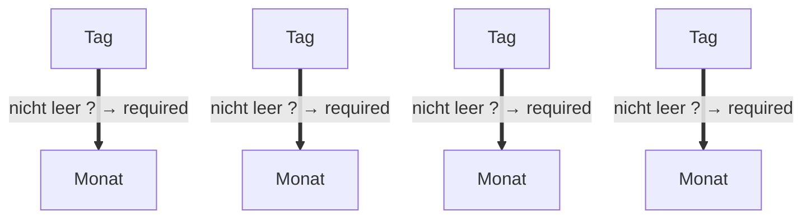

# Antrag Cannabis-Anbau in Anbauvereinigungen

- **FIM-ID:** `S02000000112 1.0.0` · **Reifegrad:** fachlich freigegeben (silber)
- **Rechtsgrundlagen:** § 11 (4) CanG vom 20.06.2024; § 12 (1) CanG vom 20.06.2024; § 22 (1) CanG vom 20.06.2024; § 23 (4) CanG vom 20.06.2024
- **Kompiliert:** 2026-08-13T15:37:04Z aus https://fimportal.de/api/v1/schemas/S02000000112/1.0.0/xdf
- **Umfang:** 86 Felder, 8 gesicherte Bedingungen, 0 ungeklärt

## Verbindliche Arbeitsweise

1. **`graph.json` entscheidet, nicht du.** Ob ein Feld gebraucht wird, welcher Nachweis fehlt und welche Bedingung gilt, steht dort. Leite das nie selbst ab.
2. **Übersetze nur.** Deine Aufgabe ist Alltagssprache ↔ Feldwert. Nenne auf Nachfrage die amtliche Formulierung und die Rechtsgrundlage.
3. **Frage nur, was offen ist.** Felder, deren Bedingung nach den bisherigen Antworten nicht erfüllt ist, entfallen — frage sie nicht ab.
4. **Bei ungeklärten Regeln sag das.** Der Abschnitt „Ungeklärte Regeln" enthält Bedingungen, die nicht maschinell gelesen werden konnten. Rate dort nicht, sondern verweise auf die zuständige Stelle.

## Felder

### Angaben zur Anbauvereinigung (`G02000001432`)

- **Eingetragener Name** (`F60000000319`) — Pflicht
  - Rechtsgrundlage: XOEV.Kernkomponente.NameOrganisation.name vom 01.08.2017; XGewerbeanzeige.Betrieb.eingetragenerName Version 2.2; XUnternehmen.Kerndatenmodell.Eingetragener Name Version 1.1
  - Hilfe: Geben Sie den im Handelsregister, im Genossenschaftsregister, im Vereinsregister oder im Stiftungsverzeichnis eingetragenen Namen mit Rechtsform an, soweit eine Eintragung vorliegt.
- **Rechtsform Anbauvereinigung auswählen** (`F02000002236`) — Pflicht
  - Rechtsgrundlage: § 11 (4) CanG
- **Mitglieder Anzahl schätzen** (`F02000002207`) — Pflicht
  - Rechtsgrundlage: § 11 (4) CanG
- **Telefonnummer** (`F60000000240`) — Pflicht
  - Rechtsgrundlage: ITU E.123
  - Hilfe: Geben Sie bei Telefonnummern innerhalb Deutschlands zuerst die Ortsvorwahl bzw. Mobilnetzvorwahl in Klammern, gefolgt von der Rufnummer an, Beispiel (0211) 12345678.
Geben Sie bei Telefonnummern außerhalb Deutschlands zuerst den Internationalen Ländercode mit vorgestelltem Plus, gefolgt von der Ortsvorwahl bzw. Mobilnetzvorwahl ohne der führenden Null, gefolgt von der Rufnummer an, Beispiel +49 211 123456789.
- **E-Mail-Adresse** (`F60000000242`) — Pflicht
  - Rechtsgrundlage: RFC 5322; RFC 5321
  - Hilfe: Geben Sie eine E-Mail-Adresse an, z.B. Max.Mustermann@email.de
- **Angabe des Registergerichts** (`F60000000380`) — Pflicht
  - Rechtsgrundlage: urn:xoev-de:xunternehmen:kerndatenobjekt:eintragung 1.1
- **Nummer des Registereintrages** (`F60000000328`) — Pflicht
  - Rechtsgrundlage: Anlage 1-3 GewAnzV vom 03.07.2019; XGewerbeanzeige.Betrieb.EintragungOrt Version 2.2; angelehnt an XGewerbeanzeige.Betrieb.eintragungNr und XGewerbeanzeige.Betrieb.eintragungNrSonstige Version 2.2

### Angaben zur Anbauvereinigung › Straßenanschrift (`G60000000086`)

- **Straße** (`F60000000243`) — Pflicht
  - Rechtsgrundlage: XInneres.Meldeanschrift.strasse Version 8
  - Hilfe: Geben Sie an, wie die Straße heißt, ohne Abkürzungen zu verwenden, Beispiel Bischöflich-Geistlicher-Rat-Josef-Zinnbauer-Straße
- **Hausnummer** (`F60000000244`) — optional
  - Rechtsgrundlage: XInneres.Meldeanschrift.hausnummer Version 8
  - Hilfe: Geben Sie die Ziffern und ggf. Buchstaben der Hausnummer der Anschrift an, Beispiel 124a.
- **Postleitzahl** (`F60000000246`) — Pflicht
  - Rechtsgrundlage: XInneres.Meldeanschrift.postleitzahl Version 8
  - Hilfe: Geben Sie die Postleitzahl des Ortes an, Beispiel 10115.
- **Ort** (`F60000000247`) — Pflicht
  - Rechtsgrundlage: § 5 (2) Nr. 9 PAuswG vom 21.6.2019; Anhang 3 Abschnitt 1 (Wohnort) PAuswV vom 28.9.2017; Tabelle 11 BSI TR-03123, Version 1.5.1; Xinneres.Meldeanschrift.Wohnort Version 8; XOEV.Kernkomponente.Anschrift.ort vom 31.01.2020
  - Hilfe: Geben Sie an, wie der Ort heißt. Benennen Sie dafür den Namen der Ortschaft, Gemeinde oder Stadt; nicht jedoch den Namen des Ortsteils, Beispiel Berlin.
- **Adresszusatz** (`F60000000248`) — optional
  - Rechtsgrundlage: XInneres.Meldeanschrift.zusatzangaben Version 8
  - Hilfe: Geben Sie Zusatzangaben zur Anschrift an. Beispiele: Hinterhaus, Gartenhaus.

### Angaben zu beteiligten Personen ergänzen › Vorstandsmitglieder ergänzen (`G02000001437`)

- **Vornamen** (`F60000000228`) — Pflicht
  - Rechtsgrundlage: § 5 (2) Nr. 2 PAuswG vom 21.6.2019; Anhang 3 PAuswV vom 28.9.2017; Tabelle 9 BSI TR-03123 Version 1.5.1; XOEV.Kernkomponente.NameNatuerlichePerson.vorname vom 31.08.2020
  - Hilfe: Geben Sie die Vornamen so an, wie sie auf den offiziellen Ausweisen angegeben sind, zum Beispiel im Personalausweis.
- **Familienname** (`F60000000227`) — Pflicht
  - Rechtsgrundlage: § 5 (2) Nr. 1 PAuswG vom 21.6.2019; Anhang 3 PAuswV vom 28.9.2017; Tabelle 9 BSI TR-03123 Version 1.5.1; XOEV.Kernkomponente.NameNatuerlichePerson.familienname vom 31.01.2020
  - Hilfe: Geben Sie den Nachnamen, Familiennamen bzw. Zunamen an.
- **E-Mail-Adresse** (`F60000000242`) — Pflicht
  - Rechtsgrundlage: RFC 5322; RFC 5321
  - Hilfe: Geben Sie eine E-Mail-Adresse an, z.B. Max.Mustermann@email.de
- **Telefonnummer** (`F60000000240`) — Pflicht
  - Rechtsgrundlage: ITU E.123
  - Hilfe: Geben Sie bei Telefonnummern innerhalb Deutschlands zuerst die Ortsvorwahl bzw. Mobilnetzvorwahl in Klammern, gefolgt von der Rufnummer an, Beispiel (0211) 12345678.
Geben Sie bei Telefonnummern außerhalb Deutschlands zuerst den Internationalen Ländercode mit vorgestelltem Plus, gefolgt von der Ortsvorwahl bzw. Mobilnetzvorwahl ohne der führenden Null, gefolgt von der Rufnummer an, Beispiel +49 211 123456789.
- **Fügen Sie ein Führungszeugnis hinzu.** (`F02000002246`) — Pflicht
  - Rechtsgrundlage: § 11 (4) CanG _(geerbt)_
- **Fügen Sie eine Gewerbezentralregisterauskunft hinzu.** (`F02000002247`) — Pflicht
  - Rechtsgrundlage: § 11 (4) CanG _(geerbt)_

### Angaben zu beteiligten Personen ergänzen › Vorstandsmitglieder ergänzen › Geburtsdatum (`G60000000083`)

- **Tag** (`F60000000231`) — optional
  - Rechtsgrundlage: § 5 (2) PAuswG vom 21.6.2019; Anhang 3 Abschnitt 1 PAuswV vom 28.9.2017; Tabelle 9 BSI TR-03123 Version 1.5.1 _(geerbt)_
- **Monat** (`F60000000232`) — optional, conditional
  - Rechtsgrundlage: § 5 (2) PAuswG vom 21.6.2019; Anhang 3 Abschnitt 1 PAuswV vom 28.9.2017; Tabelle 9 BSI TR-03123 Version 1.5.1 _(geerbt)_
- **Jahr** (`F60000000233`) — Pflicht
  - Rechtsgrundlage: § 5 (2) PAuswG vom 21.6.2019; Anhang 3 Abschnitt 1 PAuswV vom 28.9.2017; Tabelle 9 BSI TR-03123 Version 1.5.1 _(geerbt)_

### Angaben zu beteiligten Personen ergänzen › Vorstandsmitglieder ergänzen › Straßenanschrift (`G60000000086`)

- **Straße** (`F60000000243`) — Pflicht
  - Rechtsgrundlage: XInneres.Meldeanschrift.strasse Version 8
  - Hilfe: Geben Sie an, wie die Straße heißt, ohne Abkürzungen zu verwenden, Beispiel Bischöflich-Geistlicher-Rat-Josef-Zinnbauer-Straße
- **Hausnummer** (`F60000000244`) — optional
  - Rechtsgrundlage: XInneres.Meldeanschrift.hausnummer Version 8
  - Hilfe: Geben Sie die Ziffern und ggf. Buchstaben der Hausnummer der Anschrift an, Beispiel 124a.
- **Postleitzahl** (`F60000000246`) — Pflicht
  - Rechtsgrundlage: XInneres.Meldeanschrift.postleitzahl Version 8
  - Hilfe: Geben Sie die Postleitzahl des Ortes an, Beispiel 10115.
- **Ort** (`F60000000247`) — Pflicht
  - Rechtsgrundlage: § 5 (2) Nr. 9 PAuswG vom 21.6.2019; Anhang 3 Abschnitt 1 (Wohnort) PAuswV vom 28.9.2017; Tabelle 11 BSI TR-03123, Version 1.5.1; Xinneres.Meldeanschrift.Wohnort Version 8; XOEV.Kernkomponente.Anschrift.ort vom 31.01.2020
  - Hilfe: Geben Sie an, wie der Ort heißt. Benennen Sie dafür den Namen der Ortschaft, Gemeinde oder Stadt; nicht jedoch den Namen des Ortsteils, Beispiel Berlin.
- **Adresszusatz** (`F60000000248`) — optional
  - Rechtsgrundlage: XInneres.Meldeanschrift.zusatzangaben Version 8
  - Hilfe: Geben Sie Zusatzangaben zur Anschrift an. Beispiele: Hinterhaus, Gartenhaus.

### Angaben zu beteiligten Personen ergänzen › Vertretungsberechtigte Personen ergänzen (`G02000001435`)

- **Vornamen** (`F60000000228`) — Pflicht
  - Rechtsgrundlage: § 5 (2) Nr. 2 PAuswG vom 21.6.2019; Anhang 3 PAuswV vom 28.9.2017; Tabelle 9 BSI TR-03123 Version 1.5.1; XOEV.Kernkomponente.NameNatuerlichePerson.vorname vom 31.08.2020
  - Hilfe: Geben Sie die Vornamen so an, wie sie auf den offiziellen Ausweisen angegeben sind, zum Beispiel im Personalausweis.
- **Familienname** (`F60000000227`) — Pflicht
  - Rechtsgrundlage: § 5 (2) Nr. 1 PAuswG vom 21.6.2019; Anhang 3 PAuswV vom 28.9.2017; Tabelle 9 BSI TR-03123 Version 1.5.1; XOEV.Kernkomponente.NameNatuerlichePerson.familienname vom 31.01.2020
  - Hilfe: Geben Sie den Nachnamen, Familiennamen bzw. Zunamen an.
- **E-Mail-Adresse** (`F60000000242`) — Pflicht
  - Rechtsgrundlage: RFC 5322; RFC 5321
  - Hilfe: Geben Sie eine E-Mail-Adresse an, z.B. Max.Mustermann@email.de
- **Telefonnummer** (`F60000000240`) — Pflicht
  - Rechtsgrundlage: ITU E.123
  - Hilfe: Geben Sie bei Telefonnummern innerhalb Deutschlands zuerst die Ortsvorwahl bzw. Mobilnetzvorwahl in Klammern, gefolgt von der Rufnummer an, Beispiel (0211) 12345678.
Geben Sie bei Telefonnummern außerhalb Deutschlands zuerst den Internationalen Ländercode mit vorgestelltem Plus, gefolgt von der Ortsvorwahl bzw. Mobilnetzvorwahl ohne der führenden Null, gefolgt von der Rufnummer an, Beispiel +49 211 123456789.
- **Fügen Sie ein Führungszeugnis hinzu.** (`F02000002246`) — Pflicht
  - Rechtsgrundlage: § 11 (4) CanG _(geerbt)_
- **Fügen Sie eine Gewerbezentralregisterauskunft hinzu.** (`F02000002247`) — Pflicht
  - Rechtsgrundlage: § 11 (4) CanG _(geerbt)_

### Angaben zu beteiligten Personen ergänzen › Vertretungsberechtigte Personen ergänzen › Geburtsdatum (`G60000000083`)

- **Tag** (`F60000000231`) — optional
  - Rechtsgrundlage: § 5 (2) PAuswG vom 21.6.2019; Anhang 3 Abschnitt 1 PAuswV vom 28.9.2017; Tabelle 9 BSI TR-03123 Version 1.5.1 _(geerbt)_
- **Monat** (`F60000000232`) — optional, conditional
  - Rechtsgrundlage: § 5 (2) PAuswG vom 21.6.2019; Anhang 3 Abschnitt 1 PAuswV vom 28.9.2017; Tabelle 9 BSI TR-03123 Version 1.5.1 _(geerbt)_
- **Jahr** (`F60000000233`) — Pflicht
  - Rechtsgrundlage: § 5 (2) PAuswG vom 21.6.2019; Anhang 3 Abschnitt 1 PAuswV vom 28.9.2017; Tabelle 9 BSI TR-03123 Version 1.5.1 _(geerbt)_

### Angaben zu beteiligten Personen ergänzen › Vertretungsberechtigte Personen ergänzen › Straßenanschrift (`G60000000086`)

- **Straße** (`F60000000243`) — Pflicht
  - Rechtsgrundlage: XInneres.Meldeanschrift.strasse Version 8
  - Hilfe: Geben Sie an, wie die Straße heißt, ohne Abkürzungen zu verwenden, Beispiel Bischöflich-Geistlicher-Rat-Josef-Zinnbauer-Straße
- **Hausnummer** (`F60000000244`) — optional
  - Rechtsgrundlage: XInneres.Meldeanschrift.hausnummer Version 8
  - Hilfe: Geben Sie die Ziffern und ggf. Buchstaben der Hausnummer der Anschrift an, Beispiel 124a.
- **Postleitzahl** (`F60000000246`) — Pflicht
  - Rechtsgrundlage: XInneres.Meldeanschrift.postleitzahl Version 8
  - Hilfe: Geben Sie die Postleitzahl des Ortes an, Beispiel 10115.
- **Ort** (`F60000000247`) — Pflicht
  - Rechtsgrundlage: § 5 (2) Nr. 9 PAuswG vom 21.6.2019; Anhang 3 Abschnitt 1 (Wohnort) PAuswV vom 28.9.2017; Tabelle 11 BSI TR-03123, Version 1.5.1; Xinneres.Meldeanschrift.Wohnort Version 8; XOEV.Kernkomponente.Anschrift.ort vom 31.01.2020
  - Hilfe: Geben Sie an, wie der Ort heißt. Benennen Sie dafür den Namen der Ortschaft, Gemeinde oder Stadt; nicht jedoch den Namen des Ortsteils, Beispiel Berlin.
- **Adresszusatz** (`F60000000248`) — optional
  - Rechtsgrundlage: XInneres.Meldeanschrift.zusatzangaben Version 8
  - Hilfe: Geben Sie Zusatzangaben zur Anschrift an. Beispiele: Hinterhaus, Gartenhaus.

### Angaben zu beteiligten Personen ergänzen › Entgeltlich beschäftigte Personen ergänzen (`G02000001436`)

- **Vornamen** (`F60000000228`) — Pflicht
  - Rechtsgrundlage: § 5 (2) Nr. 2 PAuswG vom 21.6.2019; Anhang 3 PAuswV vom 28.9.2017; Tabelle 9 BSI TR-03123 Version 1.5.1; XOEV.Kernkomponente.NameNatuerlichePerson.vorname vom 31.08.2020
  - Hilfe: Geben Sie die Vornamen so an, wie sie auf den offiziellen Ausweisen angegeben sind, zum Beispiel im Personalausweis.
- **Familienname** (`F60000000227`) — Pflicht
  - Rechtsgrundlage: § 5 (2) Nr. 1 PAuswG vom 21.6.2019; Anhang 3 PAuswV vom 28.9.2017; Tabelle 9 BSI TR-03123 Version 1.5.1; XOEV.Kernkomponente.NameNatuerlichePerson.familienname vom 31.01.2020
  - Hilfe: Geben Sie den Nachnamen, Familiennamen bzw. Zunamen an.
- **E-Mail-Adresse** (`F60000000242`) — Pflicht
  - Rechtsgrundlage: RFC 5322; RFC 5321
  - Hilfe: Geben Sie eine E-Mail-Adresse an, z.B. Max.Mustermann@email.de
- **Telefonnummer** (`F60000000240`) — Pflicht
  - Rechtsgrundlage: ITU E.123
  - Hilfe: Geben Sie bei Telefonnummern innerhalb Deutschlands zuerst die Ortsvorwahl bzw. Mobilnetzvorwahl in Klammern, gefolgt von der Rufnummer an, Beispiel (0211) 12345678.
Geben Sie bei Telefonnummern außerhalb Deutschlands zuerst den Internationalen Ländercode mit vorgestelltem Plus, gefolgt von der Ortsvorwahl bzw. Mobilnetzvorwahl ohne der führenden Null, gefolgt von der Rufnummer an, Beispiel +49 211 123456789.

### Angaben zu beteiligten Personen ergänzen › Entgeltlich beschäftigte Personen ergänzen › Geburtsdatum (`G60000000083`)

- **Tag** (`F60000000231`) — optional
  - Rechtsgrundlage: § 5 (2) PAuswG vom 21.6.2019; Anhang 3 Abschnitt 1 PAuswV vom 28.9.2017; Tabelle 9 BSI TR-03123 Version 1.5.1 _(geerbt)_
- **Monat** (`F60000000232`) — optional, conditional
  - Rechtsgrundlage: § 5 (2) PAuswG vom 21.6.2019; Anhang 3 Abschnitt 1 PAuswV vom 28.9.2017; Tabelle 9 BSI TR-03123 Version 1.5.1 _(geerbt)_
- **Jahr** (`F60000000233`) — Pflicht
  - Rechtsgrundlage: § 5 (2) PAuswG vom 21.6.2019; Anhang 3 Abschnitt 1 PAuswV vom 28.9.2017; Tabelle 9 BSI TR-03123 Version 1.5.1 _(geerbt)_

### Angaben zu beteiligten Personen ergänzen › Entgeltlich beschäftigte Personen ergänzen › Straßenanschrift (`G60000000086`)

- **Straße** (`F60000000243`) — Pflicht
  - Rechtsgrundlage: XInneres.Meldeanschrift.strasse Version 8
  - Hilfe: Geben Sie an, wie die Straße heißt, ohne Abkürzungen zu verwenden, Beispiel Bischöflich-Geistlicher-Rat-Josef-Zinnbauer-Straße
- **Hausnummer** (`F60000000244`) — optional
  - Rechtsgrundlage: XInneres.Meldeanschrift.hausnummer Version 8
  - Hilfe: Geben Sie die Ziffern und ggf. Buchstaben der Hausnummer der Anschrift an, Beispiel 124a.
- **Postleitzahl** (`F60000000246`) — Pflicht
  - Rechtsgrundlage: XInneres.Meldeanschrift.postleitzahl Version 8
  - Hilfe: Geben Sie die Postleitzahl des Ortes an, Beispiel 10115.
- **Ort** (`F60000000247`) — Pflicht
  - Rechtsgrundlage: § 5 (2) Nr. 9 PAuswG vom 21.6.2019; Anhang 3 Abschnitt 1 (Wohnort) PAuswV vom 28.9.2017; Tabelle 11 BSI TR-03123, Version 1.5.1; Xinneres.Meldeanschrift.Wohnort Version 8; XOEV.Kernkomponente.Anschrift.ort vom 31.01.2020
  - Hilfe: Geben Sie an, wie der Ort heißt. Benennen Sie dafür den Namen der Ortschaft, Gemeinde oder Stadt; nicht jedoch den Namen des Ortsteils, Beispiel Berlin.
- **Adresszusatz** (`F60000000248`) — optional
  - Rechtsgrundlage: XInneres.Meldeanschrift.zusatzangaben Version 8
  - Hilfe: Geben Sie Zusatzangaben zur Anschrift an. Beispiele: Hinterhaus, Gartenhaus.

### Angaben zum Gebäude ergänzen (`G02000001438`)

- **Bezeichnung des Gebäudes und des Gebäudeteils ergänzen** (`F02000002211`) — Pflicht
  - Rechtsgrundlage: § 11 (4) CanG
- **Im Eingangsbereich einer Bildungseinrichtung für Kinder?** (`F02000002238`) — Pflicht
  - Rechtsgrundlage: § 12 (1) CanG
  - Hilfe: Ich bestätige, dass das befriedete Besitztum entsprechend § 12 Abs. 1 Nr. 6 KCanG nicht in einem Bereich von 200 Metern um den Eingangsbereich von Schulen, Kinder- und Jugendeinrichtungen oder Kinderspielplätzen liegt.

### Angaben zum Gebäude ergänzen › Straßenanschrift (`G60000000086`)

- **Straße** (`F60000000243`) — Pflicht
  - Rechtsgrundlage: XInneres.Meldeanschrift.strasse Version 8
  - Hilfe: Geben Sie an, wie die Straße heißt, ohne Abkürzungen zu verwenden, Beispiel Bischöflich-Geistlicher-Rat-Josef-Zinnbauer-Straße
- **Hausnummer** (`F60000000244`) — optional
  - Rechtsgrundlage: XInneres.Meldeanschrift.hausnummer Version 8
  - Hilfe: Geben Sie die Ziffern und ggf. Buchstaben der Hausnummer der Anschrift an, Beispiel 124a.
- **Postleitzahl** (`F60000000246`) — Pflicht
  - Rechtsgrundlage: XInneres.Meldeanschrift.postleitzahl Version 8
  - Hilfe: Geben Sie die Postleitzahl des Ortes an, Beispiel 10115.
- **Ort** (`F60000000247`) — Pflicht
  - Rechtsgrundlage: § 5 (2) Nr. 9 PAuswG vom 21.6.2019; Anhang 3 Abschnitt 1 (Wohnort) PAuswV vom 28.9.2017; Tabelle 11 BSI TR-03123, Version 1.5.1; Xinneres.Meldeanschrift.Wohnort Version 8; XOEV.Kernkomponente.Anschrift.ort vom 31.01.2020
  - Hilfe: Geben Sie an, wie der Ort heißt. Benennen Sie dafür den Namen der Ortschaft, Gemeinde oder Stadt; nicht jedoch den Namen des Ortsteils, Beispiel Berlin.
- **Adresszusatz** (`F60000000248`) — optional
  - Rechtsgrundlage: XInneres.Meldeanschrift.zusatzangaben Version 8
  - Hilfe: Geben Sie Zusatzangaben zur Anschrift an. Beispiele: Hinterhaus, Gartenhaus.

### Angaben zum Gebäude ergänzen › Grundstücksdaten des Ortes der Einleitung (`G02000001426`)

- **Gemarkung** (`F02000000011`) — Pflicht
  - Rechtsgrundlage: urn:xoev-de:bmk:standard:xbau_2.1:geokodierung:gemarkung
- **Flurstück** (`F02000000013`) — Pflicht
  - Rechtsgrundlage: urn:xoev-de:bmk:standard:xbau_2.1:geokodierung:flurstueck

### Anbauflächen und Gewächshäuser ergänzen (`G02000001439`)

- **Bezeichnung Anbaufläche/Gewächshaus ergänzen.** (`F02000002239`) — Pflicht
  - Rechtsgrundlage: § 11 (4) CanG
  - Hilfe: Ergänzen Sie eine Bezeichnung für die Anbaufläche/das Gewächshaus - z.B. Gewächshaus a
- **Fläche (in Quadratmetern)** (`F60000000333`) — Pflicht
  - Rechtsgrundlage: § 11 (4) CanG _(geerbt)_
- **Im Eingangsbereich einer Bildungseinrichtung für Kinder?** (`F02000002238`) — Pflicht
  - Rechtsgrundlage: § 12 (1) CanG
  - Hilfe: Ich bestätige, dass das befriedete Besitztum entsprechend § 12 Abs. 1 Nr. 6 KCanG nicht in einem Bereich von 200 Metern um den Eingangsbereich von Schulen, Kinder- und Jugendeinrichtungen oder Kinderspielplätzen liegt.

### Anbauflächen und Gewächshäuser ergänzen › Straßenanschrift (`G60000000086`)

- **Straße** (`F60000000243`) — Pflicht
  - Rechtsgrundlage: XInneres.Meldeanschrift.strasse Version 8
  - Hilfe: Geben Sie an, wie die Straße heißt, ohne Abkürzungen zu verwenden, Beispiel Bischöflich-Geistlicher-Rat-Josef-Zinnbauer-Straße
- **Hausnummer** (`F60000000244`) — optional
  - Rechtsgrundlage: XInneres.Meldeanschrift.hausnummer Version 8
  - Hilfe: Geben Sie die Ziffern und ggf. Buchstaben der Hausnummer der Anschrift an, Beispiel 124a.
- **Postleitzahl** (`F60000000246`) — Pflicht
  - Rechtsgrundlage: XInneres.Meldeanschrift.postleitzahl Version 8
  - Hilfe: Geben Sie die Postleitzahl des Ortes an, Beispiel 10115.
- **Ort** (`F60000000247`) — Pflicht
  - Rechtsgrundlage: § 5 (2) Nr. 9 PAuswG vom 21.6.2019; Anhang 3 Abschnitt 1 (Wohnort) PAuswV vom 28.9.2017; Tabelle 11 BSI TR-03123, Version 1.5.1; Xinneres.Meldeanschrift.Wohnort Version 8; XOEV.Kernkomponente.Anschrift.ort vom 31.01.2020
  - Hilfe: Geben Sie an, wie der Ort heißt. Benennen Sie dafür den Namen der Ortschaft, Gemeinde oder Stadt; nicht jedoch den Namen des Ortsteils, Beispiel Berlin.
- **Adresszusatz** (`F60000000248`) — optional
  - Rechtsgrundlage: XInneres.Meldeanschrift.zusatzangaben Version 8
  - Hilfe: Geben Sie Zusatzangaben zur Anschrift an. Beispiele: Hinterhaus, Gartenhaus.

### Voraussichtliche Abgabemenge ergänzen (`G02000001393`)

- **Voraussichtliche Menge in g an Marihuana die angebaut und weitergegeben wird** (`F02000002212`) — Pflicht
  - Rechtsgrundlage: § 11 (4) CanG
- **Voraussichtliche Menge in g an Haschisch die angebaut und weitergegeben wird** (`F02000002213`) — Pflicht
  - Rechtsgrundlage: § 11 (4) CanG

### Ohne Gruppe

- **Fügen Sie einen Nachweis über Sicherungs- und Schutzmaßnahmen hinzu.** (`F02000002248`) — Pflicht
  - Rechtsgrundlage: § 11 (4) CanG; § 22 (1) CanG
  - Hilfe: Beachten Sie dazu: https://www.gesetze-im-internet.de/kcang/__22.html

### Angaben zur Suchtprävention ergänzen (`G02000001440`)

- **Vornamen** (`F60000000228`) — Pflicht
  - Rechtsgrundlage: § 5 (2) Nr. 2 PAuswG vom 21.6.2019; Anhang 3 PAuswV vom 28.9.2017; Tabelle 9 BSI TR-03123 Version 1.5.1; XOEV.Kernkomponente.NameNatuerlichePerson.vorname vom 31.08.2020
  - Hilfe: Geben Sie die Vornamen so an, wie sie auf den offiziellen Ausweisen angegeben sind, zum Beispiel im Personalausweis.
- **Familienname** (`F60000000227`) — Pflicht
  - Rechtsgrundlage: § 5 (2) Nr. 1 PAuswG vom 21.6.2019; Anhang 3 PAuswV vom 28.9.2017; Tabelle 9 BSI TR-03123 Version 1.5.1; XOEV.Kernkomponente.NameNatuerlichePerson.familienname vom 31.01.2020
  - Hilfe: Geben Sie den Nachnamen, Familiennamen bzw. Zunamen an.
- **E-Mail-Adresse** (`F60000000242`) — Pflicht
  - Rechtsgrundlage: RFC 5322; RFC 5321
  - Hilfe: Geben Sie eine E-Mail-Adresse an, z.B. Max.Mustermann@email.de
- **Telefonnummer** (`F60000000240`) — Pflicht
  - Rechtsgrundlage: ITU E.123
  - Hilfe: Geben Sie bei Telefonnummern innerhalb Deutschlands zuerst die Ortsvorwahl bzw. Mobilnetzvorwahl in Klammern, gefolgt von der Rufnummer an, Beispiel (0211) 12345678.
Geben Sie bei Telefonnummern außerhalb Deutschlands zuerst den Internationalen Ländercode mit vorgestelltem Plus, gefolgt von der Ortsvorwahl bzw. Mobilnetzvorwahl ohne der führenden Null, gefolgt von der Rufnummer an, Beispiel +49 211 123456789.
- **Fügen Sie einen Nachweis über Beratungs- und Präventionskenntnisse hinzu.** (`F02000002249`) — Pflicht
  - Rechtsgrundlage: § 11 (4) CanG; § 23 (4) CanG
- **Fügen Sie einen Nachweis über ein Gesundheits- und Jugendschutzkonzept hinzu.** (`F02000002250`) — Pflicht
  - Rechtsgrundlage: § 11 (4) CanG; § 23 (4) CanG

### Angaben zur Suchtprävention ergänzen › Geburtsdatum (`G60000000083`)

- **Tag** (`F60000000231`) — optional
  - Rechtsgrundlage: § 5 (2) PAuswG vom 21.6.2019; Anhang 3 Abschnitt 1 PAuswV vom 28.9.2017; Tabelle 9 BSI TR-03123 Version 1.5.1 _(geerbt)_
- **Monat** (`F60000000232`) — optional, conditional
  - Rechtsgrundlage: § 5 (2) PAuswG vom 21.6.2019; Anhang 3 Abschnitt 1 PAuswV vom 28.9.2017; Tabelle 9 BSI TR-03123 Version 1.5.1 _(geerbt)_
- **Jahr** (`F60000000233`) — Pflicht
  - Rechtsgrundlage: § 5 (2) PAuswG vom 21.6.2019; Anhang 3 Abschnitt 1 PAuswV vom 28.9.2017; Tabelle 9 BSI TR-03123 Version 1.5.1 _(geerbt)_

### Angaben zur Suchtprävention ergänzen › Straßenanschrift (`G60000000086`)

- **Straße** (`F60000000243`) — Pflicht
  - Rechtsgrundlage: XInneres.Meldeanschrift.strasse Version 8
  - Hilfe: Geben Sie an, wie die Straße heißt, ohne Abkürzungen zu verwenden, Beispiel Bischöflich-Geistlicher-Rat-Josef-Zinnbauer-Straße
- **Hausnummer** (`F60000000244`) — optional
  - Rechtsgrundlage: XInneres.Meldeanschrift.hausnummer Version 8
  - Hilfe: Geben Sie die Ziffern und ggf. Buchstaben der Hausnummer der Anschrift an, Beispiel 124a.
- **Postleitzahl** (`F60000000246`) — Pflicht
  - Rechtsgrundlage: XInneres.Meldeanschrift.postleitzahl Version 8
  - Hilfe: Geben Sie die Postleitzahl des Ortes an, Beispiel 10115.
- **Ort** (`F60000000247`) — Pflicht
  - Rechtsgrundlage: § 5 (2) Nr. 9 PAuswG vom 21.6.2019; Anhang 3 Abschnitt 1 (Wohnort) PAuswV vom 28.9.2017; Tabelle 11 BSI TR-03123, Version 1.5.1; Xinneres.Meldeanschrift.Wohnort Version 8; XOEV.Kernkomponente.Anschrift.ort vom 31.01.2020
  - Hilfe: Geben Sie an, wie der Ort heißt. Benennen Sie dafür den Namen der Ortschaft, Gemeinde oder Stadt; nicht jedoch den Namen des Ortsteils, Beispiel Berlin.
- **Adresszusatz** (`F60000000248`) — optional
  - Rechtsgrundlage: XInneres.Meldeanschrift.zusatzangaben Version 8
  - Hilfe: Geben Sie Zusatzangaben zur Anschrift an. Beispiele: Hinterhaus, Gartenhaus.

## Bedingungen

| Bedingung | Feld | Folge | Rechtsgrundlage | Regel |
|---|---|---|---|---|
| wenn „Tag" nicht leer ist | „Monat" | muss ausgefüllt werden | — | `G60000000083` |
| wenn „Tag" nicht leer ist | „Monat" | muss ausgefüllt werden | — | `G60000000083` |
| wenn „Tag" nicht leer ist | „Monat" | muss ausgefüllt werden | — | `G60000000083` |
| wenn „Tag" nicht leer ist | „Monat" | muss ausgefüllt werden | — | `G60000000083` |

## Abhängigkeitsgraph

