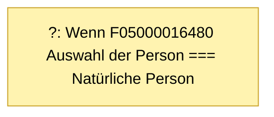

# Jährlichen Prüfbericht oder Negativerklärung als Finanzanlagenvermittler oder Honorar-Finanzanlagenberater einreichen

- **FIM-ID:** `S05000001195 2.3.0` · **Reifegrad:** fachlich freigegeben (silber)
- **Rechtsgrundlagen:** § 34 f Gewerbeordnung (GewO) https://www.gesetze-im-internet.de/gewo/__34f.html bzw. § 34 h Gewerbeordnung (GewO) https://www.gesetze-im-internet.de/gewo/__34h.html; § 24 Finanzanlagenvermittlungsverordnung (FinVermV) https://www.gesetze-im-internet.de/finvermv/__24.html
- **Kompiliert:** 2026-08-13T15:37:45Z aus https://fimportal.de/api/v1/schemas/S05000001195/2.3.0/xdf
- **Umfang:** 48 Felder, 0 gesicherte Bedingungen, 1 ungeklärt

## Verbindliche Arbeitsweise

1. **`graph.json` entscheidet, nicht du.** Ob ein Feld gebraucht wird, welcher Nachweis fehlt und welche Bedingung gilt, steht dort. Leite das nie selbst ab.
2. **Übersetze nur.** Deine Aufgabe ist Alltagssprache ↔ Feldwert. Nenne auf Nachfrage die amtliche Formulierung und die Rechtsgrundlage.
3. **Frage nur, was offen ist.** Felder, deren Bedingung nach den bisherigen Antworten nicht erfüllt ist, entfallen — frage sie nicht ab.
4. **Bei ungeklärten Regeln sag das.** Der Abschnitt „Ungeklärte Regeln" enthält Bedingungen, die nicht maschinell gelesen werden konnten. Rate dort nicht, sondern verweise auf die zuständige Stelle.

## Felder

### Ohne Gruppe

- **Möchten Sie den Antrag als natürliche oder als juristische Person stellen?** (`F05000016480`) — Pflicht
  - Rechtsgrundlage: XUnternehmen Rechtsformen

### Erlaubnisinhaber/in (`G05000010678`)

- **Registrierungsnummer Vermittlerregister** (`F05000016336`) — optional
  - Rechtsgrundlage: § 34 Gewerbeordnung
  - Hilfe: Geben Sie hier die Registrierungsnummer ein, die Sie von der zuständigen Industrie- und Handelskammer (IHK) erhalten haben (zu finden unter www.vermittlerregister.info).

### Erlaubnisinhaber/in › Angaben zur Erlaubnis innehabenden Person (`G05000010679`)

- **IHK-Identnummer** (`F05000007410`) — optional
  - Rechtsgrundlage: § 34 Gewerbeordnung
  - Hilfe: Geben Sie hier Ihre 10-stellige IHK-Identnummer an. Diese haben Sie von der zuständigen IHK zu Beginn der Mitgliedschaft erhalten.
- **Familienname** (`F60000000227`) — Pflicht
  - Rechtsgrundlage: § 5 (2) Nr. 1 PAuswG vom 21.6.2019; Anhang 3 PAuswV vom 28.9.2017; Tabelle 9 BSI TR-03123 Version 1.5.1; XOEV.Kernkomponente.NameNatuerlichePerson.familienname vom 31.01.2020
  - Hilfe: Geben Sie den Nachnamen, Familiennamen bzw. Zunamen an.
- **Vornamen** (`F60000000228`) — Pflicht
  - Rechtsgrundlage: § 5 (2) Nr. 2 PAuswG vom 21.6.2019; Anhang 3 PAuswV vom 28.9.2017; Tabelle 9 BSI TR-03123 Version 1.5.1; XOEV.Kernkomponente.NameNatuerlichePerson.vorname vom 31.08.2020
  - Hilfe: Geben Sie die Vornamen so an, wie sie auf den offiziellen Ausweisen angegeben sind, zum Beispiel im Personalausweis.
- **Geburtsname** (`F60000000230`) — optional
  - Rechtsgrundlage: § 5 (2) Nr. 1 PAuswG vom 21.6.2019; Anhang 3 Abschnitt 1 PAuswV vom 28.9.2017; Tabelle 9 BSI TR-03123 Version 1.5.1; XOEV.Kernkomponente.NameNatuerlichePerson.geburtsname vom 31.01.2020
  - Hilfe: Geben Sie den Geburtsnamen an. Manche Menschen ändern ihren Familiennamen, wenn sie heiraten oder eine Lebenspartnerschaft eingehen. Der  Geburtsname ist der Familienname den die Person bei der Geburt hatte, bevor sie ihren Namen geändert hat.
- **Geburtsdatum** (`F05000016340`) — Pflicht
  - Rechtsgrundlage: DIN 5008
  - Hilfe: Bitte geben Sie das Geburtsdatum an (Tag, Monat und Jahr).
- **Geburtsort** (`F60000000234`) — Pflicht
  - Rechtsgrundlage: § 5 (2) Nr. 4 PAuswG vom 21.6.2019; Anhang 3 Abschnitt 1 PAuswV vom 28.9.2017; Tabelle 9 BSI TR-03123 Version 1.5.1; XOEV.Kernkomponente.Geburt.geburtsort vom 31.01.2020
  - Hilfe: Geben Sie die Bezeichnung des Ortes an, in dem die Person geboren wurde, Beispiel Düsseldorf.
- **Staatsangehörigkeit** (`F60000000236`) — Pflicht
  - Rechtsgrundlage: XOEV.Kernkomponente.NatuerlichePerson.staatsangehoerigkeit vom 31.08.2020; Codeliste laut XMeld und DSMeld: Codeliste Destatis Staatsangehörigkeit (urn:de:bund:destatis:bevoelkerungsstatistik:schluessel:staatsangehörigkeit)
  - Hilfe: Wählen Sie aus, welcher Nationalität bzw. welchen Nationalitäten die Person angehört. Es ist auch die Auswahl "ohne Angabe" möglich, falls die Person keiner Nationalität angehört.

### Erlaubnisinhaber/in › Angaben zum Unternehmen (`G05000010811`)

- **Eingetragener Name des Unternehmens:** (`F05000006115`) — optional
  - Rechtsgrundlage: XOEV.Kernkomponente.NameOrganisation.name vom 01.08.2017; XGewerbeanzeige.Betrieb.eingetragenerName Version 2.2; XUnternehmen.Kerndatenmodell.Eingetragener Name Version 1.0
  - Hilfe: Geben Sie den im Handelsregister, im Genossenschaftsregister, im Vereinsregister oder im Stiftungsverzeichnis eingetragenen Name mit Rechtsform an, soweit eine Eintragung vorliegt.
- **Registergericht** (`F60000000325`) — optional
  - Rechtsgrundlage: XUnternehmen.Eintragung.Registergericht; urn:xoev-de:xunternehmen:codeliste:registergerichte_14
  - Hilfe: Geben Sie das Registergericht an, bei dem die Organisation eingetragen ist.
- **Nummer des Registereintrages** (`F60000000328`) — optional
  - Rechtsgrundlage: Anlage 1-3 GewAnzV vom 03.07.2019; XGewerbeanzeige.Betrieb.EintragungOrt Version 2.2; angelehnt an XGewerbeanzeige.Betrieb.eintragungNr und XGewerbeanzeige.Betrieb.eintragungNrSonstige Version 2.2

### Erlaubnisinhaber/in › Aktuelle Meldeanschrift (`G05000010810`)

- **Straße** (`F60000000243`) — Pflicht
  - Rechtsgrundlage: XInneres.Meldeanschrift.strasse Version 8
  - Hilfe: Geben Sie an, wie die Straße heißt, ohne Abkürzungen zu verwenden, Beispiel Bischöflich-Geistlicher-Rat-Josef-Zinnbauer-Straße
- **Hausnummer** (`F60000000244`) — Pflicht
  - Rechtsgrundlage: XInneres.Meldeanschrift.hausnummer Version 8
  - Hilfe: Geben Sie die Ziffern und ggf. Buchstaben der Hausnummer der Anschrift an, Beispiel 124a.
- **Postleitzahl** (`F60000000246`) — Pflicht
  - Rechtsgrundlage: XInneres.Meldeanschrift.postleitzahl Version 8
  - Hilfe: Geben Sie die Postleitzahl des Ortes an, Beispiel 10115.
- **Ort** (`F60000000247`) — Pflicht
  - Rechtsgrundlage: § 5 (2) Nr. 9 PAuswG vom 21.6.2019; Anhang 3 Abschnitt 1 (Wohnort) PAuswV vom 28.9.2017; Tabelle 11 BSI TR-03123, Version 1.5.1; Xinneres.Meldeanschrift.Wohnort Version 8; XOEV.Kernkomponente.Anschrift.ort vom 31.01.2020
  - Hilfe: Geben Sie an, wie der Ort heißt. Benennen Sie dafür den Namen der Ortschaft, Gemeinde oder Stadt; nicht jedoch den Namen des Ortsteils, Beispiel Berlin.
- **E-Mail-Adresse** (`F60000000242`) — Pflicht
  - Rechtsgrundlage: RFC 5322; RFC 5321
  - Hilfe: Geben Sie eine E-Mail-Adresse an, z.B. Max.Mustermann@email.de
- **Telefonnummer** (`F60000000240`) — optional
  - Rechtsgrundlage: ITU E.123
  - Hilfe: Geben Sie bei Telefonnummern innerhalb Deutschlands zuerst die Ortsvorwahl bzw. Mobilnetzvorwahl in Klammern, gefolgt von der Rufnummer an, Beispiel (0211) 12345678.
Geben Sie bei Telefonnummern außerhalb Deutschlands zuerst den Internationalen Ländercode mit vorgestelltem Plus, gefolgt von der Ortsvorwahl bzw. Mobilnetzvorwahl ohne der führenden Null, gefolgt von der Rufnummer an, Beispiel +49 211 123456789.
- **Mobilfunknummer** (`F05000016214`) — optional
  - Rechtsgrundlage: ITU E.124
  - Hilfe: Geben Sie bitte bei Mobilfunknummern innerhalb Deutschlands zuerst die Mobilnetzvorwahl in Klammern, gefolgt von der Rufnummer an, z.B. (0211) 12345678. Geben Sie bitte bei Telefonnummern außerhalb von Deutschland zuerst den Internationalen Ländercode mit vorgestelltem Plus, gefolgt von der Mobilnetzvorwahl ohne der führenden Null, gefolgt von der Rufnummer an, z.B. +49 211 123456789.

### Erlaubnisinhaber/in › Art der Meldung (`G05000010451`)

- **Die Erklärung wird für folgendes Kalenderjahr abgegeben:** (`F05000016364`) — Pflicht
  - Rechtsgrundlage: § 34 f, h Gewerbeordnung
  - Hilfe: Geben Sie das Kalenderjahr im Format JJJJ an, z.B. 2020.
- **Die Erlaubnis innehabende Gesellschaft/Person möchte folgende Berichtart für das oben genannte Kalenderjahr einreichen.** (`F05000016657`) — Pflicht
  - Rechtsgrundlage: § 34 f, h Gewerbeordnung

### Erlaubnisinhaber/in › Erforderliche Unterlagen (`G05000010452`)

- **Prüfungsbericht (aktuelles Kalenderjahr)** (`F05000016366`) — optional
  - Rechtsgrundlage: § 34 f, h, Gewerbeordnung
  - Hilfe: Laden Sie hier Ihren Prüfungsbericht aus dem aktuellen Kalenderjahr hoch.
- **Systemprüfungsbericht für das genannte Kalenderjahr** (`F05000016647`) — optional
  - Rechtsgrundlage: § 34 f, h Gewerbeordnung
- **Ausschließlichkeitserklärung** (`F05000016690`) — optional
  - Rechtsgrundlage: § 24 Abs. 1 der Finanzanlagenvermittlungsverordnung
  - Hilfe: Laden Sie hier Ihre Ausschließlichkeitserklärung hoch.

### Erlaubnisinhaber/in › Angaben Erlaubnisinhaber/in (`G05000010427`)

- **Registrierungsnummer Vermittlerregister** (`F05000016336`) — optional
  - Rechtsgrundlage: § 34 Gewerbeordnung
  - Hilfe: Geben Sie hier die Registrierungsnummer ein, die Sie von der zuständigen Industrie- und Handelskammer (IHK) erhalten haben (zu finden unter www.vermittlerregister.info).

### Erlaubnisinhaber/in › Angaben Erlaubnisinhaber/in › Angaben zum Unternehmen (`G05000010429`)

- **IHK-Identnummer** (`F05000007410`) — optional
  - Rechtsgrundlage: § 34 Gewerbeordnung
  - Hilfe: Geben Sie hier Ihre 10-stellige IHK-Identnummer an. Diese haben Sie von der zuständigen IHK zu Beginn der Mitgliedschaft erhalten.
- **Eingetragener Name des Unternehmens:** (`F05000006115`) — Pflicht
  - Rechtsgrundlage: XOEV.Kernkomponente.NameOrganisation.name vom 01.08.2017; XGewerbeanzeige.Betrieb.eingetragenerName Version 2.2; XUnternehmen.Kerndatenmodell.Eingetragener Name Version 1.0
  - Hilfe: Geben Sie den im Handelsregister, im Genossenschaftsregister, im Vereinsregister oder im Stiftungsverzeichnis eingetragenen Name mit Rechtsform an, soweit eine Eintragung vorliegt.
- **Nummer des Registereintrages** (`F60000000328`) — Pflicht
  - Rechtsgrundlage: Anlage 1-3 GewAnzV vom 03.07.2019; XGewerbeanzeige.Betrieb.EintragungOrt Version 2.2; angelehnt an XGewerbeanzeige.Betrieb.eintragungNr und XGewerbeanzeige.Betrieb.eintragungNrSonstige Version 2.2
- **Registergericht** (`F60000000325`) — Pflicht
  - Rechtsgrundlage: XUnternehmen.Eintragung.Registergericht; urn:xoev-de:xunternehmen:codeliste:registergerichte_14
  - Hilfe: Geben Sie das Registergericht an, bei dem die Organisation eingetragen ist.
- **Straße** (`F60000000243`) — Pflicht
  - Rechtsgrundlage: XInneres.Meldeanschrift.strasse Version 8
  - Hilfe: Geben Sie an, wie die Straße heißt, ohne Abkürzungen zu verwenden, Beispiel Bischöflich-Geistlicher-Rat-Josef-Zinnbauer-Straße
- **Hausnummer** (`F60000000244`) — Pflicht
  - Rechtsgrundlage: XInneres.Meldeanschrift.hausnummer Version 8
  - Hilfe: Geben Sie die Ziffern und ggf. Buchstaben der Hausnummer der Anschrift an, Beispiel 124a.
- **Postleitzahl** (`F60000000246`) — Pflicht
  - Rechtsgrundlage: XInneres.Meldeanschrift.postleitzahl Version 8
  - Hilfe: Geben Sie die Postleitzahl des Ortes an, Beispiel 10115.
- **Ort** (`F60000000247`) — Pflicht
  - Rechtsgrundlage: § 5 (2) Nr. 9 PAuswG vom 21.6.2019; Anhang 3 Abschnitt 1 (Wohnort) PAuswV vom 28.9.2017; Tabelle 11 BSI TR-03123, Version 1.5.1; Xinneres.Meldeanschrift.Wohnort Version 8; XOEV.Kernkomponente.Anschrift.ort vom 31.01.2020
  - Hilfe: Geben Sie an, wie der Ort heißt. Benennen Sie dafür den Namen der Ortschaft, Gemeinde oder Stadt; nicht jedoch den Namen des Ortsteils, Beispiel Berlin.

### Erlaubnisinhaber/in › Angaben Erlaubnisinhaber/in › Kontaktperson für Rückfragen (`G05000010434`)

- **Familienname** (`F60000000227`) — Pflicht
  - Rechtsgrundlage: § 5 (2) Nr. 1 PAuswG vom 21.6.2019; Anhang 3 PAuswV vom 28.9.2017; Tabelle 9 BSI TR-03123 Version 1.5.1; XOEV.Kernkomponente.NameNatuerlichePerson.familienname vom 31.01.2020
  - Hilfe: Geben Sie den Nachnamen, Familiennamen bzw. Zunamen an.
- **Vornamen** (`F60000000228`) — Pflicht
  - Rechtsgrundlage: § 5 (2) Nr. 2 PAuswG vom 21.6.2019; Anhang 3 PAuswV vom 28.9.2017; Tabelle 9 BSI TR-03123 Version 1.5.1; XOEV.Kernkomponente.NameNatuerlichePerson.vorname vom 31.08.2020
  - Hilfe: Geben Sie die Vornamen so an, wie sie auf den offiziellen Ausweisen angegeben sind, zum Beispiel im Personalausweis.
- **E-Mail-Adresse** (`F60000000242`) — Pflicht
  - Rechtsgrundlage: RFC 5322; RFC 5321
  - Hilfe: Geben Sie eine E-Mail-Adresse an, z.B. Max.Mustermann@email.de
- **Funktion** (`F60000000322`) — optional
  - Rechtsgrundlage: § 34 Gewerbeordnung _(geerbt)_
  - Hilfe: Geben Sie die Funktion oder Rolle der Person an.
- **Telefonnummer** (`F60000000240`) — optional
  - Rechtsgrundlage: ITU E.123
  - Hilfe: Geben Sie bei Telefonnummern innerhalb Deutschlands zuerst die Ortsvorwahl bzw. Mobilnetzvorwahl in Klammern, gefolgt von der Rufnummer an, Beispiel (0211) 12345678.
Geben Sie bei Telefonnummern außerhalb Deutschlands zuerst den Internationalen Ländercode mit vorgestelltem Plus, gefolgt von der Ortsvorwahl bzw. Mobilnetzvorwahl ohne der führenden Null, gefolgt von der Rufnummer an, Beispiel +49 211 123456789.
- **Mobilfunknummer** (`F05000016214`) — optional
  - Rechtsgrundlage: ITU E.124
  - Hilfe: Geben Sie bitte bei Mobilfunknummern innerhalb Deutschlands zuerst die Mobilnetzvorwahl in Klammern, gefolgt von der Rufnummer an, z.B. (0211) 12345678. Geben Sie bitte bei Telefonnummern außerhalb von Deutschland zuerst den Internationalen Ländercode mit vorgestelltem Plus, gefolgt von der Mobilnetzvorwahl ohne der führenden Null, gefolgt von der Rufnummer an, z.B. +49 211 123456789.

### Erlaubnisinhaber/in › Angaben Erlaubnisinhaber/in › Art der Meldung (`G05000010451`)

- **Die Erklärung wird für folgendes Kalenderjahr abgegeben:** (`F05000016364`) — Pflicht
  - Rechtsgrundlage: § 34 f, h Gewerbeordnung
  - Hilfe: Geben Sie das Kalenderjahr im Format JJJJ an, z.B. 2020.
- **Die Erlaubnis innehabende Gesellschaft/Person möchte folgende Berichtart für das oben genannte Kalenderjahr einreichen.** (`F05000016657`) — Pflicht
  - Rechtsgrundlage: § 34 f, h Gewerbeordnung

### Erlaubnisinhaber/in › Angaben Erlaubnisinhaber/in › Erforderliche Unterlagen (`G05000010452`)

- **Prüfungsbericht (aktuelles Kalenderjahr)** (`F05000016366`) — optional
  - Rechtsgrundlage: § 34 f, h, Gewerbeordnung
  - Hilfe: Laden Sie hier Ihren Prüfungsbericht aus dem aktuellen Kalenderjahr hoch.
- **Systemprüfungsbericht für das genannte Kalenderjahr** (`F05000016647`) — optional
  - Rechtsgrundlage: § 34 f, h Gewerbeordnung
- **Ausschließlichkeitserklärung** (`F05000016690`) — optional
  - Rechtsgrundlage: § 24 Abs. 1 der Finanzanlagenvermittlungsverordnung
  - Hilfe: Laden Sie hier Ihre Ausschließlichkeitserklärung hoch.

### Abschluss › Datenschutzrechtliche Hinweise (`G05000010673`)

- **Datenschutzrechtlicher Hinweis** (`F05000016569`) — Pflicht
  - Rechtsgrundlage: Art. 6 Abs. 1 S. 1 lit. e DSGVO; Art. 13 DSGVO
- **Ich versichere die Richtigkeit und Aktualität aller vorstehenden Angaben sowie aller eingereichten Unterlagen und erkläre zugleich, dass ich jede Veränderung meiner Tätigkeit und meiner persönlichen Verhältnisse mit Relevanz für das Erlaubnis- bzw. Registrierungsverfahren unverzüglich mitteile.** (`F05000016570`) — Pflicht
  - Rechtsgrundlage: § 34 Gewerbeordnung

### Abschluss › Einwilligung zur digitalen Zustellung (`G05000010756`)

- **Ich willige ein, dass Ergebnisdokumente meines Antrags, beispielsweise Bescheide, rechtsverbindlich in mein digitales Postfach im ELSTER-Konto bzw. Nutzerkonto Bund zugestellt werden.** (`F05000016639`) — Pflicht
  - Rechtsgrundlage: § 34 d, f, h, i Gewerbeordnung
  - Hilfe: Mit der Einwilligung zur digitalen Zustellung erklären Sie sich gegenüber der von Ihnen ausgewählten und für Sie zuständigen Industrie- und Handelskammer einverstanden, dass diese, bis zum Eingang eines Widerrufs dieser Einwilligung, den von Ihnen begehrten elektronischen Verwaltungsakt Ihnen gegenüber dadurch bekanntgibt, dass der Verwaltungsakt von Ihnen oder Ihrem Bevollmächtigten über Ihr Postfach, das Bestandteil Ihres Nutzerkontos bei ELSTER oder Ihrem BundID-Konto ist, abgerufen wird. Der Verwaltungsakt gilt am dritten Tag nach der Bereitstellung zum Abruf als bekannt gegeben. Sie oder Ihr Bevollmächtigter, wenn Sie einen solchen benannt haben, werden spätestens am Tag der Bereitstellung zum Abruf über die zu diesem Zweck von Ihnen angegebene Adresse über die Möglichkeit des Abrufs benachrichtigt. Erfolgt der Abruf vor einer erneuten Bekanntgabe des Verwaltungsaktes, bleibt der Tag des ersten Abrufs für den Zugang maßgeblich. Diese Einwilligung können Sie jederzeit mit Wirkung für die Zukunft widerrufen. Weitere Einzelheiten entnehmen Sie bitte der Privacy Policy auf dem IHK Portal.
- **Nicht-Einwilligung der digitalen Zustellung** (`F05000016640`) — Pflicht
  - Rechtsgrundlage: § 34 d, f, h, i Gewerbeordnung

## Bedingungen

| Bedingung | Feld | Folge | Rechtsgrundlage | Regel |
|---|---|---|---|---|

## Ungeklärte Regeln

Diese Bedingungen standen im FIM-Freitext, ließen sich aber nicht eindeutig in eine Edge übersetzen. Sie sind **nicht** im Graphen wirksam und brauchen eine menschliche Entscheidung:

- <mark>Wenn F05000016480 Auswahl der Person === "Natürliche Person", dann zeige G05000010678 Person, wenn F05000016480 Auswahl der Person === "Juristische Person", dann zeige G05000010677 Person (juristische Person).</mark> — Regel `R05000011338`

## Abhängigkeitsgraph

