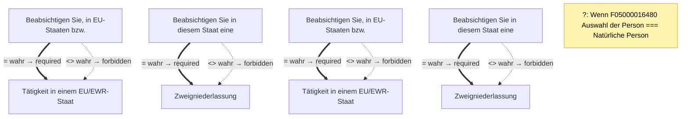

# Befreiung von der Erlaubnispflicht als Versicherungsvermittler beantragen

- **FIM-ID:** `S05000001216 3.4.0` · **Reifegrad:** fachlich freigegeben (silber)
- **Rechtsgrundlagen:** § 34d Abs. 6 Gewerbeordnung (GewO) § 34d Abs. 8 Gewerbeordnung (GewO) § 11a Gewerbeordnung (GewO) Versicherungsvermittungsverordnung (VersVermV) Gesetz über die Beaufsichtigung der Versicherungsunternehmen (VAG)
- **Kompiliert:** 2026-08-13T15:39:02Z aus https://fimportal.de/api/v1/schemas/S05000001216/3.4.0/xdf
- **Umfang:** 140 Felder, 8 gesicherte Bedingungen, 1 ungeklärt

## Verbindliche Arbeitsweise

1. **`graph.json` entscheidet, nicht du.** Ob ein Feld gebraucht wird, welcher Nachweis fehlt und welche Bedingung gilt, steht dort. Leite das nie selbst ab.
2. **Übersetze nur.** Deine Aufgabe ist Alltagssprache ↔ Feldwert. Nenne auf Nachfrage die amtliche Formulierung und die Rechtsgrundlage.
3. **Frage nur, was offen ist.** Felder, deren Bedingung nach den bisherigen Antworten nicht erfüllt ist, entfallen — frage sie nicht ab.
4. **Bei ungeklärten Regeln sag das.** Der Abschnitt „Ungeklärte Regeln" enthält Bedingungen, die nicht maschinell gelesen werden konnten. Rate dort nicht, sondern verweise auf die zuständige Stelle.

> **Hinweis:** Die zugehörige Leistung konnte nicht zweifelsfrei zugeordnet werden (Rechtsgrundlage stimmt nicht überein (D99000001421)). Zu Fristen, Kosten, Unterlagen und Zuständigkeit daher keine Auskunft geben, sondern an die zuständige Stelle verweisen.

## Felder

### Antragsart (`G05000010675`)

- **Möchten Sie den Antrag als natürliche oder als juristische Person stellen?** (`F05000016480`) — Pflicht
  - Rechtsgrundlage: XUnternehmen Rechtsformen
- **Auswahl der Antragsart** (`F05000016572`) — Pflicht
  - Rechtsgrundlage: § 34 d Absatz 6 Gewerbeordnung
  - Hilfe: Gewerbetreibende, die Versicherungen nur als Ergänzung zu einer anderweitigen Haupttätigkeit vermitteln, können sich auf Antrag von der Erlaubnispflicht befreien lassen, wenn sie ihre Tätigkeit als Versicherungsvermittler:in unmittelbar im Auftrag eines oder mehrerer Versicherungsvermittler:innen, die Inhaber einer Erlaubnis nach § 34d Absatz 1 Satz 1 GewO sind, oder eines oder mehrerer Versicherungsunternehmen ausüben. Sie können sich

    als produktakzessorische:r Versicherungsvertreter:in mit Ausnahme von der Erlaubnispflicht nach § 34d Absatz 6 der GewO oder
    als produktakzessorische:r Versicherungsmakler:in mit Ausnahme von der Erlaubnispflicht nach § 34d Absatz 6 der GewO

    in das Vermittlerregister eintragen lassen.Wenn Sie eine Tätigkeit als produktakzessorische:r Versicherungsvermittler:in nach § 34d Absatz 6 GewO aufnehmen möchten, sind Sie zum einen verpflichtet, die Erlaubnisbefreiung als Versicherungsvermittler:in einzuholen. Zum anderen sind Sie verpflichtet, sich unverzüglich nach Aufnahme Ihrer Tätigkeit in das Vermittlerregister nach §§ 34d Absatz 10, 11a Absatz 1 GewO eintragen zu lassen. Der Antrag auf Eintragung in das Vermittlerregister kann gleichzeitig mit dem Antrag auf Erlaubnisbefreiung gestellt werden. Sofern Sie nach Erlaubnisbefreiung die Tätigkeit als Versicherungsvermittler:in unverzüglich aufnehmen möchten, kreuzen Sie daher bitte beide Kästchen an. Bitte beachten Sie, dass Sie ohne erfolgte Registrierung nicht tätig werden dürfen.Durch die Eintragung im Vermittlerregister erhalten Sie eine Registrierungsnummer als produktakzessorische:r  Versicherungsvermittler:in. Diese Registrierungsnummer ist nicht mit einer eventuellen Registrierungsnummer als Finanzanlagen- oder Honorarfinanzanlagenvermittler:in oder als Immobiliardarlehensvermittler:in identisch.

### Person › Angaben zur antragstellenden Person (`G05000011197`)

- **IHK-Identnummer** (`F05000007410`) — optional
  - Rechtsgrundlage: § 34 Gewerbeordnung
  - Hilfe: Geben Sie hier Ihre 10-stellige IHK-Identnummer an. Diese haben Sie von der zuständigen IHK zu Beginn der Mitgliedschaft erhalten.
- **Familienname** (`F00000000013`) — Pflicht
  - Rechtsgrundlage: § 5 (2) Nr. 1 PAuswG vom 21.6.2019; Anhang 3 PAuswV vom 28.9.2017; Tabelle 9 BSI TR-03123 Version 1.5.1; XOEV.Kernkomponente.NameNatuerlichePerson.familienname vom 31.01.2020
  - Hilfe: Geben Sie den Nachnamen, Zunamen bzw. Familiennamen an.
- **Vornamen** (`F60000000228`) — Pflicht
  - Rechtsgrundlage: § 5 (2) Nr. 2 PAuswG vom 21.6.2019; Anhang 3 PAuswV vom 28.9.2017; Tabelle 9 BSI TR-03123 Version 1.5.1; XOEV.Kernkomponente.NameNatuerlichePerson.vorname vom 31.08.2020
  - Hilfe: Geben Sie die Vornamen so an, wie sie auf den offiziellen Ausweisen angegeben sind, zum Beispiel im Personalausweis.
- **Geburtsname** (`F60000000230`) — optional
  - Rechtsgrundlage: § 5 (2) Nr. 1 PAuswG vom 21.6.2019; Anhang 3 Abschnitt 1 PAuswV vom 28.9.2017; Tabelle 9 BSI TR-03123 Version 1.5.1; XOEV.Kernkomponente.NameNatuerlichePerson.geburtsname vom 31.01.2020
  - Hilfe: Geben Sie den Geburtsnamen an. Manche Menschen ändern ihren Familiennamen, wenn sie heiraten oder eine Lebenspartnerschaft eingehen. Der  Geburtsname ist der Familienname den die Person bei der Geburt hatte, bevor sie ihren Namen geändert hat.
- **Geburtsdatum** (`F05000016340`) — Pflicht
  - Rechtsgrundlage: DIN 5008
  - Hilfe: Bitte geben Sie das Geburtsdatum an (Tag, Monat und Jahr).
- **Geburtsort** (`F00000000067`) — Pflicht
  - Rechtsgrundlage: § 5 (2) Nr. 4 PAuswG vom 21.6.2019; Anhang 3 Abschnitt 1 PAuswV vom 28.9.2017; Tabelle 9 BSI TR-03123 Version 1.5.1; XOEV.Kernkomponente.Geburt.geburtsort vom 31.01.2020
  - Hilfe: Geben Sie die Bezeichnung des Ortes an, in dem die Person geboren wurde (z.B.: Berlin).
- **Staatsangehörigkeit** (`F60000000236`) — Pflicht
  - Rechtsgrundlage: XOEV.Kernkomponente.NatuerlichePerson.staatsangehoerigkeit vom 31.08.2020; Codeliste laut XMeld und DSMeld: Codeliste Destatis Staatsangehörigkeit (urn:de:bund:destatis:bevoelkerungsstatistik:schluessel:staatsangehörigkeit)
  - Hilfe: Wählen Sie aus, welcher Nationalität bzw. welchen Nationalitäten die Person angehört. Es ist auch die Auswahl "ohne Angabe" möglich, falls die Person keiner Nationalität angehört.

### Person › Angaben zur antragstellenden Person › Anschrift Hauptwohnsitz (`G05000011198`)

- **Straße** (`F60000000243`) — Pflicht
  - Rechtsgrundlage: XInneres.Meldeanschrift.strasse Version 8
  - Hilfe: Geben Sie an, wie die Straße heißt, ohne Abkürzungen zu verwenden, Beispiel Bischöflich-Geistlicher-Rat-Josef-Zinnbauer-Straße
- **Hausnummer** (`F60000000244`) — Pflicht
  - Rechtsgrundlage: XInneres.Meldeanschrift.hausnummer Version 8
  - Hilfe: Geben Sie die Ziffern und ggf. Buchstaben der Hausnummer der Anschrift an, Beispiel 124a.
- **Adresszusatz** (`F05000016370`) — optional
  - Rechtsgrundlage: urn:xoev-de:kosit:xoev:kernkomponente:anschrift
  - Hilfe: z.B. Hinterhaus, Gartenhaus.
- **Postleitzahl** (`F60000000246`) — Pflicht
  - Rechtsgrundlage: XInneres.Meldeanschrift.postleitzahl Version 8
  - Hilfe: Geben Sie die Postleitzahl des Ortes an, Beispiel 10115.
- **Ort** (`F60000000247`) — Pflicht
  - Rechtsgrundlage: § 5 (2) Nr. 9 PAuswG vom 21.6.2019; Anhang 3 Abschnitt 1 (Wohnort) PAuswV vom 28.9.2017; Tabelle 11 BSI TR-03123, Version 1.5.1; Xinneres.Meldeanschrift.Wohnort Version 8; XOEV.Kernkomponente.Anschrift.ort vom 31.01.2020
  - Hilfe: Geben Sie an, wie der Ort heißt. Benennen Sie dafür den Namen der Ortschaft, Gemeinde oder Stadt; nicht jedoch den Namen des Ortsteils, Beispiel Berlin.
- **E-Mail-Adresse** (`F60000000242`) — Pflicht
  - Rechtsgrundlage: RFC 5322; RFC 5321
  - Hilfe: Geben Sie eine E-Mail-Adresse an, z.B. Max.Mustermann@email.de
- **Telefonnummer** (`F60000000240`) — optional
  - Rechtsgrundlage: ITU E.123
  - Hilfe: Geben Sie bei Telefonnummern innerhalb Deutschlands zuerst die Ortsvorwahl bzw. Mobilnetzvorwahl in Klammern, gefolgt von der Rufnummer an, Beispiel (0211) 12345678.
Geben Sie bei Telefonnummern außerhalb Deutschlands zuerst den Internationalen Ländercode mit vorgestelltem Plus, gefolgt von der Ortsvorwahl bzw. Mobilnetzvorwahl ohne der führenden Null, gefolgt von der Rufnummer an, Beispiel +49 211 123456789.
- **Mobilfunknummer** (`F05000016214`) — optional
  - Rechtsgrundlage: ITU E.124
  - Hilfe: Geben Sie bitte bei Mobilfunknummern innerhalb Deutschlands zuerst die Mobilnetzvorwahl in Klammern, gefolgt von der Rufnummer an, z.B. (0211) 12345678. Geben Sie bitte bei Telefonnummern außerhalb von Deutschland zuerst den Internationalen Ländercode mit vorgestelltem Plus, gefolgt von der Mobilnetzvorwahl ohne der führenden Null, gefolgt von der Rufnummer an, z.B. +49 211 123456789.

### Person › Angaben Unternehmen › Angaben zum Unternehmen (`G05000010340`)

- **Eingetragener Name des Unternehmens:** (`F05000006115`) — optional
  - Rechtsgrundlage: XOEV.Kernkomponente.NameOrganisation.name vom 01.08.2017; XGewerbeanzeige.Betrieb.eingetragenerName Version 2.2; XUnternehmen.Kerndatenmodell.Eingetragener Name Version 1.0
  - Hilfe: Geben Sie den im Handelsregister, im Genossenschaftsregister, im Vereinsregister oder im Stiftungsverzeichnis eingetragenen Name mit Rechtsform an, soweit eine Eintragung vorliegt.
- **Registergericht** (`F60000000325`) — optional
  - Rechtsgrundlage: XUnternehmen.Eintragung.Registergericht; urn:xoev-de:xunternehmen:codeliste:registergerichte_14
  - Hilfe: Geben Sie das Registergericht an, bei dem die Organisation eingetragen ist.
- **Nummer des Registereintrages** (`F60000000328`) — optional
  - Rechtsgrundlage: Anlage 1-3 GewAnzV vom 03.07.2019; XGewerbeanzeige.Betrieb.EintragungOrt Version 2.2; angelehnt an XGewerbeanzeige.Betrieb.eintragungNr und XGewerbeanzeige.Betrieb.eintragungNrSonstige Version 2.2

### Person › Angaben Unternehmen › Adress- und Kontaktdaten des Unternehmens (`G05000011200`)

- **Straße** (`F60000000243`) — Pflicht
  - Rechtsgrundlage: XInneres.Meldeanschrift.strasse Version 8
  - Hilfe: Geben Sie an, wie die Straße heißt, ohne Abkürzungen zu verwenden, Beispiel Bischöflich-Geistlicher-Rat-Josef-Zinnbauer-Straße
- **Hausnummer** (`F60000000244`) — Pflicht
  - Rechtsgrundlage: XInneres.Meldeanschrift.hausnummer Version 8
  - Hilfe: Geben Sie die Ziffern und ggf. Buchstaben der Hausnummer der Anschrift an, Beispiel 124a.
- **Postleitzahl** (`F60000000246`) — Pflicht
  - Rechtsgrundlage: XInneres.Meldeanschrift.postleitzahl Version 8
  - Hilfe: Geben Sie die Postleitzahl des Ortes an, Beispiel 10115.
- **Ort** (`F60000000247`) — Pflicht
  - Rechtsgrundlage: § 5 (2) Nr. 9 PAuswG vom 21.6.2019; Anhang 3 Abschnitt 1 (Wohnort) PAuswV vom 28.9.2017; Tabelle 11 BSI TR-03123, Version 1.5.1; Xinneres.Meldeanschrift.Wohnort Version 8; XOEV.Kernkomponente.Anschrift.ort vom 31.01.2020
  - Hilfe: Geben Sie an, wie der Ort heißt. Benennen Sie dafür den Namen der Ortschaft, Gemeinde oder Stadt; nicht jedoch den Namen des Ortsteils, Beispiel Berlin.
- **E-Mail-Adresse** (`F60000000242`) — Pflicht
  - Rechtsgrundlage: RFC 5322; RFC 5321
  - Hilfe: Geben Sie eine E-Mail-Adresse an, z.B. Max.Mustermann@email.de
- **Telefonnummer** (`F60000000240`) — optional
  - Rechtsgrundlage: ITU E.123
  - Hilfe: Geben Sie bei Telefonnummern innerhalb Deutschlands zuerst die Ortsvorwahl bzw. Mobilnetzvorwahl in Klammern, gefolgt von der Rufnummer an, Beispiel (0211) 12345678.
Geben Sie bei Telefonnummern außerhalb Deutschlands zuerst den Internationalen Ländercode mit vorgestelltem Plus, gefolgt von der Ortsvorwahl bzw. Mobilnetzvorwahl ohne der führenden Null, gefolgt von der Rufnummer an, Beispiel +49 211 123456789.
- **Mobilfunknummer** (`F05000016214`) — optional
  - Rechtsgrundlage: ITU E.124
  - Hilfe: Geben Sie bitte bei Mobilfunknummern innerhalb Deutschlands zuerst die Mobilnetzvorwahl in Klammern, gefolgt von der Rufnummer an, z.B. (0211) 12345678. Geben Sie bitte bei Telefonnummern außerhalb von Deutschland zuerst den Internationalen Ländercode mit vorgestelltem Plus, gefolgt von der Mobilnetzvorwahl ohne der führenden Null, gefolgt von der Rufnummer an, z.B. +49 211 123456789.

### Person › Tätigkeitsart (Versicherungsvermittler) (`G05000011055`)

- **Unternehmensgegenstand bzw. Inhalt der Gewerbeanmeldung** (`F05000016895`) — optional
  - Rechtsgrundlage: § 34 Gewerbeordnung
- **Art der vermittelten Versicherung/-en** (`F05000016896`) — Pflicht
  - Rechtsgrundlage: § 34 Gewerbeordnung
- **Ich beantrage die Erlaubnisbefreiung nach § 34d Absatz 6 GewO als** (`F05000016573`) — Pflicht
  - Rechtsgrundlage: § 34d Absatz 6 Satz 1 GewO

### Person › Erforderliche Unterlagen (`G05000011213`)

- **Auftragserteilung** (`F05000016475`) — optional
  - Rechtsgrundlage: § 34 d Abs. 1 Gewerbeordnung
  - Hilfe: Laden Sie hier eine Kopie der Auftragserteilung hoch.
- **Versicherungsbestätigung Ihrer Vermögensschaden-Haftpflichtversicherung oder gleichwertige Garantie** (`F05000016261`) — optional
  - Rechtsgrundlage: § 34 c, d, f, h, i Gewerbeordnung
  - Hilfe: Laden Sie hier eine Bescheinigung über den Bestand einer Vermögensschaden-Haftpflichtversicherung oder einer gleichwertigen Garantie hoch. Bitte beachten Sie, dass hier nicht der Versicherungsschein eingereicht werden soll, sondern die Versicherungsbestätigung zur Vorlage bei der IHK im sogenannten Musterwortlaut

### Person › Personenhandelsgesellschaft (`G05000010770`)

- **Vertreten Sie als antragstellende Person als geschäftsführende/r Gesellschafter/in mit Vertretungsmacht eine oder mehrere Personen(handels)gesellschaft/en bei der Versicherungsberatung?** (`F05000016664`) — Pflicht
  - Rechtsgrundlage: § 34 i Gewerbeordnung
  - Hilfe: Wenn die antragstellende Person als Gesellschafter/in mit Vertretungsmacht eine oder mehrere Personenhandelsgesellschaft/en vertritt, bitte die Daten der Personenhandelsgesellschaften hier erfassen.

### Person › Personenhandelsgesellschaft › Personenhandelsgesellschaft hinzufügen (`G05000010397`)

- **Eingetragener Name des Unternehmens:** (`F05000006115`) — Pflicht
  - Rechtsgrundlage: XOEV.Kernkomponente.NameOrganisation.name vom 01.08.2017; XGewerbeanzeige.Betrieb.eingetragenerName Version 2.2; XUnternehmen.Kerndatenmodell.Eingetragener Name Version 1.0
  - Hilfe: Geben Sie den im Handelsregister, im Genossenschaftsregister, im Vereinsregister oder im Stiftungsverzeichnis eingetragenen Name mit Rechtsform an, soweit eine Eintragung vorliegt.
- **Registergericht** (`F60000000325`) — Pflicht
  - Rechtsgrundlage: XUnternehmen.Eintragung.Registergericht; urn:xoev-de:xunternehmen:codeliste:registergerichte_14
  - Hilfe: Geben Sie das Registergericht an, bei dem die Organisation eingetragen ist.
- **Nummer des Registereintrages** (`F60000000328`) — Pflicht
  - Rechtsgrundlage: Anlage 1-3 GewAnzV vom 03.07.2019; XGewerbeanzeige.Betrieb.EintragungOrt Version 2.2; angelehnt an XGewerbeanzeige.Betrieb.eintragungNr und XGewerbeanzeige.Betrieb.eintragungNrSonstige Version 2.2
- **Straße** (`F60000000243`) — Pflicht
  - Rechtsgrundlage: XInneres.Meldeanschrift.strasse Version 8
  - Hilfe: Geben Sie an, wie die Straße heißt, ohne Abkürzungen zu verwenden, Beispiel Bischöflich-Geistlicher-Rat-Josef-Zinnbauer-Straße
- **Hausnummer** (`F60000000244`) — Pflicht
  - Rechtsgrundlage: XInneres.Meldeanschrift.hausnummer Version 8
  - Hilfe: Geben Sie die Ziffern und ggf. Buchstaben der Hausnummer der Anschrift an, Beispiel 124a.
- **Postleitzahl** (`F60000000246`) — Pflicht
  - Rechtsgrundlage: XInneres.Meldeanschrift.postleitzahl Version 8
  - Hilfe: Geben Sie die Postleitzahl des Ortes an, Beispiel 10115.
- **Ort** (`F60000000247`) — Pflicht
  - Rechtsgrundlage: § 5 (2) Nr. 9 PAuswG vom 21.6.2019; Anhang 3 Abschnitt 1 (Wohnort) PAuswV vom 28.9.2017; Tabelle 11 BSI TR-03123, Version 1.5.1; Xinneres.Meldeanschrift.Wohnort Version 8; XOEV.Kernkomponente.Anschrift.ort vom 31.01.2020
  - Hilfe: Geben Sie an, wie der Ort heißt. Benennen Sie dafür den Namen der Ortschaft, Gemeinde oder Stadt; nicht jedoch den Namen des Ortsteils, Beispiel Berlin.
- **E-Mail-Adresse** (`F60000000242`) — optional
  - Rechtsgrundlage: RFC 5322; RFC 5321
  - Hilfe: Geben Sie eine E-Mail-Adresse an, z.B. Max.Mustermann@email.de
- **Telefonnummer** (`F60000000240`) — optional
  - Rechtsgrundlage: ITU E.123
  - Hilfe: Geben Sie bei Telefonnummern innerhalb Deutschlands zuerst die Ortsvorwahl bzw. Mobilnetzvorwahl in Klammern, gefolgt von der Rufnummer an, Beispiel (0211) 12345678.
Geben Sie bei Telefonnummern außerhalb Deutschlands zuerst den Internationalen Ländercode mit vorgestelltem Plus, gefolgt von der Ortsvorwahl bzw. Mobilnetzvorwahl ohne der führenden Null, gefolgt von der Rufnummer an, Beispiel +49 211 123456789.
- **Versicherungsbestätigung Ihrer Vermögensschaden-Haftpflichtversicherung oder gleichwertige Garantie** (`F05000016261`) — optional
  - Rechtsgrundlage: § 34 c, d, f, h, i Gewerbeordnung
  - Hilfe: Laden Sie hier eine Bescheinigung über den Bestand einer Vermögensschaden-Haftpflichtversicherung oder einer gleichwertigen Garantie hoch. Bitte beachten Sie, dass hier nicht der Versicherungsschein eingereicht werden soll, sondern die Versicherungsbestätigung zur Vorlage bei der IHK im sogenannten Musterwortlaut

### Person › Leitende Angestellte (`G05000011092`)

- **Eintragung von bei der Beratung und Vermittlung mitwirkenden Personen, die in leitender Position verantwortlich sind hinzufügen:** (`F05000016527`) — Pflicht
  - Rechtsgrundlage: § 34 d Absatz 2 Gewerbeordnung

### Person › Leitende Angestellte › Leitende Angestellte (Array) (`G05000010618`)

- **Familienname** (`F05000016338`) — Pflicht
  - Rechtsgrundlage: XÖV-Kernkomponente.NameNatuerlichePerson.familienname; Spezifikation OSCI-XMeld 2.4.2
  - Hilfe: Geben Sie den Nachnamen, Zunamen bzw. Familiennamen an.
- **Vorname** (`F05000016337`) — Pflicht
  - Rechtsgrundlage: § 5 (2) Nr. 2 PAuswG vom 21.6.2019; Anhang 3 PAuswV vom 28.9.2017; Tabelle 9 BSI TR-03123 Version 1.5.1; XOEV.Kernkomponente.NameNatuerlichePerson.vorname
  - Hilfe: Geben Sie die Vornamen so an, wie sie auf den offiziellen Ausweisen angegeben sind, zum Beispiel im Personalausweis.
- **Geburtsdatum** (`F05000016340`) — Pflicht
  - Rechtsgrundlage: DIN 5008
  - Hilfe: Bitte geben Sie das Geburtsdatum an (Tag, Monat und Jahr).
- **Mit der o.g. Datenweitergabe versichere ich, dass ich das Einverständnis des/der Mitarbeiters/in zur Datenweitergabe eingeholt habe. Der/die Mitarbeiter/in hat mich dazu ermächtigt, die oben stehenden Daten (Name, Vorname, Wohnanschrift) in elektronischer Form an die IHK weiterzuleiten, welche diese Daten zu o.g. Zweck speichert und verarbeitet. Ich habe den/die Mitarbeiter/in darüber informiert, dass die Einwilligung freiwillig ist und jederzeit für die Zukunft gegenüber der IHK elektronisch, telefonisch oder schriftlich widerrufen werden kann.Bei der IHK findet eine über diesen Zweck hinausgehende Datenverarbeitung nur statt, wenn dies aufgrund gesetzlicher Regelungen vorgeschrieben ist.** (`F05000016400`) — Pflicht
  - Rechtsgrundlage: Art. 6 Abs. 1 lit. a EU-Datenschutzgrundverordnung (DSGVO)

### Person › Auftraggebende Person (`G05000010563`)

- **Meine Tätigkeit als Versicherungsvermittler/in übe ich unmittelbar im Auftrag:** (`F05000016472`) — optional
  - Rechtsgrundlage: § 34 d Absatz 6 Gewerbeordnung
- **Name der auftraggebenden Person** (`F05000016471`) — Pflicht
  - Rechtsgrundlage: § 34 d Gewerbeordnung
  - Hilfe: Geben Sie hier den vollständigen Namen der auftraggebenden Person an (Vorname(n) und Nachname).
- **Straße** (`F60000000243`) — Pflicht
  - Rechtsgrundlage: XInneres.Meldeanschrift.strasse Version 8
  - Hilfe: Geben Sie an, wie die Straße heißt, ohne Abkürzungen zu verwenden, Beispiel Bischöflich-Geistlicher-Rat-Josef-Zinnbauer-Straße
- **Hausnummer** (`F60000000244`) — Pflicht
  - Rechtsgrundlage: XInneres.Meldeanschrift.hausnummer Version 8
  - Hilfe: Geben Sie die Ziffern und ggf. Buchstaben der Hausnummer der Anschrift an, Beispiel 124a.
- **Postleitzahl** (`F60000000246`) — Pflicht
  - Rechtsgrundlage: XInneres.Meldeanschrift.postleitzahl Version 8
  - Hilfe: Geben Sie die Postleitzahl des Ortes an, Beispiel 10115.
- **Ort** (`F60000000247`) — Pflicht
  - Rechtsgrundlage: § 5 (2) Nr. 9 PAuswG vom 21.6.2019; Anhang 3 Abschnitt 1 (Wohnort) PAuswV vom 28.9.2017; Tabelle 11 BSI TR-03123, Version 1.5.1; Xinneres.Meldeanschrift.Wohnort Version 8; XOEV.Kernkomponente.Anschrift.ort vom 31.01.2020
  - Hilfe: Geben Sie an, wie der Ort heißt. Benennen Sie dafür den Namen der Ortschaft, Gemeinde oder Stadt; nicht jedoch den Namen des Ortsteils, Beispiel Berlin.
- **Registrierungsnummer Vermittlerregister** (`F05000016336`) — Pflicht
  - Rechtsgrundlage: § 34 Gewerbeordnung
  - Hilfe: Geben Sie hier die Registrierungsnummer ein, die Sie von der zuständigen Industrie- und Handelskammer (IHK) erhalten haben (zu finden unter www.vermittlerregister.info).

### Person › Auftraggebende Person › Angaben zur Kontaktperson (`G05000011056`)

- **Familienname** (`F00000000013`) — Pflicht
  - Rechtsgrundlage: § 5 (2) Nr. 1 PAuswG vom 21.6.2019; Anhang 3 PAuswV vom 28.9.2017; Tabelle 9 BSI TR-03123 Version 1.5.1; XOEV.Kernkomponente.NameNatuerlichePerson.familienname vom 31.01.2020
  - Hilfe: Geben Sie den Nachnamen, Zunamen bzw. Familiennamen an.
- **Vornamen** (`F60000000228`) — Pflicht
  - Rechtsgrundlage: § 5 (2) Nr. 2 PAuswG vom 21.6.2019; Anhang 3 PAuswV vom 28.9.2017; Tabelle 9 BSI TR-03123 Version 1.5.1; XOEV.Kernkomponente.NameNatuerlichePerson.vorname vom 31.08.2020
  - Hilfe: Geben Sie die Vornamen so an, wie sie auf den offiziellen Ausweisen angegeben sind, zum Beispiel im Personalausweis.

### Person › Tätigkeitsort (`G05000010410`)

- **Beabsichtigen Sie, in EU-Staaten bzw. Vertragsstaaten des Abkommens über den Europäischen Wirtschaftsraum (EWR) tätig zu werden?** (`F05000016302`) — Pflicht
  - Rechtsgrundlage: § 34 c, d, f, h, i Gewerbeordnung

### Person › Tätigkeitsort › Tätigkeit in einem EU/EWR-Staat (`G05000010411`)

- **Beabsichtigte Tätigkeitsaufnahme in (bitte Staat auswählen)** (`F05000016303`) — Pflicht
  - Rechtsgrundlage: Verwendete Codeliste: Xmeld.Anschrift.Melderecht.Ausland.staat Codeliste laut Xmeld und DSMeld: Codeliste Destatis Staatsgebiete (urn:de:bund:destatis:bevoelkerungsstatistik:schluessel:staatsgebiete) § 34 i GewO
  - Hilfe: Geben Sie hier den Staat an, in dem Sie die Tätigkeit ausüben.
- **Beabsichtigen Sie in diesem Staat eine Zweigniederlassung oder ständige Präsenz einzurichten?** (`F05000016488`) — Pflicht
  - Rechtsgrundlage: § 34 c, d, f, h, i Gewerbeordnung

### Person › Tätigkeitsort › Tätigkeit in einem EU/EWR-Staat › Zweigniederlassung (`G05000010580`)

- **Name der Zweigniederlassung oder ständigen Präsenz** (`F05000016489`) — Pflicht
  - Rechtsgrundlage: § 34 c, d, f, h i Gewerbeordnung
- **Straße (Ausland)** (`F05000016446`) — Pflicht
  - Rechtsgrundlage: § 34 c, d, f, h, i Gewerbeordnung
- **Hausnummer (Ausland)** (`F05000016447`) — Pflicht
  - Rechtsgrundlage: § 34 c, d, f, h, i Gewerbeordnung
- **Postleitzahl (Ausland)** (`F05000016448`) — Pflicht
  - Rechtsgrundlage: § 34 c, d, f, h, i Gewerbeordnung
  - Hilfe: Geben Sie hier die Postleitzahl der Zweigniederlassung an.
- **Ort (Ausland)** (`F05000016449`) — Pflicht
  - Rechtsgrundlage: § 34 c, d, f, h, i Gewerbeordnung
  - Hilfe: Geben Sie hier den Namen des Ortes, der Gemeinde oder der Stadt an.
- **Vertretungsberechtigte Person** (`F05000016305`) — Pflicht
  - Rechtsgrundlage: § 34 c, d, f, h, i Gewerbeordnung
  - Hilfe: Geben Sie hier die vertretungsberechtigte Person oder die Betriebsleitung der Zweigniederlassung an.

### Person › Angaben zum Unternehmen (`G05000011201`)

- **IHK-Identnummer** (`F05000007410`) — optional
  - Rechtsgrundlage: § 34 Gewerbeordnung
  - Hilfe: Geben Sie hier Ihre 10-stellige IHK-Identnummer an. Diese haben Sie von der zuständigen IHK zu Beginn der Mitgliedschaft erhalten.
- **Status der antragstellenden Gesellschaft** (`F05000016251`) — optional
  - Rechtsgrundlage: § 34 c, d, f, h, i Gewerbeordnung
- **Eingetragener Name des Unternehmens:** (`F05000006115`) — Pflicht
  - Rechtsgrundlage: XOEV.Kernkomponente.NameOrganisation.name vom 01.08.2017; XGewerbeanzeige.Betrieb.eingetragenerName Version 2.2; XUnternehmen.Kerndatenmodell.Eingetragener Name Version 1.0
  - Hilfe: Geben Sie den im Handelsregister, im Genossenschaftsregister, im Vereinsregister oder im Stiftungsverzeichnis eingetragenen Name mit Rechtsform an, soweit eine Eintragung vorliegt.
- **Registergericht** (`F60000000325`) — optional
  - Rechtsgrundlage: XUnternehmen.Eintragung.Registergericht; urn:xoev-de:xunternehmen:codeliste:registergerichte_14
  - Hilfe: Geben Sie das Registergericht an, bei dem die Organisation eingetragen ist.
- **Nummer des Registereintrages** (`F60000000328`) — optional
  - Rechtsgrundlage: Anlage 1-3 GewAnzV vom 03.07.2019; XGewerbeanzeige.Betrieb.EintragungOrt Version 2.2; angelehnt an XGewerbeanzeige.Betrieb.eintragungNr und XGewerbeanzeige.Betrieb.eintragungNrSonstige Version 2.2
- **Datum der Eintragung ins Handelsregister** (`F05000016490`) — optional
  - Rechtsgrundlage: § 34 c, d, f, h, i Gewerbeordnung; urn:xoev-de:kosit:xoev:kernkomponente:zeitraum vom 31.08.2020
  - Hilfe: Geben Sier hier das Datum im Format TT.MM.JJJJ an.
- **Straße** (`F60000000243`) — Pflicht
  - Rechtsgrundlage: XInneres.Meldeanschrift.strasse Version 8
  - Hilfe: Geben Sie an, wie die Straße heißt, ohne Abkürzungen zu verwenden, Beispiel Bischöflich-Geistlicher-Rat-Josef-Zinnbauer-Straße
- **Hausnummer** (`F60000000244`) — Pflicht
  - Rechtsgrundlage: XInneres.Meldeanschrift.hausnummer Version 8
  - Hilfe: Geben Sie die Ziffern und ggf. Buchstaben der Hausnummer der Anschrift an, Beispiel 124a.
- **Postleitzahl** (`F60000000246`) — Pflicht
  - Rechtsgrundlage: XInneres.Meldeanschrift.postleitzahl Version 8
  - Hilfe: Geben Sie die Postleitzahl des Ortes an, Beispiel 10115.
- **Ort** (`F60000000247`) — Pflicht
  - Rechtsgrundlage: § 5 (2) Nr. 9 PAuswG vom 21.6.2019; Anhang 3 Abschnitt 1 (Wohnort) PAuswV vom 28.9.2017; Tabelle 11 BSI TR-03123, Version 1.5.1; Xinneres.Meldeanschrift.Wohnort Version 8; XOEV.Kernkomponente.Anschrift.ort vom 31.01.2020
  - Hilfe: Geben Sie an, wie der Ort heißt. Benennen Sie dafür den Namen der Ortschaft, Gemeinde oder Stadt; nicht jedoch den Namen des Ortsteils, Beispiel Berlin.

### Person › Angaben zum Unternehmen › Kontaktperson für Rückfragen (`G05000010434`)

- **Familienname** (`F60000000227`) — Pflicht
  - Rechtsgrundlage: § 5 (2) Nr. 1 PAuswG vom 21.6.2019; Anhang 3 PAuswV vom 28.9.2017; Tabelle 9 BSI TR-03123 Version 1.5.1; XOEV.Kernkomponente.NameNatuerlichePerson.familienname vom 31.01.2020
  - Hilfe: Geben Sie den Nachnamen, Familiennamen bzw. Zunamen an.
- **Vornamen** (`F60000000228`) — Pflicht
  - Rechtsgrundlage: § 5 (2) Nr. 2 PAuswG vom 21.6.2019; Anhang 3 PAuswV vom 28.9.2017; Tabelle 9 BSI TR-03123 Version 1.5.1; XOEV.Kernkomponente.NameNatuerlichePerson.vorname vom 31.08.2020
  - Hilfe: Geben Sie die Vornamen so an, wie sie auf den offiziellen Ausweisen angegeben sind, zum Beispiel im Personalausweis.
- **E-Mail-Adresse** (`F60000000242`) — Pflicht
  - Rechtsgrundlage: RFC 5322; RFC 5321
  - Hilfe: Geben Sie eine E-Mail-Adresse an, z.B. Max.Mustermann@email.de
- **Funktion** (`F60000000322`) — optional
  - Rechtsgrundlage: § 34 Gewerbeordnung _(geerbt)_
  - Hilfe: Geben Sie die Funktion oder Rolle der Person an.
- **Telefonnummer** (`F60000000240`) — optional
  - Rechtsgrundlage: ITU E.123
  - Hilfe: Geben Sie bei Telefonnummern innerhalb Deutschlands zuerst die Ortsvorwahl bzw. Mobilnetzvorwahl in Klammern, gefolgt von der Rufnummer an, Beispiel (0211) 12345678.
Geben Sie bei Telefonnummern außerhalb Deutschlands zuerst den Internationalen Ländercode mit vorgestelltem Plus, gefolgt von der Ortsvorwahl bzw. Mobilnetzvorwahl ohne der führenden Null, gefolgt von der Rufnummer an, Beispiel +49 211 123456789.
- **Mobilfunknummer** (`F05000016214`) — optional
  - Rechtsgrundlage: ITU E.124
  - Hilfe: Geben Sie bitte bei Mobilfunknummern innerhalb Deutschlands zuerst die Mobilnetzvorwahl in Klammern, gefolgt von der Rufnummer an, z.B. (0211) 12345678. Geben Sie bitte bei Telefonnummern außerhalb von Deutschland zuerst den Internationalen Ländercode mit vorgestelltem Plus, gefolgt von der Mobilnetzvorwahl ohne der führenden Null, gefolgt von der Rufnummer an, z.B. +49 211 123456789.

### Person › Tätigkeitsart (Versicherungsvermittler) (`G05000011055`)

- **Unternehmensgegenstand bzw. Inhalt der Gewerbeanmeldung** (`F05000016895`) — optional
  - Rechtsgrundlage: § 34 Gewerbeordnung
- **Art der vermittelten Versicherung/-en** (`F05000016896`) — Pflicht
  - Rechtsgrundlage: § 34 Gewerbeordnung
- **Ich beantrage die Erlaubnisbefreiung nach § 34d Absatz 6 GewO als** (`F05000016573`) — Pflicht
  - Rechtsgrundlage: § 34d Absatz 6 Satz 1 GewO

### Person › Erforderliche Unterlagen (`G05000010566`)

- **Auftragserteilung** (`F05000016475`) — optional
  - Rechtsgrundlage: § 34 d Abs. 1 Gewerbeordnung
  - Hilfe: Laden Sie hier eine Kopie der Auftragserteilung hoch.
- **Versicherungsbestätigung Ihrer Vermögensschaden-Haftpflichtversicherung oder gleichwertige Garantie** (`F05000016261`) — optional
  - Rechtsgrundlage: § 34 c, d, f, h, i Gewerbeordnung
  - Hilfe: Laden Sie hier eine Bescheinigung über den Bestand einer Vermögensschaden-Haftpflichtversicherung oder einer gleichwertigen Garantie hoch. Bitte beachten Sie, dass hier nicht der Versicherungsschein eingereicht werden soll, sondern die Versicherungsbestätigung zur Vorlage bei der IHK im sogenannten Musterwortlaut
- **Auszug aus dem Handels-, Genossenschafts- oder Vereinsregister** (`F05000016266`) — optional
  - Rechtsgrundlage: § 34 c, d, f, h, i Gewerbeordnung
  - Hilfe: Laden Sie hier Ihren Auszug aus dem Handels-, Genossenschafts- oder Vereinsregister hoch. Falls sich die Gesellschaft in Gründung befindet ist an dieser Stelle der Gesellschaftsvertrag hochzuladen.

### Person › Vertretung › Gesetzliche Vertretung (`G05000010391`)

- **Familienname** (`F00000000013`) — Pflicht
  - Rechtsgrundlage: § 5 (2) Nr. 1 PAuswG vom 21.6.2019; Anhang 3 PAuswV vom 28.9.2017; Tabelle 9 BSI TR-03123 Version 1.5.1; XOEV.Kernkomponente.NameNatuerlichePerson.familienname vom 31.01.2020
  - Hilfe: Geben Sie den Nachnamen, Zunamen bzw. Familiennamen an.
- **Vornamen** (`F60000000228`) — Pflicht
  - Rechtsgrundlage: § 5 (2) Nr. 2 PAuswG vom 21.6.2019; Anhang 3 PAuswV vom 28.9.2017; Tabelle 9 BSI TR-03123 Version 1.5.1; XOEV.Kernkomponente.NameNatuerlichePerson.vorname vom 31.08.2020
  - Hilfe: Geben Sie die Vornamen so an, wie sie auf den offiziellen Ausweisen angegeben sind, zum Beispiel im Personalausweis.
- **Geburtsname** (`F60000000230`) — optional
  - Rechtsgrundlage: § 5 (2) Nr. 1 PAuswG vom 21.6.2019; Anhang 3 Abschnitt 1 PAuswV vom 28.9.2017; Tabelle 9 BSI TR-03123 Version 1.5.1; XOEV.Kernkomponente.NameNatuerlichePerson.geburtsname vom 31.01.2020
  - Hilfe: Geben Sie den Geburtsnamen an. Manche Menschen ändern ihren Familiennamen, wenn sie heiraten oder eine Lebenspartnerschaft eingehen. Der  Geburtsname ist der Familienname den die Person bei der Geburt hatte, bevor sie ihren Namen geändert hat.
- **Geburtsdatum** (`F05000016340`) — Pflicht
  - Rechtsgrundlage: DIN 5008
  - Hilfe: Bitte geben Sie das Geburtsdatum an (Tag, Monat und Jahr).
- **Geburtsort** (`F00000000067`) — Pflicht
  - Rechtsgrundlage: § 5 (2) Nr. 4 PAuswG vom 21.6.2019; Anhang 3 Abschnitt 1 PAuswV vom 28.9.2017; Tabelle 9 BSI TR-03123 Version 1.5.1; XOEV.Kernkomponente.Geburt.geburtsort vom 31.01.2020
  - Hilfe: Geben Sie die Bezeichnung des Ortes an, in dem die Person geboren wurde (z.B.: Berlin).
- **Staatsangehörigkeit** (`F60000000236`) — Pflicht
  - Rechtsgrundlage: XOEV.Kernkomponente.NatuerlichePerson.staatsangehoerigkeit vom 31.08.2020; Codeliste laut XMeld und DSMeld: Codeliste Destatis Staatsangehörigkeit (urn:de:bund:destatis:bevoelkerungsstatistik:schluessel:staatsangehörigkeit)
  - Hilfe: Wählen Sie aus, welcher Nationalität bzw. welchen Nationalitäten die Person angehört. Es ist auch die Auswahl "ohne Angabe" möglich, falls die Person keiner Nationalität angehört.

### Person › Vertretung › Anschrift Hauptwohnsitz (`G05000011204`)

- **Straße** (`F60000000243`) — Pflicht
  - Rechtsgrundlage: XInneres.Meldeanschrift.strasse Version 8
  - Hilfe: Geben Sie an, wie die Straße heißt, ohne Abkürzungen zu verwenden, Beispiel Bischöflich-Geistlicher-Rat-Josef-Zinnbauer-Straße
- **Hausnummer** (`F60000000244`) — Pflicht
  - Rechtsgrundlage: XInneres.Meldeanschrift.hausnummer Version 8
  - Hilfe: Geben Sie die Ziffern und ggf. Buchstaben der Hausnummer der Anschrift an, Beispiel 124a.
- **Postleitzahl** (`F60000000246`) — Pflicht
  - Rechtsgrundlage: XInneres.Meldeanschrift.postleitzahl Version 8
  - Hilfe: Geben Sie die Postleitzahl des Ortes an, Beispiel 10115.
- **Ort** (`F60000000247`) — Pflicht
  - Rechtsgrundlage: § 5 (2) Nr. 9 PAuswG vom 21.6.2019; Anhang 3 Abschnitt 1 (Wohnort) PAuswV vom 28.9.2017; Tabelle 11 BSI TR-03123, Version 1.5.1; Xinneres.Meldeanschrift.Wohnort Version 8; XOEV.Kernkomponente.Anschrift.ort vom 31.01.2020
  - Hilfe: Geben Sie an, wie der Ort heißt. Benennen Sie dafür den Namen der Ortschaft, Gemeinde oder Stadt; nicht jedoch den Namen des Ortsteils, Beispiel Berlin.
- **E-Mail-Adresse** (`F60000000242`) — Pflicht
  - Rechtsgrundlage: RFC 5322; RFC 5321
  - Hilfe: Geben Sie eine E-Mail-Adresse an, z.B. Max.Mustermann@email.de
- **Telefonnummer** (`F60000000240`) — optional
  - Rechtsgrundlage: ITU E.123
  - Hilfe: Geben Sie bei Telefonnummern innerhalb Deutschlands zuerst die Ortsvorwahl bzw. Mobilnetzvorwahl in Klammern, gefolgt von der Rufnummer an, Beispiel (0211) 12345678.
Geben Sie bei Telefonnummern außerhalb Deutschlands zuerst den Internationalen Ländercode mit vorgestelltem Plus, gefolgt von der Ortsvorwahl bzw. Mobilnetzvorwahl ohne der führenden Null, gefolgt von der Rufnummer an, Beispiel +49 211 123456789.
- **Mobilfunknummer** (`F05000016214`) — optional
  - Rechtsgrundlage: ITU E.124
  - Hilfe: Geben Sie bitte bei Mobilfunknummern innerhalb Deutschlands zuerst die Mobilnetzvorwahl in Klammern, gefolgt von der Rufnummer an, z.B. (0211) 12345678. Geben Sie bitte bei Telefonnummern außerhalb von Deutschland zuerst den Internationalen Ländercode mit vorgestelltem Plus, gefolgt von der Mobilnetzvorwahl ohne der führenden Null, gefolgt von der Rufnummer an, z.B. +49 211 123456789.

### Person › Personenhandelsgesellschaft (`G05000011205`)

- **Vertreten Sie als antragstellende Person als geschäftsführende/r Gesellschafter/in mit Vertretungsmacht eine oder mehrere Personen(handels)gesellschaft/en bei der Versicherungsvermittlung?** (`F05000016668`) — Pflicht
  - Rechtsgrundlage: § 34 d Gewerbeordnung
  - Hilfe: Wenn die antragstellende Person als Gesellschafter/in mit Vertretungsmacht eine oder mehrere Personenhandelsgesellschaft/en vertritt, bitte die Daten der Personenhandelsgesellschaften hier erfassen.

### Person › Personenhandelsgesellschaft › Personenhandelsgesellschaft hinzufügen (`G05000011190`)

- **Eingetragener Name des Unternehmens:** (`F05000006115`) — Pflicht
  - Rechtsgrundlage: XOEV.Kernkomponente.NameOrganisation.name vom 01.08.2017; XGewerbeanzeige.Betrieb.eingetragenerName Version 2.2; XUnternehmen.Kerndatenmodell.Eingetragener Name Version 1.0
  - Hilfe: Geben Sie den im Handelsregister, im Genossenschaftsregister, im Vereinsregister oder im Stiftungsverzeichnis eingetragenen Name mit Rechtsform an, soweit eine Eintragung vorliegt.
- **Registergericht** (`F60000000325`) — Pflicht
  - Rechtsgrundlage: XUnternehmen.Eintragung.Registergericht; urn:xoev-de:xunternehmen:codeliste:registergerichte_14
  - Hilfe: Geben Sie das Registergericht an, bei dem die Organisation eingetragen ist.
- **Nummer des Registereintrages** (`F60000000328`) — Pflicht
  - Rechtsgrundlage: Anlage 1-3 GewAnzV vom 03.07.2019; XGewerbeanzeige.Betrieb.EintragungOrt Version 2.2; angelehnt an XGewerbeanzeige.Betrieb.eintragungNr und XGewerbeanzeige.Betrieb.eintragungNrSonstige Version 2.2
- **Straße** (`F60000000243`) — Pflicht
  - Rechtsgrundlage: XInneres.Meldeanschrift.strasse Version 8
  - Hilfe: Geben Sie an, wie die Straße heißt, ohne Abkürzungen zu verwenden, Beispiel Bischöflich-Geistlicher-Rat-Josef-Zinnbauer-Straße
- **Hausnummer** (`F60000000244`) — Pflicht
  - Rechtsgrundlage: XInneres.Meldeanschrift.hausnummer Version 8
  - Hilfe: Geben Sie die Ziffern und ggf. Buchstaben der Hausnummer der Anschrift an, Beispiel 124a.
- **Postleitzahl** (`F60000000246`) — Pflicht
  - Rechtsgrundlage: XInneres.Meldeanschrift.postleitzahl Version 8
  - Hilfe: Geben Sie die Postleitzahl des Ortes an, Beispiel 10115.
- **Ort** (`F60000000247`) — Pflicht
  - Rechtsgrundlage: § 5 (2) Nr. 9 PAuswG vom 21.6.2019; Anhang 3 Abschnitt 1 (Wohnort) PAuswV vom 28.9.2017; Tabelle 11 BSI TR-03123, Version 1.5.1; Xinneres.Meldeanschrift.Wohnort Version 8; XOEV.Kernkomponente.Anschrift.ort vom 31.01.2020
  - Hilfe: Geben Sie an, wie der Ort heißt. Benennen Sie dafür den Namen der Ortschaft, Gemeinde oder Stadt; nicht jedoch den Namen des Ortsteils, Beispiel Berlin.
- **E-Mail-Adresse** (`F60000000242`) — optional
  - Rechtsgrundlage: RFC 5322; RFC 5321
  - Hilfe: Geben Sie eine E-Mail-Adresse an, z.B. Max.Mustermann@email.de
- **Telefonnummer** (`F60000000240`) — optional
  - Rechtsgrundlage: ITU E.123
  - Hilfe: Geben Sie bei Telefonnummern innerhalb Deutschlands zuerst die Ortsvorwahl bzw. Mobilnetzvorwahl in Klammern, gefolgt von der Rufnummer an, Beispiel (0211) 12345678.
Geben Sie bei Telefonnummern außerhalb Deutschlands zuerst den Internationalen Ländercode mit vorgestelltem Plus, gefolgt von der Ortsvorwahl bzw. Mobilnetzvorwahl ohne der führenden Null, gefolgt von der Rufnummer an, Beispiel +49 211 123456789.
- **Versicherungsbestätigung Ihrer Vermögensschaden-Haftpflichtversicherung oder gleichwertige Garantie** (`F05000016261`) — optional
  - Rechtsgrundlage: § 34 c, d, f, h, i Gewerbeordnung
  - Hilfe: Laden Sie hier eine Bescheinigung über den Bestand einer Vermögensschaden-Haftpflichtversicherung oder einer gleichwertigen Garantie hoch. Bitte beachten Sie, dass hier nicht der Versicherungsschein eingereicht werden soll, sondern die Versicherungsbestätigung zur Vorlage bei der IHK im sogenannten Musterwortlaut
- **Handelsregisterauszug** (`F05000016272`) — optional
  - Rechtsgrundlage: § 34 c, d, f, i Gewerbeordnung
  - Hilfe: Laden Sie hier Ihren Handelsregisterauszug hoch.

### Person › Leitende Angestellte (`G05000011092`)

- **Eintragung von bei der Beratung und Vermittlung mitwirkenden Personen, die in leitender Position verantwortlich sind hinzufügen:** (`F05000016527`) — Pflicht
  - Rechtsgrundlage: § 34 d Absatz 2 Gewerbeordnung

### Person › Leitende Angestellte › Leitende Angestellte (Array) (`G05000010618`)

- **Familienname** (`F05000016338`) — Pflicht
  - Rechtsgrundlage: XÖV-Kernkomponente.NameNatuerlichePerson.familienname; Spezifikation OSCI-XMeld 2.4.2
  - Hilfe: Geben Sie den Nachnamen, Zunamen bzw. Familiennamen an.
- **Vorname** (`F05000016337`) — Pflicht
  - Rechtsgrundlage: § 5 (2) Nr. 2 PAuswG vom 21.6.2019; Anhang 3 PAuswV vom 28.9.2017; Tabelle 9 BSI TR-03123 Version 1.5.1; XOEV.Kernkomponente.NameNatuerlichePerson.vorname
  - Hilfe: Geben Sie die Vornamen so an, wie sie auf den offiziellen Ausweisen angegeben sind, zum Beispiel im Personalausweis.
- **Geburtsdatum** (`F05000016340`) — Pflicht
  - Rechtsgrundlage: DIN 5008
  - Hilfe: Bitte geben Sie das Geburtsdatum an (Tag, Monat und Jahr).
- **Mit der o.g. Datenweitergabe versichere ich, dass ich das Einverständnis des/der Mitarbeiters/in zur Datenweitergabe eingeholt habe. Der/die Mitarbeiter/in hat mich dazu ermächtigt, die oben stehenden Daten (Name, Vorname, Wohnanschrift) in elektronischer Form an die IHK weiterzuleiten, welche diese Daten zu o.g. Zweck speichert und verarbeitet. Ich habe den/die Mitarbeiter/in darüber informiert, dass die Einwilligung freiwillig ist und jederzeit für die Zukunft gegenüber der IHK elektronisch, telefonisch oder schriftlich widerrufen werden kann.Bei der IHK findet eine über diesen Zweck hinausgehende Datenverarbeitung nur statt, wenn dies aufgrund gesetzlicher Regelungen vorgeschrieben ist.** (`F05000016400`) — Pflicht
  - Rechtsgrundlage: Art. 6 Abs. 1 lit. a EU-Datenschutzgrundverordnung (DSGVO)

### Person › Auftraggebende Person (`G05000010563`)

- **Meine Tätigkeit als Versicherungsvermittler/in übe ich unmittelbar im Auftrag:** (`F05000016472`) — optional
  - Rechtsgrundlage: § 34 d Absatz 6 Gewerbeordnung
- **Name der auftraggebenden Person** (`F05000016471`) — Pflicht
  - Rechtsgrundlage: § 34 d Gewerbeordnung
  - Hilfe: Geben Sie hier den vollständigen Namen der auftraggebenden Person an (Vorname(n) und Nachname).
- **Straße** (`F60000000243`) — Pflicht
  - Rechtsgrundlage: XInneres.Meldeanschrift.strasse Version 8
  - Hilfe: Geben Sie an, wie die Straße heißt, ohne Abkürzungen zu verwenden, Beispiel Bischöflich-Geistlicher-Rat-Josef-Zinnbauer-Straße
- **Hausnummer** (`F60000000244`) — Pflicht
  - Rechtsgrundlage: XInneres.Meldeanschrift.hausnummer Version 8
  - Hilfe: Geben Sie die Ziffern und ggf. Buchstaben der Hausnummer der Anschrift an, Beispiel 124a.
- **Postleitzahl** (`F60000000246`) — Pflicht
  - Rechtsgrundlage: XInneres.Meldeanschrift.postleitzahl Version 8
  - Hilfe: Geben Sie die Postleitzahl des Ortes an, Beispiel 10115.
- **Ort** (`F60000000247`) — Pflicht
  - Rechtsgrundlage: § 5 (2) Nr. 9 PAuswG vom 21.6.2019; Anhang 3 Abschnitt 1 (Wohnort) PAuswV vom 28.9.2017; Tabelle 11 BSI TR-03123, Version 1.5.1; Xinneres.Meldeanschrift.Wohnort Version 8; XOEV.Kernkomponente.Anschrift.ort vom 31.01.2020
  - Hilfe: Geben Sie an, wie der Ort heißt. Benennen Sie dafür den Namen der Ortschaft, Gemeinde oder Stadt; nicht jedoch den Namen des Ortsteils, Beispiel Berlin.
- **Registrierungsnummer Vermittlerregister** (`F05000016336`) — Pflicht
  - Rechtsgrundlage: § 34 Gewerbeordnung
  - Hilfe: Geben Sie hier die Registrierungsnummer ein, die Sie von der zuständigen Industrie- und Handelskammer (IHK) erhalten haben (zu finden unter www.vermittlerregister.info).

### Person › Auftraggebende Person › Angaben zur Kontaktperson (`G05000011056`)

- **Familienname** (`F00000000013`) — Pflicht
  - Rechtsgrundlage: § 5 (2) Nr. 1 PAuswG vom 21.6.2019; Anhang 3 PAuswV vom 28.9.2017; Tabelle 9 BSI TR-03123 Version 1.5.1; XOEV.Kernkomponente.NameNatuerlichePerson.familienname vom 31.01.2020
  - Hilfe: Geben Sie den Nachnamen, Zunamen bzw. Familiennamen an.
- **Vornamen** (`F60000000228`) — Pflicht
  - Rechtsgrundlage: § 5 (2) Nr. 2 PAuswG vom 21.6.2019; Anhang 3 PAuswV vom 28.9.2017; Tabelle 9 BSI TR-03123 Version 1.5.1; XOEV.Kernkomponente.NameNatuerlichePerson.vorname vom 31.08.2020
  - Hilfe: Geben Sie die Vornamen so an, wie sie auf den offiziellen Ausweisen angegeben sind, zum Beispiel im Personalausweis.

### Person › Tätigkeitsort (`G05000010410`)

- **Beabsichtigen Sie, in EU-Staaten bzw. Vertragsstaaten des Abkommens über den Europäischen Wirtschaftsraum (EWR) tätig zu werden?** (`F05000016302`) — Pflicht
  - Rechtsgrundlage: § 34 c, d, f, h, i Gewerbeordnung

### Person › Tätigkeitsort › Tätigkeit in einem EU/EWR-Staat (`G05000010411`)

- **Beabsichtigte Tätigkeitsaufnahme in (bitte Staat auswählen)** (`F05000016303`) — Pflicht
  - Rechtsgrundlage: Verwendete Codeliste: Xmeld.Anschrift.Melderecht.Ausland.staat Codeliste laut Xmeld und DSMeld: Codeliste Destatis Staatsgebiete (urn:de:bund:destatis:bevoelkerungsstatistik:schluessel:staatsgebiete) § 34 i GewO
  - Hilfe: Geben Sie hier den Staat an, in dem Sie die Tätigkeit ausüben.
- **Beabsichtigen Sie in diesem Staat eine Zweigniederlassung oder ständige Präsenz einzurichten?** (`F05000016488`) — Pflicht
  - Rechtsgrundlage: § 34 c, d, f, h, i Gewerbeordnung

### Person › Tätigkeitsort › Tätigkeit in einem EU/EWR-Staat › Zweigniederlassung (`G05000010580`)

- **Name der Zweigniederlassung oder ständigen Präsenz** (`F05000016489`) — Pflicht
  - Rechtsgrundlage: § 34 c, d, f, h i Gewerbeordnung
- **Straße (Ausland)** (`F05000016446`) — Pflicht
  - Rechtsgrundlage: § 34 c, d, f, h, i Gewerbeordnung
- **Hausnummer (Ausland)** (`F05000016447`) — Pflicht
  - Rechtsgrundlage: § 34 c, d, f, h, i Gewerbeordnung
- **Postleitzahl (Ausland)** (`F05000016448`) — Pflicht
  - Rechtsgrundlage: § 34 c, d, f, h, i Gewerbeordnung
  - Hilfe: Geben Sie hier die Postleitzahl der Zweigniederlassung an.
- **Ort (Ausland)** (`F05000016449`) — Pflicht
  - Rechtsgrundlage: § 34 c, d, f, h, i Gewerbeordnung
  - Hilfe: Geben Sie hier den Namen des Ortes, der Gemeinde oder der Stadt an.
- **Vertretungsberechtigte Person** (`F05000016305`) — Pflicht
  - Rechtsgrundlage: § 34 c, d, f, h, i Gewerbeordnung
  - Hilfe: Geben Sie hier die vertretungsberechtigte Person oder die Betriebsleitung der Zweigniederlassung an.

### Abschluss › Datenschutzrechtliche Hinweise (`G05000010673`)

- **Datenschutzrechtlicher Hinweis** (`F05000016569`) — Pflicht
  - Rechtsgrundlage: Art. 6 Abs. 1 S. 1 lit. e DSGVO; Art. 13 DSGVO
- **Ich versichere die Richtigkeit und Aktualität aller vorstehenden Angaben sowie aller eingereichten Unterlagen und erkläre zugleich, dass ich jede Veränderung meiner Tätigkeit und meiner persönlichen Verhältnisse mit Relevanz für das Erlaubnis- bzw. Registrierungsverfahren unverzüglich mitteile.** (`F05000016570`) — Pflicht
  - Rechtsgrundlage: § 34 Gewerbeordnung

### Abschluss › Einwilligung zur digitalen Zustellung (`G05000010756`)

- **Ich willige ein, dass Ergebnisdokumente meines Antrags, beispielsweise Bescheide, rechtsverbindlich in mein digitales Postfach im ELSTER-Konto bzw. Nutzerkonto Bund zugestellt werden.** (`F05000016639`) — Pflicht
  - Rechtsgrundlage: § 34 d, f, h, i Gewerbeordnung
  - Hilfe: Mit der Einwilligung zur digitalen Zustellung erklären Sie sich gegenüber der von Ihnen ausgewählten und für Sie zuständigen Industrie- und Handelskammer einverstanden, dass diese, bis zum Eingang eines Widerrufs dieser Einwilligung, den von Ihnen begehrten elektronischen Verwaltungsakt Ihnen gegenüber dadurch bekanntgibt, dass der Verwaltungsakt von Ihnen oder Ihrem Bevollmächtigten über Ihr Postfach, das Bestandteil Ihres Nutzerkontos bei ELSTER oder Ihrem BundID-Konto ist, abgerufen wird. Der Verwaltungsakt gilt am dritten Tag nach der Bereitstellung zum Abruf als bekannt gegeben. Sie oder Ihr Bevollmächtigter, wenn Sie einen solchen benannt haben, werden spätestens am Tag der Bereitstellung zum Abruf über die zu diesem Zweck von Ihnen angegebene Adresse über die Möglichkeit des Abrufs benachrichtigt. Erfolgt der Abruf vor einer erneuten Bekanntgabe des Verwaltungsaktes, bleibt der Tag des ersten Abrufs für den Zugang maßgeblich. Diese Einwilligung können Sie jederzeit mit Wirkung für die Zukunft widerrufen. Weitere Einzelheiten entnehmen Sie bitte der Privacy Policy auf dem IHK Portal.
- **Nicht-Einwilligung der digitalen Zustellung** (`F05000016640`) — Pflicht
  - Rechtsgrundlage: § 34 d, f, h, i Gewerbeordnung

## Bedingungen

| Bedingung | Feld | Folge | Rechtsgrundlage | Regel |
|---|---|---|---|---|
| wenn „Beabsichtigen Sie, in EU-Staaten bzw. Vertragsstaaten des Abkommens über den Europäischen Wirtschaftsraum (EWR) tätig zu werden?" gleich „wahr" ist | „Tätigkeit in einem EU/EWR-Staat" | muss ausgefüllt werden | § 34 c, d, f, h, i Gewerbeordnung | `G05000010410` |
| wenn „Beabsichtigen Sie, in EU-Staaten bzw. Vertragsstaaten des Abkommens über den Europäischen Wirtschaftsraum (EWR) tätig zu werden?" ungleich „wahr" ist | „Tätigkeit in einem EU/EWR-Staat" | darf nicht ausgefüllt werden | § 34 c, d, f, h, i Gewerbeordnung | `G05000010410` |
| wenn „Beabsichtigen Sie in diesem Staat eine Zweigniederlassung oder ständige Präsenz einzurichten?" gleich „wahr" ist | „Zweigniederlassung" | muss ausgefüllt werden | § 34 c, d, f, h, i Gewerbeordnung | `G05000010411` |
| wenn „Beabsichtigen Sie in diesem Staat eine Zweigniederlassung oder ständige Präsenz einzurichten?" ungleich „wahr" ist | „Zweigniederlassung" | darf nicht ausgefüllt werden | § 34 c, d, f, h, i Gewerbeordnung | `G05000010411` |
| wenn „Beabsichtigen Sie, in EU-Staaten bzw. Vertragsstaaten des Abkommens über den Europäischen Wirtschaftsraum (EWR) tätig zu werden?" gleich „wahr" ist | „Tätigkeit in einem EU/EWR-Staat" | muss ausgefüllt werden | § 34 c, d, f, h, i Gewerbeordnung | `G05000010410` |
| wenn „Beabsichtigen Sie, in EU-Staaten bzw. Vertragsstaaten des Abkommens über den Europäischen Wirtschaftsraum (EWR) tätig zu werden?" ungleich „wahr" ist | „Tätigkeit in einem EU/EWR-Staat" | darf nicht ausgefüllt werden | § 34 c, d, f, h, i Gewerbeordnung | `G05000010410` |
| wenn „Beabsichtigen Sie in diesem Staat eine Zweigniederlassung oder ständige Präsenz einzurichten?" gleich „wahr" ist | „Zweigniederlassung" | muss ausgefüllt werden | § 34 c, d, f, h, i Gewerbeordnung | `G05000010411` |
| wenn „Beabsichtigen Sie in diesem Staat eine Zweigniederlassung oder ständige Präsenz einzurichten?" ungleich „wahr" ist | „Zweigniederlassung" | darf nicht ausgefüllt werden | § 34 c, d, f, h, i Gewerbeordnung | `G05000010411` |

## Ungeklärte Regeln

Diese Bedingungen standen im FIM-Freitext, ließen sich aber nicht eindeutig in eine Edge übersetzen. Sie sind **nicht** im Graphen wirksam und brauchen eine menschliche Entscheidung:

- <mark>Wenn F05000016480 Auswahl der Person === "Natürliche Person", dann zeige G05000010674 Person, wenn F05000016480 Auswahl der Person === "Juristische Person", dann zeige G05000010676 Person (juristische Person).</mark> — Regel `R05000011337`

## Abhängigkeitsgraph

