# Antrag auf Erteilung einer Anwärterbefugnis

- **FIM-ID:** `S05000001288 5.0.0` · **Reifegrad:** fachlich freigegeben (silber)
- **Rechtsgrundlagen:** § 2 FahrlG vom 10.8.2021; § 4 FahrlG vom 10.8.2021; § 7 FahrlG vom 10.8.2021; § 8 FahrlG vom 10.8.2021; § 9 FahrlG vom 10.8.2021; § 59 FahrlG vom 10.8.2021; § 1 FahrlAusbV vom 18.3.2022; § 18 FahrlG2018DV vom 18.3.2022; referenzbasiert
- **Kompiliert:** 2026-08-13T15:40:16Z aus https://fimportal.de/api/v1/schemas/S05000001288/5.0.0/xdf
- **Umfang:** 88 Felder, 36 gesicherte Bedingungen, 0 ungeklärt

## Verbindliche Arbeitsweise

1. **`graph.json` entscheidet, nicht du.** Ob ein Feld gebraucht wird, welcher Nachweis fehlt und welche Bedingung gilt, steht dort. Leite das nie selbst ab.
2. **Übersetze nur.** Deine Aufgabe ist Alltagssprache ↔ Feldwert. Nenne auf Nachfrage die amtliche Formulierung und die Rechtsgrundlage.
3. **Frage nur, was offen ist.** Felder, deren Bedingung nach den bisherigen Antworten nicht erfüllt ist, entfallen — frage sie nicht ab.
4. **Bei ungeklärten Regeln sag das.** Der Abschnitt „Ungeklärte Regeln" enthält Bedingungen, die nicht maschinell gelesen werden konnten. Rate dort nicht, sondern verweise auf die zuständige Stelle.

## Antworten zur Leistung

_Quelle: LeiKa 99018014001000, bundesweiter Stammtext · Zuordnung geprüft über § 2, 4 · fahrlg._

### Wer darf den Antrag stellen?

<ul>
 <li>Sie sind mindestens 21 Jahre alt.</li>
 <li>Sie sind geistig und körperlich geeignet. Sollten Bedenken bestehen, kann die zuständige Stelle ein Gutachten anfordern.</li>
 <li>Sie sind fachlich und pädagogisch geeignet.</li>
 <li>Es liegen keine Gründe vor, die Sie für den Beruf als unzuverlässig erscheinen lassen. Sollten Bedenken bestehen, kann die zuständige Stelle ein Gutachten anfordern.</li>
 <li>Sie haben eine abgeschlossene Berufsausbildung oder eine gleichwertige Vorbildung.</li>
 <li>Sie besitzen die Fahrerlaubnis der Klasse, die Sie unterrichten wollen.</li>
 <li>Sie besitzen seit mindestens 3 Jahren die Fahrerlaubnis der Klasse B und, falls die Erlaubnis als Fahrlehrerin oder Fahrlehrer zusätzlich für die Klasse A, CE oder DE erteilt werden soll, jeweils auch 2 Jahre die Fahrerlaubnis der Klasse A2, CE oder D.</li>
 <li>Sie haben in den vergangenen 3 Jahren Ihre Ausbildung als Fahrlehrerin oder Fahrlehrer erfolgreich abgeschlossen.</li>
 <li>Sie verfügen über ausreichende Deutschkenntnisse.</li>
</ul>

### Welche Unterlagen werden gebraucht?

<ul>
 <li>Antrag</li>
 <li>Geburtsurkunde</li>
 <li>Lebenslauf</li>
 <li>ärztliches und augenärztliches Zeugnis, das Ihre Eignung als Fahrlehrerin oder Fahrlehrer bestätigt (maximal 1 Jahr alt)</li>
 <li>Führerschein (Kopie)</li>
 <li>Nachweis über den Abschluss einer Berufsausbildung, Abitur oder Fachholschulreife</li>
 <li>Ausbildungsbescheinigung als Fahrlehrerin oder Fahrlehrer</li>
 <li>Bescheinigung der Ausbildungsfahrschule (nur für Klasse BE)</li>
 <li>Führungszeugnis (nicht älter als 3 Monate)</li>
</ul>

### Ausführliche Beschreibung

Sie haben Ihre Ausbildung als Fahrlehrerin oder Fahrlehrer erfolgreich abgeschlossen und möchten in diesem Beruf arbeiten? Dann müssen Sie eine Erlaubnis als Fahrlehrerin oder Fahrlehrer beantragen.

In Ihrem Antrag müssen Sie angeben, welche Klasse der Erlaubnis Sie erwerben möchten:

<ul>
 <li>BE berechtigt zur Ausbildung in den Klassen B, BE und L</li>
 <li>A berechtigt zur Ausbildung in den Klassen AM, A1, A2 und A</li>
 <li>CE berechtigt zur Ausbildung in den Klassen C1, C1E, C, CE und T</li>
 <li>DE berechtigt zur Ausbildung in den Klassen D1, D1E, D und DE</li>
</ul>

Die zuständige Stelle prüft über das Fahreignungsregister, ob Sie für den Beruf als Fahrlehrerin oder Fahrlehrer geeignet sind.

_Für 12 Länder gibt es abweichende Fassungen mit eigenen Fristen und Zuständigkeiten. Bei Fragen dazu auf die zuständige Stelle des jeweiligen Landes verweisen._

## Felder

### Ohne Gruppe

- **Hinweis zur Anwärterbefugnis** (`F05000017317`) — optional
  - Rechtsgrundlage: § 7 FahrlG; § 8 FahrlG; § 9 FahrlG
- **Stellen Sie diesen Antrag / diese Anzeige als Privatperson oder geschäftlich?** (`F05000018286`) — Pflicht
  - Rechtsgrundlage: WiPG NRW; WiPG-DVO
- **Soll der Bescheid an eine andere Adresse oder an eine andere Person geschickt werden?** (`F05000018430`) — Pflicht
  - Rechtsgrundlage: § 2 FahrlG vom 10.8.2021; § 4 FahrlG vom 10.8.2021; § 7 FahrlG vom 10.8.2021; § 8 FahrlG vom 10.8.2021; § 9 FahrlG vom 10.8.2021; § 59 FahrlG vom 10.8.2021; § 1 FahrlAusbV vom 18.3.2022; § 18 FahrlG2018DV vom 18.3.2022; referenzbasiert _(geerbt)_

### Angaben zur antragstellenden Person (`G05000012419`)

- **Geschlecht** (`F60000000332`) — optional
  - Rechtsgrundlage: XPersonenstand:Code.Geschlecht Version 1.7.5; basierend auf DSMeld.Code.Geschlecht urn:de:dsmeld:schluesseltabelle:geschlecht Version 3
  - Hilfe: Geben Sie das Geschlecht an, das auch beim Personenstandsregister oder Standesamt hinterlegt ist.
- **Vornamen** (`F60000000228`) — Pflicht
  - Rechtsgrundlage: § 5 (2) Nr. 2 PAuswG vom 21.6.2019; Anhang 3 PAuswV vom 28.9.2017; Tabelle 9 BSI TR-03123 Version 1.5.1; XOEV.Kernkomponente.NameNatuerlichePerson.vorname vom 31.08.2020
  - Hilfe: Geben Sie die Vornamen so an, wie sie auf den offiziellen Ausweisen angegeben sind, zum Beispiel im Personalausweis.
- **Familienname** (`F60000000227`) — Pflicht
  - Rechtsgrundlage: § 5 (2) Nr. 1 PAuswG vom 21.6.2019; Anhang 3 PAuswV vom 28.9.2017; Tabelle 9 BSI TR-03123 Version 1.5.1; XOEV.Kernkomponente.NameNatuerlichePerson.familienname vom 31.01.2020
  - Hilfe: Geben Sie den Nachnamen, Familiennamen bzw. Zunamen an.
- **Geburtsname** (`F60000000230`) — optional
  - Rechtsgrundlage: § 5 (2) Nr. 1 PAuswG vom 21.6.2019; Anhang 3 Abschnitt 1 PAuswV vom 28.9.2017; Tabelle 9 BSI TR-03123 Version 1.5.1; XOEV.Kernkomponente.NameNatuerlichePerson.geburtsname vom 31.01.2020
  - Hilfe: Geben Sie den Geburtsnamen an. Manche Menschen ändern ihren Familiennamen, wenn sie heiraten oder eine Lebenspartnerschaft eingehen. Der  Geburtsname ist der Familienname den die Person bei der Geburt hatte, bevor sie ihren Namen geändert hat.
- **Staat der Geburt** (`F60000000235`) — optional
  - Rechtsgrundlage: XMeld.type.AnschriftMelderecht.Ausland.staat Version 2.4.3; Codeliste laut XMeld und DSMeld: Codeliste Destatis Staat (urn:de:bund:destatis:bevoelkerungsstatistik:schluessel:staat)
- **Geburtsort** (`F60000000234`) — Pflicht
  - Rechtsgrundlage: § 5 (2) Nr. 4 PAuswG vom 21.6.2019; Anhang 3 Abschnitt 1 PAuswV vom 28.9.2017; Tabelle 9 BSI TR-03123 Version 1.5.1; XOEV.Kernkomponente.Geburt.geburtsort vom 31.01.2020
  - Hilfe: Geben Sie die Bezeichnung des Ortes an, in dem die Person geboren wurde, Beispiel Düsseldorf.
- **Staatsangehörigkeit** (`F60000000236`) — Pflicht
  - Rechtsgrundlage: XOEV.Kernkomponente.NatuerlichePerson.staatsangehoerigkeit vom 31.08.2020; Codeliste laut XMeld und DSMeld: Codeliste Destatis Staatsangehörigkeit (urn:de:bund:destatis:bevoelkerungsstatistik:schluessel:staatsangehörigkeit)
  - Hilfe: Wählen Sie aus, welcher Nationalität bzw. welchen Nationalitäten die Person angehört. Es ist auch die Auswahl "ohne Angabe" möglich, falls die Person keiner Nationalität angehört.

### Angaben zur antragstellenden Person › Geburtsdatum (`G60000000083`)

- **Tag** (`F60000000231`) — optional
  - Rechtsgrundlage: § 5 (2) PAuswG vom 21.6.2019; Anhang 3 Abschnitt 1 PAuswV vom 28.9.2017; Tabelle 9 BSI TR-03123 Version 1.5.1 _(geerbt)_
- **Monat** (`F60000000232`) — optional, conditional
  - Rechtsgrundlage: § 5 (2) PAuswG vom 21.6.2019; Anhang 3 Abschnitt 1 PAuswV vom 28.9.2017; Tabelle 9 BSI TR-03123 Version 1.5.1 _(geerbt)_
- **Jahr** (`F60000000233`) — Pflicht
  - Rechtsgrundlage: § 5 (2) PAuswG vom 21.6.2019; Anhang 3 Abschnitt 1 PAuswV vom 28.9.2017; Tabelle 9 BSI TR-03123 Version 1.5.1 _(geerbt)_

### Angaben zur antragstellenden Person › Anschrift (`G05000011746`)

- **Wo befindet sich die Anschrift?** (`F60000000263`) — Pflicht
  - Rechtsgrundlage: WiPG NRW; WiPG-DVO; Xinneres.Auslandsanschrift.Druckbild Version 8; XInneres.Meldeanschrift.strasse Version 8; XInneres.Meldeanschrift.hausnummer Version 8; § 5 (2) Nr. 9 PAuswG vom 21.6.2019; Anhang 3 Abschnitt 1 (Wohnort) PAuswV vom 28.9.2017; Tabelle 11 BSI TR-03123, Version 1.5.1; Xinneres.Meldeanschrift.Wohnort Version 8; XOEV.Kernkomponente.Anschrift.ort vom 31.01.2020; XInneres.Meldeanschrift.zusatzangaben Version 8; XMeld.type.AnschriftMelderecht.Ausland.staat Version 2.4.4; Codeliste laut Xmeld und DSMeld: Codeliste Destatis Staat (urn:de:bund:destatis:bevoelkerungsstatistik:schluessel:staat); urn:xoev-de:xunternehmen:standard:basismodul; urn:xoevde:xunternehmen:kerndatenobjekt:anschriftinlandstrassenanschrift; XInneres.PostalischeInlandsanschrift.Postfachanschrift Version 8 _(geerbt)_
  - Hilfe: Geben Sie an, ob sich die Anschrift im Inland oder im Ausland befindet.

### Angaben zur antragstellenden Person › Anschrift › Anschrift in Deutschland (`G05000011745`)

- **Wollen Sie eine Straßenanschrift oder eine Postfach- bzw. Großempfängeranschrift angeben?** (`F05000017637`) — Pflicht
  - Rechtsgrundlage: WiPG NRW; WiPG-DVO

### Angaben zur antragstellenden Person › Anschrift › Anschrift in Deutschland › Straßenanschrift Inland (`G05000011743`)

- **Adresssuche** (`F05000017636`) — Pflicht
  - Rechtsgrundlage: § 69 GewO
- **Straße** (`F60000000243`) — Pflicht
  - Rechtsgrundlage: XInneres.Meldeanschrift.strasse Version 8
  - Hilfe: Geben Sie an, wie die Straße heißt, ohne Abkürzungen zu verwenden, Beispiel Bischöflich-Geistlicher-Rat-Josef-Zinnbauer-Straße
- **Hausnummer** (`F60000000244`) — optional
  - Rechtsgrundlage: XInneres.Meldeanschrift.hausnummer Version 8
  - Hilfe: Geben Sie die Ziffern und ggf. Buchstaben der Hausnummer der Anschrift an, Beispiel 124a.
- **Postleitzahl** (`F60000000246`) — Pflicht
  - Rechtsgrundlage: XInneres.Meldeanschrift.postleitzahl Version 8
  - Hilfe: Geben Sie die Postleitzahl des Ortes an, Beispiel 10115.
- **Ort** (`F60000000247`) — Pflicht
  - Rechtsgrundlage: § 5 (2) Nr. 9 PAuswG vom 21.6.2019; Anhang 3 Abschnitt 1 (Wohnort) PAuswV vom 28.9.2017; Tabelle 11 BSI TR-03123, Version 1.5.1; Xinneres.Meldeanschrift.Wohnort Version 8; XOEV.Kernkomponente.Anschrift.ort vom 31.01.2020
  - Hilfe: Geben Sie an, wie der Ort heißt. Benennen Sie dafür den Namen der Ortschaft, Gemeinde oder Stadt; nicht jedoch den Namen des Ortsteils, Beispiel Berlin.
- **Adresszusatz** (`F60000000248`) — optional
  - Rechtsgrundlage: XInneres.Meldeanschrift.zusatzangaben Version 8
  - Hilfe: Geben Sie Zusatzangaben zur Anschrift an. Beispiele: Hinterhaus, Gartenhaus.

### Angaben zur antragstellenden Person › Anschrift › Anschrift in Deutschland › Anschrift Postfach (`G60000000087`)

- **Postfach** (`F60000000249`) — optional
  - Rechtsgrundlage: XInneres.PostalischeInlandsanschrift.postfach Version 8
  - Hilfe: Geben Sie die Nummer oder Zeichenkette des Postfachs an. Das wird manchmal Postfachnummer genannt.
- **Postleitzahl** (`F60000000246`) — Pflicht
  - Rechtsgrundlage: XInneres.Meldeanschrift.postleitzahl Version 8
  - Hilfe: Geben Sie die Postleitzahl des Ortes an, Beispiel 10115.
- **Ort** (`F60000000247`) — Pflicht
  - Rechtsgrundlage: § 5 (2) Nr. 9 PAuswG vom 21.6.2019; Anhang 3 Abschnitt 1 (Wohnort) PAuswV vom 28.9.2017; Tabelle 11 BSI TR-03123, Version 1.5.1; Xinneres.Meldeanschrift.Wohnort Version 8; XOEV.Kernkomponente.Anschrift.ort vom 31.01.2020
  - Hilfe: Geben Sie an, wie der Ort heißt. Benennen Sie dafür den Namen der Ortschaft, Gemeinde oder Stadt; nicht jedoch den Namen des Ortsteils, Beispiel Berlin.

### Angaben zur antragstellenden Person › Anschrift › Auslandsanschrift (`G05000011744`)

- **Staat** (`F60000000261`) — Pflicht
  - Rechtsgrundlage: XMeld.type.AnschriftMelderecht.Ausland.staat Version 2.4.4; Codeliste laut Xmeld und DSMeld: Codeliste Destatis Staat (urn:de:bund:destatis:bevoelkerungsstatistik:schluessel:staat)
  - Hilfe: Geben Sie den Namen des Staates bzw. des Landes an, Beispiel Deutschland, Frankreich, ...
- **Straße** (`F60000000243`) — Pflicht
  - Rechtsgrundlage: XInneres.Meldeanschrift.strasse Version 8
  - Hilfe: Geben Sie an, wie die Straße heißt, ohne Abkürzungen zu verwenden, Beispiel Bischöflich-Geistlicher-Rat-Josef-Zinnbauer-Straße
- **Hausnummer** (`F60000000244`) — optional
  - Rechtsgrundlage: XInneres.Meldeanschrift.hausnummer Version 8
  - Hilfe: Geben Sie die Ziffern und ggf. Buchstaben der Hausnummer der Anschrift an, Beispiel 124a.
- **Postleitzahl** (`F60000000382`) — Pflicht
  - Rechtsgrundlage: urn:xoev-de:xunternehmen:standard:basismodul
  - Hilfe: Geben Sie die Postleitzahl des Ortes an.
- **Ort** (`F60000000247`) — Pflicht
  - Rechtsgrundlage: § 5 (2) Nr. 9 PAuswG vom 21.6.2019; Anhang 3 Abschnitt 1 (Wohnort) PAuswV vom 28.9.2017; Tabelle 11 BSI TR-03123, Version 1.5.1; Xinneres.Meldeanschrift.Wohnort Version 8; XOEV.Kernkomponente.Anschrift.ort vom 31.01.2020
  - Hilfe: Geben Sie an, wie der Ort heißt. Benennen Sie dafür den Namen der Ortschaft, Gemeinde oder Stadt; nicht jedoch den Namen des Ortsteils, Beispiel Berlin.
- **Adresszusatz** (`F60000000248`) — optional
  - Rechtsgrundlage: XInneres.Meldeanschrift.zusatzangaben Version 8
  - Hilfe: Geben Sie Zusatzangaben zur Anschrift an. Beispiele: Hinterhaus, Gartenhaus.

### Angaben zur antragstellenden Person › Erreichbarkeit (`G05000011747`)

- **Telefonnummer** (`F60000000240`) — Pflicht
  - Rechtsgrundlage: ITU E.123
  - Hilfe: Geben Sie bei Telefonnummern innerhalb Deutschlands zuerst die Ortsvorwahl bzw. Mobilnetzvorwahl in Klammern, gefolgt von der Rufnummer an, Beispiel (0211) 12345678.
Geben Sie bei Telefonnummern außerhalb Deutschlands zuerst den Internationalen Ländercode mit vorgestelltem Plus, gefolgt von der Ortsvorwahl bzw. Mobilnetzvorwahl ohne der führenden Null, gefolgt von der Rufnummer an, Beispiel +49 211 123456789.
- **Telefaxnummer** (`F60000000241`) — optional
  - Rechtsgrundlage: ITU E.123
  - Hilfe: Geben Sie bei Telefaxnummern innerhalb Deutschlands zuerst die Ortsvorwahl bzw. Mobilnetzvorwahl in Klammern, gefolgt von der Rufnummer an, Beispiel (0211) 12345678.
Geben Sie bei Telefaxnummern außerhalb Deutschlands zuerst den Internationalen Ländercode mit vorgestelltem Plus, gefolgt von der Ortsvorwahl bzw. Mobilnetzvorwahl ohne der führenden Null, gefolgt von der Rufnummer an, Beispiel +49 211 123456789.
- **E-Mail-Adresse** (`F60000000242`) — optional
  - Rechtsgrundlage: RFC 5322; RFC 5321
  - Hilfe: Geben Sie eine E-Mail-Adresse an, z.B. Max.Mustermann@email.de
- **Webadresse / Website** (`F60000000321`) — optional
  - Rechtsgrundlage: Art. 6 Abs. 1 VO (EU) 2016/679 _(geerbt)_

### Abweichender Bescheidempfänger (`G05000012376`)

- **Art des Bescheides** (`F05000017257`) — Pflicht, conditional
  - Rechtsgrundlage: WiPG NRW; WiPG-DVO

### Abweichender Bescheidempfänger › Ansprechperson (`G05000012377`)

- **Vornamen** (`F60000000228`) — Pflicht
  - Rechtsgrundlage: § 5 (2) Nr. 2 PAuswG vom 21.6.2019; Anhang 3 PAuswV vom 28.9.2017; Tabelle 9 BSI TR-03123 Version 1.5.1; XOEV.Kernkomponente.NameNatuerlichePerson.vorname vom 31.08.2020
  - Hilfe: Geben Sie die Vornamen so an, wie sie auf den offiziellen Ausweisen angegeben sind, zum Beispiel im Personalausweis.
- **Familienname** (`F60000000227`) — Pflicht
  - Rechtsgrundlage: § 5 (2) Nr. 1 PAuswG vom 21.6.2019; Anhang 3 PAuswV vom 28.9.2017; Tabelle 9 BSI TR-03123 Version 1.5.1; XOEV.Kernkomponente.NameNatuerlichePerson.familienname vom 31.01.2020
  - Hilfe: Geben Sie den Nachnamen, Familiennamen bzw. Zunamen an.

### Abweichender Bescheidempfänger › Ansprechperson › Anschrift Inland (`G05000011494`)

- **Adresssuche** (`F05000017298`) — Pflicht
  - Rechtsgrundlage: urn:xoevde:xunternehmen:kerndatenobjekt:anschriftinlandstrassenanschrift _(geerbt)_
- **Straße** (`F60000000243`) — Pflicht
  - Rechtsgrundlage: XInneres.Meldeanschrift.strasse Version 8
  - Hilfe: Geben Sie an, wie die Straße heißt, ohne Abkürzungen zu verwenden, Beispiel Bischöflich-Geistlicher-Rat-Josef-Zinnbauer-Straße
- **Hausnummer** (`F60000000244`) — optional
  - Rechtsgrundlage: XInneres.Meldeanschrift.hausnummer Version 8
  - Hilfe: Geben Sie die Ziffern und ggf. Buchstaben der Hausnummer der Anschrift an, Beispiel 124a.
- **Postleitzahl** (`F60000000246`) — Pflicht
  - Rechtsgrundlage: XInneres.Meldeanschrift.postleitzahl Version 8
  - Hilfe: Geben Sie die Postleitzahl des Ortes an, Beispiel 10115.
- **Ort** (`F60000000247`) — Pflicht
  - Rechtsgrundlage: § 5 (2) Nr. 9 PAuswG vom 21.6.2019; Anhang 3 Abschnitt 1 (Wohnort) PAuswV vom 28.9.2017; Tabelle 11 BSI TR-03123, Version 1.5.1; Xinneres.Meldeanschrift.Wohnort Version 8; XOEV.Kernkomponente.Anschrift.ort vom 31.01.2020
  - Hilfe: Geben Sie an, wie der Ort heißt. Benennen Sie dafür den Namen der Ortschaft, Gemeinde oder Stadt; nicht jedoch den Namen des Ortsteils, Beispiel Berlin.
- **Adresszusatz** (`F60000000248`) — optional
  - Rechtsgrundlage: XInneres.Meldeanschrift.zusatzangaben Version 8
  - Hilfe: Geben Sie Zusatzangaben zur Anschrift an. Beispiele: Hinterhaus, Gartenhaus.

### Ausbildung und Qualifikation › Schulausbildung / Berufliche Vorbildung (`G05000011486`)

- **Hinweis:** (`F05000017283`) — optional
  - Rechtsgrundlage: § 2 (1) S. 1 Nr. 5 FahrlG; § 4 (1) S. 2 Nr. 5 FahrlG _(geerbt)_
- **Ich habe Abitur bzw. Fachhochschul-/Hochschulreife.** (`F05000017284`) — Pflicht
  - Rechtsgrundlage: § 2 (1) S. 1 Nr. 5 FahrlG; § 4 (1) S. 2 Nr. 5 FahrlG _(geerbt)_
- **Geben Sie den Namen der Schule an:** (`F05000017286`) — optional, conditional
  - Rechtsgrundlage: § 2 (1) S. 1 Nr. 5 FahrlG; § 4 (1) S. 2 Nr. 5 FahrlG _(geerbt)_
- **Ich habe eine abgeschlossene Ausbildung.** (`F05000017285`) — Pflicht
  - Rechtsgrundlage: § 2 (1) S. 1 Nr. 5 FahrlG; § 4 (1) S. 2 Nr. 5 FahrlG _(geerbt)_
- **Geben Sie den Namen der Berufsschule an:** (`F05000017288`) — optional, conditional
  - Rechtsgrundlage: § 2 (1) S. 1 Nr. 5 FahrlG; § 4 (1) S. 2 Nr. 5 FahrlG _(geerbt)_
- **Geben Sie die Art der Abschlusses Ihrer Berufsausbildung an:** (`F05000017289`) — optional, conditional
  - Rechtsgrundlage: § 2 (1) S. 1 Nr. 5 FahrlG; § 4 (1) S. 2 Nr. 5 FahrlG _(geerbt)_
  - Hilfe: Beispiele: Diplom-Ingenieur, Werkzeugmacherin, Automechaniker

### Ausbildung und Qualifikation › Ausbildung in der Fahrlehrerausbildungsstätte › Geben Sie den Ausbildungszeitraum an: (`G05000011498`)

- **von** (`F05000017278`) — Pflicht
  - Rechtsgrundlage: § 4 (1) S. 2 Nr. 6 FahrlG; § 9 (1) S. 1-2 FahrlG; § 1 (1) FahrlAusbV _(geerbt)_
- **bis** (`F05000017279`) — Pflicht
  - Rechtsgrundlage: § 4 (1) S. 2 Nr. 6 FahrlG; § 9 (1) S. 1-2 FahrlG; § 1 (1) FahrlAusbV _(geerbt)_

### Ausbildung und Qualifikation › Ausbildung in der Fahrlehrerausbildungsstätte › Angaben zur Fahrlehrerausbildungsstätte (`G05000011491`)

- **Name der Fahrlehrerausbildungsstätte** (`F05000017297`) — Pflicht
  - Rechtsgrundlage: § 4 (1) S. 2 Nr. 6 FahrlG; § 1 (1) FahrlAusbV

### Ausbildung und Qualifikation › Ausbildung in der Fahrlehrerausbildungsstätte › Angaben zur Fahrlehrerausbildungsstätte › Anschrift (`G05000011492`)

- **Wo befindet sich die Anschrift?** (`F60000000263`) — Pflicht
  - Rechtsgrundlage: § 4 (1) S. 2 Nr. 6 FahrlG; § 1 (1) FahrlAusbV _(geerbt)_
  - Hilfe: Geben Sie an, ob sich die Anschrift im Inland oder im Ausland befindet.

### Ausbildung und Qualifikation › Ausbildung in der Fahrlehrerausbildungsstätte › Angaben zur Fahrlehrerausbildungsstätte › Anschrift › Anschrift Inland (`G05000011494`)

- **Adresssuche** (`F05000017298`) — Pflicht
  - Rechtsgrundlage: urn:xoevde:xunternehmen:kerndatenobjekt:anschriftinlandstrassenanschrift _(geerbt)_
- **Straße** (`F60000000243`) — Pflicht
  - Rechtsgrundlage: XInneres.Meldeanschrift.strasse Version 8
  - Hilfe: Geben Sie an, wie die Straße heißt, ohne Abkürzungen zu verwenden, Beispiel Bischöflich-Geistlicher-Rat-Josef-Zinnbauer-Straße
- **Hausnummer** (`F60000000244`) — optional
  - Rechtsgrundlage: XInneres.Meldeanschrift.hausnummer Version 8
  - Hilfe: Geben Sie die Ziffern und ggf. Buchstaben der Hausnummer der Anschrift an, Beispiel 124a.
- **Postleitzahl** (`F60000000246`) — Pflicht
  - Rechtsgrundlage: XInneres.Meldeanschrift.postleitzahl Version 8
  - Hilfe: Geben Sie die Postleitzahl des Ortes an, Beispiel 10115.
- **Ort** (`F60000000247`) — Pflicht
  - Rechtsgrundlage: § 5 (2) Nr. 9 PAuswG vom 21.6.2019; Anhang 3 Abschnitt 1 (Wohnort) PAuswV vom 28.9.2017; Tabelle 11 BSI TR-03123, Version 1.5.1; Xinneres.Meldeanschrift.Wohnort Version 8; XOEV.Kernkomponente.Anschrift.ort vom 31.01.2020
  - Hilfe: Geben Sie an, wie der Ort heißt. Benennen Sie dafür den Namen der Ortschaft, Gemeinde oder Stadt; nicht jedoch den Namen des Ortsteils, Beispiel Berlin.
- **Adresszusatz** (`F60000000248`) — optional
  - Rechtsgrundlage: XInneres.Meldeanschrift.zusatzangaben Version 8
  - Hilfe: Geben Sie Zusatzangaben zur Anschrift an. Beispiele: Hinterhaus, Gartenhaus.

### Ausbildung und Qualifikation › Ausbildung in der Fahrlehrerausbildungsstätte › Angaben zur Fahrlehrerausbildungsstätte › Anschrift › Anschrift Ausland › Staat (`G60000000206`)

- **Staat** (`F60000000377`) — optional
  - Rechtsgrundlage: Codeliste Staat aus der Staats- und Gebietssystematik des Statistischen Bundesamtes; Codeliste Staatsgebiete aus der Staats- und Gebietssystematik des Statistischen Bundesamtes; Codeliste Staatsangehörigkeit aus der Staats- und Gebietssystematik des Statistischen Bundesamtes; Country Codes; urn:xoev-de:xunternehmen:kerndatenobjekt:staat
- **Staat** (`F60000000357`) — Pflicht
  - Rechtsgrundlage: urn:xoev-de:xunternehmen:kerndatenobjekt:staat Version 1.1

### Ausbildung und Qualifikation › Ausbildung in der Fahrlehrerausbildungsstätte › Angaben zur Fahrlehrerausbildungsstätte › Anschrift › Anschrift Ausland (`G60000000191`)

- **Straße** (`F60000000243`) — optional
  - Rechtsgrundlage: XInneres.Meldeanschrift.strasse Version 8
  - Hilfe: Geben Sie an, wie die Straße heißt, ohne Abkürzungen zu verwenden, Beispiel Bischöflich-Geistlicher-Rat-Josef-Zinnbauer-Straße
- **Hausnummer** (`F60000000244`) — optional
  - Rechtsgrundlage: XInneres.Meldeanschrift.hausnummer Version 8
  - Hilfe: Geben Sie die Ziffern und ggf. Buchstaben der Hausnummer der Anschrift an, Beispiel 124a.
- **Postleitzahl** (`F60000000382`) — optional
  - Rechtsgrundlage: urn:xoev-de:xunternehmen:standard:basismodul
  - Hilfe: Geben Sie die Postleitzahl des Ortes an.
- **Ort** (`F60000000247`) — optional
  - Rechtsgrundlage: § 5 (2) Nr. 9 PAuswG vom 21.6.2019; Anhang 3 Abschnitt 1 (Wohnort) PAuswV vom 28.9.2017; Tabelle 11 BSI TR-03123, Version 1.5.1; Xinneres.Meldeanschrift.Wohnort Version 8; XOEV.Kernkomponente.Anschrift.ort vom 31.01.2020
  - Hilfe: Geben Sie an, wie der Ort heißt. Benennen Sie dafür den Namen der Ortschaft, Gemeinde oder Stadt; nicht jedoch den Namen des Ortsteils, Beispiel Berlin.
- **Adresszusatz** (`F60000000248`) — optional
  - Rechtsgrundlage: XInneres.Meldeanschrift.zusatzangaben Version 8
  - Hilfe: Geben Sie Zusatzangaben zur Anschrift an. Beispiele: Hinterhaus, Gartenhaus.

### Ausbildung und Qualifikation › Ausbildung in der Fahrlehrerausbildungsstätte › Angaben zur Ausbildungsstätte, in der die Hospitation absolvieren wird (`G05000011553`)

- **Name der Hospitationsfahrschule** (`F05000017319`) — Pflicht
  - Rechtsgrundlage: § 4 (1) S. 2 Nr. 6 FahrlG; § 9 (1) S. 1-2 FahrlG

### Ausbildung und Qualifikation › Ausbildung in der Fahrlehrerausbildungsstätte › Angaben zur Ausbildungsstätte, in der die Hospitation absolvieren wird › Anschrift (`G05000011492`)

- **Wo befindet sich die Anschrift?** (`F60000000263`) — Pflicht
  - Rechtsgrundlage: § 4 (1) S. 2 Nr. 6 FahrlG; § 9 (1) S. 1-2 FahrlG _(geerbt)_
  - Hilfe: Geben Sie an, ob sich die Anschrift im Inland oder im Ausland befindet.

### Ausbildung und Qualifikation › Ausbildung in der Fahrlehrerausbildungsstätte › Angaben zur Ausbildungsstätte, in der die Hospitation absolvieren wird › Anschrift › Anschrift Inland (`G05000011494`)

- **Adresssuche** (`F05000017298`) — Pflicht
  - Rechtsgrundlage: urn:xoevde:xunternehmen:kerndatenobjekt:anschriftinlandstrassenanschrift _(geerbt)_
- **Straße** (`F60000000243`) — Pflicht
  - Rechtsgrundlage: XInneres.Meldeanschrift.strasse Version 8
  - Hilfe: Geben Sie an, wie die Straße heißt, ohne Abkürzungen zu verwenden, Beispiel Bischöflich-Geistlicher-Rat-Josef-Zinnbauer-Straße
- **Hausnummer** (`F60000000244`) — optional
  - Rechtsgrundlage: XInneres.Meldeanschrift.hausnummer Version 8
  - Hilfe: Geben Sie die Ziffern und ggf. Buchstaben der Hausnummer der Anschrift an, Beispiel 124a.
- **Postleitzahl** (`F60000000246`) — Pflicht
  - Rechtsgrundlage: XInneres.Meldeanschrift.postleitzahl Version 8
  - Hilfe: Geben Sie die Postleitzahl des Ortes an, Beispiel 10115.
- **Ort** (`F60000000247`) — Pflicht
  - Rechtsgrundlage: § 5 (2) Nr. 9 PAuswG vom 21.6.2019; Anhang 3 Abschnitt 1 (Wohnort) PAuswV vom 28.9.2017; Tabelle 11 BSI TR-03123, Version 1.5.1; Xinneres.Meldeanschrift.Wohnort Version 8; XOEV.Kernkomponente.Anschrift.ort vom 31.01.2020
  - Hilfe: Geben Sie an, wie der Ort heißt. Benennen Sie dafür den Namen der Ortschaft, Gemeinde oder Stadt; nicht jedoch den Namen des Ortsteils, Beispiel Berlin.
- **Adresszusatz** (`F60000000248`) — optional
  - Rechtsgrundlage: XInneres.Meldeanschrift.zusatzangaben Version 8
  - Hilfe: Geben Sie Zusatzangaben zur Anschrift an. Beispiele: Hinterhaus, Gartenhaus.

### Ausbildung und Qualifikation › Ausbildung in der Fahrlehrerausbildungsstätte › Angaben zur Ausbildungsstätte, in der die Hospitation absolvieren wird › Anschrift › Anschrift Ausland › Staat (`G60000000206`)

- **Staat** (`F60000000377`) — optional
  - Rechtsgrundlage: Codeliste Staat aus der Staats- und Gebietssystematik des Statistischen Bundesamtes; Codeliste Staatsgebiete aus der Staats- und Gebietssystematik des Statistischen Bundesamtes; Codeliste Staatsangehörigkeit aus der Staats- und Gebietssystematik des Statistischen Bundesamtes; Country Codes; urn:xoev-de:xunternehmen:kerndatenobjekt:staat
- **Staat** (`F60000000357`) — Pflicht
  - Rechtsgrundlage: urn:xoev-de:xunternehmen:kerndatenobjekt:staat Version 1.1

### Ausbildung und Qualifikation › Ausbildung in der Fahrlehrerausbildungsstätte › Angaben zur Ausbildungsstätte, in der die Hospitation absolvieren wird › Anschrift › Anschrift Ausland (`G60000000191`)

- **Straße** (`F60000000243`) — optional
  - Rechtsgrundlage: XInneres.Meldeanschrift.strasse Version 8
  - Hilfe: Geben Sie an, wie die Straße heißt, ohne Abkürzungen zu verwenden, Beispiel Bischöflich-Geistlicher-Rat-Josef-Zinnbauer-Straße
- **Hausnummer** (`F60000000244`) — optional
  - Rechtsgrundlage: XInneres.Meldeanschrift.hausnummer Version 8
  - Hilfe: Geben Sie die Ziffern und ggf. Buchstaben der Hausnummer der Anschrift an, Beispiel 124a.
- **Postleitzahl** (`F60000000382`) — optional
  - Rechtsgrundlage: urn:xoev-de:xunternehmen:standard:basismodul
  - Hilfe: Geben Sie die Postleitzahl des Ortes an.
- **Ort** (`F60000000247`) — optional
  - Rechtsgrundlage: § 5 (2) Nr. 9 PAuswG vom 21.6.2019; Anhang 3 Abschnitt 1 (Wohnort) PAuswV vom 28.9.2017; Tabelle 11 BSI TR-03123, Version 1.5.1; Xinneres.Meldeanschrift.Wohnort Version 8; XOEV.Kernkomponente.Anschrift.ort vom 31.01.2020
  - Hilfe: Geben Sie an, wie der Ort heißt. Benennen Sie dafür den Namen der Ortschaft, Gemeinde oder Stadt; nicht jedoch den Namen des Ortsteils, Beispiel Berlin.
- **Adresszusatz** (`F60000000248`) — optional
  - Rechtsgrundlage: XInneres.Meldeanschrift.zusatzangaben Version 8
  - Hilfe: Geben Sie Zusatzangaben zur Anschrift an. Beispiele: Hinterhaus, Gartenhaus.

### Nachweise (`G05000011550`)

- **Führerschein** (`F05000017292`) — Pflicht
  - Rechtsgrundlage: § 4 (1-2) FahrlG; § 7 (2) FahrlG; § 9 (1) S. 1-2 FahrlG; referenzbasiert _(geerbt)_
  - Hilfe: Laden Sie die Bescheinigungen der Fahrlehrerausbildungsstätte und der Ausbildungsfahrschule über die Teilnahme an der Einführungsphase hoch. Beachten Sie, dass das maximal zulässige Datenvolumen von 20MB nicht überschritten werden darf. Akzeptierte Dateiformate sind JPG, PNG und PDF.
- **Nachweis über die absolvierten Stunden der Fahrlehrausbildungsstätte** (`F05000017335`) — Pflicht
  - Rechtsgrundlage: § 7 (2) FahrlG; § 9 (1) S. 1 FahrlG
  - Hilfe: Laden Sie einen Nachweis über die absolvierten Stunden der Fahrlehrausbildungsstätte hoch. Beachten Sie, dass das maximal zulässige Datenvolumen von 20MB nicht überschritten werden darf. Akzeptierte Dateiformate sind JPG, PNG und PDF.
- **Nachweis über die fahrpraktische Prüfung** (`F05000017336`) — Pflicht
  - Rechtsgrundlage: § 9 (1) S. 1 FahrlG
  - Hilfe: Laden Sie den Nachweis über die fahrpraktische Prüfung hoch. Beachten Sie, dass das maximal zulässige Datenvolumen von 20MB nicht überschritten werden darf. Akzeptierte Dateiformate sind JPG, PNG und PDF.
- **Nachweis für die Fachkundeprüfung** (`F05000017337`) — Pflicht
  - Rechtsgrundlage: § 9 (1) S. 1 FahrlG
  - Hilfe: Laden Sie den Nachweis für die Fachkundeprüfung hoch. Beachten Sie, dass das maximal zulässige Datenvolumen von 20MB nicht überschritten werden darf. Akzeptierte Dateiformate sind JPG, PNG und PDF.
- **Sonstige Unterlagen** (`F05000017309`) — optional
  - Rechtsgrundlage: § 4 (1-2) FahrlG; § 7 (2) FahrlG; § 9 (1) S. 1-2 FahrlG; referenzbasiert _(geerbt)_
  - Hilfe: Laden Sie weitere Unterlagen hoch, falls nötig. 
Beachten Sie, dass das maximal zulässige Datenvolumen von 20MB nicht überschritten werden darf. Akzeptierte Dateiformate sind JPG, PNG und PDF.

### Landesspezifische Inhalte zur Umsetzung der AS (`G05000011706`)

- **Nachweis Fahreignungsregister** (`F05000017567`) — optional
  - Rechtsgrundlage: § 28 StVG; § 29 StVG; § 30 StVG; § 31 StVG
  - Hilfe: Laden Sie den Nachweis aus dem Fahreignungsregister hoch. Beachten Sie, dass das maximal zulässige Datenvolumen von 20MB nicht überschritten werden darf. Akzeptierte Dateiformate sind JPG, PNG und PDF.
- **Nachweis zu den zwei Wochen Einführung in der Ausbildungsfahrschule im Rahmen der Einführungsphase sowie der einen Woche in der Ausbildungsfahrschule im Rahmen der Hospitationsphase** (`F05000017570`) — optional
  - Rechtsgrundlage: § 6 DV-FahrlG

## Bedingungen

| Bedingung | Feld | Folge | Rechtsgrundlage | Regel |
|---|---|---|---|---|
| wenn „Soll der Bescheid an eine andere Adresse oder an eine andere Person geschickt werden?" gleich „wahr" ist | „Art des Bescheides" | entfällt | — | `R05000013560` |
| wenn „Soll der Bescheid an eine andere Adresse oder an eine andere Person geschickt werden?" ungleich „wahr" ist | „Art des Bescheides" | entfällt | — | `R05000013560` |
| wenn „Soll der Bescheid an eine andere Adresse oder an eine andere Person geschickt werden?" gleich „wahr" ist | „Ansprechperson" | muss ausgefüllt werden | — | `R05000013563` |
| wenn „Soll der Bescheid an eine andere Adresse oder an eine andere Person geschickt werden?" ungleich „wahr" ist | „Ansprechperson" | entfällt | — | `R05000013563` |
| wenn „Tag" nicht leer ist | „Monat" | muss ausgefüllt werden | — | `G60000000083` |
| wenn „Wo befindet sich die Anschrift?" gleich „001" ist | „Anschrift in Deutschland" | muss ausgefüllt werden | — | `G05000011746` |
| wenn „Wo befindet sich die Anschrift?" ungleich „001" ist | „Anschrift in Deutschland" | darf nicht ausgefüllt werden | — | `G05000011746` |
| wenn „Wo befindet sich die Anschrift?" gleich „002" ist | „Auslandsanschrift" | muss ausgefüllt werden | — | `G05000011746` |
| wenn „Wo befindet sich die Anschrift?" ungleich „002" ist | „Auslandsanschrift" | darf nicht ausgefüllt werden | — | `G05000011746` |
| wenn „Wollen Sie eine Straßenanschrift oder eine Postfach- bzw. Großempfängeranschrift angeben?" gleich „001" ist | „Straßenanschrift Inland" | muss ausgefüllt werden | — | `G05000011745` |
| wenn „Wollen Sie eine Straßenanschrift oder eine Postfach- bzw. Großempfängeranschrift angeben?" gleich „001" ist | „Anschrift Postfach" | darf nicht ausgefüllt werden | — | `G05000011745` |
| wenn „Wollen Sie eine Straßenanschrift oder eine Postfach- bzw. Großempfängeranschrift angeben?" gleich „002" ist | „Anschrift Postfach" | muss ausgefüllt werden | — | `G05000011745` |
| wenn „Wollen Sie eine Straßenanschrift oder eine Postfach- bzw. Großempfängeranschrift angeben?" gleich „002" ist | „Straßenanschrift Inland" | darf nicht ausgefüllt werden | — | `G05000011745` |
| wenn „Ich habe Abitur bzw. Fachhochschul-/Hochschulreife." gleich „wahr" ist | „Geben Sie den Namen der Schule an:" | muss ausgefüllt werden | — | `G05000011486` |
| wenn „Ich habe Abitur bzw. Fachhochschul-/Hochschulreife." ungleich „wahr" ist | „Geben Sie den Namen der Schule an:" | darf nicht ausgefüllt werden | — | `G05000011486` |
| wenn „Ich habe eine abgeschlossene Ausbildung." gleich „wahr" ist | „Geben Sie den Namen der Berufsschule an:" | muss ausgefüllt werden | — | `G05000011486` |
| wenn „Ich habe eine abgeschlossene Ausbildung." ungleich „wahr" ist | „Geben Sie den Namen der Berufsschule an:" | darf nicht ausgefüllt werden | — | `G05000011486` |
| wenn „Ich habe eine abgeschlossene Ausbildung." gleich „wahr" ist | „Geben Sie die Art der Abschlusses Ihrer Berufsausbildung an:" | muss ausgefüllt werden | — | `G05000011486` |
| wenn „Ich habe eine abgeschlossene Ausbildung." ungleich „wahr" ist | „Geben Sie die Art der Abschlusses Ihrer Berufsausbildung an:" | darf nicht ausgefüllt werden | — | `G05000011486` |
| wenn „Wo befindet sich die Anschrift?" gleich „001" ist | „Anschrift Inland" | muss ausgefüllt werden | — | `G05000011492` |
| wenn „Wo befindet sich die Anschrift?" ungleich „001" ist | „Anschrift Inland" | darf nicht ausgefüllt werden | — | `G05000011492` |
| wenn „Wo befindet sich die Anschrift?" gleich „002" ist | „Anschrift Ausland" | muss ausgefüllt werden | — | `G05000011492` |
| wenn „Wo befindet sich die Anschrift?" ungleich „002" ist | „Anschrift Ausland" | darf nicht ausgefüllt werden | — | `G05000011492` |
| wenn „Wo befindet sich die Anschrift?" gleich „001" ist | „Anschrift Inland" | muss ausgefüllt werden | — | `G05000011492` |
| wenn „Wo befindet sich die Anschrift?" ungleich „001" ist | „Anschrift Inland" | darf nicht ausgefüllt werden | — | `G05000011492` |
| wenn „Wo befindet sich die Anschrift?" gleich „002" ist | „Anschrift Ausland" | muss ausgefüllt werden | — | `G05000011492` |
| wenn „Wo befindet sich die Anschrift?" ungleich „002" ist | „Anschrift Ausland" | darf nicht ausgefüllt werden | — | `G05000011492` |

## Abhängigkeitsgraph

```mermaid
flowchart TD
  F05000018430["Soll der Bescheid an eine andere Adres"] -.->|"= wahr → hide"| G05000012376_F05000017257["Art des Bescheides"]
  F05000018430["Soll der Bescheid an eine andere Adres"] -.->|"<> wahr → hide"| G05000012376_F05000017257["Art des Bescheides"]
  F05000018430["Soll der Bescheid an eine andere Adres"] ==>|"= wahr → required"| G05000012376_G05000012377["Ansprechperson"]
  F05000018430["Soll der Bescheid an eine andere Adres"] -.->|"<> wahr → hide"| G05000012376_G05000012377["Ansprechperson"]
  G05000012419_G60000000083_F60000000231["Tag"] ==>|"nicht leer ? → required"| G05000012419_G60000000083_F60000000232["Monat"]
  G05000012419_G05000011746_F60000000263["Wo befindet sich die Anschrift?"] ==>|"= 001 → required"| G05000012419_G05000011746_G05000011745["Anschrift in Deutschland"]
  G05000012419_G05000011746_F60000000263["Wo befindet sich die Anschrift?"] -.->|"<> 001 → forbidden"| G05000012419_G05000011746_G05000011745["Anschrift in Deutschland"]
  G05000012419_G05000011746_F60000000263["Wo befindet sich die Anschrift?"] ==>|"= 002 → required"| G05000012419_G05000011746_G05000011744["Auslandsanschrift"]
  G05000012419_G05000011746_F60000000263["Wo befindet sich die Anschrift?"] -.->|"<> 002 → forbidden"| G05000012419_G05000011746_G05000011744["Auslandsanschrift"]
  G05000012419_G05000011746_G05000011745_F05000017637["Wollen Sie eine Straßenanschrift oder "] ==>|"= 001 → required"| G05000012419_G05000011746_G05000011745_G05000011743["Straßenanschrift Inland"]
  G05000012419_G05000011746_G05000011745_F05000017637["Wollen Sie eine Straßenanschrift oder "] -.->|"= 001 → forbidden"| G05000012419_G05000011746_G05000011745_G60000000087["Anschrift Postfach"]
  G05000012419_G05000011746_G05000011745_F05000017637["Wollen Sie eine Straßenanschrift oder "] ==>|"= 002 → required"| G05000012419_G05000011746_G05000011745_G60000000087["Anschrift Postfach"]
  G05000012419_G05000011746_G05000011745_F05000017637["Wollen Sie eine Straßenanschrift oder "] -.->|"= 002 → forbidden"| G05000012419_G05000011746_G05000011745_G05000011743["Straßenanschrift Inland"]
  G05000011549_G05000011486_F05000017284["Ich habe Abitur bzw. Fachhochschul-/Ho"] ==>|"= wahr → required"| G05000011549_G05000011486_F05000017286["Geben Sie den Namen der Schule an:"]
  G05000011549_G05000011486_F05000017284["Ich habe Abitur bzw. Fachhochschul-/Ho"] -.->|"<> wahr → forbidden"| G05000011549_G05000011486_F05000017286["Geben Sie den Namen der Schule an:"]
  G05000011549_G05000011486_F05000017285["Ich habe eine abgeschlossene Ausbildun"] ==>|"= wahr → required"| G05000011549_G05000011486_F05000017288["Geben Sie den Namen der Berufsschule a"]
  G05000011549_G05000011486_F05000017285["Ich habe eine abgeschlossene Ausbildun"] -.->|"<> wahr → forbidden"| G05000011549_G05000011486_F05000017288["Geben Sie den Namen der Berufsschule a"]
  G05000011549_G05000011486_F05000017285["Ich habe eine abgeschlossene Ausbildun"] ==>|"= wahr → required"| G05000011549_G05000011486_F05000017289["Geben Sie die Art der Abschlusses Ihre"]
  G05000011549_G05000011486_F05000017285["Ich habe eine abgeschlossene Ausbildun"] -.->|"<> wahr → forbidden"| G05000011549_G05000011486_F05000017289["Geben Sie die Art der Abschlusses Ihre"]
  G05000011549_G05000011551_G05000011491_G05000011492_F60000000263["Wo befindet sich die Anschrift?"] ==>|"= 001 → required"| G05000011549_G05000011551_G05000011491_G05000011492_G05000011494["Anschrift Inland"]
  G05000011549_G05000011551_G05000011491_G05000011492_F60000000263["Wo befindet sich die Anschrift?"] -.->|"<> 001 → forbidden"| G05000011549_G05000011551_G05000011491_G05000011492_G05000011494["Anschrift Inland"]
  G05000011549_G05000011551_G05000011491_G05000011492_F60000000263["Wo befindet sich die Anschrift?"] ==>|"= 002 → required"| G05000011549_G05000011551_G05000011491_G05000011492_G60000000191["Anschrift Ausland"]
  G05000011549_G05000011551_G05000011491_G05000011492_F60000000263["Wo befindet sich die Anschrift?"] -.->|"<> 002 → forbidden"| G05000011549_G05000011551_G05000011491_G05000011492_G60000000191["Anschrift Ausland"]
  G05000011549_G05000011551_G05000011553_G05000011492_F60000000263["Wo befindet sich die Anschrift?"] ==>|"= 001 → required"| G05000011549_G05000011551_G05000011553_G05000011492_G05000011494["Anschrift Inland"]
  G05000011549_G05000011551_G05000011553_G05000011492_F60000000263["Wo befindet sich die Anschrift?"] -.->|"<> 001 → forbidden"| G05000011549_G05000011551_G05000011553_G05000011492_G05000011494["Anschrift Inland"]
  G05000011549_G05000011551_G05000011553_G05000011492_F60000000263["Wo befindet sich die Anschrift?"] ==>|"= 002 → required"| G05000011549_G05000011551_G05000011553_G05000011492_G60000000191["Anschrift Ausland"]
  G05000011549_G05000011551_G05000011553_G05000011492_F60000000263["Wo befindet sich die Anschrift?"] -.->|"<> 002 → forbidden"| G05000011549_G05000011551_G05000011553_G05000011492_G60000000191["Anschrift Ausland"]
```

