# Anzeige bei Gewerben mit Zuverlässigkeitsüberprüfung

- **FIM-ID:** `S05000001308 1.0.0` · **Reifegrad:** fachlich freigegeben (silber)
- **Rechtsgrundlagen:** § 7 GewO vom 27.12.2024; § 34c GewO vom 27.12.2024; referenzbasiert
- **Kompiliert:** 2026-08-13T15:45:38Z aus https://fimportal.de/api/v1/schemas/S05000001308/1.0.0/xdf
- **Umfang:** 149 Felder, 89 gesicherte Bedingungen, 1 ungeklärt

## Verbindliche Arbeitsweise

1. **`graph.json` entscheidet, nicht du.** Ob ein Feld gebraucht wird, welcher Nachweis fehlt und welche Bedingung gilt, steht dort. Leite das nie selbst ab.
2. **Übersetze nur.** Deine Aufgabe ist Alltagssprache ↔ Feldwert. Nenne auf Nachfrage die amtliche Formulierung und die Rechtsgrundlage.
3. **Frage nur, was offen ist.** Felder, deren Bedingung nach den bisherigen Antworten nicht erfüllt ist, entfallen — frage sie nicht ab.
4. **Bei ungeklärten Regeln sag das.** Der Abschnitt „Ungeklärte Regeln" enthält Bedingungen, die nicht maschinell gelesen werden konnten. Rate dort nicht, sondern verweise auf die zuständige Stelle.

## Felder

### Ohne Gruppe

- **Stellen Sie diesen Antrag / diese Anzeige als Privatperson oder geschäftlich?** (`F05000018286`) — Pflicht
  - Rechtsgrundlage: WiPG NRW; WiPG-DVO
- **Hiermit geben Sie eine Anzeige nach § 7 GewO ab:** (`F05000017655`) — optional
  - Rechtsgrundlage: § 7 (2) GewO

### Unternehmensdaten › Identifikation des Unternehmens (`G05000013340`)

- **Rechtsform** (`F05000017511`) — Pflicht
  - Rechtsgrundlage: § 7 GewO _(geerbt)_
- **Hinweis** (`F05000017512`) — optional, conditional
  - Rechtsgrundlage: § 7 GewO _(geerbt)_
- **Art der Eintragung oder des Registers** (`F05000017720`) — optional, conditional
  - Rechtsgrundlage: XUnternehmen.Kerndatenmodell.Eintragung.Art der Eintragung Version 1.1; urn:xoev-de:xunternehmen:codeliste:artdereintragung_2
  - Hilfe: Geben Sie an, um welche Art von Eintrag es sich handelt.
- **Eintragungsnummer** (`F05000017514`) — optional, conditional
  - Rechtsgrundlage: § 7 GewO _(geerbt)_
- **Stiftungsverzeichnis (Freitext)** (`F05000018301`) — optional, conditional
  - Rechtsgrundlage: WiPG NRW; WiPG-DVO
  - Hilfe: Bei Einträgen im Stiftungsverzeichnis: Angabe des Bundeslandes bzw. der Behörde, in dessen oder deren Stiftungsverzeichnis der Eintrag geführt wird.
- **Nummer des Registereintrages** (`F60000000328`) — optional, conditional
  - Rechtsgrundlage: Anlage 1-3 GewAnzV vom 03.07.2019; XGewerbeanzeige.Betrieb.EintragungOrt Version 2.2; angelehnt an XGewerbeanzeige.Betrieb.eintragungNr und XGewerbeanzeige.Betrieb.eintragungNrSonstige Version 2.2
- **Ort des Registereintrags** (`F60000000327`) — optional, conditional
  - Rechtsgrundlage: Anlage 1-3 GewAnzV vom 03.07.2019; XGewerbeanzeige.Betrieb.EintragungOrt Version 2.2
- **Eingetragener Name** (`F60000000319`) — optional, conditional
  - Rechtsgrundlage: XOEV.Kernkomponente.NameOrganisation.name vom 01.08.2017; XGewerbeanzeige.Betrieb.eingetragenerName Version 2.2; XUnternehmen.Kerndatenmodell.Eingetragener Name Version 1.1
  - Hilfe: Geben Sie den im Handelsregister, im Genossenschaftsregister, im Vereinsregister oder im Stiftungsverzeichnis eingetragenen Namen mit Rechtsform an, soweit eine Eintragung vorliegt.
- **Unternehmensname** (`F05000017734`) — optional, conditional
  - Rechtsgrundlage: XGewerbeanzeige.Betrieb.geschaeftsbezeichnung Version 2.2; XUnternehmen.Kerndatenmodell.Wirtschaftliche Tätigkeit.Geschäftsbezeichnung Version 1.1
  - Hilfe: Der Name besteht aus dem Vor- und Familiennamen aller Gesellschafterinnen oder Gesellschafter mit Zusatz GbR.
- **Unternehmensname** (`F05000017735`) — optional, conditional
  - Rechtsgrundlage: XGewerbeanzeige.Betrieb.geschaeftsbezeichnung Version 2.2; XUnternehmen.Kerndatenmodell.Wirtschaftliche Tätigkeit.Geschäftsbezeichnung Version 1.1
  - Hilfe: Der Name entspricht dem Vor- und Familiennamen der Inhaberin oder des Inhabers.

### Unternehmensdaten › Angaben zur anzuzeigenden Person (`G05000011786`)

- **Vornamen** (`F60000000228`) — Pflicht
  - Rechtsgrundlage: § 5 (2) Nr. 2 PAuswG vom 21.6.2019; Anhang 3 PAuswV vom 28.9.2017; Tabelle 9 BSI TR-03123 Version 1.5.1; XOEV.Kernkomponente.NameNatuerlichePerson.vorname vom 31.08.2020
  - Hilfe: Geben Sie die Vornamen so an, wie sie auf den offiziellen Ausweisen angegeben sind, zum Beispiel im Personalausweis.
- **Familienname** (`F60000000227`) — Pflicht
  - Rechtsgrundlage: § 5 (2) Nr. 1 PAuswG vom 21.6.2019; Anhang 3 PAuswV vom 28.9.2017; Tabelle 9 BSI TR-03123 Version 1.5.1; XOEV.Kernkomponente.NameNatuerlichePerson.familienname vom 31.01.2020
  - Hilfe: Geben Sie den Nachnamen, Familiennamen bzw. Zunamen an.
- **Geburtsname** (`F60000000230`) — optional
  - Rechtsgrundlage: § 5 (2) Nr. 1 PAuswG vom 21.6.2019; Anhang 3 Abschnitt 1 PAuswV vom 28.9.2017; Tabelle 9 BSI TR-03123 Version 1.5.1; XOEV.Kernkomponente.NameNatuerlichePerson.geburtsname vom 31.01.2020
  - Hilfe: Geben Sie den Geburtsnamen an. Manche Menschen ändern ihren Familiennamen, wenn sie heiraten oder eine Lebenspartnerschaft eingehen. Der  Geburtsname ist der Familienname den die Person bei der Geburt hatte, bevor sie ihren Namen geändert hat.
- **Staat der Geburt** (`F60000000235`) — optional
  - Rechtsgrundlage: XMeld.type.AnschriftMelderecht.Ausland.staat Version 2.4.3; Codeliste laut XMeld und DSMeld: Codeliste Destatis Staat (urn:de:bund:destatis:bevoelkerungsstatistik:schluessel:staat)
- **Geburtsort** (`F60000000234`) — Pflicht
  - Rechtsgrundlage: § 5 (2) Nr. 4 PAuswG vom 21.6.2019; Anhang 3 Abschnitt 1 PAuswV vom 28.9.2017; Tabelle 9 BSI TR-03123 Version 1.5.1; XOEV.Kernkomponente.Geburt.geburtsort vom 31.01.2020
  - Hilfe: Geben Sie die Bezeichnung des Ortes an, in dem die Person geboren wurde, Beispiel Düsseldorf.
- **Staatsangehörigkeit** (`F60000000236`) — Pflicht
  - Rechtsgrundlage: XOEV.Kernkomponente.NatuerlichePerson.staatsangehoerigkeit vom 31.08.2020; Codeliste laut XMeld und DSMeld: Codeliste Destatis Staatsangehörigkeit (urn:de:bund:destatis:bevoelkerungsstatistik:schluessel:staatsangehörigkeit)
  - Hilfe: Wählen Sie aus, welcher Nationalität bzw. welchen Nationalitäten die Person angehört. Es ist auch die Auswahl "ohne Angabe" möglich, falls die Person keiner Nationalität angehört.

### Unternehmensdaten › Angaben zur anzuzeigenden Person › Geburtsdatum (`G60000000083`)

- **Tag** (`F60000000231`) — optional
  - Rechtsgrundlage: § 5 (2) PAuswG vom 21.6.2019; Anhang 3 Abschnitt 1 PAuswV vom 28.9.2017; Tabelle 9 BSI TR-03123 Version 1.5.1 _(geerbt)_
- **Monat** (`F60000000232`) — optional, conditional
  - Rechtsgrundlage: § 5 (2) PAuswG vom 21.6.2019; Anhang 3 Abschnitt 1 PAuswV vom 28.9.2017; Tabelle 9 BSI TR-03123 Version 1.5.1 _(geerbt)_
- **Jahr** (`F60000000233`) — Pflicht
  - Rechtsgrundlage: § 5 (2) PAuswG vom 21.6.2019; Anhang 3 Abschnitt 1 PAuswV vom 28.9.2017; Tabelle 9 BSI TR-03123 Version 1.5.1 _(geerbt)_

### Unternehmensdaten › Angaben zur anzuzeigenden Person › Aufenthaltsgenehmigung (`G05000012365`)

- **Welchen Status hat Ihre Aufenthaltsgenehmigung?** (`F05000017638`) — Pflicht
  - Rechtsgrundlage: xUnternehmen; WiPG NRW; WiPG-DVO
- **Ausstellende Behörde** (`F60000000292`) — optional, conditional
  - Rechtsgrundlage: Tabelle 9 BSI TR-03123 Version 1.5.1
  - Hilfe: Geben Sie den Namen der ausstellenden Behörde an.
- **Ausstellungsdatum** (`F60000000294`) — optional, conditional
  - Rechtsgrundlage: § 7 GewO; § 34c GewO _(geerbt)_
  - Hilfe: Geben Sie das Datum der Ausstellung des Dokumentes an.

### Unternehmensdaten › Angaben zur anzuzeigenden Person › Hauptwohnsitz (`G05000011865`)

- **Wo befindet sich die Anschrift?** (`F60000000263`) — Pflicht
  - Rechtsgrundlage: urn:xoevde:xunternehmen:kerndatenobjekt:anschriftinlandstrassenanschrift; referenzbasiert; XInneres.Meldeanschrift.strasse Version 8; XInneres.Meldeanschrift.hausnummer Version 8; XInneres.Meldeanschrift.postleitzahl Version 8; § 5 (2) Nr. 9 PAuswG vom 21.6.2019; Anhang 3 Abschnitt 1 (Wohnort) PAuswV vom 28.9.2017; Tabelle 11 BSI TR-03123, Version 1.5.1; Xinneres.Meldeanschrift.Wohnort Version 8; XOEV.Kernkomponente.Anschrift.ort vom 31.01.2020; XInneres.Meldeanschrift.zusatzangaben Version 8; urn:xoev-de:xunternehmen:standard:basismodul_1.1; urn:xoev-de:xunternehmen:kerndatenobjekt:anschriftausland _(geerbt)_
  - Hilfe: Geben Sie an, ob sich die Anschrift im Inland oder im Ausland befindet.

### Unternehmensdaten › Angaben zur anzuzeigenden Person › Hauptwohnsitz › Straßenanschrift Inland (`G05000013177`)

- **Adresssuche** (`F05000017636`) — Pflicht
  - Rechtsgrundlage: referenzbasiert
- **Straße** (`F60000000243`) — Pflicht
  - Rechtsgrundlage: XInneres.Meldeanschrift.strasse Version 8
  - Hilfe: Geben Sie an, wie die Straße heißt, ohne Abkürzungen zu verwenden, Beispiel Bischöflich-Geistlicher-Rat-Josef-Zinnbauer-Straße
- **Hausnummer** (`F60000000244`) — optional
  - Rechtsgrundlage: XInneres.Meldeanschrift.hausnummer Version 8
  - Hilfe: Geben Sie die Ziffern und ggf. Buchstaben der Hausnummer der Anschrift an, Beispiel 124a.
- **Postleitzahl** (`F60000000246`) — Pflicht
  - Rechtsgrundlage: XInneres.Meldeanschrift.postleitzahl Version 8
  - Hilfe: Geben Sie die Postleitzahl des Ortes an, Beispiel 10115.
- **Ort** (`F60000000247`) — Pflicht
  - Rechtsgrundlage: § 5 (2) Nr. 9 PAuswG vom 21.6.2019; Anhang 3 Abschnitt 1 (Wohnort) PAuswV vom 28.9.2017; Tabelle 11 BSI TR-03123, Version 1.5.1; Xinneres.Meldeanschrift.Wohnort Version 8; XOEV.Kernkomponente.Anschrift.ort vom 31.01.2020
  - Hilfe: Geben Sie an, wie der Ort heißt. Benennen Sie dafür den Namen der Ortschaft, Gemeinde oder Stadt; nicht jedoch den Namen des Ortsteils, Beispiel Berlin.
- **Früherer Gemeindename** (`F60000000364`) — optional
  - Rechtsgrundlage: urn:xoev-de:xunternehmen:standard:basismodul_1.1
- **Adresszusatz** (`F60000000248`) — optional
  - Rechtsgrundlage: XInneres.Meldeanschrift.zusatzangaben Version 8
  - Hilfe: Geben Sie Zusatzangaben zur Anschrift an. Beispiele: Hinterhaus, Gartenhaus.

### Unternehmensdaten › Angaben zur anzuzeigenden Person › Hauptwohnsitz › Anschrift Ausland › Staat (`G60000000206`)

- **Staat** (`F60000000377`) — optional
  - Rechtsgrundlage: Codeliste Staat aus der Staats- und Gebietssystematik des Statistischen Bundesamtes; Codeliste Staatsgebiete aus der Staats- und Gebietssystematik des Statistischen Bundesamtes; Codeliste Staatsangehörigkeit aus der Staats- und Gebietssystematik des Statistischen Bundesamtes; Country Codes; urn:xoev-de:xunternehmen:kerndatenobjekt:staat
- **Staat** (`F60000000357`) — Pflicht
  - Rechtsgrundlage: urn:xoev-de:xunternehmen:kerndatenobjekt:staat Version 1.1

### Unternehmensdaten › Angaben zur anzuzeigenden Person › Hauptwohnsitz › Anschrift Ausland (`G60000000191`)

- **Straße** (`F60000000243`) — optional
  - Rechtsgrundlage: XInneres.Meldeanschrift.strasse Version 8
  - Hilfe: Geben Sie an, wie die Straße heißt, ohne Abkürzungen zu verwenden, Beispiel Bischöflich-Geistlicher-Rat-Josef-Zinnbauer-Straße
- **Hausnummer** (`F60000000244`) — optional
  - Rechtsgrundlage: XInneres.Meldeanschrift.hausnummer Version 8
  - Hilfe: Geben Sie die Ziffern und ggf. Buchstaben der Hausnummer der Anschrift an, Beispiel 124a.
- **Postleitzahl** (`F60000000382`) — optional
  - Rechtsgrundlage: urn:xoev-de:xunternehmen:standard:basismodul
  - Hilfe: Geben Sie die Postleitzahl des Ortes an.
- **Ort** (`F60000000247`) — optional
  - Rechtsgrundlage: § 5 (2) Nr. 9 PAuswG vom 21.6.2019; Anhang 3 Abschnitt 1 (Wohnort) PAuswV vom 28.9.2017; Tabelle 11 BSI TR-03123, Version 1.5.1; Xinneres.Meldeanschrift.Wohnort Version 8; XOEV.Kernkomponente.Anschrift.ort vom 31.01.2020
  - Hilfe: Geben Sie an, wie der Ort heißt. Benennen Sie dafür den Namen der Ortschaft, Gemeinde oder Stadt; nicht jedoch den Namen des Ortsteils, Beispiel Berlin.
- **Adresszusatz** (`F60000000248`) — optional
  - Rechtsgrundlage: XInneres.Meldeanschrift.zusatzangaben Version 8
  - Hilfe: Geben Sie Zusatzangaben zur Anschrift an. Beispiele: Hinterhaus, Gartenhaus.

### Unternehmensdaten › Angaben zur anzuzeigenden Person › Änderung des Hauptwohnsitzes in den letzten fünf Jahren (`G05000011866`)

- **Hat sich Ihr Hauptwohnsitz in den letzten 5 Jahren geändert?** (`F05000017736`) — Pflicht
  - Rechtsgrundlage: urn:xoevde:xunternehmen:kerndatenobjekt:anschriftinlandstrassenanschrift; referenzbasiert; XInneres.Meldeanschrift.strasse Version 8; XInneres.Meldeanschrift.hausnummer Version 8; XInneres.Meldeanschrift.postleitzahl Version 8; § 5 (2) Nr. 9 PAuswG vom 21.6.2019; Anhang 3 Abschnitt 1 (Wohnort) PAuswV vom 28.9.2017; Tabelle 11 BSI TR-03123, Version 1.5.1; Xinneres.Meldeanschrift.Wohnort Version 8; XOEV.Kernkomponente.Anschrift.ort vom 31.01.2020; XInneres.Meldeanschrift.zusatzangaben Version 8; urn:xoev-de:xunternehmen:standard:basismodul_1.1; urn:xoev-de:xunternehmen:kerndatenobjekt:anschriftausland _(geerbt)_

### Unternehmensdaten › Angaben zur anzuzeigenden Person › Änderung des Hauptwohnsitzes in den letzten fünf Jahren › Hauptwohnsitz der letzten fünf Jahre › Zeitraum (`G05000011482`)

- **von** (`F05000017278`) — Pflicht
  - Rechtsgrundlage: urn:xoevde:xunternehmen:kerndatenobjekt:anschriftinlandstrassenanschrift; referenzbasiert; XInneres.Meldeanschrift.strasse Version 8; XInneres.Meldeanschrift.hausnummer Version 8; XInneres.Meldeanschrift.postleitzahl Version 8; § 5 (2) Nr. 9 PAuswG vom 21.6.2019; Anhang 3 Abschnitt 1 (Wohnort) PAuswV vom 28.9.2017; Tabelle 11 BSI TR-03123, Version 1.5.1; Xinneres.Meldeanschrift.Wohnort Version 8; XOEV.Kernkomponente.Anschrift.ort vom 31.01.2020; XInneres.Meldeanschrift.zusatzangaben Version 8; urn:xoev-de:xunternehmen:standard:basismodul_1.1; urn:xoev-de:xunternehmen:kerndatenobjekt:anschriftausland _(geerbt)_
- **bis** (`F05000017279`) — Pflicht
  - Rechtsgrundlage: urn:xoevde:xunternehmen:kerndatenobjekt:anschriftinlandstrassenanschrift; referenzbasiert; XInneres.Meldeanschrift.strasse Version 8; XInneres.Meldeanschrift.hausnummer Version 8; XInneres.Meldeanschrift.postleitzahl Version 8; § 5 (2) Nr. 9 PAuswG vom 21.6.2019; Anhang 3 Abschnitt 1 (Wohnort) PAuswV vom 28.9.2017; Tabelle 11 BSI TR-03123, Version 1.5.1; Xinneres.Meldeanschrift.Wohnort Version 8; XOEV.Kernkomponente.Anschrift.ort vom 31.01.2020; XInneres.Meldeanschrift.zusatzangaben Version 8; urn:xoev-de:xunternehmen:standard:basismodul_1.1; urn:xoev-de:xunternehmen:kerndatenobjekt:anschriftausland _(geerbt)_

### Unternehmensdaten › Angaben zur anzuzeigenden Person › Änderung des Hauptwohnsitzes in den letzten fünf Jahren › Hauptwohnsitz der letzten fünf Jahre (`G05000011867`)

- **Wo befindet sich die Anschrift?** (`F60000000263`) — Pflicht
  - Rechtsgrundlage: urn:xoevde:xunternehmen:kerndatenobjekt:anschriftinlandstrassenanschrift; referenzbasiert; XInneres.Meldeanschrift.strasse Version 8; XInneres.Meldeanschrift.hausnummer Version 8; XInneres.Meldeanschrift.postleitzahl Version 8; § 5 (2) Nr. 9 PAuswG vom 21.6.2019; Anhang 3 Abschnitt 1 (Wohnort) PAuswV vom 28.9.2017; Tabelle 11 BSI TR-03123, Version 1.5.1; Xinneres.Meldeanschrift.Wohnort Version 8; XOEV.Kernkomponente.Anschrift.ort vom 31.01.2020; XInneres.Meldeanschrift.zusatzangaben Version 8; urn:xoev-de:xunternehmen:standard:basismodul_1.1; urn:xoev-de:xunternehmen:kerndatenobjekt:anschriftausland _(geerbt)_
  - Hilfe: Geben Sie an, ob sich die Anschrift im Inland oder im Ausland befindet.

### Unternehmensdaten › Angaben zur anzuzeigenden Person › Änderung des Hauptwohnsitzes in den letzten fünf Jahren › Hauptwohnsitz der letzten fünf Jahre › Straßenanschrift Inland (`G05000013177`)

- **Adresssuche** (`F05000017636`) — Pflicht
  - Rechtsgrundlage: referenzbasiert
- **Straße** (`F60000000243`) — Pflicht
  - Rechtsgrundlage: XInneres.Meldeanschrift.strasse Version 8
  - Hilfe: Geben Sie an, wie die Straße heißt, ohne Abkürzungen zu verwenden, Beispiel Bischöflich-Geistlicher-Rat-Josef-Zinnbauer-Straße
- **Hausnummer** (`F60000000244`) — optional
  - Rechtsgrundlage: XInneres.Meldeanschrift.hausnummer Version 8
  - Hilfe: Geben Sie die Ziffern und ggf. Buchstaben der Hausnummer der Anschrift an, Beispiel 124a.
- **Postleitzahl** (`F60000000246`) — Pflicht
  - Rechtsgrundlage: XInneres.Meldeanschrift.postleitzahl Version 8
  - Hilfe: Geben Sie die Postleitzahl des Ortes an, Beispiel 10115.
- **Ort** (`F60000000247`) — Pflicht
  - Rechtsgrundlage: § 5 (2) Nr. 9 PAuswG vom 21.6.2019; Anhang 3 Abschnitt 1 (Wohnort) PAuswV vom 28.9.2017; Tabelle 11 BSI TR-03123, Version 1.5.1; Xinneres.Meldeanschrift.Wohnort Version 8; XOEV.Kernkomponente.Anschrift.ort vom 31.01.2020
  - Hilfe: Geben Sie an, wie der Ort heißt. Benennen Sie dafür den Namen der Ortschaft, Gemeinde oder Stadt; nicht jedoch den Namen des Ortsteils, Beispiel Berlin.
- **Früherer Gemeindename** (`F60000000364`) — optional
  - Rechtsgrundlage: urn:xoev-de:xunternehmen:standard:basismodul_1.1
- **Adresszusatz** (`F60000000248`) — optional
  - Rechtsgrundlage: XInneres.Meldeanschrift.zusatzangaben Version 8
  - Hilfe: Geben Sie Zusatzangaben zur Anschrift an. Beispiele: Hinterhaus, Gartenhaus.

### Unternehmensdaten › Angaben zur anzuzeigenden Person › Änderung des Hauptwohnsitzes in den letzten fünf Jahren › Hauptwohnsitz der letzten fünf Jahre › Anschrift Ausland › Staat (`G60000000206`)

- **Staat** (`F60000000377`) — optional
  - Rechtsgrundlage: Codeliste Staat aus der Staats- und Gebietssystematik des Statistischen Bundesamtes; Codeliste Staatsgebiete aus der Staats- und Gebietssystematik des Statistischen Bundesamtes; Codeliste Staatsangehörigkeit aus der Staats- und Gebietssystematik des Statistischen Bundesamtes; Country Codes; urn:xoev-de:xunternehmen:kerndatenobjekt:staat
- **Staat** (`F60000000357`) — Pflicht
  - Rechtsgrundlage: urn:xoev-de:xunternehmen:kerndatenobjekt:staat Version 1.1

### Unternehmensdaten › Angaben zur anzuzeigenden Person › Änderung des Hauptwohnsitzes in den letzten fünf Jahren › Hauptwohnsitz der letzten fünf Jahre › Anschrift Ausland (`G60000000191`)

- **Straße** (`F60000000243`) — optional
  - Rechtsgrundlage: XInneres.Meldeanschrift.strasse Version 8
  - Hilfe: Geben Sie an, wie die Straße heißt, ohne Abkürzungen zu verwenden, Beispiel Bischöflich-Geistlicher-Rat-Josef-Zinnbauer-Straße
- **Hausnummer** (`F60000000244`) — optional
  - Rechtsgrundlage: XInneres.Meldeanschrift.hausnummer Version 8
  - Hilfe: Geben Sie die Ziffern und ggf. Buchstaben der Hausnummer der Anschrift an, Beispiel 124a.
- **Postleitzahl** (`F60000000382`) — optional
  - Rechtsgrundlage: urn:xoev-de:xunternehmen:standard:basismodul
  - Hilfe: Geben Sie die Postleitzahl des Ortes an.
- **Ort** (`F60000000247`) — optional
  - Rechtsgrundlage: § 5 (2) Nr. 9 PAuswG vom 21.6.2019; Anhang 3 Abschnitt 1 (Wohnort) PAuswV vom 28.9.2017; Tabelle 11 BSI TR-03123, Version 1.5.1; Xinneres.Meldeanschrift.Wohnort Version 8; XOEV.Kernkomponente.Anschrift.ort vom 31.01.2020
  - Hilfe: Geben Sie an, wie der Ort heißt. Benennen Sie dafür den Namen der Ortschaft, Gemeinde oder Stadt; nicht jedoch den Namen des Ortsteils, Beispiel Berlin.
- **Adresszusatz** (`F60000000248`) — optional
  - Rechtsgrundlage: XInneres.Meldeanschrift.zusatzangaben Version 8
  - Hilfe: Geben Sie Zusatzangaben zur Anschrift an. Beispiele: Hinterhaus, Gartenhaus.

### Unternehmensdaten › Angaben zur anzuzeigenden Person › Erreichbarkeit (`G05000011747`)

- **Telefonnummer** (`F60000000240`) — Pflicht
  - Rechtsgrundlage: ITU E.123
  - Hilfe: Geben Sie bei Telefonnummern innerhalb Deutschlands zuerst die Ortsvorwahl bzw. Mobilnetzvorwahl in Klammern, gefolgt von der Rufnummer an, Beispiel (0211) 12345678.
Geben Sie bei Telefonnummern außerhalb Deutschlands zuerst den Internationalen Ländercode mit vorgestelltem Plus, gefolgt von der Ortsvorwahl bzw. Mobilnetzvorwahl ohne der führenden Null, gefolgt von der Rufnummer an, Beispiel +49 211 123456789.
- **Telefaxnummer** (`F60000000241`) — optional
  - Rechtsgrundlage: ITU E.123
  - Hilfe: Geben Sie bei Telefaxnummern innerhalb Deutschlands zuerst die Ortsvorwahl bzw. Mobilnetzvorwahl in Klammern, gefolgt von der Rufnummer an, Beispiel (0211) 12345678.
Geben Sie bei Telefaxnummern außerhalb Deutschlands zuerst den Internationalen Ländercode mit vorgestelltem Plus, gefolgt von der Ortsvorwahl bzw. Mobilnetzvorwahl ohne der führenden Null, gefolgt von der Rufnummer an, Beispiel +49 211 123456789.
- **E-Mail-Adresse** (`F60000000242`) — optional
  - Rechtsgrundlage: RFC 5322; RFC 5321
  - Hilfe: Geben Sie eine E-Mail-Adresse an, z.B. Max.Mustermann@email.de
- **Webadresse / Website** (`F60000000321`) — optional
  - Rechtsgrundlage: Art. 6 Abs. 1 VO (EU) 2016/679 _(geerbt)_

### Unternehmensdaten › Weitere Angaben zum Unternehmen › Anschrift (`G05000011492`)

- **Wo befindet sich die Anschrift?** (`F60000000263`) — Pflicht
  - Rechtsgrundlage: urn:xoevde:xunternehmen:kerndatenobjekt:anschriftinlandstrassenanschrift; referenzbasiert; XInneres.Meldeanschrift.strasse Version 8; XInneres.Meldeanschrift.hausnummer Version 8; XInneres.Meldeanschrift.postleitzahl Version 8; § 5 (2) Nr. 9 PAuswG vom 21.6.2019; Anhang 3 Abschnitt 1 (Wohnort) PAuswV vom 28.9.2017; Tabelle 11 BSI TR-03123, Version 1.5.1; Xinneres.Meldeanschrift.Wohnort Version 8; XOEV.Kernkomponente.Anschrift.ort vom 31.01.2020; XInneres.Meldeanschrift.zusatzangaben Version 8; urn:xoev-de:xunternehmen:standard:basismodul_1.1; urn:xoev-de:xunternehmen:kerndatenobjekt:anschriftausland _(geerbt)_
  - Hilfe: Geben Sie an, ob sich die Anschrift im Inland oder im Ausland befindet.

### Unternehmensdaten › Weitere Angaben zum Unternehmen › Anschrift › Straßenanschrift Inland (`G05000013177`)

- **Adresssuche** (`F05000017636`) — Pflicht
  - Rechtsgrundlage: referenzbasiert
- **Straße** (`F60000000243`) — Pflicht
  - Rechtsgrundlage: XInneres.Meldeanschrift.strasse Version 8
  - Hilfe: Geben Sie an, wie die Straße heißt, ohne Abkürzungen zu verwenden, Beispiel Bischöflich-Geistlicher-Rat-Josef-Zinnbauer-Straße
- **Hausnummer** (`F60000000244`) — optional
  - Rechtsgrundlage: XInneres.Meldeanschrift.hausnummer Version 8
  - Hilfe: Geben Sie die Ziffern und ggf. Buchstaben der Hausnummer der Anschrift an, Beispiel 124a.
- **Postleitzahl** (`F60000000246`) — Pflicht
  - Rechtsgrundlage: XInneres.Meldeanschrift.postleitzahl Version 8
  - Hilfe: Geben Sie die Postleitzahl des Ortes an, Beispiel 10115.
- **Ort** (`F60000000247`) — Pflicht
  - Rechtsgrundlage: § 5 (2) Nr. 9 PAuswG vom 21.6.2019; Anhang 3 Abschnitt 1 (Wohnort) PAuswV vom 28.9.2017; Tabelle 11 BSI TR-03123, Version 1.5.1; Xinneres.Meldeanschrift.Wohnort Version 8; XOEV.Kernkomponente.Anschrift.ort vom 31.01.2020
  - Hilfe: Geben Sie an, wie der Ort heißt. Benennen Sie dafür den Namen der Ortschaft, Gemeinde oder Stadt; nicht jedoch den Namen des Ortsteils, Beispiel Berlin.
- **Früherer Gemeindename** (`F60000000364`) — optional
  - Rechtsgrundlage: urn:xoev-de:xunternehmen:standard:basismodul_1.1
- **Adresszusatz** (`F60000000248`) — optional
  - Rechtsgrundlage: XInneres.Meldeanschrift.zusatzangaben Version 8
  - Hilfe: Geben Sie Zusatzangaben zur Anschrift an. Beispiele: Hinterhaus, Gartenhaus.

### Unternehmensdaten › Weitere Angaben zum Unternehmen › Anschrift › Anschrift Ausland › Staat (`G60000000206`)

- **Staat** (`F60000000377`) — optional
  - Rechtsgrundlage: Codeliste Staat aus der Staats- und Gebietssystematik des Statistischen Bundesamtes; Codeliste Staatsgebiete aus der Staats- und Gebietssystematik des Statistischen Bundesamtes; Codeliste Staatsangehörigkeit aus der Staats- und Gebietssystematik des Statistischen Bundesamtes; Country Codes; urn:xoev-de:xunternehmen:kerndatenobjekt:staat
- **Staat** (`F60000000357`) — Pflicht
  - Rechtsgrundlage: urn:xoev-de:xunternehmen:kerndatenobjekt:staat Version 1.1

### Unternehmensdaten › Weitere Angaben zum Unternehmen › Anschrift › Anschrift Ausland (`G60000000191`)

- **Straße** (`F60000000243`) — optional
  - Rechtsgrundlage: XInneres.Meldeanschrift.strasse Version 8
  - Hilfe: Geben Sie an, wie die Straße heißt, ohne Abkürzungen zu verwenden, Beispiel Bischöflich-Geistlicher-Rat-Josef-Zinnbauer-Straße
- **Hausnummer** (`F60000000244`) — optional
  - Rechtsgrundlage: XInneres.Meldeanschrift.hausnummer Version 8
  - Hilfe: Geben Sie die Ziffern und ggf. Buchstaben der Hausnummer der Anschrift an, Beispiel 124a.
- **Postleitzahl** (`F60000000382`) — optional
  - Rechtsgrundlage: urn:xoev-de:xunternehmen:standard:basismodul
  - Hilfe: Geben Sie die Postleitzahl des Ortes an.
- **Ort** (`F60000000247`) — optional
  - Rechtsgrundlage: § 5 (2) Nr. 9 PAuswG vom 21.6.2019; Anhang 3 Abschnitt 1 (Wohnort) PAuswV vom 28.9.2017; Tabelle 11 BSI TR-03123, Version 1.5.1; Xinneres.Meldeanschrift.Wohnort Version 8; XOEV.Kernkomponente.Anschrift.ort vom 31.01.2020
  - Hilfe: Geben Sie an, wie der Ort heißt. Benennen Sie dafür den Namen der Ortschaft, Gemeinde oder Stadt; nicht jedoch den Namen des Ortsteils, Beispiel Berlin.
- **Adresszusatz** (`F60000000248`) — optional
  - Rechtsgrundlage: XInneres.Meldeanschrift.zusatzangaben Version 8
  - Hilfe: Geben Sie Zusatzangaben zur Anschrift an. Beispiele: Hinterhaus, Gartenhaus.

### Unternehmensdaten › Weitere Angaben zum Unternehmen › Erreichbarkeit (`G05000011747`)

- **Telefonnummer** (`F60000000240`) — Pflicht
  - Rechtsgrundlage: ITU E.123
  - Hilfe: Geben Sie bei Telefonnummern innerhalb Deutschlands zuerst die Ortsvorwahl bzw. Mobilnetzvorwahl in Klammern, gefolgt von der Rufnummer an, Beispiel (0211) 12345678.
Geben Sie bei Telefonnummern außerhalb Deutschlands zuerst den Internationalen Ländercode mit vorgestelltem Plus, gefolgt von der Ortsvorwahl bzw. Mobilnetzvorwahl ohne der führenden Null, gefolgt von der Rufnummer an, Beispiel +49 211 123456789.
- **Telefaxnummer** (`F60000000241`) — optional
  - Rechtsgrundlage: ITU E.123
  - Hilfe: Geben Sie bei Telefaxnummern innerhalb Deutschlands zuerst die Ortsvorwahl bzw. Mobilnetzvorwahl in Klammern, gefolgt von der Rufnummer an, Beispiel (0211) 12345678.
Geben Sie bei Telefaxnummern außerhalb Deutschlands zuerst den Internationalen Ländercode mit vorgestelltem Plus, gefolgt von der Ortsvorwahl bzw. Mobilnetzvorwahl ohne der führenden Null, gefolgt von der Rufnummer an, Beispiel +49 211 123456789.
- **E-Mail-Adresse** (`F60000000242`) — optional
  - Rechtsgrundlage: RFC 5322; RFC 5321
  - Hilfe: Geben Sie eine E-Mail-Adresse an, z.B. Max.Mustermann@email.de
- **Webadresse / Website** (`F60000000321`) — optional
  - Rechtsgrundlage: Art. 6 Abs. 1 VO (EU) 2016/679 _(geerbt)_

### Handelnde Person › Persönliche Angaben zur handelnden Person (`G05000011778`)

- **Vornamen** (`F60000000228`) — Pflicht
  - Rechtsgrundlage: § 5 (2) Nr. 2 PAuswG vom 21.6.2019; Anhang 3 PAuswV vom 28.9.2017; Tabelle 9 BSI TR-03123 Version 1.5.1; XOEV.Kernkomponente.NameNatuerlichePerson.vorname vom 31.08.2020
  - Hilfe: Geben Sie die Vornamen so an, wie sie auf den offiziellen Ausweisen angegeben sind, zum Beispiel im Personalausweis.
- **Familienname** (`F60000000227`) — Pflicht
  - Rechtsgrundlage: § 5 (2) Nr. 1 PAuswG vom 21.6.2019; Anhang 3 PAuswV vom 28.9.2017; Tabelle 9 BSI TR-03123 Version 1.5.1; XOEV.Kernkomponente.NameNatuerlichePerson.familienname vom 31.01.2020
  - Hilfe: Geben Sie den Nachnamen, Familiennamen bzw. Zunamen an.
- **Geburtsname** (`F60000000230`) — optional
  - Rechtsgrundlage: § 5 (2) Nr. 1 PAuswG vom 21.6.2019; Anhang 3 Abschnitt 1 PAuswV vom 28.9.2017; Tabelle 9 BSI TR-03123 Version 1.5.1; XOEV.Kernkomponente.NameNatuerlichePerson.geburtsname vom 31.01.2020
  - Hilfe: Geben Sie den Geburtsnamen an. Manche Menschen ändern ihren Familiennamen, wenn sie heiraten oder eine Lebenspartnerschaft eingehen. Der  Geburtsname ist der Familienname den die Person bei der Geburt hatte, bevor sie ihren Namen geändert hat.
- **Staat der Geburt** (`F60000000235`) — Pflicht
  - Rechtsgrundlage: XMeld.type.AnschriftMelderecht.Ausland.staat Version 2.4.3; Codeliste laut XMeld und DSMeld: Codeliste Destatis Staat (urn:de:bund:destatis:bevoelkerungsstatistik:schluessel:staat)
- **Geburtsort** (`F60000000234`) — Pflicht
  - Rechtsgrundlage: § 5 (2) Nr. 4 PAuswG vom 21.6.2019; Anhang 3 Abschnitt 1 PAuswV vom 28.9.2017; Tabelle 9 BSI TR-03123 Version 1.5.1; XOEV.Kernkomponente.Geburt.geburtsort vom 31.01.2020
  - Hilfe: Geben Sie die Bezeichnung des Ortes an, in dem die Person geboren wurde, Beispiel Düsseldorf.
- **Staatsangehörigkeit** (`F60000000236`) — Pflicht
  - Rechtsgrundlage: XOEV.Kernkomponente.NatuerlichePerson.staatsangehoerigkeit vom 31.08.2020; Codeliste laut XMeld und DSMeld: Codeliste Destatis Staatsangehörigkeit (urn:de:bund:destatis:bevoelkerungsstatistik:schluessel:staatsangehörigkeit)
  - Hilfe: Wählen Sie aus, welcher Nationalität bzw. welchen Nationalitäten die Person angehört. Es ist auch die Auswahl "ohne Angabe" möglich, falls die Person keiner Nationalität angehört.

### Handelnde Person › Persönliche Angaben zur handelnden Person › Geburtsdatum (`G60000000083`)

- **Tag** (`F60000000231`) — optional
  - Rechtsgrundlage: § 5 (2) PAuswG vom 21.6.2019; Anhang 3 Abschnitt 1 PAuswV vom 28.9.2017; Tabelle 9 BSI TR-03123 Version 1.5.1 _(geerbt)_
- **Monat** (`F60000000232`) — optional, conditional
  - Rechtsgrundlage: § 5 (2) PAuswG vom 21.6.2019; Anhang 3 Abschnitt 1 PAuswV vom 28.9.2017; Tabelle 9 BSI TR-03123 Version 1.5.1 _(geerbt)_
- **Jahr** (`F60000000233`) — Pflicht
  - Rechtsgrundlage: § 5 (2) PAuswG vom 21.6.2019; Anhang 3 Abschnitt 1 PAuswV vom 28.9.2017; Tabelle 9 BSI TR-03123 Version 1.5.1 _(geerbt)_

### Handelnde Person › Persönliche Angaben zur handelnden Person › Anschrift (`G05000011492`)

- **Wo befindet sich die Anschrift?** (`F60000000263`) — Pflicht
  - Rechtsgrundlage: urn:xoevde:xunternehmen:kerndatenobjekt:anschriftinlandstrassenanschrift; referenzbasiert; XInneres.Meldeanschrift.strasse Version 8; XInneres.Meldeanschrift.hausnummer Version 8; XInneres.Meldeanschrift.postleitzahl Version 8; § 5 (2) Nr. 9 PAuswG vom 21.6.2019; Anhang 3 Abschnitt 1 (Wohnort) PAuswV vom 28.9.2017; Tabelle 11 BSI TR-03123, Version 1.5.1; Xinneres.Meldeanschrift.Wohnort Version 8; XOEV.Kernkomponente.Anschrift.ort vom 31.01.2020; XInneres.Meldeanschrift.zusatzangaben Version 8; urn:xoev-de:xunternehmen:standard:basismodul_1.1; urn:xoev-de:xunternehmen:kerndatenobjekt:anschriftausland _(geerbt)_
  - Hilfe: Geben Sie an, ob sich die Anschrift im Inland oder im Ausland befindet.

### Handelnde Person › Persönliche Angaben zur handelnden Person › Anschrift › Straßenanschrift Inland (`G05000013177`)

- **Adresssuche** (`F05000017636`) — Pflicht
  - Rechtsgrundlage: referenzbasiert
- **Straße** (`F60000000243`) — Pflicht
  - Rechtsgrundlage: XInneres.Meldeanschrift.strasse Version 8
  - Hilfe: Geben Sie an, wie die Straße heißt, ohne Abkürzungen zu verwenden, Beispiel Bischöflich-Geistlicher-Rat-Josef-Zinnbauer-Straße
- **Hausnummer** (`F60000000244`) — optional
  - Rechtsgrundlage: XInneres.Meldeanschrift.hausnummer Version 8
  - Hilfe: Geben Sie die Ziffern und ggf. Buchstaben der Hausnummer der Anschrift an, Beispiel 124a.
- **Postleitzahl** (`F60000000246`) — Pflicht
  - Rechtsgrundlage: XInneres.Meldeanschrift.postleitzahl Version 8
  - Hilfe: Geben Sie die Postleitzahl des Ortes an, Beispiel 10115.
- **Ort** (`F60000000247`) — Pflicht
  - Rechtsgrundlage: § 5 (2) Nr. 9 PAuswG vom 21.6.2019; Anhang 3 Abschnitt 1 (Wohnort) PAuswV vom 28.9.2017; Tabelle 11 BSI TR-03123, Version 1.5.1; Xinneres.Meldeanschrift.Wohnort Version 8; XOEV.Kernkomponente.Anschrift.ort vom 31.01.2020
  - Hilfe: Geben Sie an, wie der Ort heißt. Benennen Sie dafür den Namen der Ortschaft, Gemeinde oder Stadt; nicht jedoch den Namen des Ortsteils, Beispiel Berlin.
- **Früherer Gemeindename** (`F60000000364`) — optional
  - Rechtsgrundlage: urn:xoev-de:xunternehmen:standard:basismodul_1.1
- **Adresszusatz** (`F60000000248`) — optional
  - Rechtsgrundlage: XInneres.Meldeanschrift.zusatzangaben Version 8
  - Hilfe: Geben Sie Zusatzangaben zur Anschrift an. Beispiele: Hinterhaus, Gartenhaus.

### Handelnde Person › Persönliche Angaben zur handelnden Person › Anschrift › Anschrift Ausland › Staat (`G60000000206`)

- **Staat** (`F60000000377`) — optional
  - Rechtsgrundlage: Codeliste Staat aus der Staats- und Gebietssystematik des Statistischen Bundesamtes; Codeliste Staatsgebiete aus der Staats- und Gebietssystematik des Statistischen Bundesamtes; Codeliste Staatsangehörigkeit aus der Staats- und Gebietssystematik des Statistischen Bundesamtes; Country Codes; urn:xoev-de:xunternehmen:kerndatenobjekt:staat
- **Staat** (`F60000000357`) — Pflicht
  - Rechtsgrundlage: urn:xoev-de:xunternehmen:kerndatenobjekt:staat Version 1.1

### Handelnde Person › Persönliche Angaben zur handelnden Person › Anschrift › Anschrift Ausland (`G60000000191`)

- **Straße** (`F60000000243`) — optional
  - Rechtsgrundlage: XInneres.Meldeanschrift.strasse Version 8
  - Hilfe: Geben Sie an, wie die Straße heißt, ohne Abkürzungen zu verwenden, Beispiel Bischöflich-Geistlicher-Rat-Josef-Zinnbauer-Straße
- **Hausnummer** (`F60000000244`) — optional
  - Rechtsgrundlage: XInneres.Meldeanschrift.hausnummer Version 8
  - Hilfe: Geben Sie die Ziffern und ggf. Buchstaben der Hausnummer der Anschrift an, Beispiel 124a.
- **Postleitzahl** (`F60000000382`) — optional
  - Rechtsgrundlage: urn:xoev-de:xunternehmen:standard:basismodul
  - Hilfe: Geben Sie die Postleitzahl des Ortes an.
- **Ort** (`F60000000247`) — optional
  - Rechtsgrundlage: § 5 (2) Nr. 9 PAuswG vom 21.6.2019; Anhang 3 Abschnitt 1 (Wohnort) PAuswV vom 28.9.2017; Tabelle 11 BSI TR-03123, Version 1.5.1; Xinneres.Meldeanschrift.Wohnort Version 8; XOEV.Kernkomponente.Anschrift.ort vom 31.01.2020
  - Hilfe: Geben Sie an, wie der Ort heißt. Benennen Sie dafür den Namen der Ortschaft, Gemeinde oder Stadt; nicht jedoch den Namen des Ortsteils, Beispiel Berlin.
- **Adresszusatz** (`F60000000248`) — optional
  - Rechtsgrundlage: XInneres.Meldeanschrift.zusatzangaben Version 8
  - Hilfe: Geben Sie Zusatzangaben zur Anschrift an. Beispiele: Hinterhaus, Gartenhaus.

### Handelnde Person › Persönliche Angaben zur handelnden Person › Erreichbarkeit (`G05000011747`)

- **Telefonnummer** (`F60000000240`) — Pflicht
  - Rechtsgrundlage: ITU E.123
  - Hilfe: Geben Sie bei Telefonnummern innerhalb Deutschlands zuerst die Ortsvorwahl bzw. Mobilnetzvorwahl in Klammern, gefolgt von der Rufnummer an, Beispiel (0211) 12345678.
Geben Sie bei Telefonnummern außerhalb Deutschlands zuerst den Internationalen Ländercode mit vorgestelltem Plus, gefolgt von der Ortsvorwahl bzw. Mobilnetzvorwahl ohne der führenden Null, gefolgt von der Rufnummer an, Beispiel +49 211 123456789.
- **Telefaxnummer** (`F60000000241`) — optional
  - Rechtsgrundlage: ITU E.123
  - Hilfe: Geben Sie bei Telefaxnummern innerhalb Deutschlands zuerst die Ortsvorwahl bzw. Mobilnetzvorwahl in Klammern, gefolgt von der Rufnummer an, Beispiel (0211) 12345678.
Geben Sie bei Telefaxnummern außerhalb Deutschlands zuerst den Internationalen Ländercode mit vorgestelltem Plus, gefolgt von der Ortsvorwahl bzw. Mobilnetzvorwahl ohne der führenden Null, gefolgt von der Rufnummer an, Beispiel +49 211 123456789.
- **E-Mail-Adresse** (`F60000000242`) — optional
  - Rechtsgrundlage: RFC 5322; RFC 5321
  - Hilfe: Geben Sie eine E-Mail-Adresse an, z.B. Max.Mustermann@email.de
- **Webadresse / Website** (`F60000000321`) — optional
  - Rechtsgrundlage: Art. 6 Abs. 1 VO (EU) 2016/679 _(geerbt)_

### Bestehende Genehmigung nach § 34c GewO (`G05000011784`)

- **Hinweis:** (`F05000017659`) — optional
  - Rechtsgrundlage: § 34c GewO
- **Datum der Erteilung** (`F05000017658`) — Pflicht
  - Rechtsgrundlage: DIN 5008
- **Ausstellende Behörde** (`F60000000292`) — Pflicht
  - Rechtsgrundlage: Tabelle 9 BSI TR-03123 Version 1.5.1
  - Hilfe: Geben Sie den Namen der ausstellenden Behörde an.

### Nachweise › Gesellschaftsvertrag/Satzung (`G05000012352`)

- **Ein Gesellschaftsvertrag oder eine Satzung** (`F05000018387`) — Pflicht
  - Rechtsgrundlage: § 7 GewO; § 34c GewO; referenzbasiert _(geerbt)_
  - Hilfe: Im Gesellschaftsvertrag oder in der Satzung hat sich der Gesellschaftszweck bei juristischen Personen auf das ausgeübte oder auszuübende Gewerbe zu beziehen.
- **Laden Sie den entsprechenden Nachweis hoch.** (`F05000017676`) — optional, conditional
  - Rechtsgrundlage: § 7 GewO; § 34c GewO; referenzbasiert _(geerbt)_
  - Hilfe: Beachten Sie, dass das maximal zulässige Datenvolumen von 20 MB nicht überschritten werden darf. Akzeptierte Dateiformate sind JPG, PNG und PDF.

### Nachweise › Nachweise zur Zuverlässigkeit (`G05000011794`)

- **Hinweis:** (`F05000017674`) — optional
  - Rechtsgrundlage: § 34c (2) GewO

### Nachweise › Nachweise zur Zuverlässigkeit › Strafverfahren (`G05000011795`)

- **Gibt oder gab es in den letzten fünf Jahren strafrechtliche Ermittlungsverfahren, abhängige (schwebende) oder durch Freispruch, Einstellung oder Verurteilung rechtskräftig abgeschlossene Strafverfahren gegen Sie, eine Geschäftsführung, Betriebsleitung oder Leitung einer Zweigstelle Ihres Unternehmens?** (`F05000017675`) — Pflicht
  - Rechtsgrundlage: § 34c (2) GewO _(geerbt)_
- **Laden Sie den entsprechenden Nachweis hoch.** (`F05000017676`) — optional, conditional
  - Rechtsgrundlage: § 34c (2) GewO _(geerbt)_
  - Hilfe: Beachten Sie, dass das maximal zulässige Datenvolumen von 20 MB nicht überschritten werden darf. Akzeptierte Dateiformate sind JPG, PNG und PDF.

### Nachweise › Nachweise zur Zuverlässigkeit › Bußgeldverfahren (`G05000011800`)

- **Gibt oder gab es in den letzten fünf Jahren abhängige oder rechtskräftig abgeschlossene Bußgeldverfahren wegen gewerberechtlicher Verstöße gegen Sie oder von Ihnen vertretene Firma, eine Geschäftsführung, Betriebsleitung oder Leitung einer Zweigstelle Ihres Unternehmens?** (`F05000017677`) — Pflicht
  - Rechtsgrundlage: § 34c (2) GewO _(geerbt)_
- **Laden Sie den entsprechenden Nachweis hoch.** (`F05000017676`) — optional, conditional
  - Rechtsgrundlage: § 34c (2) GewO _(geerbt)_
  - Hilfe: Beachten Sie, dass das maximal zulässige Datenvolumen von 20 MB nicht überschritten werden darf. Akzeptierte Dateiformate sind JPG, PNG und PDF.

### Nachweise › Nachweise zur Zuverlässigkeit › Sonstige gewerbliche Verfahren (`G05000011801`)

- **Gibt oder gab es in der Vergangenheit sonstige abhängige oder rechtskräftig abgeschlossene gewerbliche Verfahren gegen Sie oder eine von Ihnen vertretene Firma, eine Geschäftsführung, Betriebsleitung oder Leitung einer Zweigstelle Ihres Unternehmens?** (`F05000017679`) — Pflicht
  - Rechtsgrundlage: § 34c (2) GewO _(geerbt)_
- **Laden Sie den entsprechenden Nachweis hoch.** (`F05000017676`) — optional, conditional
  - Rechtsgrundlage: § 34c (2) GewO _(geerbt)_
  - Hilfe: Beachten Sie, dass das maximal zulässige Datenvolumen von 20 MB nicht überschritten werden darf. Akzeptierte Dateiformate sind JPG, PNG und PDF.

### Nachweise › Nachweise zur Zuverlässigkeit › Insolvenzverfahren › Eröffnung Insolvenzverfahren (`G05000011851`)

- **Liegt ein Antrag auf Eröffnung eines Insolvenz- oder Vergleichsverfahrens gegen Sie vor?** (`F05000017681`) — Pflicht
  - Rechtsgrundlage: § 34c (2) GewO _(geerbt)_
- **Laden Sie den entsprechenden Nachweis hoch.** (`F05000017676`) — optional, conditional
  - Rechtsgrundlage: § 34c (2) GewO _(geerbt)_
  - Hilfe: Beachten Sie, dass das maximal zulässige Datenvolumen von 20 MB nicht überschritten werden darf. Akzeptierte Dateiformate sind JPG, PNG und PDF.

### Nachweise › Nachweise zur Zuverlässigkeit › Insolvenzverfahren › Ablehnung Insolvenzverfahren (`G05000011852`)

- **Liegt eine Ablehnung der Eröffnung eines Insolvenzverfahrens über Ihr Vermögen mangels Masse gegen Sie vor?** (`F05000017683`) — Pflicht
  - Rechtsgrundlage: § 34c (2) GewO _(geerbt)_
- **Laden Sie den entsprechenden Nachweis hoch.** (`F05000017676`) — optional, conditional
  - Rechtsgrundlage: § 34c (2) GewO _(geerbt)_
  - Hilfe: Beachten Sie, dass das maximal zulässige Datenvolumen von 20 MB nicht überschritten werden darf. Akzeptierte Dateiformate sind JPG, PNG und PDF.

### Nachweise › Nachweise zur Zuverlässigkeit › Vermögensauskunft (`G05000011803`)

- **Haben Sie eine Vermögensauskunft gemäß § 802c ZPO abgegeben?** (`F05000017685`) — Pflicht
  - Rechtsgrundlage: § 802c ZPO
- **Laden Sie den entsprechenden Nachweis hoch.** (`F05000017676`) — optional, conditional
  - Rechtsgrundlage: § 802c ZPO _(geerbt)_
  - Hilfe: Beachten Sie, dass das maximal zulässige Datenvolumen von 20 MB nicht überschritten werden darf. Akzeptierte Dateiformate sind JPG, PNG und PDF.

### Nachweise › Nachweise zur Zuverlässigkeit › Haftanordnung (`G05000011804`)

- **Liegt gegen Sie eine entsprechende Haftanforderung gemäß 802g ZPO vor?** (`F05000017688`) — Pflicht
  - Rechtsgrundlage: § 802g ZPO
- **Laden Sie den entsprechenden Nachweis hoch.** (`F05000017676`) — optional, conditional
  - Rechtsgrundlage: § 802g ZPO _(geerbt)_
  - Hilfe: Beachten Sie, dass das maximal zulässige Datenvolumen von 20 MB nicht überschritten werden darf. Akzeptierte Dateiformate sind JPG, PNG und PDF.

### Nachweise › Nachweise zur Zuverlässigkeit › Schuldnerverzeichnis (`G05000011807`)

- **Liegt eine Eintragung im Schuldnerverzeichnis nach 882b ZPO gegen Sie vor?** (`F05000017689`) — Pflicht
  - Rechtsgrundlage: § 882b ZPO
- **Laden Sie den entsprechenden Nachweis hoch.** (`F05000017676`) — optional, conditional
  - Rechtsgrundlage: § 882b ZPO _(geerbt)_
  - Hilfe: Beachten Sie, dass das maximal zulässige Datenvolumen von 20 MB nicht überschritten werden darf. Akzeptierte Dateiformate sind JPG, PNG und PDF.

### Nachweise › Nachweise zur Zuverlässigkeit › Gewerbezentralregister (`G05000011808`)

- **Hinweis:** (`F05000017691`) — optional
  - Rechtsgrundlage: § 150 GewO

### Nachweise › Nachweise zur Zuverlässigkeit › Gewerbezentralregister › Geschäftsführung oder gesetzliche Vertretung (`G05000011853`)

- **Vornamen** (`F60000000228`) — Pflicht
  - Rechtsgrundlage: § 5 (2) Nr. 2 PAuswG vom 21.6.2019; Anhang 3 PAuswV vom 28.9.2017; Tabelle 9 BSI TR-03123 Version 1.5.1; XOEV.Kernkomponente.NameNatuerlichePerson.vorname vom 31.08.2020
  - Hilfe: Geben Sie die Vornamen so an, wie sie auf den offiziellen Ausweisen angegeben sind, zum Beispiel im Personalausweis.
- **Familienname** (`F60000000227`) — Pflicht
  - Rechtsgrundlage: § 5 (2) Nr. 1 PAuswG vom 21.6.2019; Anhang 3 PAuswV vom 28.9.2017; Tabelle 9 BSI TR-03123 Version 1.5.1; XOEV.Kernkomponente.NameNatuerlichePerson.familienname vom 31.01.2020
  - Hilfe: Geben Sie den Nachnamen, Familiennamen bzw. Zunamen an.

### Nachweise › Nachweise zur Zuverlässigkeit › Gewerbezentralregister › Auszug aus dem Gewerbezentralregister (`G05000011854`)

- **Hinweis zum Gewerbezentralregisterauszug (Belegart 9):** (`F05000017727`) — optional
  - Rechtsgrundlage: § 150 GewO
- **Die Auskunft aus dem Gewerbezentralregister (Belegart 9)** (`F05000017728`) — Pflicht
  - Rechtsgrundlage: § 34c (2) GewO _(geerbt)_
  - Hilfe: Die Auskunft wird direkt übersandt.
- **Datum der Beantragung** (`F05000017693`) — optional, conditional
  - Rechtsgrundlage: DIN 5008
- **Datum der geplanten Beantragung** (`F05000017694`) — optional, conditional
  - Rechtsgrundlage: DIN 5008

### Nachweise › Nachweise zur Zuverlässigkeit › Bescheinigung in Steuersachen des Finanzamtes (`G05000011809`)

- **Liegt Ihnen eine Bescheinigung in Steuersachen des Finanzamtes vor, die Ihre Unbedenklichkeit bestätigt?** (`F05000017696`) — Pflicht
  - Rechtsgrundlage: § 34c (2) GewO _(geerbt)_
- **Laden Sie den entsprechenden Nachweis hoch.** (`F05000017676`) — optional, conditional
  - Rechtsgrundlage: § 34c (2) GewO _(geerbt)_
  - Hilfe: Beachten Sie, dass das maximal zulässige Datenvolumen von 20 MB nicht überschritten werden darf. Akzeptierte Dateiformate sind JPG, PNG und PDF.

### Nachweise › Nachweise zur Zuverlässigkeit › Bescheinigung in Steuersachen des kommunalen Steueramtes (`G05000011810`)

- **Liegt Ihnen eine Bescheinigung in Steuersachen des kommunalen Steueramtes vor?** (`F05000017697`) — Pflicht
  - Rechtsgrundlage: § 34c (2) GewO _(geerbt)_
- **Laden Sie den entsprechenden Nachweis hoch.** (`F05000017676`) — optional, conditional
  - Rechtsgrundlage: § 34c (2) GewO _(geerbt)_
  - Hilfe: Beachten Sie, dass das maximal zulässige Datenvolumen von 20 MB nicht überschritten werden darf. Akzeptierte Dateiformate sind JPG, PNG und PDF.

### Nachweise › Nachweise zur Zuverlässigkeit › Bundeszentralregisterauszug (Führungszeugnis) (`G05000011877`)

- **Hinweis:** (`F05000017729`) — optional
  - Rechtsgrundlage: § 34c (2) GewO _(geerbt)_

### Nachweise › Nachweise zur Zuverlässigkeit › Bundeszentralregisterauszug (Führungszeugnis) › Geschäftsführung oder gesetzliche Vertretung (`G05000011853`)

- **Vornamen** (`F60000000228`) — Pflicht
  - Rechtsgrundlage: § 5 (2) Nr. 2 PAuswG vom 21.6.2019; Anhang 3 PAuswV vom 28.9.2017; Tabelle 9 BSI TR-03123 Version 1.5.1; XOEV.Kernkomponente.NameNatuerlichePerson.vorname vom 31.08.2020
  - Hilfe: Geben Sie die Vornamen so an, wie sie auf den offiziellen Ausweisen angegeben sind, zum Beispiel im Personalausweis.
- **Familienname** (`F60000000227`) — Pflicht
  - Rechtsgrundlage: § 5 (2) Nr. 1 PAuswG vom 21.6.2019; Anhang 3 PAuswV vom 28.9.2017; Tabelle 9 BSI TR-03123 Version 1.5.1; XOEV.Kernkomponente.NameNatuerlichePerson.familienname vom 31.01.2020
  - Hilfe: Geben Sie den Nachnamen, Familiennamen bzw. Zunamen an.

### Nachweise › Nachweise zur Zuverlässigkeit › Bundeszentralregisterauszug (Führungszeugnis) › Auszug aus dem Bundeszentralregister / Führungszeugnis (`G05000011878`)

- **Hinweis zum Bundeszentralregisterauszug (Belegart O):** (`F05000017730`) — optional
  - Rechtsgrundlage: § 34c (2) GewO _(geerbt)_
- **Die Auskunft aus dem Bundeszentralregister** (`F05000017692`) — Pflicht
  - Rechtsgrundlage: § 34c (2) GewO _(geerbt)_
- **Datum der Beantragung** (`F05000017693`) — optional, conditional
  - Rechtsgrundlage: DIN 5008
- **Datum der geplanten Beantragung** (`F05000017694`) — optional, conditional
  - Rechtsgrundlage: DIN 5008

### Nachweise (`G05000011792`)

- **Sonstige Unterlagen** (`F05000017309`) — optional
  - Rechtsgrundlage: leer, da Referenzkontext
  - Hilfe: Laden Sie weitere Unterlagen hoch, falls nötig. 
Beachten Sie, dass das maximal zulässige Datenvolumen von 20MB nicht überschritten werden darf. Akzeptierte Dateiformate sind JPG, PNG und PDF.

## Bedingungen

| Bedingung | Feld | Folge | Rechtsgrundlage | Regel |
|---|---|---|---|---|
| wenn „Rechtsform" gleich „252000 SCE" ist | „Art der Eintragung oder des Registers" | wird gezeigt | — | `R05000015539` |
| wenn „Art der Eintragung oder des Registers" gleich „Eintragung im Stiftungsverzeichnis" ist | „Stiftungsverzeichnis (Freitext)" | wird gezeigt | — | `R05000015540` |
| wenn „Art der Eintragung oder des Registers" ungleich „Eintragung im Stiftungsverzeichnis" ist | „Stiftungsverzeichnis (Freitext)" | entfällt | — | `R05000015540` |
| wenn „Rechtsform" gleich „211000 e.V." ist | „Art der Eintragung oder des Registers" | wird gezeigt | — | `R05000015541` |
| wenn „Rechtsform" gleich „230000 rechtsf. Stiftung" ist | „Art der Eintragung oder des Registers" | wird gezeigt | — | `R05000015542` |
| wenn „Rechtsform" gleich „121000 GbR" ist | „Unternehmensname" | muss ausgefüllt werden | — | `R05000015543` |
| wenn „Rechtsform" ungleich „121000 GbR" ist | „Unternehmensname" | entfällt | — | `R05000015543` |
| wenn „Rechtsform" gleich „268100 sonst. juristische Person" ist | „Art der Eintragung oder des Registers" | wird gezeigt | — | `R05000015544` |
| wenn „Art der Eintragung oder des Registers" gleich „Eintragung im Ausland" ist | „Ort des Registereintrags" | wird gezeigt | — | `R05000015545` |
| wenn „Art der Eintragung oder des Registers" ungleich „Eintragung im Ausland" ist | „Ort des Registereintrags" | entfällt | — | `R05000015545` |
| wenn „Rechtsform" ungleich „121000 GbR" oder „340000 GmbH i.G." oder „350000 UG i.G." oder „360000 nichtrechtsf. Verein" oder „412000 nicht eingetr. gew. Einzelunternehmen" ist | „Hinweis" | wird gezeigt | — | `R05000015546` |
| wenn „Rechtsform" gleich „121000 GbR" oder „340000 GmbH i.G." oder „350000 UG i.G." oder „360000 nichtrechtsf. Verein" oder „412000 nicht eingetr. gew. Einzelunternehmen" ist | „Hinweis" | entfällt | — | `R05000015546` |
| wenn „Rechtsform" gleich „295000 ausl. juristische Person (Nicht-EU-Recht)" ist | „Art der Eintragung oder des Registers" | wird gezeigt | — | `R05000015547` |
| wenn „Rechtsform" gleich „138100 sonst. rechtsf. Personengesellschaft" oder „242000 Gebietskörperschaft" oder „540000 Gewerbebetrieb einer KöR" ist | „Art der Eintragung oder des Registers" | wird gezeigt | — | `R05000015548` |
| wenn „Art der Eintragung oder des Registers" gleich „Eintragung im Stiftungsverzeichnis" ist | „Eintragungsnummer" | wird gezeigt | — | `R05000015549` |
| wenn „Art der Eintragung oder des Registers" ungleich „Eintragung im Stiftungsverzeichnis" ist | „Eintragungsnummer" | entfällt | — | `R05000015549` |
| wenn „Rechtsform" gleich „412000 nicht eingetr. gew. Einzelunternehmen" ist | „Unternehmensname" | muss ausgefüllt werden | — | `R05000015550` |
| wenn „Rechtsform" ungleich „412000 nicht eingetr. gew. Einzelunternehmen" ist | „Unternehmensname" | entfällt | — | `R05000015550` |
| wenn „Art der Eintragung oder des Registers" ungleich „Eintragung im Ausland" oder „Eintragung im Stiftungsverzeichnis" oder „Eintragung im Stiftungsregister" ist | „Nummer des Registereintrages" | wird gezeigt | — | `R05000015551` |
| wenn „Art der Eintragung oder des Registers" gleich „Eintragung im Ausland" oder „Eintragung im Stiftungsverzeichnis" oder „Eintragung im Stiftungsregister" ist | „Nummer des Registereintrages" | entfällt | — | `R05000015551` |
| wenn „Rechtsform" gleich „213000 VVaG" oder „221100 GmbH" oder „221200 UG" oder „222110 AG" oder „223100 KGaA" oder „223211 GmbH & Co. KGaA" oder „223212 UG & Co. KGaA" oder „223221 AG & Co. KGaA" oder „223222 SE & Co. KGaA" oder „223400 Stiftung & Co. KGaA" ist | „Art der Eintragung oder des Registers" | wird gezeigt | — | `R05000015552` |
| wenn „Rechtsform" gleich „123000 eGbR" ist | „Art der Eintragung oder des Registers" | wird gezeigt | — | `R05000015553` |
| wenn „Rechtsform" gleich „251000 eG" ist | „Art der Eintragung oder des Registers" | wird gezeigt | — | `R05000015554` |
| wenn „Rechtsform" gleich „111100 OHG" oder „111211 GmbH & Co. OHG" oder „111212 UG & Co. OHG" oder „111221 AG & Co. OHG" oder „111230 KGaA & Co. OHG" oder „112100 KG" oder „112211 GmbH & Co. KG" oder „112212 UG & Co. KG" oder „112221 AG & Co. KG" oder „112222 SE & Co. KG" oder „112230 KGaA & Co. KG" oder „112310 eG & Co. KG" oder „112500 Stiftung & Co. KG" oder „113000 EWIV" oder „411000 e.K.; e.Kfm.; e.Kfr." ist | „Art der Eintragung oder des Registers" | wird gezeigt | — | `R05000015555` |
| wenn „Rechtsform" ungleich „121000 GbR" oder „340000 GmbH i.G." oder „350000 UG i.G." oder „360000 nichtrechtsf. Verein" oder „412000 nicht eingetr. gew. Einzelunternehmen" ist | „Eingetragener Name" | muss ausgefüllt werden | — | `R05000015556` |
| wenn „Rechtsform" gleich „121000 GbR" oder „340000 GmbH i.G." oder „350000 UG i.G." oder „360000 nichtrechtsf. Verein" oder „412000 nicht eingetr. gew. Einzelunternehmen" ist | „Eingetragener Name" | entfällt | — | `R05000015556` |
| wenn „Rechtsform" gleich „222200 SE" ist | „Art der Eintragung oder des Registers" | wird gezeigt | — | `R05000015557` |
| wenn „Rechtsform" gleich „294000 ausl. juristische Person (EU-Recht)" ist | „Art der Eintragung oder des Registers" | wird gezeigt | — | `R05000015558` |
| wenn „Rechtsform" gleich „191000 ausl. Personengesellschaft (EU-Recht)" oder „192000 ausl. Personengesellschaft (Nicht-EU-Recht)" oder „491000 ausl. gew. Einzelunternehmen (EU-Recht)" oder „492000 ausl. gew. Einzelunternehmen (Nicht-EU-Recht)" ist | „Art der Eintragung oder des Registers" | wird gezeigt | — | `R05000015559` |
| wenn „Staatsangehörigkeit" ungleich einem beliebigen Wert ist | „Aufenthaltsgenehmigung" | muss ausgefüllt werden | — | `R05000013471` |
| wenn „Staatsangehörigkeit" gleich einem beliebigen Wert ist | „Aufenthaltsgenehmigung" | entfällt | — | `R05000013471` |
| wenn „Tag" nicht leer ist | „Monat" | muss ausgefüllt werden | — | `G60000000083` |
| wenn „Welchen Status hat Ihre Aufenthaltsgenehmigung?" gleich „001 Liegt vor" ist | „Ausstellende Behörde" | muss ausgefüllt werden | — | `R05000013468` |
| wenn „Welchen Status hat Ihre Aufenthaltsgenehmigung?" ungleich „001 Liegt vor" ist | „Ausstellende Behörde" | entfällt | — | `R05000013468` |
| wenn „Welchen Status hat Ihre Aufenthaltsgenehmigung?" gleich „001 Liegt vor" ist | „Ausstellungsdatum" | muss ausgefüllt werden | — | `R05000013469` |
| wenn „Welchen Status hat Ihre Aufenthaltsgenehmigung?" ungleich „001 Liegt vor" ist | „Ausstellungsdatum" | entfällt | — | `R05000013469` |
| wenn „Wo befindet sich die Anschrift?" gleich „002 außerhalb von Deutschland" ist | „Anschrift Ausland" | muss ausgefüllt werden | — | `R05000012718` |
| wenn „Wo befindet sich die Anschrift?" ungleich „002 außerhalb von Deutschland" ist | „Anschrift Ausland" | darf nicht ausgefüllt werden | — | `R05000012718` |
| wenn „Wo befindet sich die Anschrift?" gleich „001 in Deutschland" ist | „Straßenanschrift Inland" | muss ausgefüllt werden | — | `R05000012719` |
| wenn „Wo befindet sich die Anschrift?" ungleich „001 in Deutschland" ist | „Straßenanschrift Inland" | entfällt | — | `R05000012719` |
| wenn „Hat sich Ihr Hauptwohnsitz in den letzten 5 Jahren geändert?" gleich „wahr" ist | „Hauptwohnsitz der letzten fünf Jahre" | muss ausgefüllt werden | — | `R05000012722` |
| wenn „Hat sich Ihr Hauptwohnsitz in den letzten 5 Jahren geändert?" ungleich „wahr" ist | „Hauptwohnsitz der letzten fünf Jahre" | darf nicht ausgefüllt werden | — | `R05000012722` |
| wenn „Wo befindet sich die Anschrift?" gleich „002 außerhalb von Deutschland" ist | „Anschrift Ausland" | muss ausgefüllt werden | — | `R05000012720` |
| wenn „Wo befindet sich die Anschrift?" ungleich „002 außerhalb von Deutschland" ist | „Anschrift Ausland" | entfällt | — | `R05000012720` |
| wenn „Wo befindet sich die Anschrift?" gleich „001 in Deutschland" ist | „Straßenanschrift Inland" | muss ausgefüllt werden | — | `R05000012721` |
| wenn „Wo befindet sich die Anschrift?" ungleich „001 in Deutschland" ist | „Straßenanschrift Inland" | entfällt | — | `R05000012721` |
| wenn „Wo befindet sich die Anschrift?" gleich „001" ist | „Straßenanschrift Inland" | muss ausgefüllt werden | — | `G05000011492` |
| wenn „Wo befindet sich die Anschrift?" ungleich „001" ist | „Straßenanschrift Inland" | darf nicht ausgefüllt werden | — | `G05000011492` |
| wenn „Wo befindet sich die Anschrift?" gleich „002" ist | „Anschrift Ausland" | muss ausgefüllt werden | — | `G05000011492` |
| wenn „Wo befindet sich die Anschrift?" ungleich „002" ist | „Anschrift Ausland" | darf nicht ausgefüllt werden | — | `G05000011492` |
| wenn „Tag" nicht leer ist | „Monat" | muss ausgefüllt werden | — | `G60000000083` |
| wenn „Wo befindet sich die Anschrift?" gleich „001" ist | „Straßenanschrift Inland" | muss ausgefüllt werden | — | `G05000011492` |
| wenn „Wo befindet sich die Anschrift?" ungleich „001" ist | „Straßenanschrift Inland" | darf nicht ausgefüllt werden | — | `G05000011492` |
| wenn „Wo befindet sich die Anschrift?" gleich „002" ist | „Anschrift Ausland" | muss ausgefüllt werden | — | `G05000011492` |
| wenn „Wo befindet sich die Anschrift?" ungleich „002" ist | „Anschrift Ausland" | darf nicht ausgefüllt werden | — | `G05000011492` |
| wenn „Ein Gesellschaftsvertrag oder eine Satzung" gleich „001 liegt vor" ist | „Laden Sie den entsprechenden Nachweis hoch." | muss ausgefüllt werden | — | `R05000013461` |
| wenn „Ein Gesellschaftsvertrag oder eine Satzung" ungleich „001 liegt vor" ist | „Laden Sie den entsprechenden Nachweis hoch." | darf nicht ausgefüllt werden | — | `R05000013461` |
| wenn „Gibt oder gab es in den letzten fünf Jahren strafrechtliche Ermittlungsverfahren, abhängige (schwebende) oder durch Freispruch, Einstellung oder Verurteilung rechtskräftig abgeschlossene Strafverfahren gegen Sie, eine Geschäftsführung, Betriebsleitung oder Leitung einer Zweigstelle Ihres Unternehmens?" gleich „wahr" ist | „Laden Sie den entsprechenden Nachweis hoch." | muss ausgefüllt werden | — | `R05000012601` |
| wenn „Gibt oder gab es in den letzten fünf Jahren strafrechtliche Ermittlungsverfahren, abhängige (schwebende) oder durch Freispruch, Einstellung oder Verurteilung rechtskräftig abgeschlossene Strafverfahren gegen Sie, eine Geschäftsführung, Betriebsleitung oder Leitung einer Zweigstelle Ihres Unternehmens?" ungleich „wahr" ist | „Laden Sie den entsprechenden Nachweis hoch." | darf nicht ausgefüllt werden | — | `R05000012601` |
| wenn „Gibt oder gab es in den letzten fünf Jahren abhängige oder rechtskräftig abgeschlossene Bußgeldverfahren wegen gewerberechtlicher Verstöße gegen Sie oder von Ihnen vertretene Firma, eine Geschäftsführung, Betriebsleitung oder Leitung einer Zweigstelle Ihres Unternehmens?" gleich „wahr" ist | „Laden Sie den entsprechenden Nachweis hoch." | muss ausgefüllt werden | — | `R05000012602` |
| wenn „Gibt oder gab es in den letzten fünf Jahren abhängige oder rechtskräftig abgeschlossene Bußgeldverfahren wegen gewerberechtlicher Verstöße gegen Sie oder von Ihnen vertretene Firma, eine Geschäftsführung, Betriebsleitung oder Leitung einer Zweigstelle Ihres Unternehmens?" ungleich „wahr" ist | „Laden Sie den entsprechenden Nachweis hoch." | darf nicht ausgefüllt werden | — | `R05000012602` |
| wenn „Gibt oder gab es in der Vergangenheit sonstige abhängige oder rechtskräftig abgeschlossene gewerbliche Verfahren gegen Sie oder eine von Ihnen vertretene Firma, eine Geschäftsführung, Betriebsleitung oder Leitung einer Zweigstelle Ihres Unternehmens?" gleich „wahr" ist | „Laden Sie den entsprechenden Nachweis hoch." | muss ausgefüllt werden | — | `R05000012603` |
| wenn „Gibt oder gab es in der Vergangenheit sonstige abhängige oder rechtskräftig abgeschlossene gewerbliche Verfahren gegen Sie oder eine von Ihnen vertretene Firma, eine Geschäftsführung, Betriebsleitung oder Leitung einer Zweigstelle Ihres Unternehmens?" ungleich „wahr" ist | „Laden Sie den entsprechenden Nachweis hoch." | darf nicht ausgefüllt werden | — | `R05000012603` |
| wenn „Liegt ein Antrag auf Eröffnung eines Insolvenz- oder Vergleichsverfahrens gegen Sie vor?" gleich „wahr" ist | „Laden Sie den entsprechenden Nachweis hoch." | muss ausgefüllt werden | — | `R05000012680` |
| wenn „Liegt ein Antrag auf Eröffnung eines Insolvenz- oder Vergleichsverfahrens gegen Sie vor?" ungleich „wahr" ist | „Laden Sie den entsprechenden Nachweis hoch." | darf nicht ausgefüllt werden | — | `R05000012680` |
| wenn „Liegt eine Ablehnung der Eröffnung eines Insolvenzverfahrens über Ihr Vermögen mangels Masse gegen Sie vor?" gleich „wahr" ist | „Laden Sie den entsprechenden Nachweis hoch." | muss ausgefüllt werden | — | `R05000012681` |
| wenn „Liegt eine Ablehnung der Eröffnung eines Insolvenzverfahrens über Ihr Vermögen mangels Masse gegen Sie vor?" ungleich „wahr" ist | „Laden Sie den entsprechenden Nachweis hoch." | darf nicht ausgefüllt werden | — | `R05000012681` |
| wenn „Haben Sie eine Vermögensauskunft gemäß § 802c ZPO abgegeben?" gleich „wahr" ist | „Laden Sie den entsprechenden Nachweis hoch." | muss ausgefüllt werden | — | `R05000012604` |
| wenn „Haben Sie eine Vermögensauskunft gemäß § 802c ZPO abgegeben?" ungleich „wahr" ist | „Laden Sie den entsprechenden Nachweis hoch." | darf nicht ausgefüllt werden | — | `R05000012604` |
| wenn „Liegt gegen Sie eine entsprechende Haftanforderung gemäß 802g ZPO vor?" gleich „wahr" ist | „Laden Sie den entsprechenden Nachweis hoch." | muss ausgefüllt werden | — | `R05000012607` |
| wenn „Liegt gegen Sie eine entsprechende Haftanforderung gemäß 802g ZPO vor?" ungleich „wahr" ist | „Laden Sie den entsprechenden Nachweis hoch." | darf nicht ausgefüllt werden | — | `R05000012607` |
| wenn „Liegt eine Eintragung im Schuldnerverzeichnis nach 882b ZPO gegen Sie vor?" gleich „wahr" ist | „Laden Sie den entsprechenden Nachweis hoch." | muss ausgefüllt werden | — | `R05000012608` |
| wenn „Liegt eine Eintragung im Schuldnerverzeichnis nach 882b ZPO gegen Sie vor?" ungleich „wahr" ist | „Laden Sie den entsprechenden Nachweis hoch." | darf nicht ausgefüllt werden | — | `R05000012608` |
| wenn „Die Auskunft aus dem Gewerbezentralregister (Belegart 9)" gleich „001 Ist beantragt" ist | „Datum der Beantragung" | muss ausgefüllt werden | — | `R05000012684` |
| wenn „Die Auskunft aus dem Gewerbezentralregister (Belegart 9)" ungleich „001 Ist beantragt" ist | „Datum der Beantragung" | darf nicht ausgefüllt werden | — | `R05000012684` |
| wenn „Die Auskunft aus dem Gewerbezentralregister (Belegart 9)" gleich „002 Ist noch nicht beantragt" ist | „Datum der geplanten Beantragung" | muss ausgefüllt werden | — | `R05000012685` |
| wenn „Die Auskunft aus dem Gewerbezentralregister (Belegart 9)" ungleich „002 Ist noch nicht beantragt" ist | „Datum der geplanten Beantragung" | darf nicht ausgefüllt werden | — | `R05000012685` |
| wenn „Liegt Ihnen eine Bescheinigung in Steuersachen des Finanzamtes vor, die Ihre Unbedenklichkeit bestätigt?" gleich „wahr" ist | „Laden Sie den entsprechenden Nachweis hoch." | muss ausgefüllt werden | — | `R05000012682` |
| wenn „Liegt Ihnen eine Bescheinigung in Steuersachen des Finanzamtes vor, die Ihre Unbedenklichkeit bestätigt?" ungleich „wahr" ist | „Laden Sie den entsprechenden Nachweis hoch." | darf nicht ausgefüllt werden | — | `R05000012682` |
| wenn „Liegt Ihnen eine Bescheinigung in Steuersachen des kommunalen Steueramtes vor?" gleich „wahr" ist | „Laden Sie den entsprechenden Nachweis hoch." | muss ausgefüllt werden | — | `R05000012683` |
| wenn „Liegt Ihnen eine Bescheinigung in Steuersachen des kommunalen Steueramtes vor?" ungleich „wahr" ist | „Laden Sie den entsprechenden Nachweis hoch." | darf nicht ausgefüllt werden | — | `R05000012683` |
| wenn „Die Auskunft aus dem Bundeszentralregister" gleich „002 ist noch nicht beantragt" ist | „Datum der geplanten Beantragung" | muss ausgefüllt werden | — | `R05000012761` |
| wenn „Die Auskunft aus dem Bundeszentralregister" ungleich „002 ist noch nicht beantragt" ist | „Datum der geplanten Beantragung" | darf nicht ausgefüllt werden | — | `R05000012761` |
| wenn „Die Auskunft aus dem Bundeszentralregister" gleich „001 ist beantragt" ist | „Datum der Beantragung" | muss ausgefüllt werden | — | `R05000012762` |
| wenn „Die Auskunft aus dem Bundeszentralregister" ungleich „001 ist beantragt" ist | „Datum der Beantragung" | darf nicht ausgefüllt werden | — | `R05000012762` |

## Ungeklärte Regeln

Diese Bedingungen standen im FIM-Freitext, ließen sich aber nicht eindeutig in eine Edge übersetzen. Sie sind **nicht** im Graphen wirksam und brauchen eine menschliche Entscheidung:

- <mark>Die Mitgliedstaaten der Europäischen Union (Stand 2025) sind alphabetisch sortiert: 124 Belgien, 125 Bulgarien, 126 Dänemark, 0 Deutschland, 127 Estland, 128 Finnland, 129 Frankreich, 134 Griechenland, 135 Irland, 137 Italien, 130 Kroatien, 139 Lettland, 142 Litauen, 143 Luxemburg, 145 Malta, 148 Niederlande, 151 Österreich, 152 Polen, 153 Portugal, 154 Rumänien, 157 Schweden, 155 Slowakei, 131 Slowenien, 161 Spanien, 164 Tschechien, 165 Ungarn und 181 Zypern.</mark> — Regel `R05000013471`

## Abhängigkeitsgraph

```mermaid
flowchart TD
  G05000013339_G05000013340_F05000017511["Rechtsform"] -->|"= 252000 SCE → show"| G05000013339_G05000013340_F05000017720["Art der Eintragung oder des Registers"]
  G05000013339_G05000013340_F05000017720["Art der Eintragung oder des Registers"] -->|"= Eintragung im Stiftungsverze → show"| G05000013339_G05000013340_F05000018301["Stiftungsverzeichnis (Freitext)"]
  G05000013339_G05000013340_F05000017720["Art der Eintragung oder des Registers"] -.->|"<> Eintragung im Stiftungsverze → hide"| G05000013339_G05000013340_F05000018301["Stiftungsverzeichnis (Freitext)"]
  G05000013339_G05000013340_F05000017511["Rechtsform"] -->|"= 211000 e.V. → show"| G05000013339_G05000013340_F05000017720["Art der Eintragung oder des Registers"]
  G05000013339_G05000013340_F05000017511["Rechtsform"] -->|"= 230000 rechtsf. Stiftung → show"| G05000013339_G05000013340_F05000017720["Art der Eintragung oder des Registers"]
  G05000013339_G05000013340_F05000017511["Rechtsform"] ==>|"= 121000 GbR → required"| G05000013339_G05000013340_F05000017734["Unternehmensname"]
  G05000013339_G05000013340_F05000017511["Rechtsform"] -.->|"<> 121000 GbR → hide"| G05000013339_G05000013340_F05000017734["Unternehmensname"]
  G05000013339_G05000013340_F05000017511["Rechtsform"] -->|"= 268100 sonst. juristische Pe → show"| G05000013339_G05000013340_F05000017720["Art der Eintragung oder des Registers"]
  G05000013339_G05000013340_F05000017720["Art der Eintragung oder des Registers"] -->|"= Eintragung im Ausland → show"| G05000013339_G05000013340_F60000000327["Ort des Registereintrags"]
  G05000013339_G05000013340_F05000017720["Art der Eintragung oder des Registers"] -.->|"<> Eintragung im Ausland → hide"| G05000013339_G05000013340_F60000000327["Ort des Registereintrags"]
  G05000013339_G05000013340_F05000017511["Rechtsform"] -->|"<> 121000 GbR, 340000 GmbH i.G. → show"| G05000013339_G05000013340_F05000017512["Hinweis"]
  G05000013339_G05000013340_F05000017511["Rechtsform"] -.->|"= 121000 GbR, 340000 GmbH i.G. → hide"| G05000013339_G05000013340_F05000017512["Hinweis"]
  G05000013339_G05000013340_F05000017511["Rechtsform"] -->|"= 295000 ausl. juristische Per → show"| G05000013339_G05000013340_F05000017720["Art der Eintragung oder des Registers"]
  G05000013339_G05000013340_F05000017511["Rechtsform"] -->|"= 138100 sonst. rechtsf. Perso → show"| G05000013339_G05000013340_F05000017720["Art der Eintragung oder des Registers"]
  G05000013339_G05000013340_F05000017720["Art der Eintragung oder des Registers"] -->|"= Eintragung im Stiftungsverze → show"| G05000013339_G05000013340_F05000017514["Eintragungsnummer"]
  G05000013339_G05000013340_F05000017720["Art der Eintragung oder des Registers"] -.->|"<> Eintragung im Stiftungsverze → hide"| G05000013339_G05000013340_F05000017514["Eintragungsnummer"]
  G05000013339_G05000013340_F05000017511["Rechtsform"] ==>|"= 412000 nicht eingetr. gew. E → required"| G05000013339_G05000013340_F05000017735["Unternehmensname"]
  G05000013339_G05000013340_F05000017511["Rechtsform"] -.->|"<> 412000 nicht eingetr. gew. E → hide"| G05000013339_G05000013340_F05000017735["Unternehmensname"]
  G05000013339_G05000013340_F05000017720["Art der Eintragung oder des Registers"] -->|"<> Eintragung im Ausland, Eintr → show"| G05000013339_G05000013340_F60000000328["Nummer des Registereintrages"]
  G05000013339_G05000013340_F05000017720["Art der Eintragung oder des Registers"] -.->|"= Eintragung im Ausland, Eintr → hide"| G05000013339_G05000013340_F60000000328["Nummer des Registereintrages"]
  G05000013339_G05000013340_F05000017511["Rechtsform"] -->|"= 213000 VVaG, 221100 GmbH, 22 → show"| G05000013339_G05000013340_F05000017720["Art der Eintragung oder des Registers"]
  G05000013339_G05000013340_F05000017511["Rechtsform"] -->|"= 123000 eGbR → show"| G05000013339_G05000013340_F05000017720["Art der Eintragung oder des Registers"]
  G05000013339_G05000013340_F05000017511["Rechtsform"] -->|"= 251000 eG → show"| G05000013339_G05000013340_F05000017720["Art der Eintragung oder des Registers"]
  G05000013339_G05000013340_F05000017511["Rechtsform"] -->|"= 111100 OHG, 111211 GmbH & Co → show"| G05000013339_G05000013340_F05000017720["Art der Eintragung oder des Registers"]
  G05000013339_G05000013340_F05000017511["Rechtsform"] ==>|"<> 121000 GbR, 340000 GmbH i.G. → required"| G05000013339_G05000013340_F60000000319["Eingetragener Name"]
  G05000013339_G05000013340_F05000017511["Rechtsform"] -.->|"= 121000 GbR, 340000 GmbH i.G. → hide"| G05000013339_G05000013340_F60000000319["Eingetragener Name"]
  G05000013339_G05000013340_F05000017511["Rechtsform"] -->|"= 222200 SE → show"| G05000013339_G05000013340_F05000017720["Art der Eintragung oder des Registers"]
  G05000013339_G05000013340_F05000017511["Rechtsform"] -->|"= 294000 ausl. juristische Per → show"| G05000013339_G05000013340_F05000017720["Art der Eintragung oder des Registers"]
  G05000013339_G05000013340_F05000017511["Rechtsform"] -->|"= 191000 ausl. Personengesells → show"| G05000013339_G05000013340_F05000017720["Art der Eintragung oder des Registers"]
  G05000013339_G05000011786_F60000000236["Staatsangehörigkeit"] ==>|"<> ? → required"| G05000013339_G05000011786_G05000012365["Aufenthaltsgenehmigung"]
  G05000013339_G05000011786_F60000000236["Staatsangehörigkeit"] -.->|"= ? → hide"| G05000013339_G05000011786_G05000012365["Aufenthaltsgenehmigung"]
  G05000013339_G05000011786_G60000000083_F60000000231["Tag"] ==>|"nicht leer ? → required"| G05000013339_G05000011786_G60000000083_F60000000232["Monat"]
  G05000013339_G05000011786_G05000012365_F05000017638["Welchen Status hat Ihre Aufenthaltsgen"] ==>|"= 001 Liegt vor → required"| G05000013339_G05000011786_G05000012365_F60000000292["Ausstellende Behörde"]
  G05000013339_G05000011786_G05000012365_F05000017638["Welchen Status hat Ihre Aufenthaltsgen"] -.->|"<> 001 Liegt vor → hide"| G05000013339_G05000011786_G05000012365_F60000000292["Ausstellende Behörde"]
  G05000013339_G05000011786_G05000012365_F05000017638["Welchen Status hat Ihre Aufenthaltsgen"] ==>|"= 001 Liegt vor → required"| G05000013339_G05000011786_G05000012365_F60000000294["Ausstellungsdatum"]
  G05000013339_G05000011786_G05000012365_F05000017638["Welchen Status hat Ihre Aufenthaltsgen"] -.->|"<> 001 Liegt vor → hide"| G05000013339_G05000011786_G05000012365_F60000000294["Ausstellungsdatum"]
  G05000013339_G05000011786_G05000011865_F60000000263["Wo befindet sich die Anschrift?"] ==>|"= 002 außerhalb von Deutschlan → required"| G05000013339_G05000011786_G05000011865_G60000000191["Anschrift Ausland"]
  G05000013339_G05000011786_G05000011865_F60000000263["Wo befindet sich die Anschrift?"] -.->|"<> 002 außerhalb von Deutschlan → forbidden"| G05000013339_G05000011786_G05000011865_G60000000191["Anschrift Ausland"]
  G05000013339_G05000011786_G05000011865_F60000000263["Wo befindet sich die Anschrift?"] ==>|"= 001 in Deutschland → required"| G05000013339_G05000011786_G05000011865_G05000013177["Straßenanschrift Inland"]
  G05000013339_G05000011786_G05000011865_F60000000263["Wo befindet sich die Anschrift?"] -.->|"<> 001 in Deutschland → hide"| G05000013339_G05000011786_G05000011865_G05000013177["Straßenanschrift Inland"]
  G05000013339_G05000011786_G05000011866_F05000017736["Hat sich Ihr Hauptwohnsitz in den letz"] ==>|"= wahr → required"| G05000013339_G05000011786_G05000011866_G05000011867["Hauptwohnsitz der letzten fünf Jahre"]
  G05000013339_G05000011786_G05000011866_F05000017736["Hat sich Ihr Hauptwohnsitz in den letz"] -.->|"<> wahr → forbidden"| G05000013339_G05000011786_G05000011866_G05000011867["Hauptwohnsitz der letzten fünf Jahre"]
  G05000013339_G05000011786_G05000011866_G05000011867_F60000000263["Wo befindet sich die Anschrift?"] ==>|"= 002 außerhalb von Deutschlan → required"| G05000013339_G05000011786_G05000011866_G05000011867_G60000000191["Anschrift Ausland"]
  G05000013339_G05000011786_G05000011866_G05000011867_F60000000263["Wo befindet sich die Anschrift?"] -.->|"<> 002 außerhalb von Deutschlan → hide"| G05000013339_G05000011786_G05000011866_G05000011867_G60000000191["Anschrift Ausland"]
  G05000013339_G05000011786_G05000011866_G05000011867_F60000000263["Wo befindet sich die Anschrift?"] ==>|"= 001 in Deutschland → required"| G05000013339_G05000011786_G05000011866_G05000011867_G05000013177["Straßenanschrift Inland"]
  G05000013339_G05000011786_G05000011866_G05000011867_F60000000263["Wo befindet sich die Anschrift?"] -.->|"<> 001 in Deutschland → hide"| G05000013339_G05000011786_G05000011866_G05000011867_G05000013177["Straßenanschrift Inland"]
  G05000013339_G05000012611_G05000011492_F60000000263["Wo befindet sich die Anschrift?"] ==>|"= 001 → required"| G05000013339_G05000012611_G05000011492_G05000013177["Straßenanschrift Inland"]
  G05000013339_G05000012611_G05000011492_F60000000263["Wo befindet sich die Anschrift?"] -.->|"<> 001 → forbidden"| G05000013339_G05000012611_G05000011492_G05000013177["Straßenanschrift Inland"]
  G05000013339_G05000012611_G05000011492_F60000000263["Wo befindet sich die Anschrift?"] ==>|"= 002 → required"| G05000013339_G05000012611_G05000011492_G60000000191["Anschrift Ausland"]
  G05000013339_G05000012611_G05000011492_F60000000263["Wo befindet sich die Anschrift?"] -.->|"<> 002 → forbidden"| G05000013339_G05000012611_G05000011492_G60000000191["Anschrift Ausland"]
  G05000012884_G05000011778_G60000000083_F60000000231["Tag"] ==>|"nicht leer ? → required"| G05000012884_G05000011778_G60000000083_F60000000232["Monat"]
  G05000012884_G05000011778_G05000011492_F60000000263["Wo befindet sich die Anschrift?"] ==>|"= 001 → required"| G05000012884_G05000011778_G05000011492_G05000013177["Straßenanschrift Inland"]
  G05000012884_G05000011778_G05000011492_F60000000263["Wo befindet sich die Anschrift?"] -.->|"<> 001 → forbidden"| G05000012884_G05000011778_G05000011492_G05000013177["Straßenanschrift Inland"]
  G05000012884_G05000011778_G05000011492_F60000000263["Wo befindet sich die Anschrift?"] ==>|"= 002 → required"| G05000012884_G05000011778_G05000011492_G60000000191["Anschrift Ausland"]
  G05000012884_G05000011778_G05000011492_F60000000263["Wo befindet sich die Anschrift?"] -.->|"<> 002 → forbidden"| G05000012884_G05000011778_G05000011492_G60000000191["Anschrift Ausland"]
  G05000011792_G05000012352_F05000018387["Ein Gesellschaftsvertrag oder eine Sat"] ==>|"= 001 liegt vor → required"| G05000011792_G05000012352_F05000017676["Laden Sie den entsprechenden Nachweis "]
  G05000011792_G05000012352_F05000018387["Ein Gesellschaftsvertrag oder eine Sat"] -.->|"<> 001 liegt vor → forbidden"| G05000011792_G05000012352_F05000017676["Laden Sie den entsprechenden Nachweis "]
  G05000011792_G05000011794_G05000011795_F05000017675["Gibt oder gab es in den letzten fünf J"] ==>|"= wahr → required"| G05000011792_G05000011794_G05000011795_F05000017676["Laden Sie den entsprechenden Nachweis "]
  G05000011792_G05000011794_G05000011795_F05000017675["Gibt oder gab es in den letzten fünf J"] -.->|"<> wahr → forbidden"| G05000011792_G05000011794_G05000011795_F05000017676["Laden Sie den entsprechenden Nachweis "]
  G05000011792_G05000011794_G05000011800_F05000017677["Gibt oder gab es in den letzten fünf J"] ==>|"= wahr → required"| G05000011792_G05000011794_G05000011800_F05000017676["Laden Sie den entsprechenden Nachweis "]
  unclear0["?: Die Mitgliedstaaten der Europäischen Union (Stand 2025) sind"]:::unclear
  classDef unclear fill:#fff3b0,stroke:#c9a227,color:#000
```

