# Antrag auf eine Ersatzausstellung der Gemeinschaftslizenz oder Erlaubnisurkunde für den gewerblichen Güterkraftverkehr

- **FIM-ID:** `S05000001313 2.0.0` · **Reifegrad:** fachlich freigegeben (silber)
- **Rechtsgrundlagen:** § 3 GüKG vom 23.02.2026; § 5 GüKG vom 23.02.2026; Art. 4 VO (EG) Nr. 1072/2009 vom 21.10.2009; Nr. 26 GüKVwV vom 09.11.2012; referenzbasiert
- **Kompiliert:** 2026-08-13T15:47:42Z aus https://fimportal.de/api/v1/schemas/S05000001313/2.0.0/xdf
- **Umfang:** 118 Felder, 101 gesicherte Bedingungen, 0 ungeklärt

## Verbindliche Arbeitsweise

1. **`graph.json` entscheidet, nicht du.** Ob ein Feld gebraucht wird, welcher Nachweis fehlt und welche Bedingung gilt, steht dort. Leite das nie selbst ab.
2. **Übersetze nur.** Deine Aufgabe ist Alltagssprache ↔ Feldwert. Nenne auf Nachfrage die amtliche Formulierung und die Rechtsgrundlage.
3. **Frage nur, was offen ist.** Felder, deren Bedingung nach den bisherigen Antworten nicht erfüllt ist, entfallen — frage sie nicht ab.
4. **Bei ungeklärten Regeln sag das.** Der Abschnitt „Ungeklärte Regeln" enthält Bedingungen, die nicht maschinell gelesen werden konnten. Rate dort nicht, sondern verweise auf die zuständige Stelle.

## Felder

### Ohne Gruppe

- **Stellen Sie diesen Antrag / diese Anzeige als Privatperson oder geschäftlich?** (`F05000018286`) — Pflicht
  - Rechtsgrundlage: WiPG NRW; WiPG-DVO
- **Sonstige Unterlagen** (`F05000017309`) — optional
  - Rechtsgrundlage: leer, da Referenzkontext
  - Hilfe: Laden Sie weitere Unterlagen hoch, falls nötig. 
Beachten Sie, dass das maximal zulässige Datenvolumen von 20MB nicht überschritten werden darf. Akzeptierte Dateiformate sind JPG, PNG und PDF.

### Antrag auf Erteilung einer Ersatzurkunde (`G05000011971`)

- **Für folgendes Dokument wird eine Ersatzurkunde beantragt:** (`F05000017845`) — Pflicht
  - Rechtsgrundlage: Art. 4 (3) VO (EG) Nr. 1072/2009; § 3 (1) GüKG; § 5 (1) GüKG

### Antrag auf Erteilung einer Ersatzurkunde › Angaben zur Gemeinschaftslizenz (`G05000013362`)

- **Gemeinschaftslizenznummer** (`F05000017817`) — optional
  - Rechtsgrundlage: § 10 (5) GBZugV; § 3 (1) GüKG; Art. 4 VO (EG) Nr. 1072/2009
- **Ausstellende Behörde** (`F60000000292`) — optional
  - Rechtsgrundlage: Tabelle 9 BSI TR-03123 Version 1.5.1
  - Hilfe: Geben Sie den Namen der ausstellenden Behörde an.
- **Art der zu beantragenden Ersatzurkunde** (`F05000017878`) — Pflicht
  - Rechtsgrundlage: Art. 4 (3) VO (EG) Nr. 1072/2009; Nr. 26 GüKVwV; § 5 (1) GüKG
- **Ich bestätige, dass die beantragten Ausfertigungen abhandengekommen sind. Bei einem Wiederauffinden sende ich diese Ausfertigungen der Behörde zu.** (`F05000017850`) — Pflicht
  - Rechtsgrundlage: Art. 4 (3) VO (EG) Nr. 1072/2009; Nr. 26 GüKVwV
- **Verlusterklärung** (`F05000017851`) — Pflicht
  - Rechtsgrundlage: Nr. 26 GüKVwV; § 5 (1) GüKG
- **Nummer der verlorenen Ausfertigung** (`F05000019667`) — Pflicht
  - Rechtsgrundlage: § 3 (1) GüKG; Art. 4 VO (EG) Nr. 1072/2009; Nr. 26 GüKVwV

### Antrag auf Erteilung einer Ersatzurkunde › Angaben zur Erlaubnis (`G05000011976`)

- **Erlaubnisnummer** (`F05000018695`) — optional
  - Rechtsgrundlage: § 3 (1) GüKG _(geerbt)_
- **Ausstellende Behörde** (`F60000000292`) — optional
  - Rechtsgrundlage: Tabelle 9 BSI TR-03123 Version 1.5.1
  - Hilfe: Geben Sie den Namen der ausstellenden Behörde an.
- **Art der zu beantragenden Ersatzurkunde** (`F05000017883`) — Pflicht
  - Rechtsgrundlage: § 3 (1) GüKG
- **Ich bestätige, dass die beantragten Ausfertigungen abhandengekommen sind. Bei einem Wiederauffinden sende ich diese Ausfertigungen der Behörde zu.** (`F05000017850`) — Pflicht
  - Rechtsgrundlage: Art. 4 (3) VO (EG) Nr. 1072/2009; Nr. 26 GüKVwV
- **Verlusterklärung** (`F05000017851`) — Pflicht
  - Rechtsgrundlage: Nr. 26 GüKVwV; § 5 (1) GüKG
- **Gemeinschaftslizenz Nr.:** (`F05000017852`) — Pflicht
  - Rechtsgrundlage: Art. 4 (3) VO (EG) Nr. 1072/2009

### Unternehmensdaten › Identifikation des Unternehmens (`G05000011879`)

- **Rechtsform** (`F05000017511`) — Pflicht
  - Rechtsgrundlage: XUnternehmen.Kerndatenmodell.Eintragung.Art der Eintragung Version 1.1; urn:xoev-de:xunternehmen:codeliste:artdereintragung_2; XUnternehmen.Eintragung.Registergericht; urn:xoev-de:xunternehmen:codeliste:registergerichte_14; XOEV.Kernkomponente.NameOrganisation.name vom 01.08.2017; XGewerbeanzeige.Betrieb.eingetragenerName Version 2.2; XUnternehmen.Kerndatenmodell.Eingetragener Name Version 1.1; XGewerbeanzeige.Betrieb.geschaeftsbezeichnung Version 2.2; XUnternehmen.Kerndatenmodell.Wirtschaftliche Tätigkeit.Geschäftsbezeichnung Version 1.1 _(geerbt)_
- **Hinweis** (`F05000017512`) — optional, conditional
  - Rechtsgrundlage: XUnternehmen.Kerndatenmodell.Eintragung.Art der Eintragung Version 1.1; urn:xoev-de:xunternehmen:codeliste:artdereintragung_2; XUnternehmen.Eintragung.Registergericht; urn:xoev-de:xunternehmen:codeliste:registergerichte_14; XOEV.Kernkomponente.NameOrganisation.name vom 01.08.2017; XGewerbeanzeige.Betrieb.eingetragenerName Version 2.2; XUnternehmen.Kerndatenmodell.Eingetragener Name Version 1.1; XGewerbeanzeige.Betrieb.geschaeftsbezeichnung Version 2.2; XUnternehmen.Kerndatenmodell.Wirtschaftliche Tätigkeit.Geschäftsbezeichnung Version 1.1 _(geerbt)_
- **Art der Eintragung oder des Registers** (`F05000017720`) — optional, conditional
  - Rechtsgrundlage: XUnternehmen.Kerndatenmodell.Eintragung.Art der Eintragung Version 1.1; urn:xoev-de:xunternehmen:codeliste:artdereintragung_2
  - Hilfe: Geben Sie an, um welche Art von Eintrag es sich handelt.
- **Eintragungsnummer** (`F05000017514`) — optional, conditional
  - Rechtsgrundlage: XUnternehmen.Kerndatenmodell.Eintragung.Art der Eintragung Version 1.1; urn:xoev-de:xunternehmen:codeliste:artdereintragung_2; XUnternehmen.Eintragung.Registergericht; urn:xoev-de:xunternehmen:codeliste:registergerichte_14; XOEV.Kernkomponente.NameOrganisation.name vom 01.08.2017; XGewerbeanzeige.Betrieb.eingetragenerName Version 2.2; XUnternehmen.Kerndatenmodell.Eingetragener Name Version 1.1; XGewerbeanzeige.Betrieb.geschaeftsbezeichnung Version 2.2; XUnternehmen.Kerndatenmodell.Wirtschaftliche Tätigkeit.Geschäftsbezeichnung Version 1.1 _(geerbt)_
- **Stiftungsverzeichnis (Freitext)** (`F05000018301`) — optional, conditional
  - Rechtsgrundlage: WiPG NRW; WiPG-DVO
  - Hilfe: Bei Einträgen im Stiftungsverzeichnis: Angabe des Bundeslandes bzw. der Behörde, in dessen oder deren Stiftungsverzeichnis der Eintrag geführt wird.
- **Nummer des Registereintrages** (`F60000000328`) — optional, conditional
  - Rechtsgrundlage: Anlage 1-3 GewAnzV vom 03.07.2019; XGewerbeanzeige.Betrieb.EintragungOrt Version 2.2; angelehnt an XGewerbeanzeige.Betrieb.eintragungNr und XGewerbeanzeige.Betrieb.eintragungNrSonstige Version 2.2
- **Registergericht** (`F05000017721`) — optional, conditional
  - Rechtsgrundlage: XUnternehmen.Eintragung.Registergericht; urn:xoev-de:xunternehmen:codeliste:registergerichte_14
  - Hilfe: Geben Sie das Registergericht an, bei dem die Organisation eingetragen ist.
- **Staat der Eintragung** (`F05000017518`) — optional, conditional
  - Rechtsgrundlage: XUnternehmen.Kerndatenmodell.Eintragung.Art der Eintragung Version 1.1; urn:xoev-de:xunternehmen:codeliste:artdereintragung_2; XUnternehmen.Eintragung.Registergericht; urn:xoev-de:xunternehmen:codeliste:registergerichte_14; XOEV.Kernkomponente.NameOrganisation.name vom 01.08.2017; XGewerbeanzeige.Betrieb.eingetragenerName Version 2.2; XUnternehmen.Kerndatenmodell.Eingetragener Name Version 1.1; XGewerbeanzeige.Betrieb.geschaeftsbezeichnung Version 2.2; XUnternehmen.Kerndatenmodell.Wirtschaftliche Tätigkeit.Geschäftsbezeichnung Version 1.1 _(geerbt)_
- **Ort des Registereintrags** (`F60000000327`) — optional, conditional
  - Rechtsgrundlage: Anlage 1-3 GewAnzV vom 03.07.2019; XGewerbeanzeige.Betrieb.EintragungOrt Version 2.2
- **Eingetragener Name** (`F60000000319`) — optional, conditional
  - Rechtsgrundlage: XOEV.Kernkomponente.NameOrganisation.name vom 01.08.2017; XGewerbeanzeige.Betrieb.eingetragenerName Version 2.2; XUnternehmen.Kerndatenmodell.Eingetragener Name Version 1.1
  - Hilfe: Geben Sie den im Handelsregister, im Genossenschaftsregister, im Vereinsregister oder im Stiftungsverzeichnis eingetragenen Namen mit Rechtsform an, soweit eine Eintragung vorliegt.
- **Unternehmensname** (`F05000017734`) — optional, conditional
  - Rechtsgrundlage: XGewerbeanzeige.Betrieb.geschaeftsbezeichnung Version 2.2; XUnternehmen.Kerndatenmodell.Wirtschaftliche Tätigkeit.Geschäftsbezeichnung Version 1.1
  - Hilfe: Der Name besteht aus dem Vor- und Familiennamen aller Gesellschafterinnen oder Gesellschafter mit Zusatz GbR.
- **Unternehmensname** (`F05000017735`) — optional, conditional
  - Rechtsgrundlage: XGewerbeanzeige.Betrieb.geschaeftsbezeichnung Version 2.2; XUnternehmen.Kerndatenmodell.Wirtschaftliche Tätigkeit.Geschäftsbezeichnung Version 1.1
  - Hilfe: Der Name entspricht dem Vor- und Familiennamen der Inhaberin oder des Inhabers.
- **Geschäftsbezeichnung** (`F60000000320`) — optional
  - Rechtsgrundlage: XGewerbeanzeige.Betrieb.geschaeftsbezeichnung Version 2.2; XUnternehmen.Kerndatenmodell.Wirtschaftliche Tätigkeit.Geschäftsbezeichnung Version 1.1
  - Hilfe: Geben Sie den zur Außendarstellung verwendeten Namen an, der nicht im Handelsregister, Genossenschaftsregister oder Vereinsregister eingetragen ist oder davon abweicht. Beispiele: Zum lustigen Wirt, Ruck-Zuck-GbR, McLazy.

### Unternehmensdaten › Einzelunternehmen - Persönliche Angaben der Inhaberin oder des Inhabers (`G05000011965`)

- **Vornamen** (`F60000000228`) — Pflicht
  - Rechtsgrundlage: § 5 (2) Nr. 2 PAuswG vom 21.6.2019; Anhang 3 PAuswV vom 28.9.2017; Tabelle 9 BSI TR-03123 Version 1.5.1; XOEV.Kernkomponente.NameNatuerlichePerson.vorname vom 31.08.2020
  - Hilfe: Geben Sie die Vornamen so an, wie sie auf den offiziellen Ausweisen angegeben sind, zum Beispiel im Personalausweis.
- **Familienname** (`F60000000227`) — Pflicht
  - Rechtsgrundlage: § 5 (2) Nr. 1 PAuswG vom 21.6.2019; Anhang 3 PAuswV vom 28.9.2017; Tabelle 9 BSI TR-03123 Version 1.5.1; XOEV.Kernkomponente.NameNatuerlichePerson.familienname vom 31.01.2020
  - Hilfe: Geben Sie den Nachnamen, Familiennamen bzw. Zunamen an.
- **Geburtsname** (`F60000000230`) — optional
  - Rechtsgrundlage: § 5 (2) Nr. 1 PAuswG vom 21.6.2019; Anhang 3 Abschnitt 1 PAuswV vom 28.9.2017; Tabelle 9 BSI TR-03123 Version 1.5.1; XOEV.Kernkomponente.NameNatuerlichePerson.geburtsname vom 31.01.2020
  - Hilfe: Geben Sie den Geburtsnamen an. Manche Menschen ändern ihren Familiennamen, wenn sie heiraten oder eine Lebenspartnerschaft eingehen. Der  Geburtsname ist der Familienname den die Person bei der Geburt hatte, bevor sie ihren Namen geändert hat.
- **Geburtsort** (`F60000000234`) — Pflicht
  - Rechtsgrundlage: § 5 (2) Nr. 4 PAuswG vom 21.6.2019; Anhang 3 Abschnitt 1 PAuswV vom 28.9.2017; Tabelle 9 BSI TR-03123 Version 1.5.1; XOEV.Kernkomponente.Geburt.geburtsort vom 31.01.2020
  - Hilfe: Geben Sie die Bezeichnung des Ortes an, in dem die Person geboren wurde, Beispiel Düsseldorf.
- **Staat der Geburt** (`F60000000235`) — Pflicht
  - Rechtsgrundlage: XMeld.type.AnschriftMelderecht.Ausland.staat Version 2.4.3; Codeliste laut XMeld und DSMeld: Codeliste Destatis Staat (urn:de:bund:destatis:bevoelkerungsstatistik:schluessel:staat)
- **Staatsangehörigkeit** (`F60000000236`) — Pflicht
  - Rechtsgrundlage: XOEV.Kernkomponente.NatuerlichePerson.staatsangehoerigkeit vom 31.08.2020; Codeliste laut XMeld und DSMeld: Codeliste Destatis Staatsangehörigkeit (urn:de:bund:destatis:bevoelkerungsstatistik:schluessel:staatsangehörigkeit)
  - Hilfe: Wählen Sie aus, welcher Nationalität bzw. welchen Nationalitäten die Person angehört. Es ist auch die Auswahl "ohne Angabe" möglich, falls die Person keiner Nationalität angehört.

### Unternehmensdaten › Einzelunternehmen - Persönliche Angaben der Inhaberin oder des Inhabers › Geburtsdatum (`G60000000083`)

- **Tag** (`F60000000231`) — optional
  - Rechtsgrundlage: § 5 (2) PAuswG vom 21.6.2019; Anhang 3 Abschnitt 1 PAuswV vom 28.9.2017; Tabelle 9 BSI TR-03123 Version 1.5.1 _(geerbt)_
- **Monat** (`F60000000232`) — optional, conditional
  - Rechtsgrundlage: § 5 (2) PAuswG vom 21.6.2019; Anhang 3 Abschnitt 1 PAuswV vom 28.9.2017; Tabelle 9 BSI TR-03123 Version 1.5.1 _(geerbt)_
- **Jahr** (`F60000000233`) — Pflicht
  - Rechtsgrundlage: § 5 (2) PAuswG vom 21.6.2019; Anhang 3 Abschnitt 1 PAuswV vom 28.9.2017; Tabelle 9 BSI TR-03123 Version 1.5.1 _(geerbt)_

### Unternehmensdaten › Einzelunternehmen - Persönliche Angaben der Inhaberin oder des Inhabers › Kommunikation (`G05000011748`)

- **Telefonnummer** (`F60000000240`) — optional
  - Rechtsgrundlage: ITU E.123
  - Hilfe: Geben Sie bei Telefonnummern innerhalb Deutschlands zuerst die Ortsvorwahl bzw. Mobilnetzvorwahl in Klammern, gefolgt von der Rufnummer an, Beispiel (0211) 12345678.
Geben Sie bei Telefonnummern außerhalb Deutschlands zuerst den Internationalen Ländercode mit vorgestelltem Plus, gefolgt von der Ortsvorwahl bzw. Mobilnetzvorwahl ohne der führenden Null, gefolgt von der Rufnummer an, Beispiel +49 211 123456789.
- **Telefaxnummer** (`F60000000241`) — optional
  - Rechtsgrundlage: ITU E.123
  - Hilfe: Geben Sie bei Telefaxnummern innerhalb Deutschlands zuerst die Ortsvorwahl bzw. Mobilnetzvorwahl in Klammern, gefolgt von der Rufnummer an, Beispiel (0211) 12345678.
Geben Sie bei Telefaxnummern außerhalb Deutschlands zuerst den Internationalen Ländercode mit vorgestelltem Plus, gefolgt von der Ortsvorwahl bzw. Mobilnetzvorwahl ohne der führenden Null, gefolgt von der Rufnummer an, Beispiel +49 211 123456789.
- **E-Mail-Adresse** (`F60000000242`) — optional
  - Rechtsgrundlage: RFC 5322; RFC 5321
  - Hilfe: Geben Sie eine E-Mail-Adresse an, z.B. Max.Mustermann@email.de
- **Webadresse / Website** (`F60000000321`) — optional
  - Rechtsgrundlage: WiPG NRW; WiPG-DVO; ITU E.123; RFC 5322; RFC 5321 _(geerbt)_

### Unternehmensdaten › Weitere Angaben zum Unternehmen › Inländische Geschäftsanschrift oder Anschrift des Verwaltungssitzes (`G05000013419`)

- **Es handelt sich um die:** (`F05000019734`) — Pflicht
  - Rechtsgrundlage: XInneres.Meldeanschrift.strasse Version 8; XInneres.Meldeanschrift.hausnummer Version 8; XInneres.Meldeanschrift.postleitzahl Version 8; § 5 (2) Nr. 9 PAuswG vom 21.6.2019; Anhang 3 Abschnitt 1 (Wohnort) PAuswV vom 28.9.2017; Tabelle 11 BSI TR-03123, Version 1.5.1; Xinneres.Meldeanschrift.Wohnort Version 8; XOEV.Kernkomponente.Anschrift.ort vom 31.01.2020; XInneres.Meldeanschrift.zusatzangaben Version 8; urn:xoev-de:xunternehmen:standard:basismodul_1.1; referenzbasiert _(geerbt)_
- **Adresssuche** (`F05000017636`) — Pflicht
  - Rechtsgrundlage: referenzbasiert
- **Straße** (`F60000000243`) — Pflicht
  - Rechtsgrundlage: XInneres.Meldeanschrift.strasse Version 8
  - Hilfe: Geben Sie an, wie die Straße heißt, ohne Abkürzungen zu verwenden, Beispiel Bischöflich-Geistlicher-Rat-Josef-Zinnbauer-Straße
- **Hausnummer** (`F60000000244`) — optional
  - Rechtsgrundlage: XInneres.Meldeanschrift.hausnummer Version 8
  - Hilfe: Geben Sie die Ziffern und ggf. Buchstaben der Hausnummer der Anschrift an, Beispiel 124a.
- **Postleitzahl** (`F60000000246`) — Pflicht
  - Rechtsgrundlage: XInneres.Meldeanschrift.postleitzahl Version 8
  - Hilfe: Geben Sie die Postleitzahl des Ortes an, Beispiel 10115.
- **Ort** (`F60000000247`) — Pflicht
  - Rechtsgrundlage: § 5 (2) Nr. 9 PAuswG vom 21.6.2019; Anhang 3 Abschnitt 1 (Wohnort) PAuswV vom 28.9.2017; Tabelle 11 BSI TR-03123, Version 1.5.1; Xinneres.Meldeanschrift.Wohnort Version 8; XOEV.Kernkomponente.Anschrift.ort vom 31.01.2020
  - Hilfe: Geben Sie an, wie der Ort heißt. Benennen Sie dafür den Namen der Ortschaft, Gemeinde oder Stadt; nicht jedoch den Namen des Ortsteils, Beispiel Berlin.
- **Früherer Gemeindename** (`F60000000364`) — optional
  - Rechtsgrundlage: urn:xoev-de:xunternehmen:standard:basismodul_1.1
- **Adresszusatz** (`F60000000248`) — optional
  - Rechtsgrundlage: XInneres.Meldeanschrift.zusatzangaben Version 8
  - Hilfe: Geben Sie Zusatzangaben zur Anschrift an. Beispiele: Hinterhaus, Gartenhaus.

### Unternehmensdaten › Weitere Angaben zum Unternehmen › Gesetzliche Vertretung des Unternehmens › Angaben zur gesetzlichen Vertretung (`G05000013325`)

- **Hinweis:** (`F05000018058`) — optional
  - Rechtsgrundlage: § 3 (3) GüKG; Art. 4 (3) VO (EG) Nr. 1072/2009 _(geerbt)_
- **Vornamen** (`F60000000228`) — Pflicht
  - Rechtsgrundlage: § 5 (2) Nr. 2 PAuswG vom 21.6.2019; Anhang 3 PAuswV vom 28.9.2017; Tabelle 9 BSI TR-03123 Version 1.5.1; XOEV.Kernkomponente.NameNatuerlichePerson.vorname vom 31.08.2020
  - Hilfe: Geben Sie die Vornamen so an, wie sie auf den offiziellen Ausweisen angegeben sind, zum Beispiel im Personalausweis.
- **Familienname** (`F60000000227`) — Pflicht
  - Rechtsgrundlage: § 5 (2) Nr. 1 PAuswG vom 21.6.2019; Anhang 3 PAuswV vom 28.9.2017; Tabelle 9 BSI TR-03123 Version 1.5.1; XOEV.Kernkomponente.NameNatuerlichePerson.familienname vom 31.01.2020
  - Hilfe: Geben Sie den Nachnamen, Familiennamen bzw. Zunamen an.
- **Geburtsname** (`F60000000230`) — optional
  - Rechtsgrundlage: § 5 (2) Nr. 1 PAuswG vom 21.6.2019; Anhang 3 Abschnitt 1 PAuswV vom 28.9.2017; Tabelle 9 BSI TR-03123 Version 1.5.1; XOEV.Kernkomponente.NameNatuerlichePerson.geburtsname vom 31.01.2020
  - Hilfe: Geben Sie den Geburtsnamen an. Manche Menschen ändern ihren Familiennamen, wenn sie heiraten oder eine Lebenspartnerschaft eingehen. Der  Geburtsname ist der Familienname den die Person bei der Geburt hatte, bevor sie ihren Namen geändert hat.
- **Geburtsort** (`F60000000234`) — Pflicht
  - Rechtsgrundlage: § 5 (2) Nr. 4 PAuswG vom 21.6.2019; Anhang 3 Abschnitt 1 PAuswV vom 28.9.2017; Tabelle 9 BSI TR-03123 Version 1.5.1; XOEV.Kernkomponente.Geburt.geburtsort vom 31.01.2020
  - Hilfe: Geben Sie die Bezeichnung des Ortes an, in dem die Person geboren wurde, Beispiel Düsseldorf.
- **Staat der Geburt** (`F60000000235`) — Pflicht
  - Rechtsgrundlage: XMeld.type.AnschriftMelderecht.Ausland.staat Version 2.4.3; Codeliste laut XMeld und DSMeld: Codeliste Destatis Staat (urn:de:bund:destatis:bevoelkerungsstatistik:schluessel:staat)
- **Staatsangehörigkeit** (`F60000000236`) — Pflicht
  - Rechtsgrundlage: XOEV.Kernkomponente.NatuerlichePerson.staatsangehoerigkeit vom 31.08.2020; Codeliste laut XMeld und DSMeld: Codeliste Destatis Staatsangehörigkeit (urn:de:bund:destatis:bevoelkerungsstatistik:schluessel:staatsangehörigkeit)
  - Hilfe: Wählen Sie aus, welcher Nationalität bzw. welchen Nationalitäten die Person angehört. Es ist auch die Auswahl "ohne Angabe" möglich, falls die Person keiner Nationalität angehört.

### Unternehmensdaten › Weitere Angaben zum Unternehmen › Gesetzliche Vertretung des Unternehmens › Angaben zur gesetzlichen Vertretung › Geburtsdatum (`G60000000083`)

- **Tag** (`F60000000231`) — optional
  - Rechtsgrundlage: § 5 (2) PAuswG vom 21.6.2019; Anhang 3 Abschnitt 1 PAuswV vom 28.9.2017; Tabelle 9 BSI TR-03123 Version 1.5.1 _(geerbt)_
- **Monat** (`F60000000232`) — optional, conditional
  - Rechtsgrundlage: § 5 (2) PAuswG vom 21.6.2019; Anhang 3 Abschnitt 1 PAuswV vom 28.9.2017; Tabelle 9 BSI TR-03123 Version 1.5.1 _(geerbt)_
- **Jahr** (`F60000000233`) — Pflicht
  - Rechtsgrundlage: § 5 (2) PAuswG vom 21.6.2019; Anhang 3 Abschnitt 1 PAuswV vom 28.9.2017; Tabelle 9 BSI TR-03123 Version 1.5.1 _(geerbt)_

### Unternehmensdaten › Weitere Angaben zum Unternehmen › Gesetzliche Vertretung des Unternehmens › Angaben zur gesetzlichen Vertretung › Kommunikation (`G05000011748`)

- **Telefonnummer** (`F60000000240`) — optional
  - Rechtsgrundlage: ITU E.123
  - Hilfe: Geben Sie bei Telefonnummern innerhalb Deutschlands zuerst die Ortsvorwahl bzw. Mobilnetzvorwahl in Klammern, gefolgt von der Rufnummer an, Beispiel (0211) 12345678.
Geben Sie bei Telefonnummern außerhalb Deutschlands zuerst den Internationalen Ländercode mit vorgestelltem Plus, gefolgt von der Ortsvorwahl bzw. Mobilnetzvorwahl ohne der führenden Null, gefolgt von der Rufnummer an, Beispiel +49 211 123456789.
- **Telefaxnummer** (`F60000000241`) — optional
  - Rechtsgrundlage: ITU E.123
  - Hilfe: Geben Sie bei Telefaxnummern innerhalb Deutschlands zuerst die Ortsvorwahl bzw. Mobilnetzvorwahl in Klammern, gefolgt von der Rufnummer an, Beispiel (0211) 12345678.
Geben Sie bei Telefaxnummern außerhalb Deutschlands zuerst den Internationalen Ländercode mit vorgestelltem Plus, gefolgt von der Ortsvorwahl bzw. Mobilnetzvorwahl ohne der führenden Null, gefolgt von der Rufnummer an, Beispiel +49 211 123456789.
- **E-Mail-Adresse** (`F60000000242`) — optional
  - Rechtsgrundlage: RFC 5322; RFC 5321
  - Hilfe: Geben Sie eine E-Mail-Adresse an, z.B. Max.Mustermann@email.de
- **Webadresse / Website** (`F60000000321`) — optional
  - Rechtsgrundlage: WiPG NRW; WiPG-DVO; ITU E.123; RFC 5322; RFC 5321 _(geerbt)_

### Unternehmensdaten › Weitere Angaben zum Unternehmen › Personengesellschaft (`G05000013326`)

- **Ist der Gesellschafter eine Natürliche Person oder  eine Juristische Person oder Personengesellschaft?** (`F05000018285`) — Pflicht
  - Rechtsgrundlage: WiPG NRW; WiPG-DVO
- **Gesellschafterart** (`F05000019514`) — Pflicht
  - Rechtsgrundlage: XUnternehmen.Kerndatenmodell.Gesellschafter.Art Version 1.1; verwendet urn:xoev-de:xunternehmen:codeliste:artgesellschafterpersonengesellschaft Version 1

### Unternehmensdaten › Weitere Angaben zum Unternehmen › Personengesellschaft › Persönliche Angaben der geschäftsführungs- und vertretungsberechtigten Gesellschafterin oder des geschäftsführungs- und vertretungsberechtigten Gesellschafters (`G05000013327`)

- **Vornamen** (`F60000000228`) — Pflicht
  - Rechtsgrundlage: § 5 (2) Nr. 2 PAuswG vom 21.6.2019; Anhang 3 PAuswV vom 28.9.2017; Tabelle 9 BSI TR-03123 Version 1.5.1; XOEV.Kernkomponente.NameNatuerlichePerson.vorname vom 31.08.2020
  - Hilfe: Geben Sie die Vornamen so an, wie sie auf den offiziellen Ausweisen angegeben sind, zum Beispiel im Personalausweis.
- **Familienname** (`F60000000227`) — Pflicht
  - Rechtsgrundlage: § 5 (2) Nr. 1 PAuswG vom 21.6.2019; Anhang 3 PAuswV vom 28.9.2017; Tabelle 9 BSI TR-03123 Version 1.5.1; XOEV.Kernkomponente.NameNatuerlichePerson.familienname vom 31.01.2020
  - Hilfe: Geben Sie den Nachnamen, Familiennamen bzw. Zunamen an.
- **Geburtsname** (`F60000000230`) — optional
  - Rechtsgrundlage: § 5 (2) Nr. 1 PAuswG vom 21.6.2019; Anhang 3 Abschnitt 1 PAuswV vom 28.9.2017; Tabelle 9 BSI TR-03123 Version 1.5.1; XOEV.Kernkomponente.NameNatuerlichePerson.geburtsname vom 31.01.2020
  - Hilfe: Geben Sie den Geburtsnamen an. Manche Menschen ändern ihren Familiennamen, wenn sie heiraten oder eine Lebenspartnerschaft eingehen. Der  Geburtsname ist der Familienname den die Person bei der Geburt hatte, bevor sie ihren Namen geändert hat.
- **Geburtsort** (`F60000000234`) — Pflicht
  - Rechtsgrundlage: § 5 (2) Nr. 4 PAuswG vom 21.6.2019; Anhang 3 Abschnitt 1 PAuswV vom 28.9.2017; Tabelle 9 BSI TR-03123 Version 1.5.1; XOEV.Kernkomponente.Geburt.geburtsort vom 31.01.2020
  - Hilfe: Geben Sie die Bezeichnung des Ortes an, in dem die Person geboren wurde, Beispiel Düsseldorf.
- **Staat der Geburt** (`F60000000235`) — Pflicht
  - Rechtsgrundlage: XMeld.type.AnschriftMelderecht.Ausland.staat Version 2.4.3; Codeliste laut XMeld und DSMeld: Codeliste Destatis Staat (urn:de:bund:destatis:bevoelkerungsstatistik:schluessel:staat)
- **Staatsangehörigkeit** (`F60000000236`) — Pflicht
  - Rechtsgrundlage: XOEV.Kernkomponente.NatuerlichePerson.staatsangehoerigkeit vom 31.08.2020; Codeliste laut XMeld und DSMeld: Codeliste Destatis Staatsangehörigkeit (urn:de:bund:destatis:bevoelkerungsstatistik:schluessel:staatsangehörigkeit)
  - Hilfe: Wählen Sie aus, welcher Nationalität bzw. welchen Nationalitäten die Person angehört. Es ist auch die Auswahl "ohne Angabe" möglich, falls die Person keiner Nationalität angehört.

### Unternehmensdaten › Weitere Angaben zum Unternehmen › Personengesellschaft › Persönliche Angaben der geschäftsführungs- und vertretungsberechtigten Gesellschafterin oder des geschäftsführungs- und vertretungsberechtigten Gesellschafters › Geburtsdatum (`G60000000083`)

- **Tag** (`F60000000231`) — optional
  - Rechtsgrundlage: § 5 (2) PAuswG vom 21.6.2019; Anhang 3 Abschnitt 1 PAuswV vom 28.9.2017; Tabelle 9 BSI TR-03123 Version 1.5.1 _(geerbt)_
- **Monat** (`F60000000232`) — optional, conditional
  - Rechtsgrundlage: § 5 (2) PAuswG vom 21.6.2019; Anhang 3 Abschnitt 1 PAuswV vom 28.9.2017; Tabelle 9 BSI TR-03123 Version 1.5.1 _(geerbt)_
- **Jahr** (`F60000000233`) — Pflicht
  - Rechtsgrundlage: § 5 (2) PAuswG vom 21.6.2019; Anhang 3 Abschnitt 1 PAuswV vom 28.9.2017; Tabelle 9 BSI TR-03123 Version 1.5.1 _(geerbt)_

### Unternehmensdaten › Weitere Angaben zum Unternehmen › Personengesellschaft › Persönliche Angaben der geschäftsführungs- und vertretungsberechtigten Gesellschafterin oder des geschäftsführungs- und vertretungsberechtigten Gesellschafters › Kommunikation (`G05000011748`)

- **Telefonnummer** (`F60000000240`) — optional
  - Rechtsgrundlage: ITU E.123
  - Hilfe: Geben Sie bei Telefonnummern innerhalb Deutschlands zuerst die Ortsvorwahl bzw. Mobilnetzvorwahl in Klammern, gefolgt von der Rufnummer an, Beispiel (0211) 12345678.
Geben Sie bei Telefonnummern außerhalb Deutschlands zuerst den Internationalen Ländercode mit vorgestelltem Plus, gefolgt von der Ortsvorwahl bzw. Mobilnetzvorwahl ohne der führenden Null, gefolgt von der Rufnummer an, Beispiel +49 211 123456789.
- **Telefaxnummer** (`F60000000241`) — optional
  - Rechtsgrundlage: ITU E.123
  - Hilfe: Geben Sie bei Telefaxnummern innerhalb Deutschlands zuerst die Ortsvorwahl bzw. Mobilnetzvorwahl in Klammern, gefolgt von der Rufnummer an, Beispiel (0211) 12345678.
Geben Sie bei Telefaxnummern außerhalb Deutschlands zuerst den Internationalen Ländercode mit vorgestelltem Plus, gefolgt von der Ortsvorwahl bzw. Mobilnetzvorwahl ohne der führenden Null, gefolgt von der Rufnummer an, Beispiel +49 211 123456789.
- **E-Mail-Adresse** (`F60000000242`) — optional
  - Rechtsgrundlage: RFC 5322; RFC 5321
  - Hilfe: Geben Sie eine E-Mail-Adresse an, z.B. Max.Mustermann@email.de
- **Webadresse / Website** (`F60000000321`) — optional
  - Rechtsgrundlage: WiPG NRW; WiPG-DVO; ITU E.123; RFC 5322; RFC 5321 _(geerbt)_

### Unternehmensdaten › Weitere Angaben zum Unternehmen › Personengesellschaft › Identifikation des Unternehmens (`G05000011879`)

- **Rechtsform** (`F05000017511`) — Pflicht
  - Rechtsgrundlage: XUnternehmen.Kerndatenmodell.Eintragung.Art der Eintragung Version 1.1; urn:xoev-de:xunternehmen:codeliste:artdereintragung_2; XUnternehmen.Eintragung.Registergericht; urn:xoev-de:xunternehmen:codeliste:registergerichte_14; XOEV.Kernkomponente.NameOrganisation.name vom 01.08.2017; XGewerbeanzeige.Betrieb.eingetragenerName Version 2.2; XUnternehmen.Kerndatenmodell.Eingetragener Name Version 1.1; XGewerbeanzeige.Betrieb.geschaeftsbezeichnung Version 2.2; XUnternehmen.Kerndatenmodell.Wirtschaftliche Tätigkeit.Geschäftsbezeichnung Version 1.1 _(geerbt)_
- **Hinweis** (`F05000017512`) — optional, conditional
  - Rechtsgrundlage: XUnternehmen.Kerndatenmodell.Eintragung.Art der Eintragung Version 1.1; urn:xoev-de:xunternehmen:codeliste:artdereintragung_2; XUnternehmen.Eintragung.Registergericht; urn:xoev-de:xunternehmen:codeliste:registergerichte_14; XOEV.Kernkomponente.NameOrganisation.name vom 01.08.2017; XGewerbeanzeige.Betrieb.eingetragenerName Version 2.2; XUnternehmen.Kerndatenmodell.Eingetragener Name Version 1.1; XGewerbeanzeige.Betrieb.geschaeftsbezeichnung Version 2.2; XUnternehmen.Kerndatenmodell.Wirtschaftliche Tätigkeit.Geschäftsbezeichnung Version 1.1 _(geerbt)_
- **Art der Eintragung oder des Registers** (`F05000017720`) — optional, conditional
  - Rechtsgrundlage: XUnternehmen.Kerndatenmodell.Eintragung.Art der Eintragung Version 1.1; urn:xoev-de:xunternehmen:codeliste:artdereintragung_2
  - Hilfe: Geben Sie an, um welche Art von Eintrag es sich handelt.
- **Eintragungsnummer** (`F05000017514`) — optional, conditional
  - Rechtsgrundlage: XUnternehmen.Kerndatenmodell.Eintragung.Art der Eintragung Version 1.1; urn:xoev-de:xunternehmen:codeliste:artdereintragung_2; XUnternehmen.Eintragung.Registergericht; urn:xoev-de:xunternehmen:codeliste:registergerichte_14; XOEV.Kernkomponente.NameOrganisation.name vom 01.08.2017; XGewerbeanzeige.Betrieb.eingetragenerName Version 2.2; XUnternehmen.Kerndatenmodell.Eingetragener Name Version 1.1; XGewerbeanzeige.Betrieb.geschaeftsbezeichnung Version 2.2; XUnternehmen.Kerndatenmodell.Wirtschaftliche Tätigkeit.Geschäftsbezeichnung Version 1.1 _(geerbt)_
- **Stiftungsverzeichnis (Freitext)** (`F05000018301`) — optional, conditional
  - Rechtsgrundlage: WiPG NRW; WiPG-DVO
  - Hilfe: Bei Einträgen im Stiftungsverzeichnis: Angabe des Bundeslandes bzw. der Behörde, in dessen oder deren Stiftungsverzeichnis der Eintrag geführt wird.
- **Nummer des Registereintrages** (`F60000000328`) — optional, conditional
  - Rechtsgrundlage: Anlage 1-3 GewAnzV vom 03.07.2019; XGewerbeanzeige.Betrieb.EintragungOrt Version 2.2; angelehnt an XGewerbeanzeige.Betrieb.eintragungNr und XGewerbeanzeige.Betrieb.eintragungNrSonstige Version 2.2
- **Registergericht** (`F05000017721`) — optional, conditional
  - Rechtsgrundlage: XUnternehmen.Eintragung.Registergericht; urn:xoev-de:xunternehmen:codeliste:registergerichte_14
  - Hilfe: Geben Sie das Registergericht an, bei dem die Organisation eingetragen ist.
- **Staat der Eintragung** (`F05000017518`) — optional, conditional
  - Rechtsgrundlage: XUnternehmen.Kerndatenmodell.Eintragung.Art der Eintragung Version 1.1; urn:xoev-de:xunternehmen:codeliste:artdereintragung_2; XUnternehmen.Eintragung.Registergericht; urn:xoev-de:xunternehmen:codeliste:registergerichte_14; XOEV.Kernkomponente.NameOrganisation.name vom 01.08.2017; XGewerbeanzeige.Betrieb.eingetragenerName Version 2.2; XUnternehmen.Kerndatenmodell.Eingetragener Name Version 1.1; XGewerbeanzeige.Betrieb.geschaeftsbezeichnung Version 2.2; XUnternehmen.Kerndatenmodell.Wirtschaftliche Tätigkeit.Geschäftsbezeichnung Version 1.1 _(geerbt)_
- **Ort des Registereintrags** (`F60000000327`) — optional, conditional
  - Rechtsgrundlage: Anlage 1-3 GewAnzV vom 03.07.2019; XGewerbeanzeige.Betrieb.EintragungOrt Version 2.2
- **Eingetragener Name** (`F60000000319`) — optional, conditional
  - Rechtsgrundlage: XOEV.Kernkomponente.NameOrganisation.name vom 01.08.2017; XGewerbeanzeige.Betrieb.eingetragenerName Version 2.2; XUnternehmen.Kerndatenmodell.Eingetragener Name Version 1.1
  - Hilfe: Geben Sie den im Handelsregister, im Genossenschaftsregister, im Vereinsregister oder im Stiftungsverzeichnis eingetragenen Namen mit Rechtsform an, soweit eine Eintragung vorliegt.
- **Unternehmensname** (`F05000017734`) — optional, conditional
  - Rechtsgrundlage: XGewerbeanzeige.Betrieb.geschaeftsbezeichnung Version 2.2; XUnternehmen.Kerndatenmodell.Wirtschaftliche Tätigkeit.Geschäftsbezeichnung Version 1.1
  - Hilfe: Der Name besteht aus dem Vor- und Familiennamen aller Gesellschafterinnen oder Gesellschafter mit Zusatz GbR.
- **Unternehmensname** (`F05000017735`) — optional, conditional
  - Rechtsgrundlage: XGewerbeanzeige.Betrieb.geschaeftsbezeichnung Version 2.2; XUnternehmen.Kerndatenmodell.Wirtschaftliche Tätigkeit.Geschäftsbezeichnung Version 1.1
  - Hilfe: Der Name entspricht dem Vor- und Familiennamen der Inhaberin oder des Inhabers.
- **Geschäftsbezeichnung** (`F60000000320`) — optional
  - Rechtsgrundlage: XGewerbeanzeige.Betrieb.geschaeftsbezeichnung Version 2.2; XUnternehmen.Kerndatenmodell.Wirtschaftliche Tätigkeit.Geschäftsbezeichnung Version 1.1
  - Hilfe: Geben Sie den zur Außendarstellung verwendeten Namen an, der nicht im Handelsregister, Genossenschaftsregister oder Vereinsregister eingetragen ist oder davon abweicht. Beispiele: Zum lustigen Wirt, Ruck-Zuck-GbR, McLazy.

### Unternehmensdaten › Weitere Angaben zum Unternehmen › Personengesellschaft › Juristische Person als Gesellschafter › Gesetzliche Vertretung des Unternehmens › Angaben zur gesetzlichen Vertretung (`G05000013325`)

- **Hinweis:** (`F05000018058`) — optional
  - Rechtsgrundlage: § 3 (3) GüKG; Art. 4 (3) VO (EG) Nr. 1072/2009 _(geerbt)_
- **Vornamen** (`F60000000228`) — Pflicht
  - Rechtsgrundlage: § 5 (2) Nr. 2 PAuswG vom 21.6.2019; Anhang 3 PAuswV vom 28.9.2017; Tabelle 9 BSI TR-03123 Version 1.5.1; XOEV.Kernkomponente.NameNatuerlichePerson.vorname vom 31.08.2020
  - Hilfe: Geben Sie die Vornamen so an, wie sie auf den offiziellen Ausweisen angegeben sind, zum Beispiel im Personalausweis.
- **Familienname** (`F60000000227`) — Pflicht
  - Rechtsgrundlage: § 5 (2) Nr. 1 PAuswG vom 21.6.2019; Anhang 3 PAuswV vom 28.9.2017; Tabelle 9 BSI TR-03123 Version 1.5.1; XOEV.Kernkomponente.NameNatuerlichePerson.familienname vom 31.01.2020
  - Hilfe: Geben Sie den Nachnamen, Familiennamen bzw. Zunamen an.
- **Geburtsname** (`F60000000230`) — optional
  - Rechtsgrundlage: § 5 (2) Nr. 1 PAuswG vom 21.6.2019; Anhang 3 Abschnitt 1 PAuswV vom 28.9.2017; Tabelle 9 BSI TR-03123 Version 1.5.1; XOEV.Kernkomponente.NameNatuerlichePerson.geburtsname vom 31.01.2020
  - Hilfe: Geben Sie den Geburtsnamen an. Manche Menschen ändern ihren Familiennamen, wenn sie heiraten oder eine Lebenspartnerschaft eingehen. Der  Geburtsname ist der Familienname den die Person bei der Geburt hatte, bevor sie ihren Namen geändert hat.
- **Geburtsort** (`F60000000234`) — Pflicht
  - Rechtsgrundlage: § 5 (2) Nr. 4 PAuswG vom 21.6.2019; Anhang 3 Abschnitt 1 PAuswV vom 28.9.2017; Tabelle 9 BSI TR-03123 Version 1.5.1; XOEV.Kernkomponente.Geburt.geburtsort vom 31.01.2020
  - Hilfe: Geben Sie die Bezeichnung des Ortes an, in dem die Person geboren wurde, Beispiel Düsseldorf.
- **Staat der Geburt** (`F60000000235`) — Pflicht
  - Rechtsgrundlage: XMeld.type.AnschriftMelderecht.Ausland.staat Version 2.4.3; Codeliste laut XMeld und DSMeld: Codeliste Destatis Staat (urn:de:bund:destatis:bevoelkerungsstatistik:schluessel:staat)
- **Staatsangehörigkeit** (`F60000000236`) — Pflicht
  - Rechtsgrundlage: XOEV.Kernkomponente.NatuerlichePerson.staatsangehoerigkeit vom 31.08.2020; Codeliste laut XMeld und DSMeld: Codeliste Destatis Staatsangehörigkeit (urn:de:bund:destatis:bevoelkerungsstatistik:schluessel:staatsangehörigkeit)
  - Hilfe: Wählen Sie aus, welcher Nationalität bzw. welchen Nationalitäten die Person angehört. Es ist auch die Auswahl "ohne Angabe" möglich, falls die Person keiner Nationalität angehört.

### Unternehmensdaten › Weitere Angaben zum Unternehmen › Personengesellschaft › Juristische Person als Gesellschafter › Gesetzliche Vertretung des Unternehmens › Angaben zur gesetzlichen Vertretung › Geburtsdatum (`G60000000083`)

- **Tag** (`F60000000231`) — optional
  - Rechtsgrundlage: § 5 (2) PAuswG vom 21.6.2019; Anhang 3 Abschnitt 1 PAuswV vom 28.9.2017; Tabelle 9 BSI TR-03123 Version 1.5.1 _(geerbt)_
- **Monat** (`F60000000232`) — optional, conditional
  - Rechtsgrundlage: § 5 (2) PAuswG vom 21.6.2019; Anhang 3 Abschnitt 1 PAuswV vom 28.9.2017; Tabelle 9 BSI TR-03123 Version 1.5.1 _(geerbt)_
- **Jahr** (`F60000000233`) — Pflicht
  - Rechtsgrundlage: § 5 (2) PAuswG vom 21.6.2019; Anhang 3 Abschnitt 1 PAuswV vom 28.9.2017; Tabelle 9 BSI TR-03123 Version 1.5.1 _(geerbt)_

### Unternehmensdaten › Weitere Angaben zum Unternehmen › Personengesellschaft › Juristische Person als Gesellschafter › Gesetzliche Vertretung des Unternehmens › Angaben zur gesetzlichen Vertretung › Kommunikation (`G05000011748`)

- **Telefonnummer** (`F60000000240`) — optional
  - Rechtsgrundlage: ITU E.123
  - Hilfe: Geben Sie bei Telefonnummern innerhalb Deutschlands zuerst die Ortsvorwahl bzw. Mobilnetzvorwahl in Klammern, gefolgt von der Rufnummer an, Beispiel (0211) 12345678.
Geben Sie bei Telefonnummern außerhalb Deutschlands zuerst den Internationalen Ländercode mit vorgestelltem Plus, gefolgt von der Ortsvorwahl bzw. Mobilnetzvorwahl ohne der führenden Null, gefolgt von der Rufnummer an, Beispiel +49 211 123456789.
- **Telefaxnummer** (`F60000000241`) — optional
  - Rechtsgrundlage: ITU E.123
  - Hilfe: Geben Sie bei Telefaxnummern innerhalb Deutschlands zuerst die Ortsvorwahl bzw. Mobilnetzvorwahl in Klammern, gefolgt von der Rufnummer an, Beispiel (0211) 12345678.
Geben Sie bei Telefaxnummern außerhalb Deutschlands zuerst den Internationalen Ländercode mit vorgestelltem Plus, gefolgt von der Ortsvorwahl bzw. Mobilnetzvorwahl ohne der führenden Null, gefolgt von der Rufnummer an, Beispiel +49 211 123456789.
- **E-Mail-Adresse** (`F60000000242`) — optional
  - Rechtsgrundlage: RFC 5322; RFC 5321
  - Hilfe: Geben Sie eine E-Mail-Adresse an, z.B. Max.Mustermann@email.de
- **Webadresse / Website** (`F60000000321`) — optional
  - Rechtsgrundlage: WiPG NRW; WiPG-DVO; ITU E.123; RFC 5322; RFC 5321 _(geerbt)_

### Unternehmensdaten › Weitere Angaben zum Unternehmen › Personengesellschaft › Personengesellschaft als Gesellschafter › Persönliche Angaben der geschäftsführungs- und vertretungsberechtigten Gesellschafterin oder des geschäftsführungs- und vertretungsberechtigten Gesellschafters (`G05000013327`)

- **Vornamen** (`F60000000228`) — Pflicht
  - Rechtsgrundlage: § 5 (2) Nr. 2 PAuswG vom 21.6.2019; Anhang 3 PAuswV vom 28.9.2017; Tabelle 9 BSI TR-03123 Version 1.5.1; XOEV.Kernkomponente.NameNatuerlichePerson.vorname vom 31.08.2020
  - Hilfe: Geben Sie die Vornamen so an, wie sie auf den offiziellen Ausweisen angegeben sind, zum Beispiel im Personalausweis.
- **Familienname** (`F60000000227`) — Pflicht
  - Rechtsgrundlage: § 5 (2) Nr. 1 PAuswG vom 21.6.2019; Anhang 3 PAuswV vom 28.9.2017; Tabelle 9 BSI TR-03123 Version 1.5.1; XOEV.Kernkomponente.NameNatuerlichePerson.familienname vom 31.01.2020
  - Hilfe: Geben Sie den Nachnamen, Familiennamen bzw. Zunamen an.
- **Geburtsname** (`F60000000230`) — optional
  - Rechtsgrundlage: § 5 (2) Nr. 1 PAuswG vom 21.6.2019; Anhang 3 Abschnitt 1 PAuswV vom 28.9.2017; Tabelle 9 BSI TR-03123 Version 1.5.1; XOEV.Kernkomponente.NameNatuerlichePerson.geburtsname vom 31.01.2020
  - Hilfe: Geben Sie den Geburtsnamen an. Manche Menschen ändern ihren Familiennamen, wenn sie heiraten oder eine Lebenspartnerschaft eingehen. Der  Geburtsname ist der Familienname den die Person bei der Geburt hatte, bevor sie ihren Namen geändert hat.
- **Geburtsort** (`F60000000234`) — Pflicht
  - Rechtsgrundlage: § 5 (2) Nr. 4 PAuswG vom 21.6.2019; Anhang 3 Abschnitt 1 PAuswV vom 28.9.2017; Tabelle 9 BSI TR-03123 Version 1.5.1; XOEV.Kernkomponente.Geburt.geburtsort vom 31.01.2020
  - Hilfe: Geben Sie die Bezeichnung des Ortes an, in dem die Person geboren wurde, Beispiel Düsseldorf.
- **Staat der Geburt** (`F60000000235`) — Pflicht
  - Rechtsgrundlage: XMeld.type.AnschriftMelderecht.Ausland.staat Version 2.4.3; Codeliste laut XMeld und DSMeld: Codeliste Destatis Staat (urn:de:bund:destatis:bevoelkerungsstatistik:schluessel:staat)
- **Staatsangehörigkeit** (`F60000000236`) — Pflicht
  - Rechtsgrundlage: XOEV.Kernkomponente.NatuerlichePerson.staatsangehoerigkeit vom 31.08.2020; Codeliste laut XMeld und DSMeld: Codeliste Destatis Staatsangehörigkeit (urn:de:bund:destatis:bevoelkerungsstatistik:schluessel:staatsangehörigkeit)
  - Hilfe: Wählen Sie aus, welcher Nationalität bzw. welchen Nationalitäten die Person angehört. Es ist auch die Auswahl "ohne Angabe" möglich, falls die Person keiner Nationalität angehört.

### Unternehmensdaten › Weitere Angaben zum Unternehmen › Personengesellschaft › Personengesellschaft als Gesellschafter › Persönliche Angaben der geschäftsführungs- und vertretungsberechtigten Gesellschafterin oder des geschäftsführungs- und vertretungsberechtigten Gesellschafters › Geburtsdatum (`G60000000083`)

- **Tag** (`F60000000231`) — optional
  - Rechtsgrundlage: § 5 (2) PAuswG vom 21.6.2019; Anhang 3 Abschnitt 1 PAuswV vom 28.9.2017; Tabelle 9 BSI TR-03123 Version 1.5.1 _(geerbt)_
- **Monat** (`F60000000232`) — optional, conditional
  - Rechtsgrundlage: § 5 (2) PAuswG vom 21.6.2019; Anhang 3 Abschnitt 1 PAuswV vom 28.9.2017; Tabelle 9 BSI TR-03123 Version 1.5.1 _(geerbt)_
- **Jahr** (`F60000000233`) — Pflicht
  - Rechtsgrundlage: § 5 (2) PAuswG vom 21.6.2019; Anhang 3 Abschnitt 1 PAuswV vom 28.9.2017; Tabelle 9 BSI TR-03123 Version 1.5.1 _(geerbt)_

### Unternehmensdaten › Weitere Angaben zum Unternehmen › Personengesellschaft › Personengesellschaft als Gesellschafter › Persönliche Angaben der geschäftsführungs- und vertretungsberechtigten Gesellschafterin oder des geschäftsführungs- und vertretungsberechtigten Gesellschafters › Kommunikation (`G05000011748`)

- **Telefonnummer** (`F60000000240`) — optional
  - Rechtsgrundlage: ITU E.123
  - Hilfe: Geben Sie bei Telefonnummern innerhalb Deutschlands zuerst die Ortsvorwahl bzw. Mobilnetzvorwahl in Klammern, gefolgt von der Rufnummer an, Beispiel (0211) 12345678.
Geben Sie bei Telefonnummern außerhalb Deutschlands zuerst den Internationalen Ländercode mit vorgestelltem Plus, gefolgt von der Ortsvorwahl bzw. Mobilnetzvorwahl ohne der führenden Null, gefolgt von der Rufnummer an, Beispiel +49 211 123456789.
- **Telefaxnummer** (`F60000000241`) — optional
  - Rechtsgrundlage: ITU E.123
  - Hilfe: Geben Sie bei Telefaxnummern innerhalb Deutschlands zuerst die Ortsvorwahl bzw. Mobilnetzvorwahl in Klammern, gefolgt von der Rufnummer an, Beispiel (0211) 12345678.
Geben Sie bei Telefaxnummern außerhalb Deutschlands zuerst den Internationalen Ländercode mit vorgestelltem Plus, gefolgt von der Ortsvorwahl bzw. Mobilnetzvorwahl ohne der führenden Null, gefolgt von der Rufnummer an, Beispiel +49 211 123456789.
- **E-Mail-Adresse** (`F60000000242`) — optional
  - Rechtsgrundlage: RFC 5322; RFC 5321
  - Hilfe: Geben Sie eine E-Mail-Adresse an, z.B. Max.Mustermann@email.de
- **Webadresse / Website** (`F60000000321`) — optional
  - Rechtsgrundlage: WiPG NRW; WiPG-DVO; ITU E.123; RFC 5322; RFC 5321 _(geerbt)_

## Bedingungen

| Bedingung | Feld | Folge | Rechtsgrundlage | Regel |
|---|---|---|---|---|
| wenn „Für folgendes Dokument wird eine Ersatzurkunde beantragt:" gleich „001 Gemeinschaftslizenz nach Art. 4 Abs. 3 VO (EG) Nr. 1072/2009" ist | „Angaben zur Gemeinschaftslizenz" | muss ausgefüllt werden | — | `R05000012914` |
| wenn „Für folgendes Dokument wird eine Ersatzurkunde beantragt:" ungleich „001 Gemeinschaftslizenz nach Art. 4 Abs. 3 VO (EG) Nr. 1072/2009" ist | „Angaben zur Gemeinschaftslizenz" | entfällt | — | `R05000012914` |
| wenn „Für folgendes Dokument wird eine Ersatzurkunde beantragt:" gleich „002 Erlaubnis nach § 3 Abs. 1 GüKG" ist | „Angaben zur Erlaubnis" | muss ausgefüllt werden | — | `R05000012915` |
| wenn „Für folgendes Dokument wird eine Ersatzurkunde beantragt:" gleich „002 Erlaubnis nach § 3 Abs. 1 GüKG" ist | „Angaben zur Erlaubnis" | entfällt | — | `R05000012915` |
| wenn „Rechtsform" gleich „251000 eG" ist | „Art der Eintragung oder des Registers" | muss ausgefüllt werden | — | `R05000012763` |
| wenn „Rechtsform" gleich „252000 SCE" ist | „Art der Eintragung oder des Registers" | muss ausgefüllt werden | — | `R05000012764` |
| wenn „Rechtsform" gleich „268100 sonst. juristische Person" ist | „Art der Eintragung oder des Registers" | wird gezeigt | — | `R05000012766` |
| wenn „Rechtsform" gleich „138100 sonst. rechtsf. Personengesellschaft" oder „242000 Gebietskörperschaft" oder „540000 Gewerbebetrieb einer KöR" ist | „Art der Eintragung oder des Registers" | wird gezeigt | — | `R05000012767` |
| wenn „Rechtsform" gleich „294000 ausl. juristische Person (EU-Recht)" ist | „Art der Eintragung oder des Registers" | muss ausgefüllt werden | — | `R05000012768` |
| wenn „Rechtsform" gleich „211000 e.V." ist | „Art der Eintragung oder des Registers" | muss ausgefüllt werden | — | `R05000012769` |
| wenn „Rechtsform" gleich „111100 OHG" oder „111211 GmbH & Co. OHG" oder „111212 UG & Co. OHG" oder „111221 AG & Co. OHG" oder „111230 KGaA & Co. OHG" oder „112100 KG" oder „112211 GmbH & Co. KG" oder „112212 UG & Co. KG" oder „112221 AG & Co. KG" oder „112222 SE & Co. KG" oder „112230 KGaA & Co. KG" oder „112310 eG & Co. KG" oder „112500 Stiftung & Co. KG" oder „113000 EWIV" oder „411000 e.K.; e.Kfm.; e.Kfr." ist | „Art der Eintragung oder des Registers" | muss ausgefüllt werden | — | `R05000012771` |
| wenn „Rechtsform" gleich „230000 rechtsf. Stiftung" ist | „Art der Eintragung oder des Registers" | muss ausgefüllt werden | — | `R05000012772` |
| wenn „Rechtsform" gleich „123000 eGbR" ist | „Art der Eintragung oder des Registers" | muss ausgefüllt werden | — | `R05000012773` |
| wenn „Rechtsform" gleich „191000 ausl. Personengesellschaft (EU-Recht)" oder „192000 ausl. Personengesellschaft (Nicht-EU-Recht)" oder „491000 ausl. gew. Einzelunternehmen (EU-Recht)" oder „492000 ausl. gew. Einzelunternehmen (Nicht-EU-Recht)" ist | „Art der Eintragung oder des Registers" | wird gezeigt | — | `R05000012774` |
| wenn „Rechtsform" gleich „222200 SE" ist | „Art der Eintragung oder des Registers" | muss ausgefüllt werden | — | `R05000012775` |
| wenn „Rechtsform" gleich „295000 ausl. juristische Person (Nicht-EU-Recht)" ist | „Art der Eintragung oder des Registers" | wird gezeigt | — | `R05000012776` |
| wenn „Rechtsform" gleich „213000 VVaG" oder „221100 GmbH" oder „221200 UG" oder „222110 AG" oder „223100 KGaA" oder „223211 GmbH & Co. KGaA" oder „223212 UG & Co. KGaA" oder „223221 AG & Co. KGaA" oder „223222 SE & Co. KGaA" oder „223400 Stiftung & Co. KGaA" ist | „Art der Eintragung oder des Registers" | muss ausgefüllt werden | — | `R05000012777` |
| wenn „Art der Eintragung oder des Registers" ungleich „Eintragung im Ausland" oder „Eintragung im Stiftungsverzeichnis" oder „Eintragung im Stiftungsregister" ist | „Nummer des Registereintrages" | muss ausgefüllt werden | — | `R05000014361` |
| wenn „Art der Eintragung oder des Registers" gleich „Eintragung im Ausland" oder „Eintragung im Stiftungsverzeichnis" oder „Eintragung im Stiftungsregister" ist | „Nummer des Registereintrages" | entfällt | — | `R05000014361` |
| wenn „Art der Eintragung oder des Registers" gleich „Eintragung im Ausland" ist | „Ort des Registereintrags" | muss ausgefüllt werden | — | `R05000014362` |
| wenn „Art der Eintragung oder des Registers" ungleich „Eintragung im Ausland" ist | „Ort des Registereintrags" | entfällt | — | `R05000014362` |
| wenn „Art der Eintragung oder des Registers" gleich „Eintragung im Ausland" ist | „Staat der Eintragung" | muss ausgefüllt werden | — | `R05000014363` |
| wenn „Art der Eintragung oder des Registers" ungleich „Eintragung im Ausland" ist | „Staat der Eintragung" | entfällt | — | `R05000014363` |
| wenn „Art der Eintragung oder des Registers" gleich „Eintragung im Stiftungsverzeichnis" ist | „Stiftungsverzeichnis (Freitext)" | muss ausgefüllt werden | — | `R05000014364` |
| wenn „Art der Eintragung oder des Registers" ungleich „Eintragung im Stiftungsverzeichnis" ist | „Stiftungsverzeichnis (Freitext)" | entfällt | — | `R05000014364` |
| wenn „Art der Eintragung oder des Registers" ungleich „Eintragung im Ausland" oder „Eintragung im Stiftungsverzeichnis" oder „Eintragung im Stiftungsregister" ist | „Registergericht" | muss ausgefüllt werden | — | `R05000014365` |
| wenn „Art der Eintragung oder des Registers" gleich „Eintragung im Ausland" oder „Eintragung im Stiftungsverzeichnis" oder „Eintragung im Stiftungsregister" ist | „Registergericht" | entfällt | — | `R05000014365` |
| wenn „Art der Eintragung oder des Registers" gleich „Eintragung im Stiftungsverzeichnis" ist | „Eintragungsnummer" | muss ausgefüllt werden | — | `R05000014366` |
| wenn „Art der Eintragung oder des Registers" ungleich „Eintragung im Stiftungsverzeichnis" ist | „Eintragungsnummer" | entfällt | — | `R05000014366` |
| wenn „Rechtsform" ungleich „121000 GbR" oder „340000 GmbH i.G." oder „350000 UG i.G." oder „360000 nichtrechtsf. Verein" oder „412000 nicht eingetr. gew. Einzelunternehmen" ist | „Hinweis" | wird gezeigt | — | `R05000014367` |
| wenn „Rechtsform" gleich „121000 GbR" oder „340000 GmbH i.G." oder „350000 UG i.G." oder „360000 nichtrechtsf. Verein" oder „412000 nicht eingetr. gew. Einzelunternehmen" ist | „Hinweis" | entfällt | — | `R05000014367` |
| wenn „Rechtsform" gleich „121000 GbR" ist | „Unternehmensname" | muss ausgefüllt werden | — | `R05000014368` |
| wenn „Rechtsform" ungleich „121000 GbR" ist | „Unternehmensname" | entfällt | — | `R05000014368` |
| wenn „Rechtsform" gleich „412000 nicht eingetr. gew. Einzelunternehmen" ist | „Unternehmensname" | muss ausgefüllt werden | — | `R05000014369` |
| wenn „Rechtsform" ungleich „412000 nicht eingetr. gew. Einzelunternehmen" ist | „Unternehmensname" | entfällt | — | `R05000014369` |
| wenn „Rechtsform" ungleich „121000 GbR" oder „340000 GmbH i.G." oder „350000 UG i.G." oder „360000 nichtrechtsf. Verein" oder „412000 nicht eingetr. gew. Einzelunternehmen" ist | „Eingetragener Name" | muss ausgefüllt werden | — | `R05000014543` |
| wenn „Rechtsform" gleich „121000 GbR" oder „340000 GmbH i.G." oder „350000 UG i.G." oder „360000 nichtrechtsf. Verein" oder „412000 nicht eingetr. gew. Einzelunternehmen" ist | „Eingetragener Name" | entfällt | — | `R05000014543` |
| wenn „Tag" nicht leer ist | „Monat" | muss ausgefüllt werden | — | `G60000000083` |
| wenn „Tag" nicht leer ist | „Monat" | muss ausgefüllt werden | — | `G60000000083` |
| wenn „Ist der Gesellschafter eine Natürliche Person oder  eine Juristische Person oder Personengesellschaft?" gleich „001 Natürliche Person" ist | _mehrere Felder_ | muss ausgefüllt werden | — | `R05000015492` |
| wenn „Ist der Gesellschafter eine Natürliche Person oder  eine Juristische Person oder Personengesellschaft?" ungleich „001 Natürliche Person" ist | _mehrere Felder_ | entfällt | — | `R05000015492` |
| wenn „Ist der Gesellschafter eine Natürliche Person oder  eine Juristische Person oder Personengesellschaft?" gleich „002 Juristische Person oder Personengesellschaft" ist | „Identifikation des Unternehmens" | muss ausgefüllt werden | — | `R05000015493` |
| wenn „Ist der Gesellschafter eine Natürliche Person oder  eine Juristische Person oder Personengesellschaft?" ungleich „002 Juristische Person oder Personengesellschaft" ist | „Identifikation des Unternehmens" | entfällt | — | `R05000015493` |
| wenn „Rechtsform" gleich „111221 AG & Co. OHG" oder „111230 KGaA & Co. OHG" oder „112100 KG" oder „112211 GmbH & Co. KG" oder „112212 UG & Co. KG" oder „112221 AG & Co. KG" oder „112222 SE & Co. KG" oder „112230 KGaA & Co. KG" oder „112310 eG & Co. KG" oder „112500 Stiftung & Co. KG" oder „113000 EWIV" oder „121000 GbR" oder „138100 sonst. rechtsf. Personengesellschaft" oder „123000 eGbR" ist | „Personengesellschaft als Gesellschafter" | muss ausgefüllt werden | — | `R05000015494` |
| wenn „Rechtsform" ungleich „111221 AG & Co. OHG" oder „111230 KGaA & Co. OHG" oder „112100 KG" oder „112211 GmbH & Co. KG" oder „112212 UG & Co. KG" oder „112221 AG & Co. KG" oder „112222 SE & Co. KG" oder „112230 KGaA & Co. KG" oder „112310 eG & Co. KG" oder „112500 Stiftung & Co. KG" oder „113000 EWIV" oder „121000 GbR" oder „138100 sonst. rechtsf. Personengesellschaft" oder „123000 eGbR" ist | „Personengesellschaft als Gesellschafter" | entfällt | — | `R05000015494` |
| wenn „Rechtsform" gleich „211000 e.V." oder „221100 GmbH" oder „222110 AG" oder „221200 UG" oder „223400 Stiftung & Co. KGaA" oder „230000 rechtsf. Stiftung" oder „242000 Gebietskörperschaft" oder „251000 eG" ist | „Juristische Person als Gesellschafter" | muss ausgefüllt werden | — | `R05000015495` |
| wenn „Rechtsform" ungleich „211000 e.V." oder „221100 GmbH" oder „222110 AG" oder „221200 UG" oder „223400 Stiftung & Co. KGaA" oder „230000 rechtsf. Stiftung" oder „242000 Gebietskörperschaft" oder „251000 eG" ist | „Juristische Person als Gesellschafter" | entfällt | — | `R05000015495` |
| wenn „Tag" nicht leer ist | „Monat" | muss ausgefüllt werden | — | `G60000000083` |
| wenn „Rechtsform" gleich „251000 eG" ist | „Art der Eintragung oder des Registers" | muss ausgefüllt werden | — | `R05000012763` |
| wenn „Rechtsform" gleich „252000 SCE" ist | „Art der Eintragung oder des Registers" | muss ausgefüllt werden | — | `R05000012764` |
| wenn „Rechtsform" gleich „268100 sonst. juristische Person" ist | „Art der Eintragung oder des Registers" | wird gezeigt | — | `R05000012766` |
| wenn „Rechtsform" gleich „138100 sonst. rechtsf. Personengesellschaft" oder „242000 Gebietskörperschaft" oder „540000 Gewerbebetrieb einer KöR" ist | „Art der Eintragung oder des Registers" | wird gezeigt | — | `R05000012767` |
| wenn „Rechtsform" gleich „294000 ausl. juristische Person (EU-Recht)" ist | „Art der Eintragung oder des Registers" | muss ausgefüllt werden | — | `R05000012768` |
| wenn „Rechtsform" gleich „211000 e.V." ist | „Art der Eintragung oder des Registers" | muss ausgefüllt werden | — | `R05000012769` |
| wenn „Rechtsform" gleich „111100 OHG" oder „111211 GmbH & Co. OHG" oder „111212 UG & Co. OHG" oder „111221 AG & Co. OHG" oder „111230 KGaA & Co. OHG" oder „112100 KG" oder „112211 GmbH & Co. KG" oder „112212 UG & Co. KG" oder „112221 AG & Co. KG" oder „112222 SE & Co. KG" oder „112230 KGaA & Co. KG" oder „112310 eG & Co. KG" oder „112500 Stiftung & Co. KG" oder „113000 EWIV" oder „411000 e.K.; e.Kfm.; e.Kfr." ist | „Art der Eintragung oder des Registers" | muss ausgefüllt werden | — | `R05000012771` |
| wenn „Rechtsform" gleich „230000 rechtsf. Stiftung" ist | „Art der Eintragung oder des Registers" | muss ausgefüllt werden | — | `R05000012772` |
| wenn „Rechtsform" gleich „123000 eGbR" ist | „Art der Eintragung oder des Registers" | muss ausgefüllt werden | — | `R05000012773` |
| wenn „Rechtsform" gleich „191000 ausl. Personengesellschaft (EU-Recht)" oder „192000 ausl. Personengesellschaft (Nicht-EU-Recht)" oder „491000 ausl. gew. Einzelunternehmen (EU-Recht)" oder „492000 ausl. gew. Einzelunternehmen (Nicht-EU-Recht)" ist | „Art der Eintragung oder des Registers" | wird gezeigt | — | `R05000012774` |
| wenn „Rechtsform" gleich „222200 SE" ist | „Art der Eintragung oder des Registers" | muss ausgefüllt werden | — | `R05000012775` |
| wenn „Rechtsform" gleich „295000 ausl. juristische Person (Nicht-EU-Recht)" ist | „Art der Eintragung oder des Registers" | wird gezeigt | — | `R05000012776` |
| wenn „Rechtsform" gleich „213000 VVaG" oder „221100 GmbH" oder „221200 UG" oder „222110 AG" oder „223100 KGaA" oder „223211 GmbH & Co. KGaA" oder „223212 UG & Co. KGaA" oder „223221 AG & Co. KGaA" oder „223222 SE & Co. KGaA" oder „223400 Stiftung & Co. KGaA" ist | „Art der Eintragung oder des Registers" | muss ausgefüllt werden | — | `R05000012777` |
| wenn „Art der Eintragung oder des Registers" ungleich „Eintragung im Ausland" oder „Eintragung im Stiftungsverzeichnis" oder „Eintragung im Stiftungsregister" ist | „Nummer des Registereintrages" | muss ausgefüllt werden | — | `R05000014361` |
| wenn „Art der Eintragung oder des Registers" gleich „Eintragung im Ausland" oder „Eintragung im Stiftungsverzeichnis" oder „Eintragung im Stiftungsregister" ist | „Nummer des Registereintrages" | entfällt | — | `R05000014361` |
| wenn „Art der Eintragung oder des Registers" gleich „Eintragung im Ausland" ist | „Ort des Registereintrags" | muss ausgefüllt werden | — | `R05000014362` |
| wenn „Art der Eintragung oder des Registers" ungleich „Eintragung im Ausland" ist | „Ort des Registereintrags" | entfällt | — | `R05000014362` |
| wenn „Art der Eintragung oder des Registers" gleich „Eintragung im Ausland" ist | „Staat der Eintragung" | muss ausgefüllt werden | — | `R05000014363` |
| wenn „Art der Eintragung oder des Registers" ungleich „Eintragung im Ausland" ist | „Staat der Eintragung" | entfällt | — | `R05000014363` |
| wenn „Art der Eintragung oder des Registers" gleich „Eintragung im Stiftungsverzeichnis" ist | „Stiftungsverzeichnis (Freitext)" | muss ausgefüllt werden | — | `R05000014364` |
| wenn „Art der Eintragung oder des Registers" ungleich „Eintragung im Stiftungsverzeichnis" ist | „Stiftungsverzeichnis (Freitext)" | entfällt | — | `R05000014364` |
| wenn „Art der Eintragung oder des Registers" ungleich „Eintragung im Ausland" oder „Eintragung im Stiftungsverzeichnis" oder „Eintragung im Stiftungsregister" ist | „Registergericht" | muss ausgefüllt werden | — | `R05000014365` |
| wenn „Art der Eintragung oder des Registers" gleich „Eintragung im Ausland" oder „Eintragung im Stiftungsverzeichnis" oder „Eintragung im Stiftungsregister" ist | „Registergericht" | entfällt | — | `R05000014365` |
| wenn „Art der Eintragung oder des Registers" gleich „Eintragung im Stiftungsverzeichnis" ist | „Eintragungsnummer" | muss ausgefüllt werden | — | `R05000014366` |
| wenn „Art der Eintragung oder des Registers" ungleich „Eintragung im Stiftungsverzeichnis" ist | „Eintragungsnummer" | entfällt | — | `R05000014366` |
| wenn „Rechtsform" ungleich „121000 GbR" oder „340000 GmbH i.G." oder „350000 UG i.G." oder „360000 nichtrechtsf. Verein" oder „412000 nicht eingetr. gew. Einzelunternehmen" ist | „Hinweis" | wird gezeigt | — | `R05000014367` |
| wenn „Rechtsform" gleich „121000 GbR" oder „340000 GmbH i.G." oder „350000 UG i.G." oder „360000 nichtrechtsf. Verein" oder „412000 nicht eingetr. gew. Einzelunternehmen" ist | „Hinweis" | entfällt | — | `R05000014367` |
| wenn „Rechtsform" gleich „121000 GbR" ist | „Unternehmensname" | muss ausgefüllt werden | — | `R05000014368` |
| wenn „Rechtsform" ungleich „121000 GbR" ist | „Unternehmensname" | entfällt | — | `R05000014368` |
| wenn „Rechtsform" gleich „412000 nicht eingetr. gew. Einzelunternehmen" ist | „Unternehmensname" | muss ausgefüllt werden | — | `R05000014369` |
| wenn „Rechtsform" ungleich „412000 nicht eingetr. gew. Einzelunternehmen" ist | „Unternehmensname" | entfällt | — | `R05000014369` |
| wenn „Rechtsform" ungleich „121000 GbR" oder „340000 GmbH i.G." oder „350000 UG i.G." oder „360000 nichtrechtsf. Verein" oder „412000 nicht eingetr. gew. Einzelunternehmen" ist | „Eingetragener Name" | muss ausgefüllt werden | — | `R05000014543` |
| wenn „Rechtsform" gleich „121000 GbR" oder „340000 GmbH i.G." oder „350000 UG i.G." oder „360000 nichtrechtsf. Verein" oder „412000 nicht eingetr. gew. Einzelunternehmen" ist | „Eingetragener Name" | entfällt | — | `R05000014543` |
| wenn „Tag" nicht leer ist | „Monat" | muss ausgefüllt werden | — | `G60000000083` |
| wenn „Tag" nicht leer ist | „Monat" | muss ausgefüllt werden | — | `G60000000083` |

## Abhängigkeitsgraph

```mermaid
flowchart TD
  G05000011971_F05000017845["Für folgendes Dokument wird eine Ersat"] ==>|"= 001 Gemeinschaftslizenz nach → required"| G05000011971_G05000013362["Angaben zur Gemeinschaftslizenz"]
  G05000011971_F05000017845["Für folgendes Dokument wird eine Ersat"] -.->|"<> 001 Gemeinschaftslizenz nach → hide"| G05000011971_G05000013362["Angaben zur Gemeinschaftslizenz"]
  G05000011971_F05000017845["Für folgendes Dokument wird eine Ersat"] ==>|"= 002 Erlaubnis nach § 3 Abs.  → required"| G05000011971_G05000011976["Angaben zur Erlaubnis"]
  G05000011971_F05000017845["Für folgendes Dokument wird eine Ersat"] -.->|"= 002 Erlaubnis nach § 3 Abs.  → hide"| G05000011971_G05000011976["Angaben zur Erlaubnis"]
  G05000013322_G05000011879_F05000017511["Rechtsform"] ==>|"= 251000 eG → required"| G05000013322_G05000011879_F05000017720["Art der Eintragung oder des Registers"]
  G05000013322_G05000011879_F05000017511["Rechtsform"] ==>|"= 252000 SCE → required"| G05000013322_G05000011879_F05000017720["Art der Eintragung oder des Registers"]
  G05000013322_G05000011879_F05000017511["Rechtsform"] -->|"= 268100 sonst. juristische Pe → show"| G05000013322_G05000011879_F05000017720["Art der Eintragung oder des Registers"]
  G05000013322_G05000011879_F05000017511["Rechtsform"] -->|"= 138100 sonst. rechtsf. Perso → show"| G05000013322_G05000011879_F05000017720["Art der Eintragung oder des Registers"]
  G05000013322_G05000011879_F05000017511["Rechtsform"] ==>|"= 294000 ausl. juristische Per → required"| G05000013322_G05000011879_F05000017720["Art der Eintragung oder des Registers"]
  G05000013322_G05000011879_F05000017511["Rechtsform"] ==>|"= 211000 e.V. → required"| G05000013322_G05000011879_F05000017720["Art der Eintragung oder des Registers"]
  G05000013322_G05000011879_F05000017511["Rechtsform"] ==>|"= 111100 OHG, 111211 GmbH & Co → required"| G05000013322_G05000011879_F05000017720["Art der Eintragung oder des Registers"]
  G05000013322_G05000011879_F05000017511["Rechtsform"] ==>|"= 230000 rechtsf. Stiftung → required"| G05000013322_G05000011879_F05000017720["Art der Eintragung oder des Registers"]
  G05000013322_G05000011879_F05000017511["Rechtsform"] ==>|"= 123000 eGbR → required"| G05000013322_G05000011879_F05000017720["Art der Eintragung oder des Registers"]
  G05000013322_G05000011879_F05000017511["Rechtsform"] -->|"= 191000 ausl. Personengesells → show"| G05000013322_G05000011879_F05000017720["Art der Eintragung oder des Registers"]
  G05000013322_G05000011879_F05000017511["Rechtsform"] ==>|"= 222200 SE → required"| G05000013322_G05000011879_F05000017720["Art der Eintragung oder des Registers"]
  G05000013322_G05000011879_F05000017511["Rechtsform"] -->|"= 295000 ausl. juristische Per → show"| G05000013322_G05000011879_F05000017720["Art der Eintragung oder des Registers"]
  G05000013322_G05000011879_F05000017511["Rechtsform"] ==>|"= 213000 VVaG, 221100 GmbH, 22 → required"| G05000013322_G05000011879_F05000017720["Art der Eintragung oder des Registers"]
  G05000013322_G05000011879_F05000017720["Art der Eintragung oder des Registers"] ==>|"<> Eintragung im Ausland, Eintr → required"| G05000013322_G05000011879_F60000000328["Nummer des Registereintrages"]
  G05000013322_G05000011879_F05000017720["Art der Eintragung oder des Registers"] -.->|"= Eintragung im Ausland, Eintr → hide"| G05000013322_G05000011879_F60000000328["Nummer des Registereintrages"]
  G05000013322_G05000011879_F05000017720["Art der Eintragung oder des Registers"] ==>|"= Eintragung im Ausland → required"| G05000013322_G05000011879_F60000000327["Ort des Registereintrags"]
  G05000013322_G05000011879_F05000017720["Art der Eintragung oder des Registers"] -.->|"<> Eintragung im Ausland → hide"| G05000013322_G05000011879_F60000000327["Ort des Registereintrags"]
  G05000013322_G05000011879_F05000017720["Art der Eintragung oder des Registers"] ==>|"= Eintragung im Ausland → required"| G05000013322_G05000011879_F05000017518["Staat der Eintragung"]
  G05000013322_G05000011879_F05000017720["Art der Eintragung oder des Registers"] -.->|"<> Eintragung im Ausland → hide"| G05000013322_G05000011879_F05000017518["Staat der Eintragung"]
  G05000013322_G05000011879_F05000017720["Art der Eintragung oder des Registers"] ==>|"= Eintragung im Stiftungsverze → required"| G05000013322_G05000011879_F05000018301["Stiftungsverzeichnis (Freitext)"]
  G05000013322_G05000011879_F05000017720["Art der Eintragung oder des Registers"] -.->|"<> Eintragung im Stiftungsverze → hide"| G05000013322_G05000011879_F05000018301["Stiftungsverzeichnis (Freitext)"]
  G05000013322_G05000011879_F05000017720["Art der Eintragung oder des Registers"] ==>|"<> Eintragung im Ausland, Eintr → required"| G05000013322_G05000011879_F05000017721["Registergericht"]
  G05000013322_G05000011879_F05000017720["Art der Eintragung oder des Registers"] -.->|"= Eintragung im Ausland, Eintr → hide"| G05000013322_G05000011879_F05000017721["Registergericht"]
  G05000013322_G05000011879_F05000017720["Art der Eintragung oder des Registers"] ==>|"= Eintragung im Stiftungsverze → required"| G05000013322_G05000011879_F05000017514["Eintragungsnummer"]
  G05000013322_G05000011879_F05000017720["Art der Eintragung oder des Registers"] -.->|"<> Eintragung im Stiftungsverze → hide"| G05000013322_G05000011879_F05000017514["Eintragungsnummer"]
  G05000013322_G05000011879_F05000017511["Rechtsform"] -->|"<> 121000 GbR, 340000 GmbH i.G. → show"| G05000013322_G05000011879_F05000017512["Hinweis"]
  G05000013322_G05000011879_F05000017511["Rechtsform"] -.->|"= 121000 GbR, 340000 GmbH i.G. → hide"| G05000013322_G05000011879_F05000017512["Hinweis"]
  G05000013322_G05000011879_F05000017511["Rechtsform"] ==>|"= 121000 GbR → required"| G05000013322_G05000011879_F05000017734["Unternehmensname"]
  G05000013322_G05000011879_F05000017511["Rechtsform"] -.->|"<> 121000 GbR → hide"| G05000013322_G05000011879_F05000017734["Unternehmensname"]
  G05000013322_G05000011879_F05000017511["Rechtsform"] ==>|"= 412000 nicht eingetr. gew. E → required"| G05000013322_G05000011879_F05000017735["Unternehmensname"]
  G05000013322_G05000011879_F05000017511["Rechtsform"] -.->|"<> 412000 nicht eingetr. gew. E → hide"| G05000013322_G05000011879_F05000017735["Unternehmensname"]
  G05000013322_G05000011879_F05000017511["Rechtsform"] ==>|"<> 121000 GbR, 340000 GmbH i.G. → required"| G05000013322_G05000011879_F60000000319["Eingetragener Name"]
  G05000013322_G05000011879_F05000017511["Rechtsform"] -.->|"= 121000 GbR, 340000 GmbH i.G. → hide"| G05000013322_G05000011879_F60000000319["Eingetragener Name"]
  G05000013322_G05000011965_G60000000083_F60000000231["Tag"] ==>|"nicht leer ? → required"| G05000013322_G05000011965_G60000000083_F60000000232["Monat"]
  G05000013322_G05000013323_G05000013324_G05000013325_G60000000083_F60000000231["Tag"] ==>|"nicht leer ? → required"| G05000013322_G05000013323_G05000013324_G05000013325_G60000000083_F60000000232["Monat"]
  G05000013322_G05000013323_G05000013326_F05000018285["Ist der Gesellschafter eine Natürliche"] ==>|"= 002 Juristische Person oder  → required"| G05000013322_G05000013323_G05000013326_G05000011879["Identifikation des Unternehmens"]
  G05000013322_G05000013323_G05000013326_F05000018285["Ist der Gesellschafter eine Natürliche"] -.->|"<> 002 Juristische Person oder  → hide"| G05000013322_G05000013323_G05000013326_G05000011879["Identifikation des Unternehmens"]
  G05000013322_G05000013323_G05000013326_G05000011879_F05000017511["Rechtsform"] ==>|"= 111221 AG & Co. OHG, 111230  → required"| G05000013322_G05000013323_G05000013326_G05000013329["Personengesellschaft als Gesellschafte"]
  G05000013322_G05000013323_G05000013326_G05000011879_F05000017511["Rechtsform"] -.->|"<> 111221 AG & Co. OHG, 111230  → hide"| G05000013322_G05000013323_G05000013326_G05000013329["Personengesellschaft als Gesellschafte"]
  G05000013322_G05000013323_G05000013326_G05000011879_F05000017511["Rechtsform"] ==>|"= 211000 e.V., 221100 GmbH, 22 → required"| G05000013322_G05000013323_G05000013326_G05000013328["Juristische Person als Gesellschafter"]
  G05000013322_G05000013323_G05000013326_G05000011879_F05000017511["Rechtsform"] -.->|"<> 211000 e.V., 221100 GmbH, 22 → hide"| G05000013322_G05000013323_G05000013326_G05000013328["Juristische Person als Gesellschafter"]
  G05000013322_G05000013323_G05000013326_G05000013327_G60000000083_F60000000231["Tag"] ==>|"nicht leer ? → required"| G05000013322_G05000013323_G05000013326_G05000013327_G60000000083_F60000000232["Monat"]
  G05000013322_G05000013323_G05000013326_G05000011879_F05000017511["Rechtsform"] ==>|"= 251000 eG → required"| G05000013322_G05000013323_G05000013326_G05000011879_F05000017720["Art der Eintragung oder des Registers"]
  G05000013322_G05000013323_G05000013326_G05000011879_F05000017511["Rechtsform"] ==>|"= 252000 SCE → required"| G05000013322_G05000013323_G05000013326_G05000011879_F05000017720["Art der Eintragung oder des Registers"]
  G05000013322_G05000013323_G05000013326_G05000011879_F05000017511["Rechtsform"] -->|"= 268100 sonst. juristische Pe → show"| G05000013322_G05000013323_G05000013326_G05000011879_F05000017720["Art der Eintragung oder des Registers"]
  G05000013322_G05000013323_G05000013326_G05000011879_F05000017511["Rechtsform"] -->|"= 138100 sonst. rechtsf. Perso → show"| G05000013322_G05000013323_G05000013326_G05000011879_F05000017720["Art der Eintragung oder des Registers"]
  G05000013322_G05000013323_G05000013326_G05000011879_F05000017511["Rechtsform"] ==>|"= 294000 ausl. juristische Per → required"| G05000013322_G05000013323_G05000013326_G05000011879_F05000017720["Art der Eintragung oder des Registers"]
  G05000013322_G05000013323_G05000013326_G05000011879_F05000017511["Rechtsform"] ==>|"= 211000 e.V. → required"| G05000013322_G05000013323_G05000013326_G05000011879_F05000017720["Art der Eintragung oder des Registers"]
  G05000013322_G05000013323_G05000013326_G05000011879_F05000017511["Rechtsform"] ==>|"= 111100 OHG, 111211 GmbH & Co → required"| G05000013322_G05000013323_G05000013326_G05000011879_F05000017720["Art der Eintragung oder des Registers"]
  G05000013322_G05000013323_G05000013326_G05000011879_F05000017511["Rechtsform"] ==>|"= 230000 rechtsf. Stiftung → required"| G05000013322_G05000013323_G05000013326_G05000011879_F05000017720["Art der Eintragung oder des Registers"]
  G05000013322_G05000013323_G05000013326_G05000011879_F05000017511["Rechtsform"] ==>|"= 123000 eGbR → required"| G05000013322_G05000013323_G05000013326_G05000011879_F05000017720["Art der Eintragung oder des Registers"]
  G05000013322_G05000013323_G05000013326_G05000011879_F05000017511["Rechtsform"] -->|"= 191000 ausl. Personengesells → show"| G05000013322_G05000013323_G05000013326_G05000011879_F05000017720["Art der Eintragung oder des Registers"]
  G05000013322_G05000013323_G05000013326_G05000011879_F05000017511["Rechtsform"] ==>|"= 222200 SE → required"| G05000013322_G05000013323_G05000013326_G05000011879_F05000017720["Art der Eintragung oder des Registers"]
  G05000013322_G05000013323_G05000013326_G05000011879_F05000017511["Rechtsform"] -->|"= 295000 ausl. juristische Per → show"| G05000013322_G05000013323_G05000013326_G05000011879_F05000017720["Art der Eintragung oder des Registers"]
  G05000013322_G05000013323_G05000013326_G05000011879_F05000017511["Rechtsform"] ==>|"= 213000 VVaG, 221100 GmbH, 22 → required"| G05000013322_G05000013323_G05000013326_G05000011879_F05000017720["Art der Eintragung oder des Registers"]
  G05000013322_G05000013323_G05000013326_G05000011879_F05000017720["Art der Eintragung oder des Registers"] ==>|"<> Eintragung im Ausland, Eintr → required"| G05000013322_G05000013323_G05000013326_G05000011879_F60000000328["Nummer des Registereintrages"]
```

