# Antrag auf Erlaubnis zum Versand von apothekenpflichtigen Arzneimitteln

- **FIM-ID:** `S05000001316 1.0.0` · **Reifegrad:** fachlich freigegeben (silber)
- **Rechtsgrundlagen:** § 11a ApoG vom 19.7.2023; § 4 (4) ApBetrO vom 12.12.2023; § 43 (1) AMG vom 23.10.2024; § 67 (8) AMG vom 23.10.2024; § 41 (1) VwVfG vom 15.7.2024; referenzbasiert
- **Kompiliert:** 2026-08-13T15:49:10Z aus https://fimportal.de/api/v1/schemas/S05000001316/1.0.0/xdf
- **Umfang:** 67 Felder, 35 gesicherte Bedingungen, 0 ungeklärt

## Verbindliche Arbeitsweise

1. **`graph.json` entscheidet, nicht du.** Ob ein Feld gebraucht wird, welcher Nachweis fehlt und welche Bedingung gilt, steht dort. Leite das nie selbst ab.
2. **Übersetze nur.** Deine Aufgabe ist Alltagssprache ↔ Feldwert. Nenne auf Nachfrage die amtliche Formulierung und die Rechtsgrundlage.
3. **Frage nur, was offen ist.** Felder, deren Bedingung nach den bisherigen Antworten nicht erfüllt ist, entfallen — frage sie nicht ab.
4. **Bei ungeklärten Regeln sag das.** Der Abschnitt „Ungeklärte Regeln" enthält Bedingungen, die nicht maschinell gelesen werden konnten. Rate dort nicht, sondern verweise auf die zuständige Stelle.

## Antworten zur Leistung

_Quelle: LeiKa 99005002005000, bundesweiter Stammtext · Zuordnung geprüft über § 11a, 43 · apog._

### Wer darf den Antrag stellen?

<ul>
 <li>Der Versand darf nur aus einer öffentlichen Apotheke zusätzlich zum üblichen Apothekenbetrieb erfolgen.</li>
 <li>Ihre öffentliche Apotheke hat eine Betriebserlaubnis.</li>
 <li>Ein Qualitätssicherungssystem für den Versandvorgang ist vorhanden.</li>
 <li>Wenn die Arzneimittel im elektronischen Handel, also über das Internet vertrieben werden, müssen entsprechende Einrichtungen und Geräte vorhanden sein.</li>
</ul>

### Welche Unterlagen werden gebraucht?

<ul>
 <li>Nachweis der Betriebserlaubnis für die Apotheke</li>
 <li>Versicherung des Antragstellenden, die Anforderungen an das Qualitätsmanagement und den Versandvorgang zu erfüllen und den Versandhandel zusätzlich zu dem üblichen Apothekenbetrieb zu erbringen</li>
</ul>

Falls Sie für den Versandhandel Räume außerhalb der genehmigten Apothekenbetriebsräume nutzen möchten, müssen Sie folgende Angaben und Nachweise zu den zusätzlichen Betriebsräumen machen:

<ul>
 <li>Größe</li>
 <li>Beschaffenheit</li>
 <li>Einrichtung</li>
 <li>Funktion</li>
 <li>maßstabsgerechte Grundrisspläne</li>
 <li>Mietvertrag</li>
</ul>

### Besonderheiten

Soweit die zuständige Behörde die Versandhandelserlaubnis erteilt, gibt sie diese Information an das Bundesinstitut für Arzneimittel und Medizinprodukte (BfArM) weiter. Das BfArM veröffentlicht Informationen über zugelassene Versandapotheken in einem nationalen Register. Als Versandapotheke sind Sie verpflichtet, das vorgegebene EU-Sicherheitslogo auf Ihrer Webseite abzubilden. Ein Klick auf das Logo führt zu den Angaben des Webshop-Betreibers im Register. Dies dient der Verbraucherorientierung über zugelassene Versandapotheken in der Europäischen Union (EU).

### Ausführliche Beschreibung

Der Versand von apothekenpflichtigen Arzneien ist erlaubnispflichtig. Für jede öffentliche Apotheke, über die Sie als Apothekeninhaberin oder Apothekeninhaber apothekenpflichtige Arzneimittel versenden möchten, benötigen Sie eine eigene Versandhandelserlaubnis.

Um die Erlaubnis zu erhalten, muss Ihre Versandapotheke bestimmte Qualitätsanforderungen erfüllen.

Beispielsweise:

<ul>
 <li>Ihr Versandhandel erfolgt aus einer öffentlichen Apotheke zusätzlich zu dem üblichen Apothekenbetrieb</li>
 <li>
  ein Qualitätssicherungssystem ist vorhanden, das bedeutet unter anderem:
  <ul>
   <li>das Arzneimittel wird so verpackt, transportiert und ausgeliefert, dass die Qualität und Wirksamkeit erhalten bleibt</li>
   <li>die Auslieferung erfolgt an die bei der Bestellung mitgeteilte Person; es kann sich um eine namentlich benannte Person oder einen benannten Personenkreis handeln</li>
   <li>die Beratung durch das pharmazeutische Personal erfolgt in deutscher Sprache</li>
  </ul>
 </li>
 <li>Sie versenden das verfügbare Arzneimittel grundsätzlich innerhalb von 2 Werktagen nach Eingang der Bestellung</li>
 <li>Sie nutzen ein System zur Sendungsverfolgung</li>
 <li>die Zweitzustellung ist kostenfrei</li>
 <li>für den Versand haben Sie eine Transportversicherung abgeschlossen</li>
</ul>

_Für 11 Länder gibt es abweichende Fassungen mit eigenen Fristen und Zuständigkeiten. Bei Fragen dazu auf die zuständige Stelle des jeweiligen Landes verweisen._

## Felder

### Ohne Gruppe

- **Stellen Sie diesen Antrag / diese Anzeige als Privatperson oder geschäftlich?** (`F05000018286`) — Pflicht
  - Rechtsgrundlage: WiPG NRW; WiPG-DVO
- **Erfolgt der Versandhandel aus Räumlichkeiten außerhalb der Raumeinheit der oben genannten öffentlichen Apotheke?** (`F05000018514`) — Pflicht
  - Rechtsgrundlage: § 11a ApoG; § 43 (1) S. 1 AMG
- **Soll der Bescheid an eine andere Adresse oder an eine andere Person geschickt werden?** (`F05000018430`) — Pflicht
  - Rechtsgrundlage: § 11a ApoG vom 19.7.2023; § 4 (4) ApBetrO vom 12.12.2023; § 43 (1) AMG vom 23.10.2024; § 67 (8) AMG vom 23.10.2024; § 41 (1) VwVfG vom 15.7.2024; referenzbasiert _(geerbt)_

### Antragsumfang (`G05000012726`)

- **Hinweis:** (`F05000018478`) — optional
  - Rechtsgrundlage: § 11a ApoG
- **Liegt bereits eine Betriebserlaubnis für eine öffentliche Apotheke vor?** (`F05000018534`) — Pflicht
  - Rechtsgrundlage: § 11a ApoG
- **Bestätigen Sie, dass Sie die Voraussetzungen für den Versandhandel mit apothekenpflichtigen Arzneimitteln nach § 11a ApoG erfüllen.** (`F05000018504`) — Pflicht
  - Rechtsgrundlage: § 11a ApoG

### Antragsumfang › Elektronischer Handel (`G05000012408`)

- **Ich möchte apothekenpflichtige Humanarzneimittel auch im Wege des elektronischen Handels (Internet) vertreiben.** (`F05000018479`) — Pflicht
  - Rechtsgrundlage: § 11a ApoG

### Antragsumfang › Elektronischer Handel › Angaben zum Elektronischen Handel (`G05000012727`)

- **Start des elektronischen Versandhandels** (`F05000018482`) — Pflicht
  - Rechtsgrundlage: § 11a ApoG
- **Der Versandhandel erfolgt über:** (`F05000018486`) — Pflicht
  - Rechtsgrundlage: § 11a ApoG
- **Hinweis:** (`F05000018501`) — optional
  - Rechtsgrundlage: § 11a ApoG
- **Hinweis:** (`F05000018969`) — optional, conditional
  - Rechtsgrundlage: § 11a ApoG
- **E-Mail-Adresse** (`F60000000242`) — optional, conditional
  - Rechtsgrundlage: RFC 5322; RFC 5321
  - Hilfe: Geben Sie eine E-Mail-Adresse an, z.B. Max.Mustermann@email.de
- **Hinweis:** (`F05000018970`) — optional, conditional
  - Rechtsgrundlage: § 11a ApoG
- **Webadresse / Website** (`F60000000321`) — optional, conditional
  - Rechtsgrundlage: § 11a ApoG _(geerbt)_
- **Der Versandhandel erfolgt über:** (`F05000018500`) — optional, conditional
  - Rechtsgrundlage: § 11a ApoG
- **Werden Humanarzneimittel über den elektronischen Handel mit überregionalem Versand per Lieferdienst vertrieben?** (`F05000018502`) — Pflicht
  - Rechtsgrundlage: § 11a ApoG

### Angaben zur Apotheke › Identifikation des Unternehmens (`G05000012938`)

- **Rechtsform** (`F05000017511`) — Pflicht
  - Rechtsgrundlage: XGewerbeanzeige.Betrieb.geschaeftsbezeichnung Version 2.2; XUnternehmen.Kerndatenmodell.Wirtschaftliche Tätigkeit.Geschäftsbezeichnung Version 1.1; XOEV.Kernkomponente.NameOrganisation.name vom 01.08.2017; XGewerbeanzeige.Betrieb.eingetragenerName Version 2.2; XUnternehmen.Kerndatenmodell.Eingetragener Name Version 1.1; XGewerbeanzeige.Betrieb.geschaeftsbezeichnung Version 2.2; XUnternehmen.Kerndatenmodell.Wirtschaftliche Tätigkeit.Geschäftsbezeichnung Version 1.1 _(geerbt)_
- **Eingetragener Name** (`F60000000319`) — optional, conditional
  - Rechtsgrundlage: XOEV.Kernkomponente.NameOrganisation.name vom 01.08.2017; XGewerbeanzeige.Betrieb.eingetragenerName Version 2.2; XUnternehmen.Kerndatenmodell.Eingetragener Name Version 1.1
  - Hilfe: Geben Sie den im Handelsregister, im Genossenschaftsregister, im Vereinsregister oder im Stiftungsverzeichnis eingetragenen Namen mit Rechtsform an, soweit eine Eintragung vorliegt.
- **Unternehmensname** (`F05000017734`) — optional, conditional
  - Rechtsgrundlage: XGewerbeanzeige.Betrieb.geschaeftsbezeichnung Version 2.2; XUnternehmen.Kerndatenmodell.Wirtschaftliche Tätigkeit.Geschäftsbezeichnung Version 1.1
  - Hilfe: Der Name besteht aus dem Vor- und Familiennamen aller Gesellschafterinnen oder Gesellschafter mit Zusatz GbR.
- **Unternehmensname** (`F05000017735`) — optional, conditional
  - Rechtsgrundlage: XGewerbeanzeige.Betrieb.geschaeftsbezeichnung Version 2.2; XUnternehmen.Kerndatenmodell.Wirtschaftliche Tätigkeit.Geschäftsbezeichnung Version 1.1
  - Hilfe: Der Name entspricht dem Vor- und Familiennamen der Inhaberin oder des Inhabers.
- **Geschäftsbezeichnung** (`F60000000320`) — optional
  - Rechtsgrundlage: XGewerbeanzeige.Betrieb.geschaeftsbezeichnung Version 2.2; XUnternehmen.Kerndatenmodell.Wirtschaftliche Tätigkeit.Geschäftsbezeichnung Version 1.1
  - Hilfe: Geben Sie den zur Außendarstellung verwendeten Namen an, der nicht im Handelsregister, Genossenschaftsregister oder Vereinsregister eingetragen ist oder davon abweicht. Beispiele: Zum lustigen Wirt, Ruck-Zuck-GbR, McLazy.

### Angaben zur Apotheke › Einzelunternehmen - Persönliche Angaben der Inhaberin oder des Inhabers (`G05000013383`)

- **Vornamen** (`F60000000228`) — Pflicht
  - Rechtsgrundlage: § 5 (2) Nr. 2 PAuswG vom 21.6.2019; Anhang 3 PAuswV vom 28.9.2017; Tabelle 9 BSI TR-03123 Version 1.5.1; XOEV.Kernkomponente.NameNatuerlichePerson.vorname vom 31.08.2020
  - Hilfe: Geben Sie die Vornamen so an, wie sie auf den offiziellen Ausweisen angegeben sind, zum Beispiel im Personalausweis.
- **Familienname** (`F60000000227`) — Pflicht
  - Rechtsgrundlage: § 5 (2) Nr. 1 PAuswG vom 21.6.2019; Anhang 3 PAuswV vom 28.9.2017; Tabelle 9 BSI TR-03123 Version 1.5.1; XOEV.Kernkomponente.NameNatuerlichePerson.familienname vom 31.01.2020
  - Hilfe: Geben Sie den Nachnamen, Familiennamen bzw. Zunamen an.

### Angaben zur Apotheke › Weitere Angaben zum Unternehmen › Straßenanschrift Inland (`G05000012253`)

- **Adresssuche** (`F05000017636`) — Pflicht
  - Rechtsgrundlage: referenzbasiert
- **Straße** (`F60000000243`) — Pflicht
  - Rechtsgrundlage: XInneres.Meldeanschrift.strasse Version 8
  - Hilfe: Geben Sie an, wie die Straße heißt, ohne Abkürzungen zu verwenden, Beispiel Bischöflich-Geistlicher-Rat-Josef-Zinnbauer-Straße
- **Hausnummer** (`F60000000244`) — optional
  - Rechtsgrundlage: XInneres.Meldeanschrift.hausnummer Version 8
  - Hilfe: Geben Sie die Ziffern und ggf. Buchstaben der Hausnummer der Anschrift an, Beispiel 124a.
- **Postleitzahl** (`F60000000246`) — Pflicht
  - Rechtsgrundlage: XInneres.Meldeanschrift.postleitzahl Version 8
  - Hilfe: Geben Sie die Postleitzahl des Ortes an, Beispiel 10115.
- **Ort** (`F60000000247`) — Pflicht
  - Rechtsgrundlage: § 5 (2) Nr. 9 PAuswG vom 21.6.2019; Anhang 3 Abschnitt 1 (Wohnort) PAuswV vom 28.9.2017; Tabelle 11 BSI TR-03123, Version 1.5.1; Xinneres.Meldeanschrift.Wohnort Version 8; XOEV.Kernkomponente.Anschrift.ort vom 31.01.2020
  - Hilfe: Geben Sie an, wie der Ort heißt. Benennen Sie dafür den Namen der Ortschaft, Gemeinde oder Stadt; nicht jedoch den Namen des Ortsteils, Beispiel Berlin.
- **Früherer Gemeindename** (`F60000000364`) — optional
  - Rechtsgrundlage: urn:xoev-de:xunternehmen:standard:basismodul_1.1
- **Adresszusatz** (`F60000000248`) — optional
  - Rechtsgrundlage: XInneres.Meldeanschrift.zusatzangaben Version 8
  - Hilfe: Geben Sie Zusatzangaben zur Anschrift an. Beispiele: Hinterhaus, Gartenhaus.

### Antragstellende Person › Angaben zur antragstellenden Person (`G05000012734`)

- **Vornamen** (`F60000000228`) — Pflicht
  - Rechtsgrundlage: § 5 (2) Nr. 2 PAuswG vom 21.6.2019; Anhang 3 PAuswV vom 28.9.2017; Tabelle 9 BSI TR-03123 Version 1.5.1; XOEV.Kernkomponente.NameNatuerlichePerson.vorname vom 31.08.2020
  - Hilfe: Geben Sie die Vornamen so an, wie sie auf den offiziellen Ausweisen angegeben sind, zum Beispiel im Personalausweis.
- **Familienname** (`F60000000227`) — Pflicht
  - Rechtsgrundlage: § 5 (2) Nr. 1 PAuswG vom 21.6.2019; Anhang 3 PAuswV vom 28.9.2017; Tabelle 9 BSI TR-03123 Version 1.5.1; XOEV.Kernkomponente.NameNatuerlichePerson.familienname vom 31.01.2020
  - Hilfe: Geben Sie den Nachnamen, Familiennamen bzw. Zunamen an.

### Angaben zu den Räumlichkeiten des Versandhandels (`G05000012733`)

- **Art der Niederlassung** (`F60000000363`) — Pflicht
  - Rechtsgrundlage: urn: xoev-de:xunternehmen:codeliste:artniederlassung_1
- **Sind diese Räume bereits Bestandteil der Apothekenbetriebserlaubnis?** (`F05000018535`) — Pflicht
  - Rechtsgrundlage: § 43 (1) S. 1 AMG

### Angaben zu den Räumlichkeiten des Versandhandels › Straßenanschrift Inland (`G05000012253`)

- **Adresssuche** (`F05000017636`) — Pflicht
  - Rechtsgrundlage: referenzbasiert
- **Straße** (`F60000000243`) — Pflicht
  - Rechtsgrundlage: XInneres.Meldeanschrift.strasse Version 8
  - Hilfe: Geben Sie an, wie die Straße heißt, ohne Abkürzungen zu verwenden, Beispiel Bischöflich-Geistlicher-Rat-Josef-Zinnbauer-Straße
- **Hausnummer** (`F60000000244`) — optional
  - Rechtsgrundlage: XInneres.Meldeanschrift.hausnummer Version 8
  - Hilfe: Geben Sie die Ziffern und ggf. Buchstaben der Hausnummer der Anschrift an, Beispiel 124a.
- **Postleitzahl** (`F60000000246`) — Pflicht
  - Rechtsgrundlage: XInneres.Meldeanschrift.postleitzahl Version 8
  - Hilfe: Geben Sie die Postleitzahl des Ortes an, Beispiel 10115.
- **Ort** (`F60000000247`) — Pflicht
  - Rechtsgrundlage: § 5 (2) Nr. 9 PAuswG vom 21.6.2019; Anhang 3 Abschnitt 1 (Wohnort) PAuswV vom 28.9.2017; Tabelle 11 BSI TR-03123, Version 1.5.1; Xinneres.Meldeanschrift.Wohnort Version 8; XOEV.Kernkomponente.Anschrift.ort vom 31.01.2020
  - Hilfe: Geben Sie an, wie der Ort heißt. Benennen Sie dafür den Namen der Ortschaft, Gemeinde oder Stadt; nicht jedoch den Namen des Ortsteils, Beispiel Berlin.
- **Früherer Gemeindename** (`F60000000364`) — optional
  - Rechtsgrundlage: urn:xoev-de:xunternehmen:standard:basismodul_1.1
- **Adresszusatz** (`F60000000248`) — optional
  - Rechtsgrundlage: XInneres.Meldeanschrift.zusatzangaben Version 8
  - Hilfe: Geben Sie Zusatzangaben zur Anschrift an. Beispiele: Hinterhaus, Gartenhaus.

### Abweichender Bescheidempfänger (`G05000012730`)

- **Art des Bescheides** (`F05000017257`) — Pflicht
  - Rechtsgrundlage: WiPG NRW; WiPG-DVO

### Abweichender Bescheidempfänger › Ansprechperson (`G05000012962`)

- **Vornamen** (`F60000000228`) — Pflicht
  - Rechtsgrundlage: § 5 (2) Nr. 2 PAuswG vom 21.6.2019; Anhang 3 PAuswV vom 28.9.2017; Tabelle 9 BSI TR-03123 Version 1.5.1; XOEV.Kernkomponente.NameNatuerlichePerson.vorname vom 31.08.2020
  - Hilfe: Geben Sie die Vornamen so an, wie sie auf den offiziellen Ausweisen angegeben sind, zum Beispiel im Personalausweis.
- **Familienname** (`F60000000227`) — Pflicht
  - Rechtsgrundlage: § 5 (2) Nr. 1 PAuswG vom 21.6.2019; Anhang 3 PAuswV vom 28.9.2017; Tabelle 9 BSI TR-03123 Version 1.5.1; XOEV.Kernkomponente.NameNatuerlichePerson.familienname vom 31.01.2020
  - Hilfe: Geben Sie den Nachnamen, Familiennamen bzw. Zunamen an.

### Abweichender Bescheidempfänger › Ansprechperson › Anschrift (`G05000011492`)

- **Wo befindet sich die Anschrift?** (`F60000000263`) — Pflicht
  - Rechtsgrundlage: urn:xoevde:xunternehmen:kerndatenobjekt:anschriftinlandstrassenanschrift; referenzbasiert; XInneres.Meldeanschrift.strasse Version 8; XInneres.Meldeanschrift.hausnummer Version 8; XInneres.Meldeanschrift.postleitzahl Version 8; § 5 (2) Nr. 9 PAuswG vom 21.6.2019; Anhang 3 Abschnitt 1 (Wohnort) PAuswV vom 28.9.2017; Tabelle 11 BSI TR-03123, Version 1.5.1; Xinneres.Meldeanschrift.Wohnort Version 8; XOEV.Kernkomponente.Anschrift.ort vom 31.01.2020; XInneres.Meldeanschrift.zusatzangaben Version 8; urn:xoev-de:xunternehmen:standard:basismodul_1.1; urn:xoev-de:xunternehmen:kerndatenobjekt:anschriftausland _(geerbt)_
  - Hilfe: Geben Sie an, ob sich die Anschrift im Inland oder im Ausland befindet.

### Abweichender Bescheidempfänger › Ansprechperson › Anschrift › Straßenanschrift Inland (`G05000013177`)

- **Adresssuche** (`F05000017636`) — Pflicht
  - Rechtsgrundlage: referenzbasiert
- **Straße** (`F60000000243`) — Pflicht
  - Rechtsgrundlage: XInneres.Meldeanschrift.strasse Version 8
  - Hilfe: Geben Sie an, wie die Straße heißt, ohne Abkürzungen zu verwenden, Beispiel Bischöflich-Geistlicher-Rat-Josef-Zinnbauer-Straße
- **Hausnummer** (`F60000000244`) — optional
  - Rechtsgrundlage: XInneres.Meldeanschrift.hausnummer Version 8
  - Hilfe: Geben Sie die Ziffern und ggf. Buchstaben der Hausnummer der Anschrift an, Beispiel 124a.
- **Postleitzahl** (`F60000000246`) — Pflicht
  - Rechtsgrundlage: XInneres.Meldeanschrift.postleitzahl Version 8
  - Hilfe: Geben Sie die Postleitzahl des Ortes an, Beispiel 10115.
- **Ort** (`F60000000247`) — Pflicht
  - Rechtsgrundlage: § 5 (2) Nr. 9 PAuswG vom 21.6.2019; Anhang 3 Abschnitt 1 (Wohnort) PAuswV vom 28.9.2017; Tabelle 11 BSI TR-03123, Version 1.5.1; Xinneres.Meldeanschrift.Wohnort Version 8; XOEV.Kernkomponente.Anschrift.ort vom 31.01.2020
  - Hilfe: Geben Sie an, wie der Ort heißt. Benennen Sie dafür den Namen der Ortschaft, Gemeinde oder Stadt; nicht jedoch den Namen des Ortsteils, Beispiel Berlin.
- **Früherer Gemeindename** (`F60000000364`) — optional
  - Rechtsgrundlage: urn:xoev-de:xunternehmen:standard:basismodul_1.1
- **Adresszusatz** (`F60000000248`) — optional
  - Rechtsgrundlage: XInneres.Meldeanschrift.zusatzangaben Version 8
  - Hilfe: Geben Sie Zusatzangaben zur Anschrift an. Beispiele: Hinterhaus, Gartenhaus.

### Abweichender Bescheidempfänger › Ansprechperson › Anschrift › Anschrift Ausland › Staat (`G60000000206`)

- **Staat** (`F60000000377`) — optional
  - Rechtsgrundlage: Codeliste Staat aus der Staats- und Gebietssystematik des Statistischen Bundesamtes; Codeliste Staatsgebiete aus der Staats- und Gebietssystematik des Statistischen Bundesamtes; Codeliste Staatsangehörigkeit aus der Staats- und Gebietssystematik des Statistischen Bundesamtes; Country Codes; urn:xoev-de:xunternehmen:kerndatenobjekt:staat
- **Staat** (`F60000000357`) — Pflicht
  - Rechtsgrundlage: urn:xoev-de:xunternehmen:kerndatenobjekt:staat Version 1.1

### Abweichender Bescheidempfänger › Ansprechperson › Anschrift › Anschrift Ausland (`G60000000191`)

- **Straße** (`F60000000243`) — optional
  - Rechtsgrundlage: XInneres.Meldeanschrift.strasse Version 8
  - Hilfe: Geben Sie an, wie die Straße heißt, ohne Abkürzungen zu verwenden, Beispiel Bischöflich-Geistlicher-Rat-Josef-Zinnbauer-Straße
- **Hausnummer** (`F60000000244`) — optional
  - Rechtsgrundlage: XInneres.Meldeanschrift.hausnummer Version 8
  - Hilfe: Geben Sie die Ziffern und ggf. Buchstaben der Hausnummer der Anschrift an, Beispiel 124a.
- **Postleitzahl** (`F60000000382`) — optional
  - Rechtsgrundlage: urn:xoev-de:xunternehmen:standard:basismodul
  - Hilfe: Geben Sie die Postleitzahl des Ortes an.
- **Ort** (`F60000000247`) — optional
  - Rechtsgrundlage: § 5 (2) Nr. 9 PAuswG vom 21.6.2019; Anhang 3 Abschnitt 1 (Wohnort) PAuswV vom 28.9.2017; Tabelle 11 BSI TR-03123, Version 1.5.1; Xinneres.Meldeanschrift.Wohnort Version 8; XOEV.Kernkomponente.Anschrift.ort vom 31.01.2020
  - Hilfe: Geben Sie an, wie der Ort heißt. Benennen Sie dafür den Namen der Ortschaft, Gemeinde oder Stadt; nicht jedoch den Namen des Ortsteils, Beispiel Berlin.
- **Adresszusatz** (`F60000000248`) — optional
  - Rechtsgrundlage: XInneres.Meldeanschrift.zusatzangaben Version 8
  - Hilfe: Geben Sie Zusatzangaben zur Anschrift an. Beispiele: Hinterhaus, Gartenhaus.

### Abweichender Bescheidempfänger › Ansprechperson › Erreichbarkeit (`G05000011747`)

- **Telefonnummer** (`F60000000240`) — Pflicht
  - Rechtsgrundlage: ITU E.123
  - Hilfe: Geben Sie bei Telefonnummern innerhalb Deutschlands zuerst die Ortsvorwahl bzw. Mobilnetzvorwahl in Klammern, gefolgt von der Rufnummer an, Beispiel (0211) 12345678.
Geben Sie bei Telefonnummern außerhalb Deutschlands zuerst den Internationalen Ländercode mit vorgestelltem Plus, gefolgt von der Ortsvorwahl bzw. Mobilnetzvorwahl ohne der führenden Null, gefolgt von der Rufnummer an, Beispiel +49 211 123456789.
- **Telefaxnummer** (`F60000000241`) — optional
  - Rechtsgrundlage: ITU E.123
  - Hilfe: Geben Sie bei Telefaxnummern innerhalb Deutschlands zuerst die Ortsvorwahl bzw. Mobilnetzvorwahl in Klammern, gefolgt von der Rufnummer an, Beispiel (0211) 12345678.
Geben Sie bei Telefaxnummern außerhalb Deutschlands zuerst den Internationalen Ländercode mit vorgestelltem Plus, gefolgt von der Ortsvorwahl bzw. Mobilnetzvorwahl ohne der führenden Null, gefolgt von der Rufnummer an, Beispiel +49 211 123456789.
- **E-Mail-Adresse** (`F60000000242`) — optional
  - Rechtsgrundlage: RFC 5322; RFC 5321
  - Hilfe: Geben Sie eine E-Mail-Adresse an, z.B. Max.Mustermann@email.de
- **Webadresse / Website** (`F60000000321`) — optional
  - Rechtsgrundlage: Art. 6 Abs. 1 VO (EU) 2016/679 _(geerbt)_

### Nachweise (`G05000012442`)

- **Grundrisspläne** (`F05000018531`) — optional, conditional
  - Rechtsgrundlage: § 4 (4) S. 1 Nr. 2 ApBetrO
  - Hilfe: Hinweis: Sollten die Räumlichkeiten nicht Teil der Betriebserlaubnis sein, muss eine entsprechende Betriebserlaubnis beantragt werden.
Laden Sie die Grundrisspläne hoch. Beachten Sie, dass das maximal zulässige Datenvolumen von 20MB nicht überschritten werden darf. Akzeptierte Dateiformate sind JPG, PNG und PDF.
- **Nachweis über die Verfügungsgewalt der Räumlichkeiten, die noch nicht von der Betriebserlaubnis umfasst sind** (`F05000018532`) — optional, conditional
  - Rechtsgrundlage: § 4 (4) S. 1 Nr. 2 ApBetrO
  - Hilfe: Laden Sie den Nachweis über die Verfügungsgewalt der Räumlichkeiten hoch, die noch nicht von der Betriebserlaubnis umfasst sind. 
Beachten Sie, dass das maximal zulässige Datenvolumen von 20MB nicht überschritten werden darf. Akzeptierte Dateiformate sind JPG, PNG und PDF.
- **Datenerfassungsformular Versandapotheken-/Versandhandelsregister. 
Hinweis: Sie finden dieses auf der Website Ihrer zuständigen Stelle.** (`F05000018533`) — Pflicht
  - Rechtsgrundlage: § 43 (1) AMG; § 67 (8) AMG
  - Hilfe: Laden Sie das ausgefüllte Datenerfassungsformular Versandapotheken-/Versandhandelsregister hoch. 
Beachten Sie, dass das maximal zulässige Datenvolumen von 20MB nicht überschritten werden darf. Akzeptierte Dateiformate sind JPG, PNG und PDF.
- **Sonstige Unterlagen** (`F05000017309`) — optional
  - Rechtsgrundlage: leer, da Referenzkontext
  - Hilfe: Laden Sie weitere Unterlagen hoch, falls nötig. 
Beachten Sie, dass das maximal zulässige Datenvolumen von 20MB nicht überschritten werden darf. Akzeptierte Dateiformate sind JPG, PNG und PDF.

## Bedingungen

| Bedingung | Feld | Folge | Rechtsgrundlage | Regel |
|---|---|---|---|---|
| wenn „Erfolgt der Versandhandel aus Räumlichkeiten außerhalb der Raumeinheit der oben genannten öffentlichen Apotheke?" gleich „wahr" ist | „Grundrisspläne" | muss ausgefüllt werden | — | `R05000013590` |
| wenn „Erfolgt der Versandhandel aus Räumlichkeiten außerhalb der Raumeinheit der oben genannten öffentlichen Apotheke?" ungleich „wahr" ist | „Grundrisspläne" | entfällt | — | `R05000013590` |
| wenn „Sind diese Räume bereits Bestandteil der Apothekenbetriebserlaubnis?" ungleich „wahr" ist | „Nachweis über die Verfügungsgewalt der Räumlichkeiten, die noch nicht von der Betriebserlaubnis umfasst sind" | muss ausgefüllt werden | — | `R05000013591` |
| wenn „Sind diese Räume bereits Bestandteil der Apothekenbetriebserlaubnis?" gleich „wahr" ist | „Nachweis über die Verfügungsgewalt der Räumlichkeiten, die noch nicht von der Betriebserlaubnis umfasst sind" | entfällt | — | `R05000013591` |
| wenn „Soll der Bescheid an eine andere Adresse oder an eine andere Person geschickt werden?" gleich „wahr" ist | „Abweichender Bescheidempfänger" | muss ausgefüllt werden | — | `R05000014141` |
| wenn „Soll der Bescheid an eine andere Adresse oder an eine andere Person geschickt werden?" ungleich „wahr" ist | „Abweichender Bescheidempfänger" | entfällt | — | `R05000014141` |
| wenn „Erfolgt der Versandhandel aus Räumlichkeiten außerhalb der Raumeinheit der oben genannten öffentlichen Apotheke?" ungleich „wahr" ist | „Angaben zu den Räumlichkeiten des Versandhandels" | muss ausgefüllt werden | — | `R05000014608` |
| wenn „Erfolgt der Versandhandel aus Räumlichkeiten außerhalb der Raumeinheit der oben genannten öffentlichen Apotheke?" gleich „wahr" ist | „Angaben zu den Räumlichkeiten des Versandhandels" | entfällt | — | `R05000014608` |
| wenn „Ich möchte apothekenpflichtige Humanarzneimittel auch im Wege des elektronischen Handels (Internet) vertreiben." gleich „wahr" ist | „Angaben zum Elektronischen Handel" | muss ausgefüllt werden | — | `R05000013553` |
| wenn „Ich möchte apothekenpflichtige Humanarzneimittel auch im Wege des elektronischen Handels (Internet) vertreiben." ungleich „wahr" ist | „Angaben zum Elektronischen Handel" | entfällt | — | `R05000013553` |
| wenn „Der Versandhandel erfolgt über:" gleich „001 Eine E-Mail Adresse" ist | „E-Mail-Adresse" | wird gezeigt | — | `R05000014121` |
| wenn „Der Versandhandel erfolgt über:" ungleich „001 Eine E-Mail Adresse" ist | „E-Mail-Adresse" | entfällt | — | `R05000014121` |
| wenn „Der Versandhandel erfolgt über:" gleich „002 Einen Webshop" ist | „Webadresse / Website" | wird gezeigt | — | `R05000014122` |
| wenn „Der Versandhandel erfolgt über:" ungleich „002 Einen Webshop" ist | „Webadresse / Website" | entfällt | — | `R05000014122` |
| wenn „Der Versandhandel erfolgt über:" gleich „999 Sonstiges" ist | „Der Versandhandel erfolgt über:" | wird gezeigt | — | `R05000014123` |
| wenn „Der Versandhandel erfolgt über:" ungleich „999 Sonstiges" ist | „Der Versandhandel erfolgt über:" | entfällt | — | `R05000014123` |
| wenn „Der Versandhandel erfolgt über:" gleich „001 Eine E-Mail Adresse" ist | „Hinweis:" | wird gezeigt | — | `R05000014124` |
| wenn „Der Versandhandel erfolgt über:" ungleich „001 Eine E-Mail Adresse" ist | „Hinweis:" | entfällt | — | `R05000014124` |
| wenn „Der Versandhandel erfolgt über:" gleich „002 Einen Webshop" ist | „Hinweis:" | wird gezeigt | — | `R05000014125` |
| wenn „Der Versandhandel erfolgt über:" ungleich „002 Einen Webshop" ist | „Hinweis:" | entfällt | — | `R05000014125` |
| wenn „Rechtsform" gleich „411000 e.K., e.Kfm., e.Kfr." oder „412000 nicht eingetr. gew. Einzelunternehmen" ist | „Einzelunternehmen - Persönliche Angaben der Inhaberin oder des Inhabers" | muss ausgefüllt werden | — | `R05000015670` |
| wenn „Rechtsform" ungleich „411000 e.K., e.Kfm., e.Kfr." oder „412000 nicht eingetr. gew. Einzelunternehmen" ist | „Einzelunternehmen - Persönliche Angaben der Inhaberin oder des Inhabers" | entfällt | — | `R05000015670` |
| wenn „Rechtsform" gleich „121000 GbR" ist | „Unternehmensname" | muss ausgefüllt werden | — | `R05000014642` |
| wenn „Rechtsform" ungleich „121000 GbR" ist | „Unternehmensname" | entfällt | — | `R05000014642` |
| wenn „Rechtsform" gleich „412000 nicht eingetr. gew. Einzelunternehmen" ist | „Unternehmensname" | muss ausgefüllt werden | — | `R05000014643` |
| wenn „Rechtsform" ungleich „412000 nicht eingetr. gew. Einzelunternehmen" ist | „Unternehmensname" | entfällt | — | `R05000014643` |
| wenn „Rechtsform" ungleich „121000 GbR" oder „340000 GmbH i.G." oder „350000 UG i.G." oder „360000 nichtrechtsf. Verein" oder „412000 nicht eingetr. gew. Einzelunternehmen" ist | „Eingetragener Name" | muss ausgefüllt werden | — | `R05000014650` |
| wenn „Rechtsform" gleich „121000 GbR" oder „340000 GmbH i.G." oder „350000 UG i.G." oder „360000 nichtrechtsf. Verein" oder „412000 nicht eingetr. gew. Einzelunternehmen" ist | „Eingetragener Name" | entfällt | — | `R05000014650` |
| wenn „Wo befindet sich die Anschrift?" gleich „001" ist | „Straßenanschrift Inland" | muss ausgefüllt werden | — | `G05000011492` |
| wenn „Wo befindet sich die Anschrift?" ungleich „001" ist | „Straßenanschrift Inland" | darf nicht ausgefüllt werden | — | `G05000011492` |
| wenn „Wo befindet sich die Anschrift?" gleich „002" ist | „Anschrift Ausland" | muss ausgefüllt werden | — | `G05000011492` |
| wenn „Wo befindet sich die Anschrift?" ungleich „002" ist | „Anschrift Ausland" | darf nicht ausgefüllt werden | — | `G05000011492` |

## Abhängigkeitsgraph

```mermaid
flowchart TD
  F05000018514["Erfolgt der Versandhandel aus Räumlich"] ==>|"= wahr → required"| G05000012442_F05000018531["Grundrisspläne"]
  F05000018514["Erfolgt der Versandhandel aus Räumlich"] -.->|"<> wahr → hide"| G05000012442_F05000018531["Grundrisspläne"]
  G05000012733_F05000018535["Sind diese Räume bereits Bestandteil d"] ==>|"<> wahr → required"| G05000012442_F05000018532["Nachweis über die Verfügungsgewalt der"]
  G05000012733_F05000018535["Sind diese Räume bereits Bestandteil d"] -.->|"= wahr → hide"| G05000012442_F05000018532["Nachweis über die Verfügungsgewalt der"]
  F05000018430["Soll der Bescheid an eine andere Adres"] ==>|"= wahr → required"| G05000012730["Abweichender Bescheidempfänger"]
  F05000018430["Soll der Bescheid an eine andere Adres"] -.->|"<> wahr → hide"| G05000012730["Abweichender Bescheidempfänger"]
  F05000018514["Erfolgt der Versandhandel aus Räumlich"] ==>|"<> wahr → required"| G05000012733["Angaben zu den Räumlichkeiten des Vers"]
  F05000018514["Erfolgt der Versandhandel aus Räumlich"] -.->|"= wahr → hide"| G05000012733["Angaben zu den Räumlichkeiten des Vers"]
  G05000012726_G05000012408_F05000018479["Ich möchte apothekenpflichtige Humanar"] ==>|"= wahr → required"| G05000012726_G05000012408_G05000012727["Angaben zum Elektronischen Handel"]
  G05000012726_G05000012408_F05000018479["Ich möchte apothekenpflichtige Humanar"] -.->|"<> wahr → hide"| G05000012726_G05000012408_G05000012727["Angaben zum Elektronischen Handel"]
  G05000012726_G05000012408_G05000012727_F05000018486["Der Versandhandel erfolgt über:"] -->|"= 001 Eine E-Mail Adresse → show"| G05000012726_G05000012408_G05000012727_F60000000242["E-Mail-Adresse"]
  G05000012726_G05000012408_G05000012727_F05000018486["Der Versandhandel erfolgt über:"] -.->|"<> 001 Eine E-Mail Adresse → hide"| G05000012726_G05000012408_G05000012727_F60000000242["E-Mail-Adresse"]
  G05000012726_G05000012408_G05000012727_F05000018486["Der Versandhandel erfolgt über:"] -->|"= 002 Einen Webshop → show"| G05000012726_G05000012408_G05000012727_F60000000321["Webadresse / Website"]
  G05000012726_G05000012408_G05000012727_F05000018486["Der Versandhandel erfolgt über:"] -.->|"<> 002 Einen Webshop → hide"| G05000012726_G05000012408_G05000012727_F60000000321["Webadresse / Website"]
  G05000012726_G05000012408_G05000012727_F05000018486["Der Versandhandel erfolgt über:"] -->|"= 999 Sonstiges → show"| G05000012726_G05000012408_G05000012727_F05000018500["Der Versandhandel erfolgt über:"]
  G05000012726_G05000012408_G05000012727_F05000018486["Der Versandhandel erfolgt über:"] -.->|"<> 999 Sonstiges → hide"| G05000012726_G05000012408_G05000012727_F05000018500["Der Versandhandel erfolgt über:"]
  G05000012726_G05000012408_G05000012727_F05000018486["Der Versandhandel erfolgt über:"] -->|"= 001 Eine E-Mail Adresse → show"| G05000012726_G05000012408_G05000012727_F05000018969["Hinweis:"]
  G05000012726_G05000012408_G05000012727_F05000018486["Der Versandhandel erfolgt über:"] -.->|"<> 001 Eine E-Mail Adresse → hide"| G05000012726_G05000012408_G05000012727_F05000018969["Hinweis:"]
  G05000012726_G05000012408_G05000012727_F05000018486["Der Versandhandel erfolgt über:"] -->|"= 002 Einen Webshop → show"| G05000012726_G05000012408_G05000012727_F05000018970["Hinweis:"]
  G05000012726_G05000012408_G05000012727_F05000018486["Der Versandhandel erfolgt über:"] -.->|"<> 002 Einen Webshop → hide"| G05000012726_G05000012408_G05000012727_F05000018970["Hinweis:"]
  G05000012433_G05000012938_F05000017511["Rechtsform"] ==>|"= 411000 e.K., e.Kfm., e.Kfr., → required"| G05000012433_G05000013383["Einzelunternehmen - Persönliche Angabe"]
  G05000012433_G05000012938_F05000017511["Rechtsform"] -.->|"<> 411000 e.K., e.Kfm., e.Kfr., → hide"| G05000012433_G05000013383["Einzelunternehmen - Persönliche Angabe"]
  G05000012433_G05000012938_F05000017511["Rechtsform"] ==>|"= 121000 GbR → required"| G05000012433_G05000012938_F05000017734["Unternehmensname"]
  G05000012433_G05000012938_F05000017511["Rechtsform"] -.->|"<> 121000 GbR → hide"| G05000012433_G05000012938_F05000017734["Unternehmensname"]
  G05000012433_G05000012938_F05000017511["Rechtsform"] ==>|"= 412000 nicht eingetr. gew. E → required"| G05000012433_G05000012938_F05000017735["Unternehmensname"]
  G05000012433_G05000012938_F05000017511["Rechtsform"] -.->|"<> 412000 nicht eingetr. gew. E → hide"| G05000012433_G05000012938_F05000017735["Unternehmensname"]
  G05000012433_G05000012938_F05000017511["Rechtsform"] ==>|"<> 121000 GbR, 340000 GmbH i.G. → required"| G05000012433_G05000012938_F60000000319["Eingetragener Name"]
  G05000012433_G05000012938_F05000017511["Rechtsform"] -.->|"= 121000 GbR, 340000 GmbH i.G. → hide"| G05000012433_G05000012938_F60000000319["Eingetragener Name"]
  G05000012730_G05000012962_G05000011492_F60000000263["Wo befindet sich die Anschrift?"] ==>|"= 001 → required"| G05000012730_G05000012962_G05000011492_G05000013177["Straßenanschrift Inland"]
  G05000012730_G05000012962_G05000011492_F60000000263["Wo befindet sich die Anschrift?"] -.->|"<> 001 → forbidden"| G05000012730_G05000012962_G05000011492_G05000013177["Straßenanschrift Inland"]
  G05000012730_G05000012962_G05000011492_F60000000263["Wo befindet sich die Anschrift?"] ==>|"= 002 → required"| G05000012730_G05000012962_G05000011492_G60000000191["Anschrift Ausland"]
  G05000012730_G05000012962_G05000011492_F60000000263["Wo befindet sich die Anschrift?"] -.->|"<> 002 → forbidden"| G05000012730_G05000012962_G05000011492_G60000000191["Anschrift Ausland"]
```

