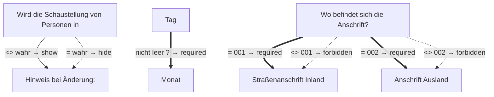

# Antrag auf Verlängerung der Frist für das Erlöschen der Erlaubnis zur gewerbsmäßigen Schaustellung von Personen

- **FIM-ID:** `S05000001319 2.0.0` · **Reifegrad:** fachlich freigegeben (silber)
- **Rechtsgrundlagen:** § 33a GewO vom 22.02.1999; § 49 GewO vom 22.02.1999; referenzbasiert
- **Kompiliert:** 2026-08-13T15:50:40Z aus https://fimportal.de/api/v1/schemas/S05000001319/2.0.0/xdf
- **Umfang:** 54 Felder, 9 gesicherte Bedingungen, 0 ungeklärt

## Verbindliche Arbeitsweise

1. **`graph.json` entscheidet, nicht du.** Ob ein Feld gebraucht wird, welcher Nachweis fehlt und welche Bedingung gilt, steht dort. Leite das nie selbst ab.
2. **Übersetze nur.** Deine Aufgabe ist Alltagssprache ↔ Feldwert. Nenne auf Nachfrage die amtliche Formulierung und die Rechtsgrundlage.
3. **Frage nur, was offen ist.** Felder, deren Bedingung nach den bisherigen Antworten nicht erfüllt ist, entfallen — frage sie nicht ab.
4. **Bei ungeklärten Regeln sag das.** Der Abschnitt „Ungeklärte Regeln" enthält Bedingungen, die nicht maschinell gelesen werden konnten. Rate dort nicht, sondern verweise auf die zuständige Stelle.

## Felder

### Ohne Gruppe

- **Stellen Sie diesen Antrag / diese Anzeige als Privatperson oder geschäftlich?** (`F05000018286`) — Pflicht
  - Rechtsgrundlage: WiPG NRW; WiPG-DVO

### Angaben zur Verlängerung › Die Verlängerung der Erlöschensfrist der Erlaubnis wird beantragt für: (`G05000012005`)

- **Veranstaltung von Schaustellungen von Personen** (`F05000017885`) — Pflicht
  - Rechtsgrundlage: § 33a GewO; § 49 GewO
- **Zurverfügungstellung der Räume für Dritte** (`F05000017886`) — Pflicht
  - Rechtsgrundlage: § 33a GewO; § 49 GewO

### Angaben zur Verlängerung › Erlaubnis zur gewerbsmäßigen Schaustellung von Personen (`G05000012006`)

- **Hinweis:** (`F05000017887`) — optional
  - Rechtsgrundlage: § 33a GewO
- **Ausstellende Behörde** (`F60000000292`) — Pflicht
  - Rechtsgrundlage: Tabelle 9 BSI TR-03123 Version 1.5.1
  - Hilfe: Geben Sie den Namen der ausstellenden Behörde an.
- **Wann wurde die Erlaubnis erteilt?** (`F05000017505`) — Pflicht
  - Rechtsgrundlage: § 33a GewO; § 49 GewO _(geerbt)_
- **Aktenzeichen der Erlaubnis** (`F05000018051`) — Pflicht
  - Rechtsgrundlage: § 33a GewO; § 49 GewO _(geerbt)_
- **Angaben zur Verlängerung der Erlöschensfrist** (`F05000017888`) — Pflicht
  - Rechtsgrundlage: § 33a GewO; § 49 GewO
  - Hilfe: Ein wichtiger Grund liegt vor, wenn die Frist nicht eingehalten werden kann. Die Ursache darf nicht von den Erlaubnisinhabenden zu vertreten sein und muss außerhalb ihres Verantwortungsbereichs liegen. 
Beispiele sind: 
- langandauernde Erkrankung,
- höhere Gewalt, 
- betriebswirtschaftliche Notwendigkeit, 
- Nachbarswiderspruch oder
- rechtswidriges Behördenhandeln.

### Angaben zur Verlängerung › Angaben zu Änderungen seit Erlaubniserteilung (`G05000013300`)

- **Wird die Schaustellung von Personen in der gleichen Form fortgeführt?** (`F05000017889`) — Pflicht
  - Rechtsgrundlage: § 33a GewO; § 49 GewO
- **Hinweis bei Änderung:** (`F05000018948`) — Pflicht, conditional
  - Rechtsgrundlage: § 33a (1) GewO; § 49 GewO

### Unternehmensdaten › Identifikation des Unternehmens (`G05000012723`)

- **Rechtsform** (`F05000017511`) — Pflicht
  - Rechtsgrundlage: § 33a GewO; § 49 GewO _(geerbt)_
- **Name des Unternehmens** (`F05000017763`) — Pflicht
  - Rechtsgrundlage: § 33a GewO; § 49 GewO _(geerbt)_

### Unternehmensdaten › Weitere Angaben zum Unternehmen › Inländische Geschäftsanschrift oder Anschrift des Verwaltungssitzes (`G05000013419`)

- **Es handelt sich um die:** (`F05000019734`) — Pflicht
  - Rechtsgrundlage: XInneres.Meldeanschrift.strasse Version 8; XInneres.Meldeanschrift.hausnummer Version 8; XInneres.Meldeanschrift.postleitzahl Version 8; § 5 (2) Nr. 9 PAuswG vom 21.6.2019; Anhang 3 Abschnitt 1 (Wohnort) PAuswV vom 28.9.2017; Tabelle 11 BSI TR-03123, Version 1.5.1; Xinneres.Meldeanschrift.Wohnort Version 8; XOEV.Kernkomponente.Anschrift.ort vom 31.01.2020; XInneres.Meldeanschrift.zusatzangaben Version 8; urn:xoev-de:xunternehmen:standard:basismodul_1.1; referenzbasiert _(geerbt)_
- **Adresssuche** (`F05000017636`) — Pflicht
  - Rechtsgrundlage: referenzbasiert
- **Straße** (`F60000000243`) — Pflicht
  - Rechtsgrundlage: XInneres.Meldeanschrift.strasse Version 8
  - Hilfe: Geben Sie an, wie die Straße heißt, ohne Abkürzungen zu verwenden, Beispiel Bischöflich-Geistlicher-Rat-Josef-Zinnbauer-Straße
- **Hausnummer** (`F60000000244`) — optional
  - Rechtsgrundlage: XInneres.Meldeanschrift.hausnummer Version 8
  - Hilfe: Geben Sie die Ziffern und ggf. Buchstaben der Hausnummer der Anschrift an, Beispiel 124a.
- **Postleitzahl** (`F60000000246`) — Pflicht
  - Rechtsgrundlage: XInneres.Meldeanschrift.postleitzahl Version 8
  - Hilfe: Geben Sie die Postleitzahl des Ortes an, Beispiel 10115.
- **Ort** (`F60000000247`) — Pflicht
  - Rechtsgrundlage: § 5 (2) Nr. 9 PAuswG vom 21.6.2019; Anhang 3 Abschnitt 1 (Wohnort) PAuswV vom 28.9.2017; Tabelle 11 BSI TR-03123, Version 1.5.1; Xinneres.Meldeanschrift.Wohnort Version 8; XOEV.Kernkomponente.Anschrift.ort vom 31.01.2020
  - Hilfe: Geben Sie an, wie der Ort heißt. Benennen Sie dafür den Namen der Ortschaft, Gemeinde oder Stadt; nicht jedoch den Namen des Ortsteils, Beispiel Berlin.
- **Früherer Gemeindename** (`F60000000364`) — optional
  - Rechtsgrundlage: urn:xoev-de:xunternehmen:standard:basismodul_1.1
- **Adresszusatz** (`F60000000248`) — optional
  - Rechtsgrundlage: XInneres.Meldeanschrift.zusatzangaben Version 8
  - Hilfe: Geben Sie Zusatzangaben zur Anschrift an. Beispiele: Hinterhaus, Gartenhaus.

### Unternehmensdaten › Weitere Angaben zum Unternehmen › Erreichbarkeit (`G05000011747`)

- **Telefonnummer** (`F60000000240`) — Pflicht
  - Rechtsgrundlage: ITU E.123
  - Hilfe: Geben Sie bei Telefonnummern innerhalb Deutschlands zuerst die Ortsvorwahl bzw. Mobilnetzvorwahl in Klammern, gefolgt von der Rufnummer an, Beispiel (0211) 12345678.
Geben Sie bei Telefonnummern außerhalb Deutschlands zuerst den Internationalen Ländercode mit vorgestelltem Plus, gefolgt von der Ortsvorwahl bzw. Mobilnetzvorwahl ohne der führenden Null, gefolgt von der Rufnummer an, Beispiel +49 211 123456789.
- **Telefaxnummer** (`F60000000241`) — optional
  - Rechtsgrundlage: ITU E.123
  - Hilfe: Geben Sie bei Telefaxnummern innerhalb Deutschlands zuerst die Ortsvorwahl bzw. Mobilnetzvorwahl in Klammern, gefolgt von der Rufnummer an, Beispiel (0211) 12345678.
Geben Sie bei Telefaxnummern außerhalb Deutschlands zuerst den Internationalen Ländercode mit vorgestelltem Plus, gefolgt von der Ortsvorwahl bzw. Mobilnetzvorwahl ohne der führenden Null, gefolgt von der Rufnummer an, Beispiel +49 211 123456789.
- **E-Mail-Adresse** (`F60000000242`) — optional
  - Rechtsgrundlage: RFC 5322; RFC 5321
  - Hilfe: Geben Sie eine E-Mail-Adresse an, z.B. Max.Mustermann@email.de
- **Webadresse / Website** (`F60000000321`) — optional
  - Rechtsgrundlage: Art. 6 Abs. 1 VO (EU) 2016/679 _(geerbt)_

### Unternehmensdaten › Antragstellende Person (`G05000012016`)

- **Vornamen** (`F60000000228`) — Pflicht
  - Rechtsgrundlage: § 5 (2) Nr. 2 PAuswG vom 21.6.2019; Anhang 3 PAuswV vom 28.9.2017; Tabelle 9 BSI TR-03123 Version 1.5.1; XOEV.Kernkomponente.NameNatuerlichePerson.vorname vom 31.08.2020
  - Hilfe: Geben Sie die Vornamen so an, wie sie auf den offiziellen Ausweisen angegeben sind, zum Beispiel im Personalausweis.
- **Familienname** (`F60000000227`) — Pflicht
  - Rechtsgrundlage: § 5 (2) Nr. 1 PAuswG vom 21.6.2019; Anhang 3 PAuswV vom 28.9.2017; Tabelle 9 BSI TR-03123 Version 1.5.1; XOEV.Kernkomponente.NameNatuerlichePerson.familienname vom 31.01.2020
  - Hilfe: Geben Sie den Nachnamen, Familiennamen bzw. Zunamen an.
- **Geburtsname** (`F60000000230`) — optional
  - Rechtsgrundlage: § 5 (2) Nr. 1 PAuswG vom 21.6.2019; Anhang 3 Abschnitt 1 PAuswV vom 28.9.2017; Tabelle 9 BSI TR-03123 Version 1.5.1; XOEV.Kernkomponente.NameNatuerlichePerson.geburtsname vom 31.01.2020
  - Hilfe: Geben Sie den Geburtsnamen an. Manche Menschen ändern ihren Familiennamen, wenn sie heiraten oder eine Lebenspartnerschaft eingehen. Der  Geburtsname ist der Familienname den die Person bei der Geburt hatte, bevor sie ihren Namen geändert hat.
- **Geburtsort** (`F60000000234`) — Pflicht
  - Rechtsgrundlage: § 5 (2) Nr. 4 PAuswG vom 21.6.2019; Anhang 3 Abschnitt 1 PAuswV vom 28.9.2017; Tabelle 9 BSI TR-03123 Version 1.5.1; XOEV.Kernkomponente.Geburt.geburtsort vom 31.01.2020
  - Hilfe: Geben Sie die Bezeichnung des Ortes an, in dem die Person geboren wurde, Beispiel Düsseldorf.
- **Staat der Geburt** (`F60000000235`) — Pflicht
  - Rechtsgrundlage: XMeld.type.AnschriftMelderecht.Ausland.staat Version 2.4.3; Codeliste laut XMeld und DSMeld: Codeliste Destatis Staat (urn:de:bund:destatis:bevoelkerungsstatistik:schluessel:staat)
- **Staatsangehörigkeit** (`F60000000236`) — Pflicht
  - Rechtsgrundlage: XOEV.Kernkomponente.NatuerlichePerson.staatsangehoerigkeit vom 31.08.2020; Codeliste laut XMeld und DSMeld: Codeliste Destatis Staatsangehörigkeit (urn:de:bund:destatis:bevoelkerungsstatistik:schluessel:staatsangehörigkeit)
  - Hilfe: Wählen Sie aus, welcher Nationalität bzw. welchen Nationalitäten die Person angehört. Es ist auch die Auswahl "ohne Angabe" möglich, falls die Person keiner Nationalität angehört.

### Unternehmensdaten › Antragstellende Person › Geburtsdatum (`G60000000083`)

- **Tag** (`F60000000231`) — optional
  - Rechtsgrundlage: § 5 (2) PAuswG vom 21.6.2019; Anhang 3 Abschnitt 1 PAuswV vom 28.9.2017; Tabelle 9 BSI TR-03123 Version 1.5.1 _(geerbt)_
- **Monat** (`F60000000232`) — optional, conditional
  - Rechtsgrundlage: § 5 (2) PAuswG vom 21.6.2019; Anhang 3 Abschnitt 1 PAuswV vom 28.9.2017; Tabelle 9 BSI TR-03123 Version 1.5.1 _(geerbt)_
- **Jahr** (`F60000000233`) — Pflicht
  - Rechtsgrundlage: § 5 (2) PAuswG vom 21.6.2019; Anhang 3 Abschnitt 1 PAuswV vom 28.9.2017; Tabelle 9 BSI TR-03123 Version 1.5.1 _(geerbt)_

### Unternehmensdaten › Antragstellende Person › Anschrift (`G05000011492`)

- **Wo befindet sich die Anschrift?** (`F60000000263`) — Pflicht
  - Rechtsgrundlage: urn:xoevde:xunternehmen:kerndatenobjekt:anschriftinlandstrassenanschrift; referenzbasiert; XInneres.Meldeanschrift.strasse Version 8; XInneres.Meldeanschrift.hausnummer Version 8; XInneres.Meldeanschrift.postleitzahl Version 8; § 5 (2) Nr. 9 PAuswG vom 21.6.2019; Anhang 3 Abschnitt 1 (Wohnort) PAuswV vom 28.9.2017; Tabelle 11 BSI TR-03123, Version 1.5.1; Xinneres.Meldeanschrift.Wohnort Version 8; XOEV.Kernkomponente.Anschrift.ort vom 31.01.2020; XInneres.Meldeanschrift.zusatzangaben Version 8; urn:xoev-de:xunternehmen:standard:basismodul_1.1; urn:xoev-de:xunternehmen:kerndatenobjekt:anschriftausland _(geerbt)_
  - Hilfe: Geben Sie an, ob sich die Anschrift im Inland oder im Ausland befindet.

### Unternehmensdaten › Antragstellende Person › Anschrift › Straßenanschrift Inland (`G05000013177`)

- **Adresssuche** (`F05000017636`) — Pflicht
  - Rechtsgrundlage: referenzbasiert
- **Straße** (`F60000000243`) — Pflicht
  - Rechtsgrundlage: XInneres.Meldeanschrift.strasse Version 8
  - Hilfe: Geben Sie an, wie die Straße heißt, ohne Abkürzungen zu verwenden, Beispiel Bischöflich-Geistlicher-Rat-Josef-Zinnbauer-Straße
- **Hausnummer** (`F60000000244`) — optional
  - Rechtsgrundlage: XInneres.Meldeanschrift.hausnummer Version 8
  - Hilfe: Geben Sie die Ziffern und ggf. Buchstaben der Hausnummer der Anschrift an, Beispiel 124a.
- **Postleitzahl** (`F60000000246`) — Pflicht
  - Rechtsgrundlage: XInneres.Meldeanschrift.postleitzahl Version 8
  - Hilfe: Geben Sie die Postleitzahl des Ortes an, Beispiel 10115.
- **Ort** (`F60000000247`) — Pflicht
  - Rechtsgrundlage: § 5 (2) Nr. 9 PAuswG vom 21.6.2019; Anhang 3 Abschnitt 1 (Wohnort) PAuswV vom 28.9.2017; Tabelle 11 BSI TR-03123, Version 1.5.1; Xinneres.Meldeanschrift.Wohnort Version 8; XOEV.Kernkomponente.Anschrift.ort vom 31.01.2020
  - Hilfe: Geben Sie an, wie der Ort heißt. Benennen Sie dafür den Namen der Ortschaft, Gemeinde oder Stadt; nicht jedoch den Namen des Ortsteils, Beispiel Berlin.
- **Früherer Gemeindename** (`F60000000364`) — optional
  - Rechtsgrundlage: urn:xoev-de:xunternehmen:standard:basismodul_1.1
- **Adresszusatz** (`F60000000248`) — optional
  - Rechtsgrundlage: XInneres.Meldeanschrift.zusatzangaben Version 8
  - Hilfe: Geben Sie Zusatzangaben zur Anschrift an. Beispiele: Hinterhaus, Gartenhaus.

### Unternehmensdaten › Antragstellende Person › Anschrift › Anschrift Ausland › Staat (`G60000000206`)

- **Staat** (`F60000000377`) — optional
  - Rechtsgrundlage: Codeliste Staat aus der Staats- und Gebietssystematik des Statistischen Bundesamtes; Codeliste Staatsgebiete aus der Staats- und Gebietssystematik des Statistischen Bundesamtes; Codeliste Staatsangehörigkeit aus der Staats- und Gebietssystematik des Statistischen Bundesamtes; Country Codes; urn:xoev-de:xunternehmen:kerndatenobjekt:staat
- **Staat** (`F60000000357`) — Pflicht
  - Rechtsgrundlage: urn:xoev-de:xunternehmen:kerndatenobjekt:staat Version 1.1

### Unternehmensdaten › Antragstellende Person › Anschrift › Anschrift Ausland (`G60000000191`)

- **Straße** (`F60000000243`) — optional
  - Rechtsgrundlage: XInneres.Meldeanschrift.strasse Version 8
  - Hilfe: Geben Sie an, wie die Straße heißt, ohne Abkürzungen zu verwenden, Beispiel Bischöflich-Geistlicher-Rat-Josef-Zinnbauer-Straße
- **Hausnummer** (`F60000000244`) — optional
  - Rechtsgrundlage: XInneres.Meldeanschrift.hausnummer Version 8
  - Hilfe: Geben Sie die Ziffern und ggf. Buchstaben der Hausnummer der Anschrift an, Beispiel 124a.
- **Postleitzahl** (`F60000000382`) — optional
  - Rechtsgrundlage: urn:xoev-de:xunternehmen:standard:basismodul
  - Hilfe: Geben Sie die Postleitzahl des Ortes an.
- **Ort** (`F60000000247`) — optional
  - Rechtsgrundlage: § 5 (2) Nr. 9 PAuswG vom 21.6.2019; Anhang 3 Abschnitt 1 (Wohnort) PAuswV vom 28.9.2017; Tabelle 11 BSI TR-03123, Version 1.5.1; Xinneres.Meldeanschrift.Wohnort Version 8; XOEV.Kernkomponente.Anschrift.ort vom 31.01.2020
  - Hilfe: Geben Sie an, wie der Ort heißt. Benennen Sie dafür den Namen der Ortschaft, Gemeinde oder Stadt; nicht jedoch den Namen des Ortsteils, Beispiel Berlin.
- **Adresszusatz** (`F60000000248`) — optional
  - Rechtsgrundlage: XInneres.Meldeanschrift.zusatzangaben Version 8
  - Hilfe: Geben Sie Zusatzangaben zur Anschrift an. Beispiele: Hinterhaus, Gartenhaus.

### Unternehmensdaten › Antragstellende Person › Erreichbarkeit (`G05000011747`)

- **Telefonnummer** (`F60000000240`) — Pflicht
  - Rechtsgrundlage: ITU E.123
  - Hilfe: Geben Sie bei Telefonnummern innerhalb Deutschlands zuerst die Ortsvorwahl bzw. Mobilnetzvorwahl in Klammern, gefolgt von der Rufnummer an, Beispiel (0211) 12345678.
Geben Sie bei Telefonnummern außerhalb Deutschlands zuerst den Internationalen Ländercode mit vorgestelltem Plus, gefolgt von der Ortsvorwahl bzw. Mobilnetzvorwahl ohne der führenden Null, gefolgt von der Rufnummer an, Beispiel +49 211 123456789.
- **Telefaxnummer** (`F60000000241`) — optional
  - Rechtsgrundlage: ITU E.123
  - Hilfe: Geben Sie bei Telefaxnummern innerhalb Deutschlands zuerst die Ortsvorwahl bzw. Mobilnetzvorwahl in Klammern, gefolgt von der Rufnummer an, Beispiel (0211) 12345678.
Geben Sie bei Telefaxnummern außerhalb Deutschlands zuerst den Internationalen Ländercode mit vorgestelltem Plus, gefolgt von der Ortsvorwahl bzw. Mobilnetzvorwahl ohne der führenden Null, gefolgt von der Rufnummer an, Beispiel +49 211 123456789.
- **E-Mail-Adresse** (`F60000000242`) — optional
  - Rechtsgrundlage: RFC 5322; RFC 5321
  - Hilfe: Geben Sie eine E-Mail-Adresse an, z.B. Max.Mustermann@email.de
- **Webadresse / Website** (`F60000000321`) — optional
  - Rechtsgrundlage: Art. 6 Abs. 1 VO (EU) 2016/679 _(geerbt)_

### Nachweise (`G05000012009`)

- **Unterlagen für die Verlängerung der Erlöschensfrist** (`F05000017890`) — optional
  - Rechtsgrundlage: § 33a GewO; § 49 GewO
  - Hilfe: Laden Sie die Unterlagen, die das Vorliegen eines wichtigen Grundes für die Verlängerung der Erlöschensfrist belegen, hoch. Beachten Sie, dass das maximal zulässige Datenvolumen von 20MB nicht überschritten werden darf. Akzeptierte Dateiformate sind JPG, PNG und PDF.
- **Sonstige Unterlagen** (`F05000017309`) — optional
  - Rechtsgrundlage: urn:xoev-de:xunternehmen:standard:basismodul:nachr:nachweisdokument.upload, Version 1.2
  - Hilfe: Laden Sie weitere Unterlagen hoch, falls nötig. 
Beachten Sie, dass das maximal zulässige Datenvolumen von 20 MB nicht überschritten werden darf. Akzeptierte Dateiformate sind JPG, PNG und PDF.

## Bedingungen

| Bedingung | Feld | Folge | Rechtsgrundlage | Regel |
|---|---|---|---|---|
| wenn „Wird die Schaustellung von Personen in der gleichen Form fortgeführt?" ungleich „wahr" ist | „Hinweis bei Änderung:" | wird gezeigt | — | `R05000014100` |
| wenn „Wird die Schaustellung von Personen in der gleichen Form fortgeführt?" gleich „wahr" ist | „Hinweis bei Änderung:" | entfällt | — | `R05000014100` |
| wenn „Tag" nicht leer ist | „Monat" | muss ausgefüllt werden | — | `G60000000083` |
| wenn „Wo befindet sich die Anschrift?" gleich „001" ist | „Straßenanschrift Inland" | muss ausgefüllt werden | — | `G05000011492` |
| wenn „Wo befindet sich die Anschrift?" ungleich „001" ist | „Straßenanschrift Inland" | darf nicht ausgefüllt werden | — | `G05000011492` |
| wenn „Wo befindet sich die Anschrift?" gleich „002" ist | „Anschrift Ausland" | muss ausgefüllt werden | — | `G05000011492` |
| wenn „Wo befindet sich die Anschrift?" ungleich „002" ist | „Anschrift Ausland" | darf nicht ausgefüllt werden | — | `G05000011492` |

## Abhängigkeitsgraph

