# Antrag auf Erlaubnis für Tätigkeiten mit Krankheitserregern

- **FIM-ID:** `S05000001323 1.0.0` · **Reifegrad:** fachlich freigegeben (silber)
- **Rechtsgrundlagen:** § 44 IfSG vom 12.12.2023; § 47 IfSG vom 12.12.2023; § 3 BioStoffV vom 2.12.2024; § 15 BioStoffV vom 2.12.2024; referenzbasiert
- **Kompiliert:** 2026-08-13T15:50:46Z aus https://fimportal.de/api/v1/schemas/S05000001323/1.0.0/xdf
- **Umfang:** 57 Felder, 24 gesicherte Bedingungen, 0 ungeklärt

## Verbindliche Arbeitsweise

1. **`graph.json` entscheidet, nicht du.** Ob ein Feld gebraucht wird, welcher Nachweis fehlt und welche Bedingung gilt, steht dort. Leite das nie selbst ab.
2. **Übersetze nur.** Deine Aufgabe ist Alltagssprache ↔ Feldwert. Nenne auf Nachfrage die amtliche Formulierung und die Rechtsgrundlage.
3. **Frage nur, was offen ist.** Felder, deren Bedingung nach den bisherigen Antworten nicht erfüllt ist, entfallen — frage sie nicht ab.
4. **Bei ungeklärten Regeln sag das.** Der Abschnitt „Ungeklärte Regeln" enthält Bedingungen, die nicht maschinell gelesen werden konnten. Rate dort nicht, sondern verweise auf die zuständige Stelle.

> **Hinweis:** Die zugehörige Leistung konnte nicht zweifelsfrei zugeordnet werden (Rechtsgrundlage stimmt nicht überein (D99000001971)). Zu Fristen, Kosten, Unterlagen und Zuständigkeit daher keine Auskunft geben, sondern an die zuständige Stelle verweisen.

## Felder

### Ohne Gruppe

- **Hinweis:** (`F05000018318`) — optional
  - Rechtsgrundlage: § 44 IfSG
- **Stellen Sie diesen Antrag / diese Anzeige als Privatperson oder geschäftlich?** (`F05000018286`) — Pflicht
  - Rechtsgrundlage: WiPG NRW; WiPG-DVO
- **Wählen Sie die beantragte Risikogruppe nach § 3 Biostoffverordnung:** (`F05000018320`) — Pflicht
  - Rechtsgrundlage: § 3 BioStoffV

### Antragsteller/Anzeigender (nicht geschäftlich) (`G05000013427`)

- **Vornamen** (`F60000000228`) — Pflicht
  - Rechtsgrundlage: § 5 (2) Nr. 2 PAuswG vom 21.6.2019; Anhang 3 PAuswV vom 28.9.2017; Tabelle 9 BSI TR-03123 Version 1.5.1; XOEV.Kernkomponente.NameNatuerlichePerson.vorname vom 31.08.2020
  - Hilfe: Geben Sie die Vornamen so an, wie sie auf den offiziellen Ausweisen angegeben sind, zum Beispiel im Personalausweis.
- **Familienname** (`F60000000227`) — Pflicht
  - Rechtsgrundlage: § 5 (2) Nr. 1 PAuswG vom 21.6.2019; Anhang 3 PAuswV vom 28.9.2017; Tabelle 9 BSI TR-03123 Version 1.5.1; XOEV.Kernkomponente.NameNatuerlichePerson.familienname vom 31.01.2020
  - Hilfe: Geben Sie den Nachnamen, Familiennamen bzw. Zunamen an.
- **Geburtsname** (`F60000000230`) — optional
  - Rechtsgrundlage: § 5 (2) Nr. 1 PAuswG vom 21.6.2019; Anhang 3 Abschnitt 1 PAuswV vom 28.9.2017; Tabelle 9 BSI TR-03123 Version 1.5.1; XOEV.Kernkomponente.NameNatuerlichePerson.geburtsname vom 31.01.2020
  - Hilfe: Geben Sie den Geburtsnamen an. Manche Menschen ändern ihren Familiennamen, wenn sie heiraten oder eine Lebenspartnerschaft eingehen. Der  Geburtsname ist der Familienname den die Person bei der Geburt hatte, bevor sie ihren Namen geändert hat.
- **Geburtsort** (`F60000000234`) — optional
  - Rechtsgrundlage: § 5 (2) Nr. 4 PAuswG vom 21.6.2019; Anhang 3 Abschnitt 1 PAuswV vom 28.9.2017; Tabelle 9 BSI TR-03123 Version 1.5.1; XOEV.Kernkomponente.Geburt.geburtsort vom 31.01.2020
  - Hilfe: Geben Sie die Bezeichnung des Ortes an, in dem die Person geboren wurde, Beispiel Düsseldorf.
- **Staatsangehörigkeit** (`F60000000236`) — optional
  - Rechtsgrundlage: XOEV.Kernkomponente.NatuerlichePerson.staatsangehoerigkeit vom 31.08.2020; Codeliste laut XMeld und DSMeld: Codeliste Destatis Staatsangehörigkeit (urn:de:bund:destatis:bevoelkerungsstatistik:schluessel:staatsangehörigkeit)
  - Hilfe: Wählen Sie aus, welcher Nationalität bzw. welchen Nationalitäten die Person angehört. Es ist auch die Auswahl "ohne Angabe" möglich, falls die Person keiner Nationalität angehört.

### Antragsteller/Anzeigender (nicht geschäftlich) › Geburtsdatum (`G60000000083`)

- **Tag** (`F60000000231`) — optional
  - Rechtsgrundlage: § 5 (2) PAuswG vom 21.6.2019; Anhang 3 Abschnitt 1 PAuswV vom 28.9.2017; Tabelle 9 BSI TR-03123 Version 1.5.1 _(geerbt)_
- **Monat** (`F60000000232`) — optional, conditional
  - Rechtsgrundlage: § 5 (2) PAuswG vom 21.6.2019; Anhang 3 Abschnitt 1 PAuswV vom 28.9.2017; Tabelle 9 BSI TR-03123 Version 1.5.1 _(geerbt)_
- **Jahr** (`F60000000233`) — Pflicht
  - Rechtsgrundlage: § 5 (2) PAuswG vom 21.6.2019; Anhang 3 Abschnitt 1 PAuswV vom 28.9.2017; Tabelle 9 BSI TR-03123 Version 1.5.1 _(geerbt)_

### Antragsteller/Anzeigender (nicht geschäftlich) › Anschrift (`G05000011492`)

- **Wo befindet sich die Anschrift?** (`F60000000263`) — Pflicht
  - Rechtsgrundlage: urn:xoevde:xunternehmen:kerndatenobjekt:anschriftinlandstrassenanschrift; referenzbasiert; XInneres.Meldeanschrift.strasse Version 8; XInneres.Meldeanschrift.hausnummer Version 8; XInneres.Meldeanschrift.postleitzahl Version 8; § 5 (2) Nr. 9 PAuswG vom 21.6.2019; Anhang 3 Abschnitt 1 (Wohnort) PAuswV vom 28.9.2017; Tabelle 11 BSI TR-03123, Version 1.5.1; Xinneres.Meldeanschrift.Wohnort Version 8; XOEV.Kernkomponente.Anschrift.ort vom 31.01.2020; XInneres.Meldeanschrift.zusatzangaben Version 8; urn:xoev-de:xunternehmen:standard:basismodul_1.1; urn:xoev-de:xunternehmen:kerndatenobjekt:anschriftausland _(geerbt)_
  - Hilfe: Geben Sie an, ob sich die Anschrift im Inland oder im Ausland befindet.

### Antragsteller/Anzeigender (nicht geschäftlich) › Anschrift › Straßenanschrift Inland (`G05000013177`)

- **Adresssuche** (`F05000017636`) — Pflicht
  - Rechtsgrundlage: referenzbasiert
- **Straße** (`F60000000243`) — Pflicht
  - Rechtsgrundlage: XInneres.Meldeanschrift.strasse Version 8
  - Hilfe: Geben Sie an, wie die Straße heißt, ohne Abkürzungen zu verwenden, Beispiel Bischöflich-Geistlicher-Rat-Josef-Zinnbauer-Straße
- **Hausnummer** (`F60000000244`) — optional
  - Rechtsgrundlage: XInneres.Meldeanschrift.hausnummer Version 8
  - Hilfe: Geben Sie die Ziffern und ggf. Buchstaben der Hausnummer der Anschrift an, Beispiel 124a.
- **Postleitzahl** (`F60000000246`) — Pflicht
  - Rechtsgrundlage: XInneres.Meldeanschrift.postleitzahl Version 8
  - Hilfe: Geben Sie die Postleitzahl des Ortes an, Beispiel 10115.
- **Ort** (`F60000000247`) — Pflicht
  - Rechtsgrundlage: § 5 (2) Nr. 9 PAuswG vom 21.6.2019; Anhang 3 Abschnitt 1 (Wohnort) PAuswV vom 28.9.2017; Tabelle 11 BSI TR-03123, Version 1.5.1; Xinneres.Meldeanschrift.Wohnort Version 8; XOEV.Kernkomponente.Anschrift.ort vom 31.01.2020
  - Hilfe: Geben Sie an, wie der Ort heißt. Benennen Sie dafür den Namen der Ortschaft, Gemeinde oder Stadt; nicht jedoch den Namen des Ortsteils, Beispiel Berlin.
- **Früherer Gemeindename** (`F60000000364`) — optional
  - Rechtsgrundlage: urn:xoev-de:xunternehmen:standard:basismodul_1.1
- **Adresszusatz** (`F60000000248`) — optional
  - Rechtsgrundlage: XInneres.Meldeanschrift.zusatzangaben Version 8
  - Hilfe: Geben Sie Zusatzangaben zur Anschrift an. Beispiele: Hinterhaus, Gartenhaus.

### Antragsteller/Anzeigender (nicht geschäftlich) › Anschrift › Anschrift Ausland › Staat (`G60000000206`)

- **Staat** (`F60000000377`) — optional
  - Rechtsgrundlage: Codeliste Staat aus der Staats- und Gebietssystematik des Statistischen Bundesamtes; Codeliste Staatsgebiete aus der Staats- und Gebietssystematik des Statistischen Bundesamtes; Codeliste Staatsangehörigkeit aus der Staats- und Gebietssystematik des Statistischen Bundesamtes; Country Codes; urn:xoev-de:xunternehmen:kerndatenobjekt:staat
- **Staat** (`F60000000357`) — Pflicht
  - Rechtsgrundlage: urn:xoev-de:xunternehmen:kerndatenobjekt:staat Version 1.1

### Antragsteller/Anzeigender (nicht geschäftlich) › Anschrift › Anschrift Ausland (`G60000000191`)

- **Straße** (`F60000000243`) — optional
  - Rechtsgrundlage: XInneres.Meldeanschrift.strasse Version 8
  - Hilfe: Geben Sie an, wie die Straße heißt, ohne Abkürzungen zu verwenden, Beispiel Bischöflich-Geistlicher-Rat-Josef-Zinnbauer-Straße
- **Hausnummer** (`F60000000244`) — optional
  - Rechtsgrundlage: XInneres.Meldeanschrift.hausnummer Version 8
  - Hilfe: Geben Sie die Ziffern und ggf. Buchstaben der Hausnummer der Anschrift an, Beispiel 124a.
- **Postleitzahl** (`F60000000382`) — optional
  - Rechtsgrundlage: urn:xoev-de:xunternehmen:standard:basismodul
  - Hilfe: Geben Sie die Postleitzahl des Ortes an.
- **Ort** (`F60000000247`) — optional
  - Rechtsgrundlage: § 5 (2) Nr. 9 PAuswG vom 21.6.2019; Anhang 3 Abschnitt 1 (Wohnort) PAuswV vom 28.9.2017; Tabelle 11 BSI TR-03123, Version 1.5.1; Xinneres.Meldeanschrift.Wohnort Version 8; XOEV.Kernkomponente.Anschrift.ort vom 31.01.2020
  - Hilfe: Geben Sie an, wie der Ort heißt. Benennen Sie dafür den Namen der Ortschaft, Gemeinde oder Stadt; nicht jedoch den Namen des Ortsteils, Beispiel Berlin.
- **Adresszusatz** (`F60000000248`) — optional
  - Rechtsgrundlage: XInneres.Meldeanschrift.zusatzangaben Version 8
  - Hilfe: Geben Sie Zusatzangaben zur Anschrift an. Beispiele: Hinterhaus, Gartenhaus.

### Antragsteller/Anzeigender (nicht geschäftlich) › Kommunikation (`G05000011748`)

- **Telefonnummer** (`F60000000240`) — optional
  - Rechtsgrundlage: ITU E.123
  - Hilfe: Geben Sie bei Telefonnummern innerhalb Deutschlands zuerst die Ortsvorwahl bzw. Mobilnetzvorwahl in Klammern, gefolgt von der Rufnummer an, Beispiel (0211) 12345678.
Geben Sie bei Telefonnummern außerhalb Deutschlands zuerst den Internationalen Ländercode mit vorgestelltem Plus, gefolgt von der Ortsvorwahl bzw. Mobilnetzvorwahl ohne der führenden Null, gefolgt von der Rufnummer an, Beispiel +49 211 123456789.
- **Telefaxnummer** (`F60000000241`) — optional
  - Rechtsgrundlage: ITU E.123
  - Hilfe: Geben Sie bei Telefaxnummern innerhalb Deutschlands zuerst die Ortsvorwahl bzw. Mobilnetzvorwahl in Klammern, gefolgt von der Rufnummer an, Beispiel (0211) 12345678.
Geben Sie bei Telefaxnummern außerhalb Deutschlands zuerst den Internationalen Ländercode mit vorgestelltem Plus, gefolgt von der Ortsvorwahl bzw. Mobilnetzvorwahl ohne der führenden Null, gefolgt von der Rufnummer an, Beispiel +49 211 123456789.
- **E-Mail-Adresse** (`F60000000242`) — optional
  - Rechtsgrundlage: RFC 5322; RFC 5321
  - Hilfe: Geben Sie eine E-Mail-Adresse an, z.B. Max.Mustermann@email.de
- **Webadresse / Website** (`F60000000321`) — optional
  - Rechtsgrundlage: WiPG NRW; WiPG-DVO; ITU E.123; RFC 5322; RFC 5321 _(geerbt)_

### Erwerb der Sachkenntnis › Zeitraum in dem die Sachkenntnis erworben wurde (`G05000012346`)

- **von** (`F05000017278`) — Pflicht
  - Rechtsgrundlage: § 47 (1) S. 1 Nr. 1 IfSG _(geerbt)_
- **bis** (`F05000017279`) — Pflicht
  - Rechtsgrundlage: § 47 (1) S. 1 Nr. 1 IfSG _(geerbt)_

### Erwerb der Sachkenntnis (`G05000012312`)

- **Welche Tätigkeit wurde ausgeübt?** (`F05000018322`) — Pflicht
  - Rechtsgrundlage: § 47 (1) S. 1 Nr. 1 IfSG _(geerbt)_
- **Wurde die Sachkenntnis unter Aufsicht einer anderen Person erworben?** (`F05000018321`) — Pflicht
  - Rechtsgrundlage: § 47 (1) S. 1 Nr. 1 IfSG
- **Besitzt die Person, unter deren Aufsicht die Sachkenntnis erworben wurde, eine Erlaubnis zum Umgang mit Krankheitserregern?** (`F05000018323`) — optional, conditional
  - Rechtsgrundlage: § 47 (1) S. 1 Nr. 1 IfSG

### Nachweise Erlaubnis Krankheitserreger › Bundeszentralregisterauszug (Führungszeugnis) (`G05000012347`)

- **Hinweis:** (`F05000018378`) — optional
  - Rechtsgrundlage: § 47 (1) S. 1 Nr. 2 IfSG
- **Die Auskunft aus dem Bundeszentralregister** (`F05000018379`) — Pflicht
  - Rechtsgrundlage: § 47 (1) S. 1 Nr. 2 IfSG
  - Hilfe: Die Auskunft ist bei der Wohnsitzgemeinde zur Vorlage bei einer Behörde zu beantragen, d. h. sie wird direkt übersandt. Es ist nötig, dass Sie bei der Beantragung die genaue Anschrift der zuständigen Erlaubnisbehörde sowie den Verwendungszweck "Erlaubnisantrag für die Tätigkeit mit Krankheitserregern" angeben. Die Auskunft darf nicht älter als drei Monate sein.
- **Datum der Beantragung** (`F05000017693`) — optional, conditional
  - Rechtsgrundlage: DIN 5008
- **Datum der geplanten Beantragung** (`F05000017694`) — optional, conditional
  - Rechtsgrundlage: DIN 5008

### Nachweise Erlaubnis Krankheitserreger (`G05000012313`)

- **Erlaubnis für Tätigkeiten mit Krankheitserregern der Person, unter deren Aufsicht die Tätigkeit erfolgte.** (`F05000018325`) — optional
  - Rechtsgrundlage: § 44 IfSG; § 15 BioStoffV
  - Hilfe: Laden Sie eine Erlaubnis für Tätigkeiten mit Krankheitserregern von derjenigen Person hoch, unter deren Aufsicht die Tätigkeit erfolgte. Beachten Sie, dass das maximal zulässige Datenvolumen von 20MB nicht überschritten werden darf. Akzeptierte Dateiformate sind JPG, PNG und PDF.
- **Sonstige Unterlagen** (`F05000017309`) — optional
  - Rechtsgrundlage: urn:xoev-de:xunternehmen:standard:basismodul:nachr:nachweisdokument.upload, Version 1.2
  - Hilfe: Laden Sie weitere Unterlagen hoch, falls nötig. 
Beachten Sie, dass das maximal zulässige Datenvolumen von 20 MB nicht überschritten werden darf. Akzeptierte Dateiformate sind JPG, PNG und PDF.

### Nachweise Erlaubnis Krankheitserreger › Nachweis über den Abschluss eines Studiums (`G05000012320`)

- **Hinweis:** (`F05000018331`) — optional
  - Rechtsgrundlage: § 47 (2) S. 1 Nr. 1 IfSG
- **Nachweis über den Abschluss eines Studiums** (`F05000018327`) — Pflicht
  - Rechtsgrundlage: § 47 (2) S. 1 Nr. 1 IfSG
  - Hilfe: Laden hier den Nachweis über den Abschluss eines Studiums hoch. Beachten Sie, dass das maximal zulässige Datenvolumen von 20MB nicht überschritten werden darf. Akzeptierte Dateiformate sind JPG, PNG und PDF.

### Nachweise Erlaubnis Krankheitserreger › Nachweis zweijährige Tätigkeit Krankheitserregern (`G05000012321`)

- **Hinweis:** (`F05000018332`) — optional
  - Rechtsgrundlage: § 47 (2) S. 1 Nr. 2 IfSG
- **Nachweis einer mindestens zweijährigen hauptberuflichen Tätigkeit mit Krankheitserregern** (`F05000018333`) — Pflicht
  - Rechtsgrundlage: § 47 (2) S. 1 Nr. 2 IfSG
  - Hilfe: Laden Sie den Nachweis einer mindestens zweijährigen hauptberuflichen Tätigkeit mit Krankheitserregern hoch. Beachten Sie, dass das maximal zulässige Datenvolumen von 20MB nicht überschritten werden darf. Akzeptierte Dateiformate sind JPG, PNG und PDF.

### Landesspezifika › Nachweis über den Abschluss eines Studiums › Nachweis gemäß § 47 Abs. 2 S. 1 Nr. 1 IfSG über ein abgeschlossenes Studium (`G05000012327`)

- **Studium der Humanmedizin** (`F05000018341`) — Pflicht
  - Rechtsgrundlage: § 47 (2) S. 1 Nr. 1 IfSG
- **Studium der Zahnmedizin** (`F05000018343`) — Pflicht
  - Rechtsgrundlage: § 47 (2) S. 1 Nr. 1 IfSG
- **Studium der Veterinärmedizin** (`F05000018344`) — Pflicht
  - Rechtsgrundlage: § 47 (2) S. 1 Nr. 1 IfSG
- **Studium der Pharmazie** (`F05000018346`) — Pflicht
  - Rechtsgrundlage: § 47 (2) S. 1 Nr. 1 IfSG
- **Naturwissenschaftliches Studium an einer Universität mit mikrobiologischen Inhalten** (`F05000018347`) — Pflicht
  - Rechtsgrundlage: § 47 (2) S. 1 Nr. 1 IfSG
- **Naturwissenschaftliches Studium an einer Fachhochschule mit mikrobiologischen Inhalten** (`F05000018348`) — Pflicht
  - Rechtsgrundlage: § 47 (2) S. 1 Nr. 1 IfSG

### Landesspezifika › Nachweis über den Abschluss eines Studiums › Nachweis gemäß § 47 Abs. 3 S. 2 IfSG über ein abgeschlossenes Studium zur Erteilung einer eingeschränkten Erlaubnis (`G05000012329`)

- **Naturwissenschaftliches Studium an einer Universität ohne mikrobiologische Inhalte** (`F05000018350`) — Pflicht
  - Rechtsgrundlage: § 47 (3) S. 2 IfSG
- **Naturwissenschaftliches Studium an einer Fachhochschule ohne mikrobiologische Inhalte** (`F05000018351`) — Pflicht
  - Rechtsgrundlage: § 47 (3) S. 2 IfSG
- **Ingenieurwissenschaftliches Studium an einer Universität mit mikrobiologischen Inhalten** (`F05000018353`) — Pflicht
  - Rechtsgrundlage: § 47 (3) S. 2 IfSG
- **Ingenieurwissenschaftliches Studium an einer Fachhochschule mit mikrobiologischen Inhalten** (`F05000018356`) — Pflicht
  - Rechtsgrundlage: § 47 (3) S. 2 IfSG

### Landesspezifika › Nachweis über den Abschluss eines Studiums (`G05000012325`)

- **Nachweis über den Abschluss eines Studiums** (`F05000018327`) — Pflicht
  - Rechtsgrundlage: § 47 (2) S. 1 Nr. 1 IfSG
  - Hilfe: Laden hier den Nachweis über den Abschluss eines Studiums hoch. Beachten Sie, dass das maximal zulässige Datenvolumen von 20MB nicht überschritten werden darf. Akzeptierte Dateiformate sind JPG, PNG und PDF.

### Landesspezifika (`G05000012322`)

- **Nachweis der erforderlichen Sachkenntnis nach § 47 Abs. 2 IfSG** (`F05000018366`) — optional
  - Rechtsgrundlage: § 47 (2) IfSG
  - Hilfe: Laden Sie den Nachweis der erforderlichen Sachkenntnis nach § 47 Abs. 2 IfSG hoch. Beachten Sie, dass das maximal zulässige Datenvolumen von 20MB nicht überschritten werden darf. Akzeptierte Dateiformate sind JPG, PNG und PDF.

## Bedingungen

| Bedingung | Feld | Folge | Rechtsgrundlage | Regel |
|---|---|---|---|---|
| wenn „Tag" nicht leer ist | „Monat" | muss ausgefüllt werden | — | `G60000000083` |
| wenn „Wo befindet sich die Anschrift?" gleich „001" ist | „Straßenanschrift Inland" | muss ausgefüllt werden | — | `G05000011492` |
| wenn „Wo befindet sich die Anschrift?" ungleich „001" ist | „Straßenanschrift Inland" | darf nicht ausgefüllt werden | — | `G05000011492` |
| wenn „Wo befindet sich die Anschrift?" gleich „002" ist | „Anschrift Ausland" | muss ausgefüllt werden | — | `G05000011492` |
| wenn „Wo befindet sich die Anschrift?" ungleich „002" ist | „Anschrift Ausland" | darf nicht ausgefüllt werden | — | `G05000011492` |
| wenn „Wurde die Sachkenntnis unter Aufsicht einer anderen Person erworben?" gleich „wahr" ist | „Besitzt die Person, unter deren Aufsicht die Sachkenntnis erworben wurde, eine Erlaubnis zum Umgang mit Krankheitserregern?" | muss ausgefüllt werden | — | `G05000012312` |
| wenn „Wurde die Sachkenntnis unter Aufsicht einer anderen Person erworben?" ungleich „wahr" ist | „Besitzt die Person, unter deren Aufsicht die Sachkenntnis erworben wurde, eine Erlaubnis zum Umgang mit Krankheitserregern?" | darf nicht ausgefüllt werden | — | `G05000012312` |
| wenn „Die Auskunft aus dem Bundeszentralregister" gleich „001" ist | „Datum der Beantragung" | muss ausgefüllt werden | — | `G05000012347` |
| wenn „Die Auskunft aus dem Bundeszentralregister" ungleich „001" ist | „Datum der Beantragung" | darf nicht ausgefüllt werden | — | `G05000012347` |
| wenn „Die Auskunft aus dem Bundeszentralregister" gleich „002" ist | „Datum der geplanten Beantragung" | muss ausgefüllt werden | — | `G05000012347` |
| wenn „Die Auskunft aus dem Bundeszentralregister" ungleich „002" ist | „Datum der geplanten Beantragung" | darf nicht ausgefüllt werden | — | `G05000012347` |

## Abhängigkeitsgraph

```mermaid
flowchart TD
  G05000013427_G60000000083_F60000000231["Tag"] ==>|"nicht leer ? → required"| G05000013427_G60000000083_F60000000232["Monat"]
  G05000013427_G05000011492_F60000000263["Wo befindet sich die Anschrift?"] ==>|"= 001 → required"| G05000013427_G05000011492_G05000013177["Straßenanschrift Inland"]
  G05000013427_G05000011492_F60000000263["Wo befindet sich die Anschrift?"] -.->|"<> 001 → forbidden"| G05000013427_G05000011492_G05000013177["Straßenanschrift Inland"]
  G05000013427_G05000011492_F60000000263["Wo befindet sich die Anschrift?"] ==>|"= 002 → required"| G05000013427_G05000011492_G60000000191["Anschrift Ausland"]
  G05000013427_G05000011492_F60000000263["Wo befindet sich die Anschrift?"] -.->|"<> 002 → forbidden"| G05000013427_G05000011492_G60000000191["Anschrift Ausland"]
  G05000012312_F05000018321["Wurde die Sachkenntnis unter Aufsicht "] ==>|"= wahr → required"| G05000012312_F05000018323["Besitzt die Person, unter deren Aufsic"]
  G05000012312_F05000018321["Wurde die Sachkenntnis unter Aufsicht "] -.->|"<> wahr → forbidden"| G05000012312_F05000018323["Besitzt die Person, unter deren Aufsic"]
  G05000012313_G05000012347_F05000018379["Die Auskunft aus dem Bundeszentralregi"] ==>|"= 001 → required"| G05000012313_G05000012347_F05000017693["Datum der Beantragung"]
  G05000012313_G05000012347_F05000018379["Die Auskunft aus dem Bundeszentralregi"] -.->|"<> 001 → forbidden"| G05000012313_G05000012347_F05000017693["Datum der Beantragung"]
  G05000012313_G05000012347_F05000018379["Die Auskunft aus dem Bundeszentralregi"] ==>|"= 002 → required"| G05000012313_G05000012347_F05000017694["Datum der geplanten Beantragung"]
  G05000012313_G05000012347_F05000018379["Die Auskunft aus dem Bundeszentralregi"] -.->|"<> 002 → forbidden"| G05000012313_G05000012347_F05000017694["Datum der geplanten Beantragung"]
```

