# Anzeige des Einzelhandels mit freiverkäuflichen Arzneimitteln

- **FIM-ID:** `S05000001345 2.0.0` · **Reifegrad:** fachlich freigegeben (silber)
- **Rechtsgrundlagen:** § 43 AMG vom 23.10.2024; § 50 AMG vom 23.10.2024; § 67 AMG vom 23.10.2024; referenzbasiert
- **Kompiliert:** 2026-08-13T15:51:28Z aus https://fimportal.de/api/v1/schemas/S05000001345/2.0.0/xdf
- **Umfang:** 44 Felder, 26 gesicherte Bedingungen, 0 ungeklärt

## Verbindliche Arbeitsweise

1. **`graph.json` entscheidet, nicht du.** Ob ein Feld gebraucht wird, welcher Nachweis fehlt und welche Bedingung gilt, steht dort. Leite das nie selbst ab.
2. **Übersetze nur.** Deine Aufgabe ist Alltagssprache ↔ Feldwert. Nenne auf Nachfrage die amtliche Formulierung und die Rechtsgrundlage.
3. **Frage nur, was offen ist.** Felder, deren Bedingung nach den bisherigen Antworten nicht erfüllt ist, entfallen — frage sie nicht ab.
4. **Bei ungeklärten Regeln sag das.** Der Abschnitt „Ungeklärte Regeln" enthält Bedingungen, die nicht maschinell gelesen werden konnten. Rate dort nicht, sondern verweise auf die zuständige Stelle.

> **Hinweis:** Die zugehörige Leistung konnte nicht zweifelsfrei zugeordnet werden (Rechtsgrundlage stimmt nicht überein (D99000001936)). Zu Fristen, Kosten, Unterlagen und Zuständigkeit daher keine Auskunft geben, sondern an die zuständige Stelle verweisen.

## Felder

### Ohne Gruppe

- **Stellen Sie diesen Antrag / diese Anzeige als Privatperson oder geschäftlich?** (`F05000018286`) — Pflicht
  - Rechtsgrundlage: WiPG NRW; WiPG-DVO
- **Ist die Geschäftsanschrift gleich der Betriebsstätte?** (`F05000018656`) — Pflicht
  - Rechtsgrundlage: § 43 AMG vom 23.10.2024; § 50 AMG vom 23.10.2024; § 67 AMG vom 23.10.2024; referenzbasiert _(geerbt)_

### Angaben zum Freiverkauf (`G05000012735`)

- **Information zu freiverkäuflichen Humanarzneimitteln** (`F05000018555`) — optional
  - Rechtsgrundlage: § 50 (1) AMG
- **Sollen freiverkäufliche Arzneimittel zusätzlich im Versandhandel in Verkehr gebracht werden?** (`F05000018558`) — Pflicht
  - Rechtsgrundlage: § 50 (1) AMG
- **Name des Versandhandels** (`F05000018557`) — optional, conditional
  - Rechtsgrundlage: § 50 (1) AMG
- **Webadresse / Website** (`F60000000321`) — optional, conditional
  - Rechtsgrundlage: § 50 (1) AMG _(geerbt)_

### Angaben zum Unternehmen › Identifikation des Unternehmens (`G05000012938`)

- **Rechtsform** (`F05000017511`) — Pflicht
  - Rechtsgrundlage: XGewerbeanzeige.Betrieb.geschaeftsbezeichnung Version 2.2; XUnternehmen.Kerndatenmodell.Wirtschaftliche Tätigkeit.Geschäftsbezeichnung Version 1.1; XOEV.Kernkomponente.NameOrganisation.name vom 01.08.2017; XGewerbeanzeige.Betrieb.eingetragenerName Version 2.2; XUnternehmen.Kerndatenmodell.Eingetragener Name Version 1.1; XGewerbeanzeige.Betrieb.geschaeftsbezeichnung Version 2.2; XUnternehmen.Kerndatenmodell.Wirtschaftliche Tätigkeit.Geschäftsbezeichnung Version 1.1 _(geerbt)_
- **Eingetragener Name** (`F60000000319`) — optional, conditional
  - Rechtsgrundlage: XOEV.Kernkomponente.NameOrganisation.name vom 01.08.2017; XGewerbeanzeige.Betrieb.eingetragenerName Version 2.2; XUnternehmen.Kerndatenmodell.Eingetragener Name Version 1.1
  - Hilfe: Geben Sie den im Handelsregister, im Genossenschaftsregister, im Vereinsregister oder im Stiftungsverzeichnis eingetragenen Namen mit Rechtsform an, soweit eine Eintragung vorliegt.
- **Unternehmensname** (`F05000017734`) — optional, conditional
  - Rechtsgrundlage: XGewerbeanzeige.Betrieb.geschaeftsbezeichnung Version 2.2; XUnternehmen.Kerndatenmodell.Wirtschaftliche Tätigkeit.Geschäftsbezeichnung Version 1.1
  - Hilfe: Der Name besteht aus dem Vor- und Familiennamen aller Gesellschafterinnen oder Gesellschafter mit Zusatz GbR.
- **Unternehmensname** (`F05000017735`) — optional, conditional
  - Rechtsgrundlage: XGewerbeanzeige.Betrieb.geschaeftsbezeichnung Version 2.2; XUnternehmen.Kerndatenmodell.Wirtschaftliche Tätigkeit.Geschäftsbezeichnung Version 1.1
  - Hilfe: Der Name entspricht dem Vor- und Familiennamen der Inhaberin oder des Inhabers.
- **Geschäftsbezeichnung** (`F60000000320`) — optional
  - Rechtsgrundlage: XGewerbeanzeige.Betrieb.geschaeftsbezeichnung Version 2.2; XUnternehmen.Kerndatenmodell.Wirtschaftliche Tätigkeit.Geschäftsbezeichnung Version 1.1
  - Hilfe: Geben Sie den zur Außendarstellung verwendeten Namen an, der nicht im Handelsregister, Genossenschaftsregister oder Vereinsregister eingetragen ist oder davon abweicht. Beispiele: Zum lustigen Wirt, Ruck-Zuck-GbR, McLazy.

### Angaben zum Unternehmen › Einzelunternehmen - Persönliche Angaben der Inhaberin oder des Inhabers (`G05000013383`)

- **Vornamen** (`F60000000228`) — Pflicht
  - Rechtsgrundlage: § 5 (2) Nr. 2 PAuswG vom 21.6.2019; Anhang 3 PAuswV vom 28.9.2017; Tabelle 9 BSI TR-03123 Version 1.5.1; XOEV.Kernkomponente.NameNatuerlichePerson.vorname vom 31.08.2020
  - Hilfe: Geben Sie die Vornamen so an, wie sie auf den offiziellen Ausweisen angegeben sind, zum Beispiel im Personalausweis.
- **Familienname** (`F60000000227`) — Pflicht
  - Rechtsgrundlage: § 5 (2) Nr. 1 PAuswG vom 21.6.2019; Anhang 3 PAuswV vom 28.9.2017; Tabelle 9 BSI TR-03123 Version 1.5.1; XOEV.Kernkomponente.NameNatuerlichePerson.familienname vom 31.01.2020
  - Hilfe: Geben Sie den Nachnamen, Familiennamen bzw. Zunamen an.

### Angaben zum Unternehmen › Weitere Angaben zum Unternehmen › Inländische Geschäftsanschrift oder Anschrift des Verwaltungssitzes (`G05000013419`)

- **Es handelt sich um die:** (`F05000019734`) — Pflicht
  - Rechtsgrundlage: XInneres.Meldeanschrift.strasse Version 8; XInneres.Meldeanschrift.hausnummer Version 8; XInneres.Meldeanschrift.postleitzahl Version 8; § 5 (2) Nr. 9 PAuswG vom 21.6.2019; Anhang 3 Abschnitt 1 (Wohnort) PAuswV vom 28.9.2017; Tabelle 11 BSI TR-03123, Version 1.5.1; Xinneres.Meldeanschrift.Wohnort Version 8; XOEV.Kernkomponente.Anschrift.ort vom 31.01.2020; XInneres.Meldeanschrift.zusatzangaben Version 8; urn:xoev-de:xunternehmen:standard:basismodul_1.1; referenzbasiert _(geerbt)_
- **Adresssuche** (`F05000017636`) — Pflicht
  - Rechtsgrundlage: referenzbasiert
- **Straße** (`F60000000243`) — Pflicht
  - Rechtsgrundlage: XInneres.Meldeanschrift.strasse Version 8
  - Hilfe: Geben Sie an, wie die Straße heißt, ohne Abkürzungen zu verwenden, Beispiel Bischöflich-Geistlicher-Rat-Josef-Zinnbauer-Straße
- **Hausnummer** (`F60000000244`) — optional
  - Rechtsgrundlage: XInneres.Meldeanschrift.hausnummer Version 8
  - Hilfe: Geben Sie die Ziffern und ggf. Buchstaben der Hausnummer der Anschrift an, Beispiel 124a.
- **Postleitzahl** (`F60000000246`) — Pflicht
  - Rechtsgrundlage: XInneres.Meldeanschrift.postleitzahl Version 8
  - Hilfe: Geben Sie die Postleitzahl des Ortes an, Beispiel 10115.
- **Ort** (`F60000000247`) — Pflicht
  - Rechtsgrundlage: § 5 (2) Nr. 9 PAuswG vom 21.6.2019; Anhang 3 Abschnitt 1 (Wohnort) PAuswV vom 28.9.2017; Tabelle 11 BSI TR-03123, Version 1.5.1; Xinneres.Meldeanschrift.Wohnort Version 8; XOEV.Kernkomponente.Anschrift.ort vom 31.01.2020
  - Hilfe: Geben Sie an, wie der Ort heißt. Benennen Sie dafür den Namen der Ortschaft, Gemeinde oder Stadt; nicht jedoch den Namen des Ortsteils, Beispiel Berlin.
- **Früherer Gemeindename** (`F60000000364`) — optional
  - Rechtsgrundlage: urn:xoev-de:xunternehmen:standard:basismodul_1.1
- **Adresszusatz** (`F60000000248`) — optional
  - Rechtsgrundlage: XInneres.Meldeanschrift.zusatzangaben Version 8
  - Hilfe: Geben Sie Zusatzangaben zur Anschrift an. Beispiele: Hinterhaus, Gartenhaus.

### Angaben zum Unternehmen › Weitere Angaben zum Unternehmen › Erreichbarkeit (`G05000011747`)

- **Telefonnummer** (`F60000000240`) — Pflicht
  - Rechtsgrundlage: ITU E.123
  - Hilfe: Geben Sie bei Telefonnummern innerhalb Deutschlands zuerst die Ortsvorwahl bzw. Mobilnetzvorwahl in Klammern, gefolgt von der Rufnummer an, Beispiel (0211) 12345678.
Geben Sie bei Telefonnummern außerhalb Deutschlands zuerst den Internationalen Ländercode mit vorgestelltem Plus, gefolgt von der Ortsvorwahl bzw. Mobilnetzvorwahl ohne der führenden Null, gefolgt von der Rufnummer an, Beispiel +49 211 123456789.
- **Telefaxnummer** (`F60000000241`) — optional
  - Rechtsgrundlage: ITU E.123
  - Hilfe: Geben Sie bei Telefaxnummern innerhalb Deutschlands zuerst die Ortsvorwahl bzw. Mobilnetzvorwahl in Klammern, gefolgt von der Rufnummer an, Beispiel (0211) 12345678.
Geben Sie bei Telefaxnummern außerhalb Deutschlands zuerst den Internationalen Ländercode mit vorgestelltem Plus, gefolgt von der Ortsvorwahl bzw. Mobilnetzvorwahl ohne der führenden Null, gefolgt von der Rufnummer an, Beispiel +49 211 123456789.
- **E-Mail-Adresse** (`F60000000242`) — optional
  - Rechtsgrundlage: RFC 5322; RFC 5321
  - Hilfe: Geben Sie eine E-Mail-Adresse an, z.B. Max.Mustermann@email.de
- **Webadresse / Website** (`F60000000321`) — optional
  - Rechtsgrundlage: Art. 6 Abs. 1 VO (EU) 2016/679 _(geerbt)_

### Angaben zur Betriebsstätte (`G05000012736`)

- **Art der Niederlassung** (`F60000000363`) — Pflicht
  - Rechtsgrundlage: urn: xoev-de:xunternehmen:codeliste:artniederlassung_1

### Angaben zur Betriebsstätte › Straßenanschrift Inland (`G05000012253`)

- **Adresssuche** (`F05000017636`) — Pflicht
  - Rechtsgrundlage: referenzbasiert
- **Straße** (`F60000000243`) — Pflicht
  - Rechtsgrundlage: XInneres.Meldeanschrift.strasse Version 8
  - Hilfe: Geben Sie an, wie die Straße heißt, ohne Abkürzungen zu verwenden, Beispiel Bischöflich-Geistlicher-Rat-Josef-Zinnbauer-Straße
- **Hausnummer** (`F60000000244`) — optional
  - Rechtsgrundlage: XInneres.Meldeanschrift.hausnummer Version 8
  - Hilfe: Geben Sie die Ziffern und ggf. Buchstaben der Hausnummer der Anschrift an, Beispiel 124a.
- **Postleitzahl** (`F60000000246`) — Pflicht
  - Rechtsgrundlage: XInneres.Meldeanschrift.postleitzahl Version 8
  - Hilfe: Geben Sie die Postleitzahl des Ortes an, Beispiel 10115.
- **Ort** (`F60000000247`) — Pflicht
  - Rechtsgrundlage: § 5 (2) Nr. 9 PAuswG vom 21.6.2019; Anhang 3 Abschnitt 1 (Wohnort) PAuswV vom 28.9.2017; Tabelle 11 BSI TR-03123, Version 1.5.1; Xinneres.Meldeanschrift.Wohnort Version 8; XOEV.Kernkomponente.Anschrift.ort vom 31.01.2020
  - Hilfe: Geben Sie an, wie der Ort heißt. Benennen Sie dafür den Namen der Ortschaft, Gemeinde oder Stadt; nicht jedoch den Namen des Ortsteils, Beispiel Berlin.
- **Früherer Gemeindename** (`F60000000364`) — optional
  - Rechtsgrundlage: urn:xoev-de:xunternehmen:standard:basismodul_1.1
- **Adresszusatz** (`F60000000248`) — optional
  - Rechtsgrundlage: XInneres.Meldeanschrift.zusatzangaben Version 8
  - Hilfe: Geben Sie Zusatzangaben zur Anschrift an. Beispiele: Hinterhaus, Gartenhaus.

### Angaben zur Betriebsstätte › Angaben zur Leitung der Betriebsstätte (`G05000012504`)

- **Vornamen** (`F60000000228`) — Pflicht
  - Rechtsgrundlage: § 5 (2) Nr. 2 PAuswG vom 21.6.2019; Anhang 3 PAuswV vom 28.9.2017; Tabelle 9 BSI TR-03123 Version 1.5.1; XOEV.Kernkomponente.NameNatuerlichePerson.vorname vom 31.08.2020
  - Hilfe: Geben Sie die Vornamen so an, wie sie auf den offiziellen Ausweisen angegeben sind, zum Beispiel im Personalausweis.
- **Familienname** (`F60000000227`) — Pflicht
  - Rechtsgrundlage: § 5 (2) Nr. 1 PAuswG vom 21.6.2019; Anhang 3 PAuswV vom 28.9.2017; Tabelle 9 BSI TR-03123 Version 1.5.1; XOEV.Kernkomponente.NameNatuerlichePerson.familienname vom 31.01.2020
  - Hilfe: Geben Sie den Nachnamen, Familiennamen bzw. Zunamen an.

### Nachweise (`G05000012493`)

- **Datenerfassungsformular Versandapotheken-/Versandhandelsregister. 
Hinweis: Sie finden dieses auf der Website Ihrer zuständigen Stelle.** (`F05000018533`) — optional, conditional
  - Rechtsgrundlage: § 43 (1) AMG; § 67 (8) AMG
  - Hilfe: Laden Sie das ausgefüllte Datenerfassungsformular Versandapotheken-/Versandhandelsregister hoch. 
Beachten Sie, dass das maximal zulässige Datenvolumen von 20MB nicht überschritten werden darf. Akzeptierte Dateiformate sind JPG, PNG und PDF.
- **Sonstige Unterlagen** (`F05000017309`) — optional
  - Rechtsgrundlage: leer, da Referenzkontext
  - Hilfe: Laden Sie weitere Unterlagen hoch, falls nötig. 
Beachten Sie, dass das maximal zulässige Datenvolumen von 20MB nicht überschritten werden darf. Akzeptierte Dateiformate sind JPG, PNG und PDF.

### Landesspezifische Anforderungen (TH, HH, NW, BW) › Person mit Sachkenntnis (`G05000012499`)

- **Hinweis:** (`F05000018589`) — optional
  - Rechtsgrundlage: § 50 (2) AMG; § 50 (3) AMG
- **Ist mindestens eine Person mit Sachkenntnis gem. § 50 Abs. 2 AMG benannt?** (`F05000018979`) — Pflicht
  - Rechtsgrundlage: § 50 (2) AMG; § 50 (3) AMG
- **Nachweis über die vorhandene Sachkenntnis gem. § 50 Abs. 2 AMG** (`F05000018604`) — optional, conditional
  - Rechtsgrundlage: § 50 (2) AMG
  - Hilfe: Laden Sie den Nachweis über die vorhandene Sachkenntnis gem. § 50 Abs. 2 AMG hoch, sofern notwendig.
Beachten Sie, dass das maximal zulässige Datenvolumen von 20MB nicht überschritten werden darf. Akzeptierte Dateiformate sind JPG, PNG und PDF.

### Landesspezifische Anforderungen (TH, HH, NW, BW) › Person mit Sachkenntnis › Angaben zur Person mit Sachkenntnis (`G05000012505`)

- **Vornamen** (`F60000000228`) — Pflicht
  - Rechtsgrundlage: § 5 (2) Nr. 2 PAuswG vom 21.6.2019; Anhang 3 PAuswV vom 28.9.2017; Tabelle 9 BSI TR-03123 Version 1.5.1; XOEV.Kernkomponente.NameNatuerlichePerson.vorname vom 31.08.2020
  - Hilfe: Geben Sie die Vornamen so an, wie sie auf den offiziellen Ausweisen angegeben sind, zum Beispiel im Personalausweis.
- **Familienname** (`F60000000227`) — Pflicht
  - Rechtsgrundlage: § 5 (2) Nr. 1 PAuswG vom 21.6.2019; Anhang 3 PAuswV vom 28.9.2017; Tabelle 9 BSI TR-03123 Version 1.5.1; XOEV.Kernkomponente.NameNatuerlichePerson.familienname vom 31.01.2020
  - Hilfe: Geben Sie den Nachnamen, Familiennamen bzw. Zunamen an.

### Landesspezifische Anforderungen (TH, HH, NW, BW) › Person mit Sachkenntnis (`G05000012500`)

- **Hinweis:** (`F05000018589`) — optional
  - Rechtsgrundlage: § 50 (2) AMG; § 50 (3) AMG
- **Ist mindestens eine Person mit Sachkenntnis gem. § 50 Abs. 2 AMG benannt?** (`F05000018592`) — Pflicht
  - Rechtsgrundlage: § 50 (2) AMG; § 50 (3) AMG

## Bedingungen

| Bedingung | Feld | Folge | Rechtsgrundlage | Regel |
|---|---|---|---|---|
| wenn „Sollen freiverkäufliche Arzneimittel zusätzlich im Versandhandel in Verkehr gebracht werden?" gleich „wahr" ist | „Datenerfassungsformular Versandapotheken-/Versandhandelsregister. 
Hinweis: Sie finden dieses auf der Website Ihrer zuständigen Stelle." | muss ausgefüllt werden | — | `R05000013728` |
| wenn „Sollen freiverkäufliche Arzneimittel zusätzlich im Versandhandel in Verkehr gebracht werden?" ungleich „wahr" ist | „Datenerfassungsformular Versandapotheken-/Versandhandelsregister. 
Hinweis: Sie finden dieses auf der Website Ihrer zuständigen Stelle." | entfällt | — | `R05000013728` |
| wenn „Ist die Geschäftsanschrift gleich der Betriebsstätte?" gleich „ <> " oder „wahr" ist | „Angaben zur Betriebsstätte" | muss ausgefüllt werden | — | `R05000014154` |
| wenn „Ist die Geschäftsanschrift gleich der Betriebsstätte?" gleich „ = " oder „wahr" ist | „Angaben zur Betriebsstätte" | entfällt | — | `R05000014154` |
| wenn „Sollen freiverkäufliche Arzneimittel zusätzlich im Versandhandel in Verkehr gebracht werden?" gleich „wahr" ist | „Name des Versandhandels" | muss ausgefüllt werden | — | `R05000014146` |
| wenn „Sollen freiverkäufliche Arzneimittel zusätzlich im Versandhandel in Verkehr gebracht werden?" ungleich „wahr" ist | „Name des Versandhandels" | entfällt | — | `R05000014146` |
| wenn „Sollen freiverkäufliche Arzneimittel zusätzlich im Versandhandel in Verkehr gebracht werden?" gleich „wahr" ist | „Webadresse / Website" | muss ausgefüllt werden | — | `R05000014147` |
| wenn „Sollen freiverkäufliche Arzneimittel zusätzlich im Versandhandel in Verkehr gebracht werden?" ungleich „wahr" ist | „Webadresse / Website" | entfällt | — | `R05000014147` |
| wenn „Rechtsform" gleich „411000 e.K., e.Kfm., e.Kfr." oder „412000 nicht eingetr. gew. Einzelunternehmen" ist | „Einzelunternehmen - Persönliche Angaben der Inhaberin oder des Inhabers" | muss ausgefüllt werden | — | `R05000015671` |
| wenn „Rechtsform" ungleich „411000 e.K., e.Kfm., e.Kfr." oder „412000 nicht eingetr. gew. Einzelunternehmen" ist | „Einzelunternehmen - Persönliche Angaben der Inhaberin oder des Inhabers" | entfällt | — | `R05000015671` |
| wenn „Rechtsform" gleich „121000 GbR" ist | „Unternehmensname" | muss ausgefüllt werden | — | `R05000014642` |
| wenn „Rechtsform" ungleich „121000 GbR" ist | „Unternehmensname" | entfällt | — | `R05000014642` |
| wenn „Rechtsform" gleich „412000 nicht eingetr. gew. Einzelunternehmen" ist | „Unternehmensname" | muss ausgefüllt werden | — | `R05000014643` |
| wenn „Rechtsform" ungleich „412000 nicht eingetr. gew. Einzelunternehmen" ist | „Unternehmensname" | entfällt | — | `R05000014643` |
| wenn „Rechtsform" ungleich „121000 GbR" oder „340000 GmbH i.G." oder „350000 UG i.G." oder „360000 nichtrechtsf. Verein" oder „412000 nicht eingetr. gew. Einzelunternehmen" ist | „Eingetragener Name" | muss ausgefüllt werden | — | `R05000014650` |
| wenn „Rechtsform" gleich „121000 GbR" oder „340000 GmbH i.G." oder „350000 UG i.G." oder „360000 nichtrechtsf. Verein" oder „412000 nicht eingetr. gew. Einzelunternehmen" ist | „Eingetragener Name" | entfällt | — | `R05000014650` |
| wenn „Ist mindestens eine Person mit Sachkenntnis gem. § 50 Abs. 2 AMG benannt?" gleich „001 Ja" ist | „Angaben zur Person mit Sachkenntnis" | muss ausgefüllt werden | — | `R05000013729` |
| wenn „Ist mindestens eine Person mit Sachkenntnis gem. § 50 Abs. 2 AMG benannt?" ungleich „001 Ja" ist | „Angaben zur Person mit Sachkenntnis" | entfällt | — | `R05000013729` |
| wenn „Ist mindestens eine Person mit Sachkenntnis gem. § 50 Abs. 2 AMG benannt?" gleich „001 Ja" ist | „Nachweis über die vorhandene Sachkenntnis gem. § 50 Abs. 2 AMG" | wird gezeigt | — | `R05000014158` |
| wenn „Ist mindestens eine Person mit Sachkenntnis gem. § 50 Abs. 2 AMG benannt?" ungleich „001 Ja" ist | „Nachweis über die vorhandene Sachkenntnis gem. § 50 Abs. 2 AMG" | entfällt | — | `R05000014158` |

## Abhängigkeitsgraph

```mermaid
flowchart TD
  G05000012735_F05000018558["Sollen freiverkäufliche Arzneimittel z"] ==>|"= wahr → required"| G05000012493_F05000018533["Datenerfassungsformular Versandapothek"]
  G05000012735_F05000018558["Sollen freiverkäufliche Arzneimittel z"] -.->|"<> wahr → hide"| G05000012493_F05000018533["Datenerfassungsformular Versandapothek"]
  F05000018656["Ist die Geschäftsanschrift gleich der "] ==>|"=  <> , wahr → required"| G05000012736["Angaben zur Betriebsstätte"]
  F05000018656["Ist die Geschäftsanschrift gleich der "] -.->|"=  = , wahr → hide"| G05000012736["Angaben zur Betriebsstätte"]
  G05000012735_F05000018558["Sollen freiverkäufliche Arzneimittel z"] ==>|"= wahr → required"| G05000012735_F05000018557["Name des Versandhandels"]
  G05000012735_F05000018558["Sollen freiverkäufliche Arzneimittel z"] -.->|"<> wahr → hide"| G05000012735_F05000018557["Name des Versandhandels"]
  G05000012735_F05000018558["Sollen freiverkäufliche Arzneimittel z"] ==>|"= wahr → required"| G05000012735_F60000000321["Webadresse / Website"]
  G05000012735_F05000018558["Sollen freiverkäufliche Arzneimittel z"] -.->|"<> wahr → hide"| G05000012735_F60000000321["Webadresse / Website"]
  G05000012543_G05000012938_F05000017511["Rechtsform"] ==>|"= 411000 e.K., e.Kfm., e.Kfr., → required"| G05000012543_G05000013383["Einzelunternehmen - Persönliche Angabe"]
  G05000012543_G05000012938_F05000017511["Rechtsform"] -.->|"<> 411000 e.K., e.Kfm., e.Kfr., → hide"| G05000012543_G05000013383["Einzelunternehmen - Persönliche Angabe"]
  G05000012543_G05000012938_F05000017511["Rechtsform"] ==>|"= 121000 GbR → required"| G05000012543_G05000012938_F05000017734["Unternehmensname"]
  G05000012543_G05000012938_F05000017511["Rechtsform"] -.->|"<> 121000 GbR → hide"| G05000012543_G05000012938_F05000017734["Unternehmensname"]
  G05000012543_G05000012938_F05000017511["Rechtsform"] ==>|"= 412000 nicht eingetr. gew. E → required"| G05000012543_G05000012938_F05000017735["Unternehmensname"]
  G05000012543_G05000012938_F05000017511["Rechtsform"] -.->|"<> 412000 nicht eingetr. gew. E → hide"| G05000012543_G05000012938_F05000017735["Unternehmensname"]
  G05000012543_G05000012938_F05000017511["Rechtsform"] ==>|"<> 121000 GbR, 340000 GmbH i.G. → required"| G05000012543_G05000012938_F60000000319["Eingetragener Name"]
  G05000012543_G05000012938_F05000017511["Rechtsform"] -.->|"= 121000 GbR, 340000 GmbH i.G. → hide"| G05000012543_G05000012938_F60000000319["Eingetragener Name"]
  G05000012498_G05000012499_F05000018979["Ist mindestens eine Person mit Sachken"] ==>|"= 001 Ja → required"| G05000012498_G05000012499_G05000012505["Angaben zur Person mit Sachkenntnis"]
  G05000012498_G05000012499_F05000018979["Ist mindestens eine Person mit Sachken"] -.->|"<> 001 Ja → hide"| G05000012498_G05000012499_G05000012505["Angaben zur Person mit Sachkenntnis"]
  G05000012498_G05000012499_F05000018979["Ist mindestens eine Person mit Sachken"] -->|"= 001 Ja → show"| G05000012498_G05000012499_F05000018604["Nachweis über die vorhandene Sachkennt"]
  G05000012498_G05000012499_F05000018979["Ist mindestens eine Person mit Sachken"] -.->|"<> 001 Ja → hide"| G05000012498_G05000012499_F05000018604["Nachweis über die vorhandene Sachkennt"]
```

