# Antrag auf Erlaubnis zum Führen der Berufsbezeichnung "Medizinische Technologin für Funktionsdiagnostik" oder "Medizinischer Technologe für Funktionsdiagnostik" (MTF)

- **FIM-ID:** `S05000001381 1.0.0` · **Reifegrad:** fachlich freigegeben (silber)
- **Rechtsgrundlagen:** § 1 MTBG vom 12.12.2023; § 2 MTBG vom 12.12.2023; § 11 MTBG vom 12.12.2023; § 13 MTBG vom 12.12.2023; § 25 MTBG vom 12.12.2023; § 46 MTBG vom 12.12.2023; § 75 MTBG vom 12.12.2023; § 10 (1) StAG vom 22.12.2025; § 30a BZRG vom 19.07.2024; § 3 (1) VwVfG vom 15.07.2024; referenzbasiert
- **Kompiliert:** 2026-08-13T15:54:04Z aus https://fimportal.de/api/v1/schemas/S05000001381/1.0.0/xdf
- **Umfang:** 85 Felder, 65 gesicherte Bedingungen, 1 ungeklärt

## Verbindliche Arbeitsweise

1. **`graph.json` entscheidet, nicht du.** Ob ein Feld gebraucht wird, welcher Nachweis fehlt und welche Bedingung gilt, steht dort. Leite das nie selbst ab.
2. **Übersetze nur.** Deine Aufgabe ist Alltagssprache ↔ Feldwert. Nenne auf Nachfrage die amtliche Formulierung und die Rechtsgrundlage.
3. **Frage nur, was offen ist.** Felder, deren Bedingung nach den bisherigen Antworten nicht erfüllt ist, entfallen — frage sie nicht ab.
4. **Bei ungeklärten Regeln sag das.** Der Abschnitt „Ungeklärte Regeln" enthält Bedingungen, die nicht maschinell gelesen werden konnten. Rate dort nicht, sondern verweise auf die zuständige Stelle.

## Felder

### Ohne Gruppe

- **Stellen Sie diesen Antrag / diese Anzeige als Privatperson oder geschäftlich?** (`F05000018286`) — Pflicht
  - Rechtsgrundlage: WiPG NRW; WiPG-DVO

### Antragsumfang (`G05000013190`)

- **Hinweis:** (`F05000019520`) — optional
  - Rechtsgrundlage: § 1 (1) MTBG; § 75 MTBG
- **Hinweis für Abschlüsse aus dem Ausland:** (`F05000019521`) — optional
  - Rechtsgrundlage: § 4 BQFG vom 16.08.2023; § 9 BQGF vom 16.08.2023
- **Haben Sie Ihre Ausbildung in Deutschland absolviert?** (`F05000019530`) — optional
  - Rechtsgrundlage: § 4 BQFG vom 16.08.2023; § 9 BQGF vom 16.08.2023
- **Wurde Ihre Ausbildung bereits anerkannt und haben Sie für Ihre Ausbildung einen Gleichwertigkeitsbescheid erhalten?** (`F05000019535`) — optional, conditional
  - Rechtsgrundlage: § 4 BQFG vom 16.08.2023; § 9 BQGF vom 16.08.2023

### Antragsumfang › Angestrebter Arbeitsort (`G05000013210`)

- **Adresssuche** (`F05000017636`) — Pflicht
  - Rechtsgrundlage: referenzbasiert
- **Straße** (`F60000000243`) — Pflicht
  - Rechtsgrundlage: XInneres.Meldeanschrift.strasse Version 8
  - Hilfe: Geben Sie an, wie die Straße heißt, ohne Abkürzungen zu verwenden, Beispiel Bischöflich-Geistlicher-Rat-Josef-Zinnbauer-Straße
- **Hausnummer** (`F60000000244`) — optional
  - Rechtsgrundlage: XInneres.Meldeanschrift.hausnummer Version 8
  - Hilfe: Geben Sie die Ziffern und ggf. Buchstaben der Hausnummer der Anschrift an, Beispiel 124a.
- **Postleitzahl** (`F60000000246`) — Pflicht
  - Rechtsgrundlage: XInneres.Meldeanschrift.postleitzahl Version 8
  - Hilfe: Geben Sie die Postleitzahl des Ortes an, Beispiel 10115.
- **Ort** (`F60000000247`) — Pflicht
  - Rechtsgrundlage: § 5 (2) Nr. 9 PAuswG vom 21.6.2019; Anhang 3 Abschnitt 1 (Wohnort) PAuswV vom 28.9.2017; Tabelle 11 BSI TR-03123, Version 1.5.1; Xinneres.Meldeanschrift.Wohnort Version 8; XOEV.Kernkomponente.Anschrift.ort vom 31.01.2020
  - Hilfe: Geben Sie an, wie der Ort heißt. Benennen Sie dafür den Namen der Ortschaft, Gemeinde oder Stadt; nicht jedoch den Namen des Ortsteils, Beispiel Berlin.
- **Adresszusatz** (`F60000000248`) — optional
  - Rechtsgrundlage: XInneres.Meldeanschrift.zusatzangaben Version 8
  - Hilfe: Geben Sie Zusatzangaben zur Anschrift an. Beispiele: Hinterhaus, Gartenhaus.

### Antragsumfang › Angaben zur Ausbildung (`G05000013211`)

- **Name der Anstalt oder der Schule** (`F05000019515`) — Pflicht
  - Rechtsgrundlage: urn:xoev-de:xschule-digital:def:standard:xschule:xsc:NameOrganisation, Version 1.2
- **Ort** (`F60000000247`) — Pflicht
  - Rechtsgrundlage: § 5 (2) Nr. 9 PAuswG vom 21.6.2019; Anhang 3 Abschnitt 1 (Wohnort) PAuswV vom 28.9.2017; Tabelle 11 BSI TR-03123, Version 1.5.1; Xinneres.Meldeanschrift.Wohnort Version 8; XOEV.Kernkomponente.Anschrift.ort vom 31.01.2020
  - Hilfe: Geben Sie an, wie der Ort heißt. Benennen Sie dafür den Namen der Ortschaft, Gemeinde oder Stadt; nicht jedoch den Namen des Ortsteils, Beispiel Berlin.
- **Postleitzahl** (`F60000000246`) — Pflicht
  - Rechtsgrundlage: XInneres.Meldeanschrift.postleitzahl Version 8
  - Hilfe: Geben Sie die Postleitzahl des Ortes an, Beispiel 10115.
- **Prüfungsdatum** (`F05000019516`) — Pflicht
  - Rechtsgrundlage: urn:xoev-de:kosit:standard:xberufsbildung:pruefling.pruefungszeugnis:pruefungsdatum, Version Version 0.6
  - Hilfe: Geben Sie das offizielle Datum der Prüfung oder des Examens laut Zeugnis an.
- **Abschluss gültig seit** (`F05000019517`) — Pflicht
  - Rechtsgrundlage: urn:xoev-de:kosit:standard:xberufsbildung:pruefling.pruefungszeugnis:pruefungsdatum, Version Version 0.6
  - Hilfe: Geben Sie das Datum an, seit dem Ihr Abschluss gültig ist.
- **Ende der Ausbildung** (`F05000019518`) — Pflicht
  - Rechtsgrundlage: § 5 (1) Nr. 1 BQFG vom 16.08.2023; § 25 (1) MTBG vom 12.12.2023

### Antragsumfang › Angaben zur Ausbildung außerhalb Deutschlands (`G05000013213`)

- **Staat** (`F60000000261`) — Pflicht
  - Rechtsgrundlage: XMeld.type.AnschriftMelderecht.Ausland.staat Version 2.4.4; Codeliste laut Xmeld und DSMeld: Codeliste Destatis Staat (urn:de:bund:destatis:bevoelkerungsstatistik:schluessel:staat)
  - Hilfe: Geben Sie den Namen des Staates bzw. des Landes an, Beispiel Deutschland, Frankreich, ...
- **Name der Anstalt oder der Schule** (`F05000019515`) — Pflicht
  - Rechtsgrundlage: urn:xoev-de:xschule-digital:def:standard:xschule:xsc:NameOrganisation, Version 1.2
- **Ort** (`F60000000247`) — Pflicht
  - Rechtsgrundlage: § 5 (2) Nr. 9 PAuswG vom 21.6.2019; Anhang 3 Abschnitt 1 (Wohnort) PAuswV vom 28.9.2017; Tabelle 11 BSI TR-03123, Version 1.5.1; Xinneres.Meldeanschrift.Wohnort Version 8; XOEV.Kernkomponente.Anschrift.ort vom 31.01.2020
  - Hilfe: Geben Sie an, wie der Ort heißt. Benennen Sie dafür den Namen der Ortschaft, Gemeinde oder Stadt; nicht jedoch den Namen des Ortsteils, Beispiel Berlin.
- **Prüfungsdatum** (`F05000019516`) — Pflicht
  - Rechtsgrundlage: urn:xoev-de:kosit:standard:xberufsbildung:pruefling.pruefungszeugnis:pruefungsdatum, Version Version 0.6
  - Hilfe: Geben Sie das offizielle Datum der Prüfung oder des Examens laut Zeugnis an.
- **Abschluss gültig seit** (`F05000019517`) — Pflicht
  - Rechtsgrundlage: urn:xoev-de:kosit:standard:xberufsbildung:pruefling.pruefungszeugnis:pruefungsdatum, Version Version 0.6
  - Hilfe: Geben Sie das Datum an, seit dem Ihr Abschluss gültig ist.
- **Ende der Ausbildung** (`F05000019518`) — Pflicht
  - Rechtsgrundlage: § 5 (1) Nr. 1 BQFG vom 16.08.2023; § 25 (1) MTBG vom 12.12.2023

### Antragsumfang › Angaben zu Sprachkenntnissen (`G05000013214`)

- **Hinweis:** (`F05000019527`) — optional
  - Rechtsgrundlage: § 16d (1) S. 2 Nr. 1 AufenthG vom 20.03.2026
- **Ist ein Nachweis über Ihre Fachsprachenkenntnisse und deutschen Sprachkenntnisse nach Niveau B2 vorhanden?** (`F05000019519`) — Pflicht
  - Rechtsgrundlage: § 16d (1) S. 2 Nr. 1 AufenthG vom 20.03.2026
- **Vorliegendes Sprachzertifikat** (`F05000019528`) — optional, conditional
  - Rechtsgrundlage: § 16d (1) S. 2 Nr. 1 AufenthG vom 20.03.2026

### Persönliche Angaben zur antragstellenden Person (`G05000013207`)

- **Vornamen** (`F60000000228`) — Pflicht
  - Rechtsgrundlage: § 5 (2) Nr. 2 PAuswG vom 21.6.2019; Anhang 3 PAuswV vom 28.9.2017; Tabelle 9 BSI TR-03123 Version 1.5.1; XOEV.Kernkomponente.NameNatuerlichePerson.vorname vom 31.08.2020
  - Hilfe: Geben Sie die Vornamen so an, wie sie auf den offiziellen Ausweisen angegeben sind, zum Beispiel im Personalausweis.
- **Familienname** (`F60000000227`) — Pflicht
  - Rechtsgrundlage: § 5 (2) Nr. 1 PAuswG vom 21.6.2019; Anhang 3 PAuswV vom 28.9.2017; Tabelle 9 BSI TR-03123 Version 1.5.1; XOEV.Kernkomponente.NameNatuerlichePerson.familienname vom 31.01.2020
  - Hilfe: Geben Sie den Nachnamen, Familiennamen bzw. Zunamen an.
- **Geburtsname** (`F60000000230`) — optional
  - Rechtsgrundlage: § 5 (2) Nr. 1 PAuswG vom 21.6.2019; Anhang 3 Abschnitt 1 PAuswV vom 28.9.2017; Tabelle 9 BSI TR-03123 Version 1.5.1; XOEV.Kernkomponente.NameNatuerlichePerson.geburtsname vom 31.01.2020
  - Hilfe: Geben Sie den Geburtsnamen an. Manche Menschen ändern ihren Familiennamen, wenn sie heiraten oder eine Lebenspartnerschaft eingehen. Der  Geburtsname ist der Familienname den die Person bei der Geburt hatte, bevor sie ihren Namen geändert hat.
- **Staat der Geburt** (`F60000000235`) — Pflicht
  - Rechtsgrundlage: XMeld.type.AnschriftMelderecht.Ausland.staat Version 2.4.3; Codeliste laut XMeld und DSMeld: Codeliste Destatis Staat (urn:de:bund:destatis:bevoelkerungsstatistik:schluessel:staat)
- **Geburtsort** (`F60000000234`) — Pflicht
  - Rechtsgrundlage: § 5 (2) Nr. 4 PAuswG vom 21.6.2019; Anhang 3 Abschnitt 1 PAuswV vom 28.9.2017; Tabelle 9 BSI TR-03123 Version 1.5.1; XOEV.Kernkomponente.Geburt.geburtsort vom 31.01.2020
  - Hilfe: Geben Sie die Bezeichnung des Ortes an, in dem die Person geboren wurde, Beispiel Düsseldorf.
- **Staatsangehörigkeit** (`F60000000236`) — Pflicht
  - Rechtsgrundlage: XOEV.Kernkomponente.NatuerlichePerson.staatsangehoerigkeit vom 31.08.2020; Codeliste laut XMeld und DSMeld: Codeliste Destatis Staatsangehörigkeit (urn:de:bund:destatis:bevoelkerungsstatistik:schluessel:staatsangehörigkeit)
  - Hilfe: Wählen Sie aus, welcher Nationalität bzw. welchen Nationalitäten die Person angehört. Es ist auch die Auswahl "ohne Angabe" möglich, falls die Person keiner Nationalität angehört.

### Persönliche Angaben zur antragstellenden Person › Geburtsdatum (`G60000000083`)

- **Tag** (`F60000000231`) — optional
  - Rechtsgrundlage: § 5 (2) PAuswG vom 21.6.2019; Anhang 3 Abschnitt 1 PAuswV vom 28.9.2017; Tabelle 9 BSI TR-03123 Version 1.5.1 _(geerbt)_
- **Monat** (`F60000000232`) — optional, conditional
  - Rechtsgrundlage: § 5 (2) PAuswG vom 21.6.2019; Anhang 3 Abschnitt 1 PAuswV vom 28.9.2017; Tabelle 9 BSI TR-03123 Version 1.5.1 _(geerbt)_
- **Jahr** (`F60000000233`) — Pflicht
  - Rechtsgrundlage: § 5 (2) PAuswG vom 21.6.2019; Anhang 3 Abschnitt 1 PAuswV vom 28.9.2017; Tabelle 9 BSI TR-03123 Version 1.5.1 _(geerbt)_

### Persönliche Angaben zur antragstellenden Person › Anschrift (`G05000011492`)

- **Wo befindet sich die Anschrift?** (`F60000000263`) — Pflicht
  - Rechtsgrundlage: urn:xoevde:xunternehmen:kerndatenobjekt:anschriftinlandstrassenanschrift; referenzbasiert; XInneres.Meldeanschrift.strasse Version 8; XInneres.Meldeanschrift.hausnummer Version 8; XInneres.Meldeanschrift.postleitzahl Version 8; § 5 (2) Nr. 9 PAuswG vom 21.6.2019; Anhang 3 Abschnitt 1 (Wohnort) PAuswV vom 28.9.2017; Tabelle 11 BSI TR-03123, Version 1.5.1; Xinneres.Meldeanschrift.Wohnort Version 8; XOEV.Kernkomponente.Anschrift.ort vom 31.01.2020; XInneres.Meldeanschrift.zusatzangaben Version 8; urn:xoev-de:xunternehmen:standard:basismodul_1.1; urn:xoev-de:xunternehmen:kerndatenobjekt:anschriftausland _(geerbt)_
  - Hilfe: Geben Sie an, ob sich die Anschrift im Inland oder im Ausland befindet.

### Persönliche Angaben zur antragstellenden Person › Anschrift › Straßenanschrift Inland (`G05000013177`)

- **Adresssuche** (`F05000017636`) — Pflicht
  - Rechtsgrundlage: referenzbasiert
- **Straße** (`F60000000243`) — Pflicht
  - Rechtsgrundlage: XInneres.Meldeanschrift.strasse Version 8
  - Hilfe: Geben Sie an, wie die Straße heißt, ohne Abkürzungen zu verwenden, Beispiel Bischöflich-Geistlicher-Rat-Josef-Zinnbauer-Straße
- **Hausnummer** (`F60000000244`) — optional
  - Rechtsgrundlage: XInneres.Meldeanschrift.hausnummer Version 8
  - Hilfe: Geben Sie die Ziffern und ggf. Buchstaben der Hausnummer der Anschrift an, Beispiel 124a.
- **Postleitzahl** (`F60000000246`) — Pflicht
  - Rechtsgrundlage: XInneres.Meldeanschrift.postleitzahl Version 8
  - Hilfe: Geben Sie die Postleitzahl des Ortes an, Beispiel 10115.
- **Ort** (`F60000000247`) — Pflicht
  - Rechtsgrundlage: § 5 (2) Nr. 9 PAuswG vom 21.6.2019; Anhang 3 Abschnitt 1 (Wohnort) PAuswV vom 28.9.2017; Tabelle 11 BSI TR-03123, Version 1.5.1; Xinneres.Meldeanschrift.Wohnort Version 8; XOEV.Kernkomponente.Anschrift.ort vom 31.01.2020
  - Hilfe: Geben Sie an, wie der Ort heißt. Benennen Sie dafür den Namen der Ortschaft, Gemeinde oder Stadt; nicht jedoch den Namen des Ortsteils, Beispiel Berlin.
- **Früherer Gemeindename** (`F60000000364`) — optional
  - Rechtsgrundlage: urn:xoev-de:xunternehmen:standard:basismodul_1.1
- **Adresszusatz** (`F60000000248`) — optional
  - Rechtsgrundlage: XInneres.Meldeanschrift.zusatzangaben Version 8
  - Hilfe: Geben Sie Zusatzangaben zur Anschrift an. Beispiele: Hinterhaus, Gartenhaus.

### Persönliche Angaben zur antragstellenden Person › Anschrift › Anschrift Ausland › Staat (`G60000000206`)

- **Staat** (`F60000000377`) — optional
  - Rechtsgrundlage: Codeliste Staat aus der Staats- und Gebietssystematik des Statistischen Bundesamtes; Codeliste Staatsgebiete aus der Staats- und Gebietssystematik des Statistischen Bundesamtes; Codeliste Staatsangehörigkeit aus der Staats- und Gebietssystematik des Statistischen Bundesamtes; Country Codes; urn:xoev-de:xunternehmen:kerndatenobjekt:staat
- **Staat** (`F60000000357`) — Pflicht
  - Rechtsgrundlage: urn:xoev-de:xunternehmen:kerndatenobjekt:staat Version 1.1

### Persönliche Angaben zur antragstellenden Person › Anschrift › Anschrift Ausland (`G60000000191`)

- **Straße** (`F60000000243`) — optional
  - Rechtsgrundlage: XInneres.Meldeanschrift.strasse Version 8
  - Hilfe: Geben Sie an, wie die Straße heißt, ohne Abkürzungen zu verwenden, Beispiel Bischöflich-Geistlicher-Rat-Josef-Zinnbauer-Straße
- **Hausnummer** (`F60000000244`) — optional
  - Rechtsgrundlage: XInneres.Meldeanschrift.hausnummer Version 8
  - Hilfe: Geben Sie die Ziffern und ggf. Buchstaben der Hausnummer der Anschrift an, Beispiel 124a.
- **Postleitzahl** (`F60000000382`) — optional
  - Rechtsgrundlage: urn:xoev-de:xunternehmen:standard:basismodul
  - Hilfe: Geben Sie die Postleitzahl des Ortes an.
- **Ort** (`F60000000247`) — optional
  - Rechtsgrundlage: § 5 (2) Nr. 9 PAuswG vom 21.6.2019; Anhang 3 Abschnitt 1 (Wohnort) PAuswV vom 28.9.2017; Tabelle 11 BSI TR-03123, Version 1.5.1; Xinneres.Meldeanschrift.Wohnort Version 8; XOEV.Kernkomponente.Anschrift.ort vom 31.01.2020
  - Hilfe: Geben Sie an, wie der Ort heißt. Benennen Sie dafür den Namen der Ortschaft, Gemeinde oder Stadt; nicht jedoch den Namen des Ortsteils, Beispiel Berlin.
- **Adresszusatz** (`F60000000248`) — optional
  - Rechtsgrundlage: XInneres.Meldeanschrift.zusatzangaben Version 8
  - Hilfe: Geben Sie Zusatzangaben zur Anschrift an. Beispiele: Hinterhaus, Gartenhaus.

### Persönliche Angaben zur antragstellenden Person › Erreichbarkeit (`G05000011747`)

- **Telefonnummer** (`F60000000240`) — Pflicht
  - Rechtsgrundlage: ITU E.123
  - Hilfe: Geben Sie bei Telefonnummern innerhalb Deutschlands zuerst die Ortsvorwahl bzw. Mobilnetzvorwahl in Klammern, gefolgt von der Rufnummer an, Beispiel (0211) 12345678.
Geben Sie bei Telefonnummern außerhalb Deutschlands zuerst den Internationalen Ländercode mit vorgestelltem Plus, gefolgt von der Ortsvorwahl bzw. Mobilnetzvorwahl ohne der führenden Null, gefolgt von der Rufnummer an, Beispiel +49 211 123456789.
- **Telefaxnummer** (`F60000000241`) — optional
  - Rechtsgrundlage: ITU E.123
  - Hilfe: Geben Sie bei Telefaxnummern innerhalb Deutschlands zuerst die Ortsvorwahl bzw. Mobilnetzvorwahl in Klammern, gefolgt von der Rufnummer an, Beispiel (0211) 12345678.
Geben Sie bei Telefaxnummern außerhalb Deutschlands zuerst den Internationalen Ländercode mit vorgestelltem Plus, gefolgt von der Ortsvorwahl bzw. Mobilnetzvorwahl ohne der führenden Null, gefolgt von der Rufnummer an, Beispiel +49 211 123456789.
- **E-Mail-Adresse** (`F60000000242`) — optional
  - Rechtsgrundlage: RFC 5322; RFC 5321
  - Hilfe: Geben Sie eine E-Mail-Adresse an, z.B. Max.Mustermann@email.de
- **Webadresse / Website** (`F60000000321`) — optional
  - Rechtsgrundlage: Art. 6 Abs. 1 VO (EU) 2016/679 _(geerbt)_

### Persönliche Angaben zur antragstellenden Person › Aufenthaltstitel (`G05000013208`)

- **Welchen Status hat Ihr Aufenthaltstitel?** (`F05000019533`) — Pflicht
  - Rechtsgrundlage: § 4 AufenthG vom 20.03.2026
- **Ausstellende Behörde** (`F60000000292`) — optional, conditional
  - Rechtsgrundlage: Tabelle 9 BSI TR-03123 Version 1.5.1
  - Hilfe: Geben Sie den Namen der ausstellenden Behörde an.
- **Ausstellungsdatum** (`F60000000294`) — optional, conditional
  - Rechtsgrundlage: § 4 AufenthG vom 20.03.2026; Tabelle 9 BSI TR-03123 Version 1.5.1 _(geerbt)_
  - Hilfe: Geben Sie das Datum der Ausstellung des Dokumentes an.

### Nachweise (`G05000013193`)

- **Hinweis:** (`F05000019522`) — optional
  - Rechtsgrundlage: § 5 (2) BQFG vom 16.08.2023
- **Aufenthaltstitel** (`F05000019504`) — optional, conditional
  - Rechtsgrundlage: § 4 AufenthG vom 20.03.2026
  - Hilfe: Laden Sie den Aufenthaltstitel hoch. Beachten Sie, dass das maximal zulässige Datenvolumen von 20 MB nicht überschritten werden darf. Akzeptierte Dateiformate sind JPG, PNG und PDF.
- **Gleichwertigkeitsbescheid zum Zeugnis einer abgeschlossenen Ausbildung** (`F05000019536`) — optional, conditional
  - Rechtsgrundlage: § 4 BQFG vom 16.08.2023; § 9 BQGF vom 16.08.2023
  - Hilfe: Laden Sie den Gleichwertigkeitsbescheid zum Zeugnis einer abgeschlossenen Ausbildung hoch. Beachten Sie, dass das maximal zulässige Datenvolumen von 20 MB nicht überschritten werden darf. Akzeptierte Dateiformate sind JPG, PNG und PDF.
- **Nachweis über den taggenauen Ausbildungszeitraum** (`F05000019534`) — optional
  - Rechtsgrundlage: § 5 (1) Nr. 1 BQFG vom 16.08.2023; § 25 (1) MTBG vom 12.12.2023
  - Hilfe: Laden Sie den Nachweis über den taggenauen Ausbildungszeitraum hoch. Beachten Sie, dass das maximal zulässige Datenvolumen von 20 MB nicht überschritten werden darf. Akzeptierte Dateiformate sind JPG, PNG und PDF.
- **Sonstige Unterlagen** (`F05000017309`) — optional
  - Rechtsgrundlage: urn:xoev-de:xunternehmen:standard:basismodul:nachr:nachweisdokument.upload, Version 1.2
  - Hilfe: Laden Sie weitere Unterlagen hoch, falls nötig. 
Beachten Sie, dass das maximal zulässige Datenvolumen von 20 MB nicht überschritten werden darf. Akzeptierte Dateiformate sind JPG, PNG und PDF.

### Nachweise › Angaben zur Zuverlässigkeit (`G05000013222`)

- **Hinweis:** (`F05000019537`) — optional
  - Rechtsgrundlage: § 11 (1) GewO vom 04.02.2026
- **Sind Sie bereits länger als fünf Jahre in Deutschland gemeldet?** (`F05000019538`) — optional
  - Rechtsgrundlage: § 11 (1) GewO vom 04.02.2026
- **Sind Sie bereits länger als zwei Jahre in Deutschland gemeldet?** (`F05000019539`) — optional
  - Rechtsgrundlage: § 11 (1) GewO vom 04.02.2026

### Nachweise › Angaben zur Zuverlässigkeit › Ausländisches Strafregister (`G05000013196`)

- **Hinweis:** (`F05000019523`) — optional
  - Rechtsgrundlage: § 5 (2) BQFG vom 16.08.2023
- **Laden Sie einen Strafregisterauszug der Länder hoch, in denen Sie in den letzten zwei Jahren gemeldet waren.** (`F05000019506`) — Pflicht
  - Rechtsgrundlage: Art. 2c Rahmenbeschluss 2009/315/JI vom 26.02.2009
  - Hilfe: Beachten Sie, dass das maximal zulässige Datenvolumen von 20 MB nicht überschritten werden darf. Akzeptierte Dateiformate sind JPG, PNG und PDF.

### Nachweise › Angaben zur Zuverlässigkeit › Auszug aus dem Bundeszentralregister / Führungszeugnis (`G05000013217`)

- **Hinweis:** (`F05000019529`) — optional
  - Rechtsgrundlage: § 1 (2) Nr. 2 MTBG; § 30a BZRG
- **Die Auskunft aus dem Bundeszentralregister** (`F05000017692`) — Pflicht
  - Rechtsgrundlage: § 30 (1) BRZG vom 19.07.2024; § 30a (1) BRZG vom 19.07.2024
- **Datum der Beantragung** (`F05000017693`) — optional, conditional
  - Rechtsgrundlage: DIN 5008
- **Datum der geplanten Beantragung** (`F05000017694`) — optional, conditional
  - Rechtsgrundlage: DIN 5008

### Nachweise › Angaben zur Zuverlässigkeit › Auszug aus dem Bundeszentralregister / Führungszeugnis (`G05000013219`)

- **Hinweis:** (`F05000019531`) — optional
  - Rechtsgrundlage: § 30a BZRG; § 1 (2) S. 1 Nr. 2 MTBG
- **Die Auskunft aus dem Bundeszentralregister** (`F05000017692`) — Pflicht
  - Rechtsgrundlage: § 30 (1) BRZG vom 19.07.2024; § 30a (1) BRZG vom 19.07.2024
- **Datum der Beantragung** (`F05000017693`) — optional, conditional
  - Rechtsgrundlage: DIN 5008
- **Datum der geplanten Beantragung** (`F05000017694`) — optional, conditional
  - Rechtsgrundlage: DIN 5008

### Nachweise › Angaben zur Zuverlässigkeit › Auszug aus dem Bundeszentralregister / Führungszeugnis (`G05000013221`)

- **Hinweis:** (`F05000019532`) — optional
  - Rechtsgrundlage: § 1 (2) Nr. 2 MTBG; § 30a BZRG
- **Die Auskunft aus dem Bundeszentralregister** (`F05000017692`) — Pflicht
  - Rechtsgrundlage: § 30 (1) BRZG vom 19.07.2024; § 30a (1) BRZG vom 19.07.2024
- **Datum der Beantragung** (`F05000017693`) — optional, conditional
  - Rechtsgrundlage: DIN 5008
- **Datum der geplanten Beantragung** (`F05000017694`) — optional, conditional
  - Rechtsgrundlage: DIN 5008

### Nachweise › Sprachkenntnisse (`G05000013199`)

- **Hinweis:** (`F05000019526`) — optional
  - Rechtsgrundlage: § 16d (1) S. 2 Nr. 1 AufenthG vom 20.03.2026
- **Laden Sie den entsprechenden Nachweis hoch.** (`F05000017676`) — Pflicht
  - Rechtsgrundlage: urn:xoev-de:xunternehmen:standard:basismodul:nachr:nachweisdokument.upload, Version 1.2
  - Hilfe: Beachten Sie, dass das maximal zulässige Datenvolumen von 20 MB nicht überschritten werden darf. Akzeptierte Dateiformate sind JPG, PNG und PDF.

### Nachweise › Ärztliche Bescheinigung (`G05000013197`)

- **Hinweis:** (`F05000019524`) — optional
  - Rechtsgrundlage: § 1 (2) Nr. 3 MTBG vom 12.12.2023; § 34 (1) S. 2 Nr. 8 ÄApprO 2002 vom 07.06.2023
- **Laden Sie den entsprechenden Nachweis hoch.** (`F05000017676`) — Pflicht
  - Rechtsgrundlage: urn:xoev-de:xunternehmen:standard:basismodul:nachr:nachweisdokument.upload, Version 1.2
  - Hilfe: Beachten Sie, dass das maximal zulässige Datenvolumen von 20 MB nicht überschritten werden darf. Akzeptierte Dateiformate sind JPG, PNG und PDF.

### Nachweise › Zeugnis über die abgeschlossene Ausbildung (`G05000013198`)

- **Hinweis:** (`F05000019525`) — optional
  - Rechtsgrundlage: § 4 (1) Nr. 3 BQGF vom 16.08.2023; § 13 MTBG vom 12.12.2023; § 47 ATA-OTA-APrV vom 12.12.2023
- **Laden Sie den entsprechenden Nachweis hoch.** (`F05000017676`) — Pflicht
  - Rechtsgrundlage: urn:xoev-de:xunternehmen:standard:basismodul:nachr:nachweisdokument.upload, Version 1.2
  - Hilfe: Beachten Sie, dass das maximal zulässige Datenvolumen von 20 MB nicht überschritten werden darf. Akzeptierte Dateiformate sind JPG, PNG und PDF.

## Bedingungen

| Bedingung | Feld | Folge | Rechtsgrundlage | Regel |
|---|---|---|---|---|
| wenn „Welchen Status hat Ihr Aufenthaltstitel?" gleich „Liegt vor" ist | „Aufenthaltstitel" | muss ausgefüllt werden | — | `R05000015220` |
| wenn „Welchen Status hat Ihr Aufenthaltstitel?" ungleich „Liegt vor" ist | „Aufenthaltstitel" | entfällt | — | `R05000015220` |
| wenn „Ist ein Nachweis über Ihre Fachsprachenkenntnisse und deutschen Sprachkenntnisse nach Niveau B2 vorhanden?" gleich „wahr" ist _(nur NW, SL, SN)_ | „Sprachkenntnisse" | muss ausgefüllt werden | — | `R05000015222` |
| wenn „Ist ein Nachweis über Ihre Fachsprachenkenntnisse und deutschen Sprachkenntnisse nach Niveau B2 vorhanden?" ungleich „wahr" ist _(nur NW, SL, SN)_ | „Sprachkenntnisse" | entfällt | — | `R05000015222` |
| wenn „Haben Sie Ihre Ausbildung in Deutschland absolviert?" ungleich „wahr" ist _(nur SL, SN, NW)_ | „Ausländisches Strafregister" | muss ausgefüllt werden | — | `R05000015277` |
| wenn „Haben Sie Ihre Ausbildung in Deutschland absolviert?" gleich „wahr" ist _(nur SL, SN, NW)_ | „Ausländisches Strafregister" | entfällt | — | `R05000015277` |
| wenn „Wurde Ihre Ausbildung bereits anerkannt und haben Sie für Ihre Ausbildung einen Gleichwertigkeitsbescheid erhalten?" gleich „wahr" ist _(nur SL, SN)_ | „Gleichwertigkeitsbescheid zum Zeugnis einer abgeschlossenen Ausbildung" | wird gezeigt | — | `R05000015278` |
| wenn „Wurde Ihre Ausbildung bereits anerkannt und haben Sie für Ihre Ausbildung einen Gleichwertigkeitsbescheid erhalten?" ungleich „wahr" ist _(nur SL, SN)_ | „Gleichwertigkeitsbescheid zum Zeugnis einer abgeschlossenen Ausbildung" | entfällt | — | `R05000015278` |
| wenn „Haben Sie Ihre Ausbildung in Deutschland absolviert?" ungleich „wahr" ist _(nur NW, SL, SN)_ | „Wurde Ihre Ausbildung bereits anerkannt und haben Sie für Ihre Ausbildung einen Gleichwertigkeitsbescheid erhalten?" | muss ausgefüllt werden | — | `R05000015237` |
| wenn „Haben Sie Ihre Ausbildung in Deutschland absolviert?" gleich „wahr" ist _(nur NW, SL, SN)_ | „Wurde Ihre Ausbildung bereits anerkannt und haben Sie für Ihre Ausbildung einen Gleichwertigkeitsbescheid erhalten?" | entfällt | — | `R05000015237` |
| wenn „Haben Sie Ihre Ausbildung in Deutschland absolviert?" ungleich „wahr" ist _(nur NW, SL, SN)_ | „Angestrebter Arbeitsort" | muss ausgefüllt werden | — | `R05000015239` |
| wenn „Haben Sie Ihre Ausbildung in Deutschland absolviert?" gleich „wahr" ist _(nur NW, SL, SN)_ | „Angestrebter Arbeitsort" | entfällt | — | `R05000015239` |
| wenn „Haben Sie Ihre Ausbildung in Deutschland absolviert?" gleich „wahr" ist _(nur NW, SL, SN)_ | „Angaben zur Ausbildung" | muss ausgefüllt werden | — | `R05000015240` |
| wenn „Haben Sie Ihre Ausbildung in Deutschland absolviert?" ungleich „wahr" ist _(nur NW, SL, SN)_ | „Angaben zur Ausbildung" | entfällt | — | `R05000015240` |
| wenn „Haben Sie Ihre Ausbildung in Deutschland absolviert?" ungleich „wahr" ist _(nur NW, SL, SN)_ | „Angaben zur Ausbildung außerhalb Deutschlands" | muss ausgefüllt werden | — | `R05000015241` |
| wenn „Haben Sie Ihre Ausbildung in Deutschland absolviert?" gleich „wahr" ist _(nur NW, SL, SN)_ | „Angaben zur Ausbildung außerhalb Deutschlands" | entfällt | — | `R05000015241` |
| wenn „Haben Sie Ihre Ausbildung in Deutschland absolviert?" ungleich „wahr" ist _(nur NW, SL, SN)_ | „Angaben zu Sprachkenntnissen" | muss ausgefüllt werden | — | `R05000015242` |
| wenn „Haben Sie Ihre Ausbildung in Deutschland absolviert?" gleich „wahr" ist _(nur NW, SL, SN)_ | „Angaben zu Sprachkenntnissen" | entfällt | — | `R05000015242` |
| wenn „Ist ein Nachweis über Ihre Fachsprachenkenntnisse und deutschen Sprachkenntnisse nach Niveau B2 vorhanden?" gleich „wahr" ist | „Vorliegendes Sprachzertifikat" | muss ausgefüllt werden | — | `G05000013214` |
| wenn „Ist ein Nachweis über Ihre Fachsprachenkenntnisse und deutschen Sprachkenntnisse nach Niveau B2 vorhanden?" ungleich „wahr" ist | „Vorliegendes Sprachzertifikat" | darf nicht ausgefüllt werden | — | `G05000013214` |
| wenn „Staatsangehörigkeit" gesetzt auf einem beliebigen Wert ist | „Aufenthaltstitel" | muss ausgefüllt werden | — | `R05000015206` |
| wenn „Staatsangehörigkeit" gesetzt auf einem beliebigen Wert ist | „Aufenthaltstitel" | entfällt | — | `R05000015206` |
| wenn „Tag" nicht leer ist | „Monat" | muss ausgefüllt werden | — | `G60000000083` |
| wenn „Wo befindet sich die Anschrift?" gleich „001" ist | „Straßenanschrift Inland" | muss ausgefüllt werden | — | `G05000011492` |
| wenn „Wo befindet sich die Anschrift?" ungleich „001" ist | „Straßenanschrift Inland" | darf nicht ausgefüllt werden | — | `G05000011492` |
| wenn „Wo befindet sich die Anschrift?" gleich „002" ist | „Anschrift Ausland" | muss ausgefüllt werden | — | `G05000011492` |
| wenn „Wo befindet sich die Anschrift?" ungleich „002" ist | „Anschrift Ausland" | darf nicht ausgefüllt werden | — | `G05000011492` |
| wenn „Welchen Status hat Ihr Aufenthaltstitel?" gleich „1" ist | „Ausstellende Behörde" | muss ausgefüllt werden | — | `G05000013208` |
| wenn „Welchen Status hat Ihr Aufenthaltstitel?" ungleich „1" ist | „Ausstellende Behörde" | darf nicht ausgefüllt werden | — | `G05000013208` |
| wenn „Welchen Status hat Ihr Aufenthaltstitel?" gleich „1" ist | „Ausstellungsdatum" | muss ausgefüllt werden | — | `G05000013208` |
| wenn „Welchen Status hat Ihr Aufenthaltstitel?" ungleich „1" ist | „Ausstellungsdatum" | darf nicht ausgefüllt werden | — | `G05000013208` |
| wenn „Die Auskunft aus dem Bundeszentralregister" gleich „002" ist | „Datum der geplanten Beantragung" | muss ausgefüllt werden | — | `G05000013217` |
| wenn „Die Auskunft aus dem Bundeszentralregister" ungleich „002" ist | „Datum der geplanten Beantragung" | darf nicht ausgefüllt werden | — | `G05000013217` |
| wenn „Die Auskunft aus dem Bundeszentralregister" gleich „001" ist | „Datum der Beantragung" | muss ausgefüllt werden | — | `G05000013217` |
| wenn „Die Auskunft aus dem Bundeszentralregister" ungleich „001" ist | „Datum der Beantragung" | darf nicht ausgefüllt werden | — | `G05000013217` |
| wenn „Die Auskunft aus dem Bundeszentralregister" gleich „002" ist | „Datum der geplanten Beantragung" | muss ausgefüllt werden | — | `G05000013219` |
| wenn „Die Auskunft aus dem Bundeszentralregister" ungleich „002" ist | „Datum der geplanten Beantragung" | darf nicht ausgefüllt werden | — | `G05000013219` |
| wenn „Die Auskunft aus dem Bundeszentralregister" gleich „001" ist | „Datum der Beantragung" | muss ausgefüllt werden | — | `G05000013219` |
| wenn „Die Auskunft aus dem Bundeszentralregister" ungleich „001" ist | „Datum der Beantragung" | darf nicht ausgefüllt werden | — | `G05000013219` |
| wenn „Die Auskunft aus dem Bundeszentralregister" gleich „002" ist | „Datum der geplanten Beantragung" | muss ausgefüllt werden | — | `G05000013221` |
| wenn „Die Auskunft aus dem Bundeszentralregister" ungleich „002" ist | „Datum der geplanten Beantragung" | darf nicht ausgefüllt werden | — | `G05000013221` |
| wenn „Die Auskunft aus dem Bundeszentralregister" gleich „001" ist | „Datum der Beantragung" | muss ausgefüllt werden | — | `G05000013221` |
| wenn „Die Auskunft aus dem Bundeszentralregister" ungleich „001" ist | „Datum der Beantragung" | darf nicht ausgefüllt werden | — | `G05000013221` |

## Ungeklärte Regeln

Diese Bedingungen standen im FIM-Freitext, ließen sich aber nicht eindeutig in eine Edge übersetzen. Sie sind **nicht** im Graphen wirksam und brauchen eine menschliche Entscheidung:

- <mark>Die Mitgliedstaaten der EU, EWR und Schweiz (Stand 02/2026) sind alphabetisch sortiert: 124 Belgien, 125 Bulgarien, 126 Dänemark, 000 Deutschland, 127 Estland, 128 Finnland, 129 Frankreich, 134 Griechenland, 135 Irland, 136 Island, 137 Italien, 130 Kroatien, 139 Lettland, 141 Liechtenstein, 142 Litauen, 143 Luxemburg, 145 Malta, 148 Niederlande, 149 Norwegen, 151 Österreich, 152 Polen, 153 Portugal, 154 Rumänien, 157 Schweden, 155 Slowakei, 131 Slowenien, 158 Schweiz, 161 Spanien, 164 Tschechien, 165 Ungarn und 181 Zypern.</mark> — Regel `R05000015206`

## Abhängigkeitsgraph

```mermaid
flowchart TD
  G05000013207_G05000013208_F05000019533["Welchen Status hat Ihr Aufenthaltstite"] ==>|"= Liegt vor → required"| G05000013193_F05000019504["Aufenthaltstitel"]
  G05000013207_G05000013208_F05000019533["Welchen Status hat Ihr Aufenthaltstite"] -.->|"<> Liegt vor → hide"| G05000013193_F05000019504["Aufenthaltstitel"]
  G05000013190_G05000013214_F05000019519["Ist ein Nachweis über Ihre Fachsprache"] ==>|"= wahr → required [NW,SL,SN]"| G05000013193_G05000013199["Sprachkenntnisse"]
  G05000013190_G05000013214_F05000019519["Ist ein Nachweis über Ihre Fachsprache"] -.->|"<> wahr → hide [NW,SL,SN]"| G05000013193_G05000013199["Sprachkenntnisse"]
  G05000013190_F05000019530["Haben Sie Ihre Ausbildung in Deutschla"] ==>|"<> wahr → required [SL,SN,NW]"| G05000013193_G05000013222_G05000013196["Ausländisches Strafregister"]
  G05000013190_F05000019530["Haben Sie Ihre Ausbildung in Deutschla"] -.->|"= wahr → hide [SL,SN,NW]"| G05000013193_G05000013222_G05000013196["Ausländisches Strafregister"]
  G05000013190_F05000019535["Wurde Ihre Ausbildung bereits anerkann"] -->|"= wahr → show [SL,SN]"| G05000013193_F05000019536["Gleichwertigkeitsbescheid zum Zeugnis "]
  G05000013190_F05000019535["Wurde Ihre Ausbildung bereits anerkann"] -.->|"<> wahr → hide [SL,SN]"| G05000013193_F05000019536["Gleichwertigkeitsbescheid zum Zeugnis "]
  G05000013190_F05000019530["Haben Sie Ihre Ausbildung in Deutschla"] ==>|"<> wahr → required [NW,SL,SN]"| G05000013190_F05000019535["Wurde Ihre Ausbildung bereits anerkann"]
  G05000013190_F05000019530["Haben Sie Ihre Ausbildung in Deutschla"] -.->|"= wahr → hide [NW,SL,SN]"| G05000013190_F05000019535["Wurde Ihre Ausbildung bereits anerkann"]
  G05000013190_F05000019530["Haben Sie Ihre Ausbildung in Deutschla"] ==>|"<> wahr → required [NW,SL,SN]"| G05000013190_G05000013210["Angestrebter Arbeitsort"]
  G05000013190_F05000019530["Haben Sie Ihre Ausbildung in Deutschla"] -.->|"= wahr → hide [NW,SL,SN]"| G05000013190_G05000013210["Angestrebter Arbeitsort"]
  G05000013190_F05000019530["Haben Sie Ihre Ausbildung in Deutschla"] ==>|"= wahr → required [NW,SL,SN]"| G05000013190_G05000013211["Angaben zur Ausbildung"]
  G05000013190_F05000019530["Haben Sie Ihre Ausbildung in Deutschla"] -.->|"<> wahr → hide [NW,SL,SN]"| G05000013190_G05000013211["Angaben zur Ausbildung"]
  G05000013190_F05000019530["Haben Sie Ihre Ausbildung in Deutschla"] ==>|"<> wahr → required [NW,SL,SN]"| G05000013190_G05000013213["Angaben zur Ausbildung außerhalb Deuts"]
  G05000013190_F05000019530["Haben Sie Ihre Ausbildung in Deutschla"] -.->|"= wahr → hide [NW,SL,SN]"| G05000013190_G05000013213["Angaben zur Ausbildung außerhalb Deuts"]
  G05000013190_F05000019530["Haben Sie Ihre Ausbildung in Deutschla"] ==>|"<> wahr → required [NW,SL,SN]"| G05000013190_G05000013214["Angaben zu Sprachkenntnissen"]
  G05000013190_F05000019530["Haben Sie Ihre Ausbildung in Deutschla"] -.->|"= wahr → hide [NW,SL,SN]"| G05000013190_G05000013214["Angaben zu Sprachkenntnissen"]
  G05000013190_G05000013214_F05000019519["Ist ein Nachweis über Ihre Fachsprache"] ==>|"= wahr → required"| G05000013190_G05000013214_F05000019528["Vorliegendes Sprachzertifikat"]
  G05000013190_G05000013214_F05000019519["Ist ein Nachweis über Ihre Fachsprache"] -.->|"<> wahr → forbidden"| G05000013190_G05000013214_F05000019528["Vorliegendes Sprachzertifikat"]
  G05000013207_F60000000236["Staatsangehörigkeit"] ==>|"? ? → required"| G05000013207_G05000013208["Aufenthaltstitel"]
  G05000013207_F60000000236["Staatsangehörigkeit"] -.->|"? ? → hide"| G05000013207_G05000013208["Aufenthaltstitel"]
  G05000013207_G60000000083_F60000000231["Tag"] ==>|"nicht leer ? → required"| G05000013207_G60000000083_F60000000232["Monat"]
  G05000013207_G05000011492_F60000000263["Wo befindet sich die Anschrift?"] ==>|"= 001 → required"| G05000013207_G05000011492_G05000013177["Straßenanschrift Inland"]
  G05000013207_G05000011492_F60000000263["Wo befindet sich die Anschrift?"] -.->|"<> 001 → forbidden"| G05000013207_G05000011492_G05000013177["Straßenanschrift Inland"]
  G05000013207_G05000011492_F60000000263["Wo befindet sich die Anschrift?"] ==>|"= 002 → required"| G05000013207_G05000011492_G60000000191["Anschrift Ausland"]
  G05000013207_G05000011492_F60000000263["Wo befindet sich die Anschrift?"] -.->|"<> 002 → forbidden"| G05000013207_G05000011492_G60000000191["Anschrift Ausland"]
  G05000013207_G05000013208_F05000019533["Welchen Status hat Ihr Aufenthaltstite"] ==>|"= 1 → required"| G05000013207_G05000013208_F60000000292["Ausstellende Behörde"]
  G05000013207_G05000013208_F05000019533["Welchen Status hat Ihr Aufenthaltstite"] -.->|"<> 1 → forbidden"| G05000013207_G05000013208_F60000000292["Ausstellende Behörde"]
  G05000013207_G05000013208_F05000019533["Welchen Status hat Ihr Aufenthaltstite"] ==>|"= 1 → required"| G05000013207_G05000013208_F60000000294["Ausstellungsdatum"]
  G05000013207_G05000013208_F05000019533["Welchen Status hat Ihr Aufenthaltstite"] -.->|"<> 1 → forbidden"| G05000013207_G05000013208_F60000000294["Ausstellungsdatum"]
  G05000013193_G05000013222_G05000013217_F05000017692["Die Auskunft aus dem Bundeszentralregi"] ==>|"= 002 → required"| G05000013193_G05000013222_G05000013217_F05000017694["Datum der geplanten Beantragung"]
  G05000013193_G05000013222_G05000013217_F05000017692["Die Auskunft aus dem Bundeszentralregi"] -.->|"<> 002 → forbidden"| G05000013193_G05000013222_G05000013217_F05000017694["Datum der geplanten Beantragung"]
  G05000013193_G05000013222_G05000013217_F05000017692["Die Auskunft aus dem Bundeszentralregi"] ==>|"= 001 → required"| G05000013193_G05000013222_G05000013217_F05000017693["Datum der Beantragung"]
  G05000013193_G05000013222_G05000013217_F05000017692["Die Auskunft aus dem Bundeszentralregi"] -.->|"<> 001 → forbidden"| G05000013193_G05000013222_G05000013217_F05000017693["Datum der Beantragung"]
  G05000013193_G05000013222_G05000013219_F05000017692["Die Auskunft aus dem Bundeszentralregi"] ==>|"= 002 → required"| G05000013193_G05000013222_G05000013219_F05000017694["Datum der geplanten Beantragung"]
  G05000013193_G05000013222_G05000013219_F05000017692["Die Auskunft aus dem Bundeszentralregi"] -.->|"<> 002 → forbidden"| G05000013193_G05000013222_G05000013219_F05000017694["Datum der geplanten Beantragung"]
  G05000013193_G05000013222_G05000013219_F05000017692["Die Auskunft aus dem Bundeszentralregi"] ==>|"= 001 → required"| G05000013193_G05000013222_G05000013219_F05000017693["Datum der Beantragung"]
  G05000013193_G05000013222_G05000013219_F05000017692["Die Auskunft aus dem Bundeszentralregi"] -.->|"<> 001 → forbidden"| G05000013193_G05000013222_G05000013219_F05000017693["Datum der Beantragung"]
  G05000013193_G05000013222_G05000013221_F05000017692["Die Auskunft aus dem Bundeszentralregi"] ==>|"= 002 → required"| G05000013193_G05000013222_G05000013221_F05000017694["Datum der geplanten Beantragung"]
  G05000013193_G05000013222_G05000013221_F05000017692["Die Auskunft aus dem Bundeszentralregi"] -.->|"<> 002 → forbidden"| G05000013193_G05000013222_G05000013221_F05000017694["Datum der geplanten Beantragung"]
  G05000013193_G05000013222_G05000013221_F05000017692["Die Auskunft aus dem Bundeszentralregi"] ==>|"= 001 → required"| G05000013193_G05000013222_G05000013221_F05000017693["Datum der Beantragung"]
  G05000013193_G05000013222_G05000013221_F05000017692["Die Auskunft aus dem Bundeszentralregi"] -.->|"<> 001 → forbidden"| G05000013193_G05000013222_G05000013221_F05000017693["Datum der Beantragung"]
  unclear0["?: Die Mitgliedstaaten der EU, EWR und Schweiz (Stand 02/2026) "]:::unclear
  classDef unclear fill:#fff3b0,stroke:#c9a227,color:#000
```

