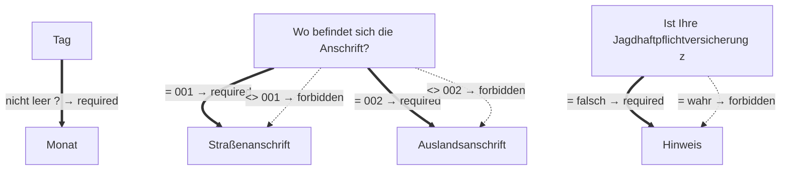

# Antrag auf Wiedererteilung eines Ausländerfalknerjagdscheins

- **FIM-ID:** `S07000000259 1.2.0` · **Reifegrad:** fachlich freigegeben (silber)
- **Rechtsgrundlagen:** § 3 BJagdG vom 25.10.2024; § 4 BJagdG vom 25.10.2024; § 11 BJagdG vom 25.10.2024; § 15 BJagdG vom 25.10.2024; § 17 BJagdG vom 25.10.2024; § 24 (1) VwVfG vom 15.07.2024; § 25 (1), (2) VwVfG vom 15.07.2024; § 26 (1) VwVfG vom 15.07.2024
- **Kompiliert:** 2026-08-13T15:59:47Z aus https://fimportal.de/api/v1/schemas/S07000000259/1.2.0/xdf
- **Umfang:** 44 Felder, 8 gesicherte Bedingungen, 0 ungeklärt

## Verbindliche Arbeitsweise

1. **`graph.json` entscheidet, nicht du.** Ob ein Feld gebraucht wird, welcher Nachweis fehlt und welche Bedingung gilt, steht dort. Leite das nie selbst ab.
2. **Übersetze nur.** Deine Aufgabe ist Alltagssprache ↔ Feldwert. Nenne auf Nachfrage die amtliche Formulierung und die Rechtsgrundlage.
3. **Frage nur, was offen ist.** Felder, deren Bedingung nach den bisherigen Antworten nicht erfüllt ist, entfallen — frage sie nicht ab.
4. **Bei ungeklärten Regeln sag das.** Der Abschnitt „Ungeklärte Regeln" enthält Bedingungen, die nicht maschinell gelesen werden konnten. Rate dort nicht, sondern verweise auf die zuständige Stelle.

## Felder

### Antragstellende Person (`G07000000817`)

- **Familienname** (`F60000000227`) — Pflicht
  - Rechtsgrundlage: § 5 (2) Nr. 1 PAuswG vom 21.6.2019; Anhang 3 PAuswV vom 28.9.2017; Tabelle 9 BSI TR-03123 Version 1.5.1; XOEV.Kernkomponente.NameNatuerlichePerson.familienname vom 31.01.2020
  - Hilfe: Geben Sie den Nachnamen, Familiennamen bzw. Zunamen an.
- **Geburtsname** (`F60000000230`) — optional
  - Rechtsgrundlage: § 5 (2) Nr. 1 PAuswG vom 21.6.2019; Anhang 3 Abschnitt 1 PAuswV vom 28.9.2017; Tabelle 9 BSI TR-03123 Version 1.5.1; XOEV.Kernkomponente.NameNatuerlichePerson.geburtsname vom 31.01.2020
  - Hilfe: Geben Sie den Geburtsnamen an. Manche Menschen ändern ihren Familiennamen, wenn sie heiraten oder eine Lebenspartnerschaft eingehen. Der  Geburtsname ist der Familienname den die Person bei der Geburt hatte, bevor sie ihren Namen geändert hat.
- **Vornamen** (`F60000000228`) — Pflicht
  - Rechtsgrundlage: § 5 (2) Nr. 2 PAuswG vom 21.6.2019; Anhang 3 PAuswV vom 28.9.2017; Tabelle 9 BSI TR-03123 Version 1.5.1; XOEV.Kernkomponente.NameNatuerlichePerson.vorname vom 31.08.2020
  - Hilfe: Geben Sie die Vornamen so an, wie sie auf den offiziellen Ausweisen angegeben sind, zum Beispiel im Personalausweis.
- **Doktorgrade** (`F60000000229`) — optional
  - Rechtsgrundlage: § 5 (2) Nr. 3 PAuswG vom 21.6.2019; Tabelle 9 BSI TR-03123 Version 1.5.1 (dort als Titel); XMeld.type.NameNatuerlichePerson.doktorgrad Version 2.4.4
  - Hilfe: Geben Sie anerkannte Doktorgrade an. Zulässig sind: "Dr.", "Dr.hc." und "Dr.eh.". Wollen Sie mehrere Doktorgrade angeben, trennen Sie diese durch ein Leerzeichen.
- **Geburtsort** (`F60000000234`) — Pflicht
  - Rechtsgrundlage: § 5 (2) Nr. 4 PAuswG vom 21.6.2019; Anhang 3 Abschnitt 1 PAuswV vom 28.9.2017; Tabelle 9 BSI TR-03123 Version 1.5.1; XOEV.Kernkomponente.Geburt.geburtsort vom 31.01.2020
  - Hilfe: Geben Sie die Bezeichnung des Ortes an, in dem die Person geboren wurde, Beispiel Düsseldorf.
- **Staat der Geburt** (`F60000000235`) — Pflicht
  - Rechtsgrundlage: XMeld.type.AnschriftMelderecht.Ausland.staat Version 2.4.3; Codeliste laut XMeld und DSMeld: Codeliste Destatis Staat (urn:de:bund:destatis:bevoelkerungsstatistik:schluessel:staat)
- **Staatsangehörigkeit** (`F60000000236`) — Pflicht
  - Rechtsgrundlage: XOEV.Kernkomponente.NatuerlichePerson.staatsangehoerigkeit vom 31.08.2020; Codeliste laut XMeld und DSMeld: Codeliste Destatis Staatsangehörigkeit (urn:de:bund:destatis:bevoelkerungsstatistik:schluessel:staatsangehörigkeit)
  - Hilfe: Wählen Sie aus, welcher Nationalität bzw. welchen Nationalitäten die Person angehört. Es ist auch die Auswahl "ohne Angabe" möglich, falls die Person keiner Nationalität angehört.
- **Ausweisdokument** (`F07000001249`) — Pflicht
  - Rechtsgrundlage: § 24 (1) VwVfG; § 25 (1), (2) VwVfG; § 26 (1) VwVfG

### Antragstellende Person › Geburtsdatum (`G60000000083`)

- **Tag** (`F60000000231`) — optional
  - Rechtsgrundlage: § 5 (2) PAuswG vom 21.6.2019; Anhang 3 Abschnitt 1 PAuswV vom 28.9.2017; Tabelle 9 BSI TR-03123 Version 1.5.1 _(geerbt)_
- **Monat** (`F60000000232`) — optional, conditional
  - Rechtsgrundlage: § 5 (2) PAuswG vom 21.6.2019; Anhang 3 Abschnitt 1 PAuswV vom 28.9.2017; Tabelle 9 BSI TR-03123 Version 1.5.1 _(geerbt)_
- **Jahr** (`F60000000233`) — Pflicht
  - Rechtsgrundlage: § 5 (2) PAuswG vom 21.6.2019; Anhang 3 Abschnitt 1 PAuswV vom 28.9.2017; Tabelle 9 BSI TR-03123 Version 1.5.1 _(geerbt)_

### Antragstellende Person › Wohnsitz (`G07000002558`)

- **Wo befindet sich die Anschrift?** (`F60000000263`) — Pflicht
  - Rechtsgrundlage: § 15 BJagdG _(geerbt)_
  - Hilfe: Geben Sie an, ob sich die Anschrift im Inland oder im Ausland befindet.

### Antragstellende Person › Wohnsitz › Straßenanschrift (`G60000000086`)

- **Straße** (`F60000000243`) — Pflicht
  - Rechtsgrundlage: XInneres.Meldeanschrift.strasse Version 8
  - Hilfe: Geben Sie an, wie die Straße heißt, ohne Abkürzungen zu verwenden, Beispiel Bischöflich-Geistlicher-Rat-Josef-Zinnbauer-Straße
- **Hausnummer** (`F60000000244`) — optional
  - Rechtsgrundlage: XInneres.Meldeanschrift.hausnummer Version 8
  - Hilfe: Geben Sie die Ziffern und ggf. Buchstaben der Hausnummer der Anschrift an, Beispiel 124a.
- **Postleitzahl** (`F60000000246`) — Pflicht
  - Rechtsgrundlage: XInneres.Meldeanschrift.postleitzahl Version 8
  - Hilfe: Geben Sie die Postleitzahl des Ortes an, Beispiel 10115.
- **Ort** (`F60000000247`) — Pflicht
  - Rechtsgrundlage: § 5 (2) Nr. 9 PAuswG vom 21.6.2019; Anhang 3 Abschnitt 1 (Wohnort) PAuswV vom 28.9.2017; Tabelle 11 BSI TR-03123, Version 1.5.1; Xinneres.Meldeanschrift.Wohnort Version 8; XOEV.Kernkomponente.Anschrift.ort vom 31.01.2020
  - Hilfe: Geben Sie an, wie der Ort heißt. Benennen Sie dafür den Namen der Ortschaft, Gemeinde oder Stadt; nicht jedoch den Namen des Ortsteils, Beispiel Berlin.
- **Adresszusatz** (`F60000000248`) — optional
  - Rechtsgrundlage: XInneres.Meldeanschrift.zusatzangaben Version 8
  - Hilfe: Geben Sie Zusatzangaben zur Anschrift an. Beispiele: Hinterhaus, Gartenhaus.

### Antragstellende Person › Wohnsitz › Auslandsanschrift (`G60000000091`)

- **Staat** (`F60000000261`) — Pflicht
  - Rechtsgrundlage: XMeld.type.AnschriftMelderecht.Ausland.staat Version 2.4.4; Codeliste laut Xmeld und DSMeld: Codeliste Destatis Staat (urn:de:bund:destatis:bevoelkerungsstatistik:schluessel:staat)
  - Hilfe: Geben Sie den Namen des Staates bzw. des Landes an, Beispiel Deutschland, Frankreich, ...

### Antragstellende Person › Wohnsitz › Auslandsanschrift › Ausländische Anschrift (`G60000000092`)

- **Anschriftzeile** (`F60000000262`) — optional
  - Rechtsgrundlage: XInneres.Auslandsanschrift.Anschriftzone.zeile.anschrift Version 8
  - Hilfe: Geben Sie die ausländische Anschrift an

### Antragstellende Person › Kontaktdaten (`G07000000827`)

- **Telefonnummer** (`F60000000240`) — optional
  - Rechtsgrundlage: ITU E.123
  - Hilfe: Geben Sie bei Telefonnummern innerhalb Deutschlands zuerst die Ortsvorwahl bzw. Mobilnetzvorwahl in Klammern, gefolgt von der Rufnummer an, Beispiel (0211) 12345678.
Geben Sie bei Telefonnummern außerhalb Deutschlands zuerst den Internationalen Ländercode mit vorgestelltem Plus, gefolgt von der Ortsvorwahl bzw. Mobilnetzvorwahl ohne der führenden Null, gefolgt von der Rufnummer an, Beispiel +49 211 123456789.
- **E-Mail-Adresse** (`F60000000242`) — optional
  - Rechtsgrundlage: RFC 5322; RFC 5321
  - Hilfe: Geben Sie eine E-Mail-Adresse an, z.B. Max.Mustermann@email.de

### Angaben zum Jagdschein (`G07000002556`)

- **Beantragter Jagdschein** (`F07000001339`) — Pflicht
  - Rechtsgrundlage: § 15 BJagdG
- **Landkreis, in dem der Jagdschein ausgestellt oder zuletzt verlängert wurde** (`F07000003635`) — Pflicht
  - Rechtsgrundlage: urn:de:bund:destatis:bevoelkerungsstatistik:schluessel:kreis
- **Geben Sie an, ab wann der Jagdschein gelten soll. Bei Jahresjagdscheinen nennen Sie den Beginn des laufenden oder nächsten Jagdjahres. Bei Tagesjagdscheinen beachten Sie die Gültigkeitsdauer von 14 Tagen.** (`F07000002602`) — Pflicht
  - Rechtsgrundlage: § 15 BJagdG

### Angaben zum Jagdschein › Rechtsgrund (`G07000002557`)

- **Rechtsgrund** (`F07000001340`) — Pflicht
  - Rechtsgrundlage: § 3 BJagdG
- **Nachweis** (`F60000000296`) — Pflicht
  - Rechtsgrundlage: § 3 BJagdG _(geerbt)_
  - Hilfe: Fügen Sie einen Nachweis bei, der die Angaben bestätigt.

### Jagdfläche › Lage der Jagdfläche (`G07000000840`)

- **Landkreis / Kreis** (`F17000004079`) — Pflicht
  - Rechtsgrundlage: urn:de:bund:destatis:bevoelkerungsstatistik:schluessel:kreis
- **Gemeinde** (`F07000001255`) — Pflicht
  - Rechtsgrundlage: § 11 BJagdG
- **Bezeichnung des Jagdbezirks** (`F07000001254`) — Pflicht
  - Rechtsgrundlage: § 4 BJagdG

### Jagdfläche › Größe der Jagdfläche (`G07000000841`)

- **Gesamtgröße des Jagdbezirks (in Hektar)** (`F07000001259`) — Pflicht
  - Rechtsgrundlage: § 11 BJagdG
- **Anteil der Jagdfläche am Jagdbezirk (in Hektar)** (`F07000001261`) — Pflicht
  - Rechtsgrundlage: § 11 BJagdG

### Jagdfläche › Anrechnungszeitraum von Jagdflächen (`G07000000962`)

- **Anfang** (`F60000000048`) — Pflicht
  - Rechtsgrundlage: urn:xoev-de:kosit:xoev:kernkomponente:zeitraum vom 31.08.2020
- **Ende** (`F60000000049`) — optional
  - Rechtsgrundlage: urn:xoev-de:kosit:xoev:kernkomponente:zeitraum vom 31.08.2020

### Jagdhaftpflichtversicherung (`G07000000963`)

- **Erläuterung zur Jagdhaftpflichtversicherung** (`F07000001410`) — Pflicht
  - Rechtsgrundlage: § 17 BJagdG
- **Ich habe eine derartige Jagdhaftpflichtversicherung abgeschlossen.** (`F07000001411`) — Pflicht
  - Rechtsgrundlage: § 17 BJagdG
- **Versicherungsgesellschaft** (`F07000001412`) — Pflicht
  - Rechtsgrundlage: § 17 BJagdG
- **Versicherungsnummer** (`F07000001413`) — Pflicht
  - Rechtsgrundlage: § 17 BJagdG
- **Nachweis** (`F60000000296`) — Pflicht
  - Rechtsgrundlage: § 17 BJagdG _(geerbt)_
  - Hilfe: Fügen Sie einen Nachweis bei, der die Angaben bestätigt.

### Jagdhaftpflichtversicherung › Gültigkeit (`G07000002555`)

- **Ist Ihre Jagdhaftpflichtversicherung zeitlich begrenzt gültig?** (`F07000003636`) — Pflicht
  - Rechtsgrundlage: § 17 BJagdG
- **Hinweis** (`F07000003637`) — optional, conditional
  - Rechtsgrundlage: § 17 BJagdG

### Jagdhaftpflichtversicherung › Gültigkeit › Zeitraum (`G60000000019`)

- **Anfang** (`F60000000048`) — Pflicht
  - Rechtsgrundlage: urn:xoev-de:kosit:xoev:kernkomponente:zeitraum vom 31.08.2020
- **Ende** (`F60000000049`) — Pflicht
  - Rechtsgrundlage: urn:xoev-de:kosit:xoev:kernkomponente:zeitraum vom 31.08.2020

### Erklärungen zur Zuverlässigkeit und Eignung (`G07000000964`)

- **Gegen mich ist bzw. war in den letzten 5 Jahren kein Strafverfahren oder/und Ordnungswidrigkeitsverfahren anhängig.** (`F07000001416`) — Pflicht
  - Rechtsgrundlage: § 17 BJagdG
- **Es bestehen keine Krankheiten oder Gebrechen, die meine körperliche oder geistige Eignung für die Jagdausübung beeinträchtigen.** (`F07000001418`) — Pflicht
  - Rechtsgrundlage: § 17 BJagdG

## Bedingungen

| Bedingung | Feld | Folge | Rechtsgrundlage | Regel |
|---|---|---|---|---|
| wenn „Tag" nicht leer ist | „Monat" | muss ausgefüllt werden | — | `G60000000083` |
| wenn „Wo befindet sich die Anschrift?" gleich „001" ist | „Straßenanschrift" | muss ausgefüllt werden | — | `G07000002558` |
| wenn „Wo befindet sich die Anschrift?" ungleich „001" ist | „Straßenanschrift" | darf nicht ausgefüllt werden | — | `G07000002558` |
| wenn „Wo befindet sich die Anschrift?" gleich „002" ist | „Auslandsanschrift" | muss ausgefüllt werden | — | `G07000002558` |
| wenn „Wo befindet sich die Anschrift?" ungleich „002" ist | „Auslandsanschrift" | darf nicht ausgefüllt werden | — | `G07000002558` |
| wenn „Ist Ihre Jagdhaftpflichtversicherung zeitlich begrenzt gültig?" gleich „falsch" ist | „Hinweis" | muss ausgefüllt werden | — | `G07000002555` |
| wenn „Ist Ihre Jagdhaftpflichtversicherung zeitlich begrenzt gültig?" gleich „wahr" ist | „Hinweis" | darf nicht ausgefüllt werden | — | `G07000002555` |

## Abhängigkeitsgraph

